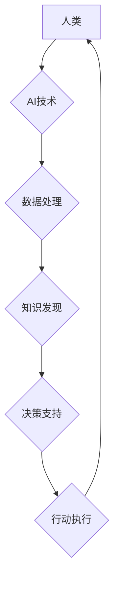

> 人类计算，人工智能，价值观，伦理，可持续发展，未来科技

## 1. 背景介绍

科技发展日新月异，人工智能（AI）作为科技发展的重要趋势，正在深刻地改变着我们的生活。从自动驾驶汽车到智能语音助手，AI技术的应用日益广泛，为人类社会带来了诸多便利和机遇。然而，在AI技术飞速发展的过程中，我们也必须认真思考其潜在的风险和挑战，并确保科技发展始终以人为本，服务于人类的福祉。

人类计算的概念，强调将人类的智慧和创造力与人工智能技术相结合，共同构建更加智能、更加人性化的未来。它倡导将AI技术视为人类能力的扩展，而非人类的替代品，旨在通过技术手段提升人类的认知能力、创造力、协作能力，最终实现人类价值的全面提升。

## 2. 核心概念与联系

### 2.1 人类计算的本质

人类计算的核心在于将人类的智慧和经验与人工智能技术的计算能力相结合，形成一个协同共进的循环系统。

* **人类智慧:** 包括人类的创造力、批判性思维、情感智能、伦理判断等，是人类区别于机器的关键优势。
* **人工智能技术:** 包括机器学习、深度学习、自然语言处理等，能够帮助人类处理海量数据、发现隐藏模式、自动化重复性任务等。

通过将这两者结合起来，人类计算可以实现以下目标：

* **提升人类认知能力:** AI可以帮助人类更快、更准确地获取信息，并从中发现隐藏的规律和趋势。
* **增强人类创造力:** AI可以提供灵感和创意，帮助人类突破思维定式，产生新的想法和解决方案。
* **促进人类协作:** AI可以帮助人类更好地沟通和协作，打破地域和语言的障碍，实现更有效的团队合作。

### 2.2 人类计算的架构



**流程图说明:**

1. 人类提供数据和任务指令给AI系统。
2. AI系统利用机器学习等算法对数据进行处理和分析。
3. AI系统发现数据中的隐藏模式和规律，并将其转化为可理解的知识。
4. AI系统根据知识和人类的决策规则，提供决策建议和方案。
5. 人类根据AI的建议，进行最终决策并执行相应的行动。
6. 行动结果反馈给AI系统，用于模型的不断优化和改进。

## 3. 核心算法原理 & 具体操作步骤

### 3.1 算法原理概述

人类计算的核心算法原理是基于机器学习和深度学习的算法，这些算法能够帮助AI系统从海量数据中学习和发现规律。

* **机器学习:** 是一种人工智能技术，通过训练模型，使模型能够从数据中学习，并对新的数据进行预测或分类。
* **深度学习:** 是一种更高级的机器学习技术，利用多层神经网络来模拟人类大脑的学习过程，能够处理更复杂的数据和任务。

### 3.2 算法步骤详解

1. **数据收集和预处理:** 收集相关数据，并进行清洗、转换、格式化等预处理工作，以确保数据质量和算法的有效性。
2. **模型选择和训练:** 根据任务需求选择合适的机器学习或深度学习模型，并利用训练数据对模型进行训练，使其能够学习数据中的规律。
3. **模型评估和优化:** 利用测试数据评估模型的性能，并根据评估结果对模型进行调整和优化，以提高模型的准确性和效率。
4. **模型部署和应用:** 将训练好的模型部署到实际应用场景中，并根据需要进行实时更新和维护。

### 3.3 算法优缺点

**优点:**

* **自动化能力强:** 可以自动处理海量数据，解放人类的生产力。
* **学习能力强:** 可以从数据中不断学习和改进，提高处理问题的效率和准确性。
* **适应性强:** 可以适应不同的数据和任务需求，并进行灵活调整。

**缺点:**

* **数据依赖性强:** 算法的性能取决于数据的质量和数量，如果数据不足或质量差，算法的性能会受到影响。
* **解释性弱:** 一些深度学习模型的内部机制难以理解，难以解释其决策过程。
* **伦理风险:** AI算法可能存在偏见和歧视，需要谨慎设计和使用，以避免造成负面影响。

### 3.4 算法应用领域

人类计算的算法应用领域非常广泛，包括：

* **医疗保健:** 辅助诊断、个性化治疗、药物研发等。
* **教育:** 个性化学习、智能辅导、教育资源推荐等。
* **金融:** 风险评估、欺诈检测、投资决策等。
* **制造业:** 自动化生产、质量控制、设备维护等。
* **交通运输:** 自动驾驶、交通流量优化、物流管理等。

## 4. 数学模型和公式 & 详细讲解 & 举例说明

### 4.1 数学模型构建

人类计算的核心数学模型是基于概率论和统计学的模型，这些模型能够描述数据之间的关系和规律，并用于预测和决策。

* **贝叶斯网络:** 用于表示随机变量之间的依赖关系，并进行概率推理。
* **决策树:** 用于分类和回归问题，通过树状结构表示决策规则。
* **支持向量机:** 用于分类问题，通过寻找最佳的分隔超平面来区分不同类别的数据。

### 4.2 公式推导过程

例如，贝叶斯网络中的一个基本公式是贝叶斯定理：

$$P(A|B) = \frac{P(B|A)P(A)}{P(B)}$$

其中：

* $P(A|B)$ 是在已知事件 B 发生的情况下，事件 A 发生的概率。
* $P(B|A)$ 是在已知事件 A 发生的情况下，事件 B 发生的概率。
* $P(A)$ 是事件 A 发生的概率。
* $P(B)$ 是事件 B 发生的概率。

这个公式可以用于计算事件之间的条件概率，并用于推理和决策。

### 4.3 案例分析与讲解

例如，在医疗诊断领域，可以使用贝叶斯网络来计算患者患某种疾病的概率，根据患者的症状、病史、检查结果等信息，结合疾病的发生率和相关症状的概率，最终得出患者患病的可能性。

## 5. 项目实践：代码实例和详细解释说明

### 5.1 开发环境搭建

* **操作系统:** Linux 或 macOS
* **编程语言:** Python
* **深度学习框架:** TensorFlow 或 PyTorch
* **其他工具:** Jupyter Notebook、Git 等

### 5.2 源代码详细实现

以下是一个简单的深度学习模型的代码示例，用于图像分类任务：

```python
import tensorflow as tf

# 定义模型结构
model = tf.keras.models.Sequential([
    tf.keras.layers.Conv2D(32, (3, 3), activation='relu', input_shape=(28, 28, 1)),
    tf.keras.layers.MaxPooling2D((2, 2)),
    tf.keras.layers.Conv2D(64, (3, 3), activation='relu'),
    tf.keras.layers.MaxPooling2D((2, 2)),
    tf.keras.layers.Flatten(),
    tf.keras.layers.Dense(10, activation='softmax')
])

# 编译模型
model.compile(optimizer='adam',
              loss='sparse_categorical_crossentropy',
              metrics=['accuracy'])

# 训练模型
model.fit(x_train, y_train, epochs=5)

# 评估模型
loss, accuracy = model.evaluate(x_test, y_test)
print('Test loss:', loss)
print('Test accuracy:', accuracy)
```

### 5.3 代码解读与分析

* **模型结构:** 该代码定义了一个简单的卷积神经网络模型，用于图像分类任务。模型包含两层卷积层、两层最大池化层、一层全连接层和一层输出层。
* **模型编译:** 使用 Adam 优化器、交叉熵损失函数和准确率指标来编译模型。
* **模型训练:** 使用训练数据训练模型，训练 epochs 次。
* **模型评估:** 使用测试数据评估模型的性能，并打印测试损失和准确率。

### 5.4 运行结果展示

训练完成后，可以将模型应用于新的图像数据进行分类。

## 6. 实际应用场景

### 6.1 人工智能辅助医疗诊断

AI技术可以帮助医生更快、更准确地诊断疾病，例如：

* **图像分析:** AI可以分析X光片、CT扫描和MRI图像，识别肿瘤、骨折和其他异常。
* **病历分析:** AI可以分析患者的病历、症状和检查结果，提供诊断建议。
* **药物研发:** AI可以加速药物研发过程，帮助科学家发现新的药物靶点和候选药物。

### 6.2 个性化教育

AI技术可以提供个性化的学习体验，例如：

* **智能辅导:** AI可以根据学生的学习进度和能力，提供个性化的辅导和练习。
* **学习资源推荐:** AI可以根据学生的学习兴趣和需求，推荐合适的学习资源。
* **自动批改作业:** AI可以自动批改学生的作业，并提供反馈。

### 6.3 智能金融服务

AI技术可以提高金融服务的效率和安全性，例如：

* **欺诈检测:** AI可以分析交易数据，识别潜在的欺诈行为。
* **风险评估:** AI可以评估客户的信用风险，帮助银行和金融机构做出更明智的贷款决策。
* **投资决策:** AI可以分析市场数据，提供投资建议。

### 6.4 未来应用展望

随着人工智能技术的不断发展，人类计算将在更多领域得到应用，例如：

* **自动驾驶:** AI可以帮助汽车自动驾驶，提高交通安全和效率。
* **机器人技术:** AI可以赋予机器人更强的智能和自主性，用于工业生产、服务业和医疗保健等领域。
* **个性化体验:** AI可以提供更加个性化的产品和服务，例如个性化推荐、定制化设计等。

## 7. 工具和资源推荐

### 7.1 学习资源推荐

* **在线课程:** Coursera、edX、Udacity 等平台提供丰富的AI课程。
* **书籍:** 《深度学习》、《人工智能：一种现代方法》等书籍。
* **开源项目:** TensorFlow、PyTorch、OpenCV 等开源项目。

### 7.2 开发工具推荐

* **编程语言:** Python
* **深度学习框架:** TensorFlow、PyTorch
* **数据处理工具:** Pandas、NumPy
* **可视化工具:** Matplotlib、Seaborn

### 7.3 相关论文推荐

* **《ImageNet Classification with Deep Convolutional Neural Networks》**
* **《Attention Is All You Need》**
* **《BERT: Pre-training of Deep Bidirectional Transformers for Language Understanding》**

## 8. 总结：未来发展趋势与挑战

### 8.1 研究成果总结

人类计算是一个充满机遇和挑战的领域，近年来取得了显著的进展。AI技术已经应用于医疗保健、教育、金融等多个领域，取得了令人瞩目的成果。

### 8.2 未来发展趋势

未来，人类计算将朝着以下几个方向发展：

* **更强大的AI模型:** 研究人员将继续开发更强大、更智能的AI模型，例如通用人工智能（AGI）。
* **更广泛的应用场景:** AI技术将应用于更多领域，例如自动驾驶、机器人技术、个性化体验等。
* **更注重伦理和可持续性:** 人类计算的发展需要更加注重伦理和可持续性，确保AI技术服务于人类福祉。

### 8.3 面临的挑战

人类计算也面临着一些挑战：

* **数据安全和隐私:** AI模型的训练需要大量数据，如何保护数据安全和隐私是一个重要问题。
* **算法偏见和歧视:** AI算法可能存在偏见和歧视