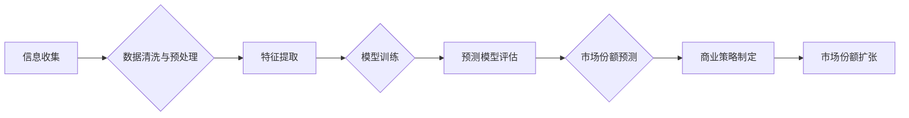

> 大数据，信息差，市场份额，商业策略，数据分析，机器学习，预测模型

## 1. 背景介绍

在当今数据爆炸的时代，信息已成为企业竞争的核心资源。掌握信息，洞察市场，精准定位目标客户，是企业扩大市场份额的关键。大数据技术凭借其强大的数据处理和分析能力，为企业提供了前所未有的机会，帮助企业有效利用信息差，制定精准的商业策略，最终实现市场份额的扩张。

传统商业模式往往依赖于经验和直觉，难以准确把握市场变化和客户需求。而大数据则通过收集、存储、分析海量数据，揭示隐藏在数据背后的规律和趋势，为企业决策提供科学依据。

## 2. 核心概念与联系

**2.1 信息差**

信息差是指不同主体之间对同一事物所掌握信息的不对称性。在商业领域，信息差是指企业对市场、客户、竞争对手等方面的了解程度高于其他企业。

**2.2 市场份额**

市场份额是指一家企业在特定市场上销售额占该市场总销售额的比例。扩大市场份额意味着企业在该市场上占据更大的份额，获得更多的利润和竞争优势。

**2.3 大数据**

大数据是指规模庞大、结构复杂、更新速度快的海量数据。大数据通常具有以下四个特征：

* **海量 (Volume):** 数据量巨大，难以用传统方法处理。
* **高速 (Velocity):** 数据产生和更新速度快，需要实时处理。
* **多样性 (Variety):** 数据类型多样，包括结构化数据、非结构化数据和半结构化数据。
* **价值 (Value):** 数据蕴含着丰富的价值，需要通过分析挖掘。

**2.4 数据分析**

数据分析是指通过收集、清洗、转换、分析和挖掘数据，以发现数据背后的规律和趋势，并为决策提供支持的过程。

**2.5 机器学习**

机器学习是一种人工智能技术，通过算法训练模型，使模型能够从数据中学习，并对新数据进行预测或分类。

**2.6 预测模型**

预测模型是指基于历史数据，利用机器学习算法构建的模型，用于预测未来事件或趋势的模型。

**2.7 流程图**



## 3. 核心算法原理 & 具体操作步骤

### 3.1 算法原理概述

信息差的商业市场份额管理的核心算法原理是利用大数据分析和机器学习技术，构建预测模型，预测未来市场趋势和客户需求，从而制定精准的商业策略，扩大市场份额。

### 3.2 算法步骤详解

1. **信息收集:** 收集来自各种渠道的市场数据，包括销售数据、客户数据、竞争对手数据、市场调研数据等。
2. **数据清洗与预处理:** 对收集到的数据进行清洗、转换和预处理，去除噪声数据、缺失值和异常值，并将数据格式统一。
3. **特征提取:** 从数据中提取具有预测价值的特征，例如客户年龄、性别、购买历史、浏览记录、地理位置等。
4. **模型训练:** 利用机器学习算法，例如线性回归、逻辑回归、决策树、支持向量机等，对提取的特征进行训练，构建预测模型。
5. **预测模型评估:** 对训练好的模型进行评估，例如使用准确率、召回率、F1-score等指标，评估模型的预测性能。
6. **市场份额预测:** 利用训练好的预测模型，预测未来市场趋势和客户需求，例如预测未来销售额、客户流失率、市场份额变化等。
7. **商业策略制定:** 根据市场份额预测结果，制定精准的商业策略，例如调整产品价格、优化营销活动、开发新产品等。
8. **市场份额扩张:** 通过实施精准的商业策略，扩大市场份额。

### 3.3 算法优缺点

**优点:**

* **数据驱动:** 基于海量数据分析，决策更加科学和精准。
* **预测能力强:** 利用机器学习算法，可以预测未来市场趋势和客户需求。
* **效率提升:** 自动化数据分析和预测过程，提高工作效率。

**缺点:**

* **数据依赖:** 算法的准确性依赖于数据质量和数量。
* **模型复杂:** 机器学习模型的构建和训练需要专业知识和技术。
* **解释性差:** 一些机器学习模型的决策过程难以解释，难以获得用户信任。

### 3.4 算法应用领域

* **市场营销:** 预测客户购买行为，精准营销，提高营销效率。
* **产品开发:** 预测市场需求，开发符合市场需求的产品。
* **价格管理:** 预测市场价格趋势，制定合理的定价策略。
* **风险管理:** 预测市场风险，制定风险控制措施。

## 4. 数学模型和公式 & 详细讲解 & 举例说明

### 4.1 数学模型构建

假设我们想要预测未来某个产品的销售额。我们可以构建一个线性回归模型，将产品销售额作为因变量，并将影响产品销售额的因素作为自变量。

### 4.2 公式推导过程

线性回归模型的公式如下：

$$
y = \beta_0 + \beta_1x_1 + \beta_2x_2 + ... + \beta_nx_n + \epsilon
$$

其中：

* $y$ 是产品销售额
* $\beta_0$ 是截距
* $\beta_1, \beta_2, ..., \beta_n$ 是自变量的系数
* $x_1, x_2, ..., x_n$ 是影响产品销售额的因素
* $\epsilon$ 是误差项

### 4.3 案例分析与讲解

假设我们想要预测某款产品的销售额，影响产品销售额的因素包括产品价格、广告投入、季节因素等。我们可以收集历史数据，训练线性回归模型，并使用模型预测未来某个时间段的产品销售额。

例如，我们可以收集过去一年的销售数据，并将产品价格、广告投入、季节因素作为自变量，并将销售额作为因变量。通过训练线性回归模型，我们可以得到每个自变量的系数，以及模型的截距。

然后，我们可以使用模型预测未来某个时间段的产品销售额。例如，如果未来某个时间段的产品价格为 $x_1$，广告投入为 $x_2$，季节因素为 $x_3$，那么我们可以使用以下公式预测产品销售额：

$$
y = \beta_0 + \beta_1x_1 + \beta_2x_2 + \beta_3x_3
$$

其中，$\beta_0, \beta_1, \beta_2, \beta_3$ 是模型训练得到的系数。

## 5. 项目实践：代码实例和详细解释说明

### 5.1 开发环境搭建

* 操作系统：Windows/macOS/Linux
* Python 版本：3.6+
* 必要的库：pandas, numpy, scikit-learn, matplotlib

### 5.2 源代码详细实现

```python
import pandas as pd
from sklearn.linear_model import LinearRegression
from sklearn.model_selection import train_test_split
import matplotlib.pyplot as plt

# 加载数据
data = pd.read_csv('sales_data.csv')

# 选择特征和目标变量
features = ['price', 'advertising', 'season']
target = 'sales'

# 将数据分为训练集和测试集
X_train, X_test, y_train, y_test = train_test_split(data[features], data[target], test_size=0.2, random_state=42)

# 创建线性回归模型
model = LinearRegression()

# 训练模型
model.fit(X_train, y_train)

# 预测测试集数据
y_pred = model.predict(X_test)

# 评估模型性能
from sklearn.metrics import mean_squared_error
mse = mean_squared_error(y_test, y_pred)
print(f'Mean Squared Error: {mse}')

# 可视化预测结果
plt.scatter(y_test, y_pred)
plt.xlabel('Actual Sales')
plt.ylabel('Predicted Sales')
plt.title('Actual vs Predicted Sales')
plt.show()
```

### 5.3 代码解读与分析

* 首先，我们加载数据，选择特征和目标变量。
* 然后，我们将数据分为训练集和测试集，用于训练和评估模型。
* 接下来，我们创建线性回归模型，并使用训练集数据训练模型。
* 训练完成后，我们使用模型预测测试集数据，并评估模型性能。
* 最后，我们可视化预测结果，观察模型的预测效果。

### 5.4 运行结果展示

运行代码后，会输出模型的均方误差 (MSE) 值，以及实际销售额与预测销售额的散点图。

## 6. 实际应用场景

### 6.1 市场营销

利用大数据分析客户购买行为，精准定位目标客户，制定个性化营销策略，提高营销效率。例如，电商平台可以根据用户的浏览记录、购买历史等数据，推荐个性化的商品，提高转化率。

### 6.2 产品开发

分析市场需求趋势，预测未来产品需求，开发符合市场需求的产品。例如，手机厂商可以根据用户对手机功能的需求进行分析，开发出更符合用户需求的手机产品。

### 6.3 价格管理

分析市场价格趋势，制定合理的定价策略，提高利润率。例如，航空公司可以根据市场供求关系，动态调整机票价格，提高收益。

### 6.4 未来应用展望

随着大数据的不断发展，信息差的商业市场份额管理将更加智能化、精准化。未来，我们将看到更多基于人工智能和大数据的商业应用，例如：

* **个性化推荐:** 基于用户的行为数据，提供更加个性化的产品和服务推荐。
* **智能营销:** 利用机器学习算法，自动生成营销文案和广告，提高营销效果。
* **预测性维护:** 利用传感器数据和机器学习算法，预测设备故障，提前进行维护，降低维护成本。

## 7. 工具和资源推荐

### 7.1 学习资源推荐

* **书籍:**
    * 《Python数据科学手册》
    * 《机器学习实战》
    * 《大数据分析》
* **在线课程:**
    * Coursera: 数据科学、机器学习
    * edX: 数据分析、人工智能
    * Udemy: Python编程、数据分析

### 7.2 开发工具推荐

* **Python:** 数据分析和机器学习的常用编程语言。
* **pandas:** 数据处理和分析库。
* **numpy:** 数值计算库。
* **scikit-learn:** 机器学习库。
* **matplotlib:** 数据可视化库。

### 7.3 相关论文推荐

* **《大数据分析与商业决策》**
* **《机器学习在市场营销中的应用》**
* **《信息差与市场份额》**

## 8. 总结：未来发展趋势与挑战

### 8.1 研究成果总结

信息差的商业市场份额管理利用大数据分析和机器学习技术，为企业提供了精准的商业决策支持，有效提升了市场竞争力。

### 8.2 未来发展趋势

* **更智能化的预测模型:** 利用深度学习等更先进的机器学习算法，构建更智能化的预测模型，提高预测精度。
* **更个性化的商业策略:** 基于用户的行为数据和偏好，制定更个性化的商业策略，提高客户满意度。
* **更全面的数据融合:** 将来自不同渠道的数据进行融合，构建更全面的数据模型，提高决策的准确性。

### 8.3 面临的挑战

* **数据质量问题:** 大数据分析的准确性依赖于