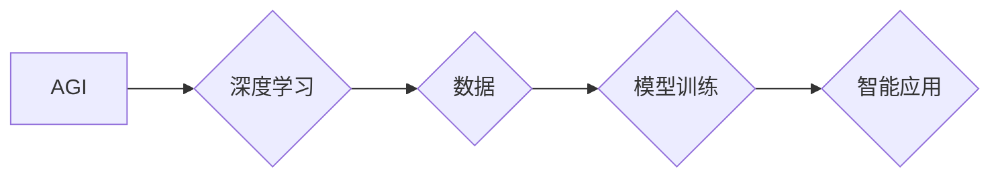

> AGI, 创业公司, 深度学习, 伦理, 可持续发展, 投资

## 1. 背景介绍

人工智能（AI）正以惊人的速度发展，从自动驾驶到医疗诊断，AI技术已渗透到各个领域。其中，通用人工智能（AGI，Artificial General Intelligence）作为人工智能领域终极目标，一直备受关注。AGI是指能够像人类一样学习、理解和解决各种复杂问题的智能系统。

对于创业公司而言，AGI的愿景既充满机遇，也面临着巨大的挑战。一方面，AGI技术有潜力彻底改变商业模式，创造全新的价值。另一方面，AGI的开发需要巨额资金投入和长期的技术积累，对于资源有限的创业公司来说，是否值得投入是需要认真权衡的问题。

## 2. 核心概念与联系

### 2.1 AGI的定义与特征

AGI是指能够像人类一样学习、理解和解决各种复杂问题的智能系统。其核心特征包括：

* **通用性:** AGI能够应用于各种不同的任务，而不是像现有的AI系统那样局限于特定领域。
* **学习能力:** AGI能够从数据中学习，并不断提升其解决问题的能力。
* **推理能力:** AGI能够进行逻辑推理，并做出合理的判断。
* **创造力:** AGI能够产生新的想法和解决方案。

### 2.2 AGI与深度学习的关系

深度学习是目前实现AGI的重要技术之一。深度学习算法能够从海量数据中学习复杂的模式和关系，并用于各种AI应用，例如图像识别、自然语言处理等。

**AGI与深度学习的关系可概括为：**

* 深度学习是实现AGI的重要技术手段，但并非唯一途径。
* AGI的目标是超越深度学习的局限性，实现更接近人类智能的系统。

**AGI与深度学习的联系流程图：**



## 3. 核心算法原理 & 具体操作步骤

### 3.1  算法原理概述

实现AGI的算法原理目前尚无统一标准，但主要围绕以下几个方向展开：

* **强化学习:** 通过奖励机制训练智能体，使其在环境中学习最优策略。
* **神经网络:** 模仿人类大脑神经网络结构，学习复杂模式和关系。
* **进化算法:** 通过模拟自然进化过程，不断优化算法参数，提高智能体性能。

### 3.2  算法步骤详解

以强化学习为例，其核心步骤包括：

1. **环境建模:** 建立模拟真实世界的环境模型，包括状态空间、动作空间和奖励函数。
2. **智能体设计:** 设计智能体，使其能够感知环境状态、选择动作并接收奖励。
3. **策略学习:** 利用强化学习算法，例如Q学习或深度强化学习，训练智能体学习最优策略，即在不同状态下选择最优动作以获得最大奖励。
4. **策略评估:** 通过在环境中运行训练好的智能体，评估其性能并进行改进。

### 3.3  算法优缺点

**强化学习的优点:**

* 能够学习复杂、非线性决策问题。
* 不需要明确的规则和知识，能够从经验中学习。

**强化学习的缺点:**

* 训练过程可能非常耗时和资源密集。
* 难以解决奖励函数设计的问题，奖励函数的设计直接影响智能体的学习效果。

### 3.4  算法应用领域

强化学习已应用于多个领域，例如：

* **游戏:** 训练AI代理在游戏中取得胜利。
* **机器人:** 训练机器人完成复杂的任务，例如导航、抓取等。
* **金融:** 优化投资策略、预测市场趋势。

## 4. 数学模型和公式 & 详细讲解 & 举例说明

### 4.1  数学模型构建

强化学习的核心数学模型是**状态-动作-奖励（SARSA）模型**。该模型将智能体的行为决策过程描述为一个马尔可夫决策过程（MDP）。

**MDP的定义:**

* **状态空间 (S):** 智能体可能处于的所有状态集合。
* **动作空间 (A):** 智能体在每个状态下可以采取的所有动作集合。
* **转移概率 (P):** 从一个状态执行一个动作后转移到另一个状态的概率。
* **奖励函数 (R):** 智能体在每个状态执行一个动作后获得的奖励值。

### 4.2  公式推导过程

SARSA算法的目标是学习一个策略π(s,a)，该策略能够在每个状态s下选择最优动作a，以最大化累积奖励。

**SARSA算法的更新公式:**

$$Q(s,a) \leftarrow Q(s,a) + \alpha [r + \gamma \max_{a'} Q(s',a') - Q(s,a)]$$

其中:

* $Q(s,a)$: 状态s下执行动作a的价值函数。
* $\alpha$: 学习率，控制学习速度。
* $r$: 智能体在状态s执行动作a后获得的奖励。
* $\gamma$: 折扣因子，控制未来奖励的权重。
* $s'$: 执行动作a后转移到的下一个状态。
* $a'$: 在下一个状态s'下执行的动作。

### 4.3  案例分析与讲解

假设一个智能体在玩一个简单的游戏，游戏状态包括“开始”、“移动”、“到达终点”等。智能体可以采取“向上”、“向下”、“向左”、“向右”等动作。

通过SARSA算法，智能体可以学习到在每个状态下执行哪个动作可以获得最大的奖励，最终达到游戏目标。

## 5. 项目实践：代码实例和详细解释说明

### 5.1  开发环境搭建

实现AGI的项目实践需要搭建一个强大的开发环境，包括：

* **硬件:** 高性能CPU、GPU和大量内存。
* **软件:** 深度学习框架（例如TensorFlow、PyTorch）、数据处理工具、版本控制系统等。

### 5.2  源代码详细实现

由于AGI的实现非常复杂，这里只提供一个简单的强化学习代码示例，用于演示SARSA算法的基本原理。

```python
import numpy as np

# 定义状态空间和动作空间
states = ['start', 'move', 'end']
actions = ['up', 'down', 'left', 'right']

# 定义奖励函数
rewards = {
    ('start', 'up'): 1,
    ('start', 'down'): -1,
    ('move', 'up'): 1,
    ('move', 'down'): -1,
    ('end', 'up'): 0,
    ('end', 'down'): 0,
}

# 初始化价值函数
Q = np.zeros((len(states), len(actions)))

# 设置超参数
alpha = 0.1
gamma = 0.9

# SARSA算法迭代更新
for episode in range(1000):
    state = 'start'
    while state != 'end':
        action = np.argmax(Q[states.index(state)])
        next_state, reward = next_step(state, action)
        Q[states.index(state), actions.index(action)] += alpha * (reward + gamma * np.max(Q[states.index(next_state)]) - Q[states.index(state), actions.index(action)])
        state = next_state

# 打印最终的价值函数
print(Q)
```

### 5.3  代码解读与分析

* 代码首先定义了状态空间、动作空间和奖励函数。
* 然后初始化价值函数Q，该函数存储了每个状态下执行每个动作的价值。
* SARSA算法迭代更新价值函数，通过学习从状态到状态的转移概率和奖励，最终找到最优策略。

### 5.4  运行结果展示

运行上述代码后，会输出一个价值函数矩阵，该矩阵反映了每个状态下执行每个动作的价值。

## 6. 实际应用场景

### 6.1  创业公司应用场景

* **个性化推荐:** AGI可以分析用户的行为数据，提供更精准的个性化推荐，提升用户体验和转化率。
* **自动化运营:** AGI可以自动化完成许多重复性任务，例如客服回复、数据分析等，提高运营效率。
* **新产品研发:** AGI可以帮助创业公司更快地识别市场需求，并设计出更符合用户需求的新产品。

### 6.2  未来应用展望

AGI技术的未来应用前景广阔，例如：

* **医疗诊断:** AGI可以辅助医生进行诊断，提高诊断准确率。
* **科学研究:** AGI可以加速科学研究，例如药物研发、材料科学等。
* **教育:** AGI可以提供个性化的教育服务，帮助学生更好地学习。

## 7. 工具和资源推荐

### 7.1  学习资源推荐

* **书籍:**
    * 《深度学习》
    * 《人工智能：现代方法》
* **在线课程:**
    * Coursera上的深度学习课程
    * edX上的人工智能课程

### 7.2  开发工具推荐

* **深度学习框架:** TensorFlow、PyTorch
* **数据处理工具:** Pandas、NumPy
* **版本控制系统:** Git

### 7.3  相关论文推荐

* **《AlphaGo》**
* **《Attention Is All You Need》**

## 8. 总结：未来发展趋势与挑战

### 8.1  研究成果总结

AGI的研究取得了显著进展，例如AlphaGo的成功证明了深度学习在游戏领域的强大能力。

### 8.2  未来发展趋势

AGI的发展趋势包括：

* **模型规模和复杂度提升:** 训练更大型、更复杂的AI模型。
* **多模态学习:** 融合文本、图像、音频等多种数据类型进行学习。
* **可解释性增强:** 使AI模型的决策过程更加透明和可解释。

### 8.3  面临的挑战

AGI的开发面临着许多挑战，例如：

* **数据获取和标注:** 训练AGI模型需要海量高质量数据，数据获取和标注成本高昂。
* **计算资源:** 训练大型AI模型需要大量的计算资源，成本高昂。
* **伦理问题:** AGI的开发可能带来伦理问题，例如算法偏见、隐私泄露等。

### 8.4  研究展望

未来AGI研究需要关注以下几个方面:

* **开发更有效的学习算法:** 提高AI模型的学习效率和泛化能力。
* **解决数据获取和标注问题:** 探索新的数据获取和标注方法。
* **加强伦理研究:** 制定相应的伦理规范和监管机制，确保AGI技术安全可控地发展。

## 9. 附录：常见问题与解答

### 9.1  AGI与现有AI的区别是什么？

现有AI系统通常局限于特定领域，而AGI的目标是实现更接近人类智能的系统，能够学习、理解和解决各种复杂问题。

### 9.2  实现AGI需要多长时间？

目前尚无确切的时间表，实现AGI是一个长期而复杂的挑战。

### 9.3  AGI会取代人类工作吗？

AGI可能会改变一些工作模式，但同时也创造新的工作机会。

### 9.4  AGI会带来哪些伦理问题？

AGI的开发可能带来算法偏见、隐私泄露、自主武器等伦理问题，需要引起重视并制定相应的应对措施。


作者：禅与计算机程序设计艺术 / Zen and the Art of Computer Programming 
<end_of_turn>