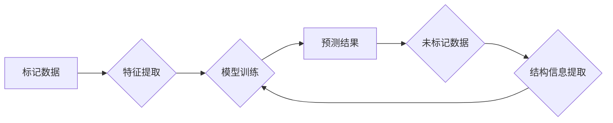

> 半监督学习、监督学习、无监督学习、标签数据、未标记数据、迁移学习、模型泛化、算法原理、实践应用

## 1. 背景介绍

在机器学习领域，训练模型通常依赖于大量的标记数据。然而，获取高质量的标记数据往往成本高昂且耗时费力。半监督学习 (Semi-supervised Learning) 应运而生，它利用少量标记数据和大量未标记数据来训练模型，从而降低对标记数据的依赖。

半监督学习在许多领域展现出巨大的潜力，例如图像识别、自然语言处理、语音识别等。它能够有效地提高模型的泛化能力，并在数据有限的情况下取得令人印象深刻的性能。

## 2. 核心概念与联系

半监督学习的核心思想是利用未标记数据的结构信息和模式来辅助标记数据的学习。它结合了监督学习和无监督学习的优势，在数据有限的情况下，能够更好地学习数据的本质特征。

**半监督学习流程图:**



**核心概念:**

* **标记数据:** 已知类别标签的数据，用于训练模型。
* **未标记数据:** 未知类别标签的数据，用于辅助模型学习。
* **特征提取:** 将数据转换为模型可理解的特征向量。
* **模型训练:** 利用标记数据和未标记数据训练模型。
* **结构信息提取:** 从未标记数据中提取结构信息，例如相似性、聚类等。
* **预测结果:** 模型对新数据的预测结果。

## 3. 核心算法原理 & 具体操作步骤

### 3.1  算法原理概述

半监督学习算法主要分为以下几类:

* **基于图的算法:** 将数据点表示为图中的节点，利用节点之间的连接关系来学习数据的结构信息。
* **基于概率的算法:** 利用概率模型来描述数据分布，并通过最大化似然函数来训练模型。
* **基于迁移学习的算法:** 将已训练好的模型应用于新的任务，利用已有知识来辅助学习。

### 3.2  算法步骤详解

以基于图的算法为例，其具体操作步骤如下:

1. **构建图:** 将数据点表示为图中的节点，节点之间的连接表示数据之间的相似性。
2. **特征提取:** 将每个节点的特征向量表示为图中的边权重。
3. **模型训练:** 利用图结构信息和标记数据训练模型，例如使用图卷积网络 (Graph Convolutional Network) 来学习节点的表示。
4. **预测:** 利用训练好的模型对未标记数据进行预测。

### 3.3  算法优缺点

**优点:**

* 能够有效利用未标记数据，提高模型的泛化能力。
* 在数据有限的情况下，能够取得较好的性能。

**缺点:**

* 算法的复杂度较高，需要更多的计算资源。
* 图结构的构建需要一定的经验和技巧。

### 3.4  算法应用领域

* **图像识别:** 利用未标记图像数据来训练图像分类模型。
* **自然语言处理:** 利用未标记文本数据来训练文本分类、情感分析等模型。
* **语音识别:** 利用未标记语音数据来训练语音识别模型。

## 4. 数学模型和公式 & 详细讲解 & 举例说明

### 4.1  数学模型构建

半监督学习的数学模型通常基于概率图模型或最大似然估计。

**概率图模型:**

概率图模型是一种用于表示概率分布的图形模型，它可以将数据点和其之间的关系表示为图结构。

**最大似然估计:**

最大似然估计是一种常用的参数估计方法，它通过最大化模型对观测数据的似然函数来估计模型参数。

### 4.2  公式推导过程

半监督学习的公式推导过程通常涉及到以下几个步骤:

1. **构建概率模型:** 根据数据特点和学习目标，构建一个合适的概率模型。
2. **定义似然函数:** 将模型参数和观测数据联系起来，定义模型的似然函数。
3. **求解参数:** 利用最大似然估计方法，求解模型参数。

### 4.3  案例分析与讲解

以半监督图像分类为例，我们可以使用概率图模型来表示图像数据和其类别标签之间的关系。

**假设:**

* 图像数据可以表示为特征向量。
* 类别标签是离散的。

**模型:**

我们可以使用贝叶斯网络来表示图像数据和类别标签之间的关系。

**公式:**

$$
P(y|x) = \frac{P(x|y)P(y)}{P(x)}
$$

其中:

* $P(y|x)$ 是给定特征向量 $x$ 的类别标签 $y$ 的条件概率。
* $P(x|y)$ 是给定类别标签 $y$ 的特征向量 $x$ 的条件概率。
* $P(y)$ 是类别标签 $y$ 的先验概率。
* $P(x)$ 是特征向量 $x$ 的边缘概率。

**解释:**

该公式表示给定特征向量 $x$ 的类别标签 $y$ 的条件概率等于特征向量 $x$ 给定类别标签 $y$ 的条件概率乘以类别标签 $y$ 的先验概率，再除以特征向量 $x$ 的边缘概率。

## 5. 项目实践：代码实例和详细解释说明

### 5.1  开发环境搭建

* Python 3.x
* TensorFlow 或 PyTorch
* 其他必要的库，例如 NumPy、Scikit-learn 等

### 5.2  源代码详细实现

```python
import tensorflow as tf

# 定义模型
model = tf.keras.models.Sequential([
    tf.keras.layers.Dense(128, activation='relu', input_shape=(784,)),
    tf.keras.layers.Dropout(0.5),
    tf.keras.layers.Dense(10, activation='softmax')
])

# 定义损失函数和优化器
loss_fn = tf.keras.losses.SparseCategoricalCrossentropy()
optimizer = tf.keras.optimizers.Adam()

# 训练模型
model.compile(loss=loss_fn, optimizer=optimizer)
model.fit(x_train, y_train, epochs=10, validation_data=(x_val, y_val))

# 预测
predictions = model.predict(x_test)
```

### 5.3  代码解读与分析

* 该代码示例使用 TensorFlow 库构建了一个简单的多层感知机 (MLP) 模型。
* 模型输入为 784 维的特征向量，输出为 10 个类别标签。
* 训练过程中，使用交叉熵损失函数和 Adam 优化器。
* 模型在训练集和验证集上进行训练，并使用测试集进行预测。

### 5.4  运行结果展示

* 训练过程中的损失值和准确率曲线。
* 测试集上的预测结果和准确率。

## 6. 实际应用场景

### 6.1  图像识别

* **场景:** 利用少量标记图像数据，训练模型识别新的图像类别。
* **应用:** 自动驾驶、医疗影像分析、产品识别等。

### 6.2  自然语言处理

* **场景:** 利用少量标记文本数据，训练模型进行文本分类、情感分析等任务。
* **应用:** 垃圾邮件过滤、社交媒体监控、客户服务自动化等。

### 6.3  语音识别

* **场景:** 利用少量标记语音数据，训练模型识别语音内容。
* **应用:** 语音助手、语音搜索、语音翻译等。

### 6.4  未来应用展望

* **更广泛的数据类型:** 半监督学习可以应用于更多类型的数据，例如视频、音频、传感器数据等。
* **更复杂的模型:** 可以使用更复杂的模型，例如深度神经网络，来提高模型的性能。
* **自动化数据标注:** 可以利用半监督学习算法自动标注数据，降低人工标注的成本。

## 7. 工具和资源推荐

### 7.1  学习资源推荐

* **书籍:**
    * 半监督学习 (Semi-Supervised Learning) - Christopher M. Bishop
    * Pattern Recognition and Machine Learning - Christopher M. Bishop
* **论文:**
    * Semi-Supervised Learning - Andrew Ng
    * Graph-Based Semi-Supervised Learning - Jianbo Shi
* **在线课程:**
    * Coursera: Machine Learning
    * Udacity: Deep Learning

### 7.2  开发工具推荐

* **TensorFlow:** 开源深度学习框架。
* **PyTorch:** 开源深度学习框架。
* **Scikit-learn:** 机器学习库。

### 7.3  相关论文推荐

* Semi-Supervised Learning with Graph Convolutional Networks - Kipf & Welling
* Label Propagation - Zhu & Ghahramani
* Transductive Support Vector Machines - Vapnik & Cortes

## 8. 总结：未来发展趋势与挑战

### 8.1  研究成果总结

半监督学习在过去几十年取得了显著的进展，在许多领域取得了令人印象深刻的应用成果。

### 8.2  未来发展趋势

* **更有效的算法:** 研究更有效的半监督学习算法，提高模型的性能和泛化能力。
* **更强大的模型:** 使用更强大的模型，例如 Transformer，来处理更复杂的数据。
* **更广泛的应用:** 将半监督学习应用于更多领域，例如医疗、金融、教育等。

### 8.3  面临的挑战

* **数据质量:** 半监督学习算法对数据质量要求较高，需要高质量的标记数据和未标记数据。
* **算法复杂度:** 一些半监督学习算法的复杂度较高，需要更多的计算资源。
* **理论解释:** 半监督学习的理论基础尚不完善，需要进一步的研究和探索。

### 8.4  研究展望

未来，半监督学习将继续是一个重要的研究方向，有望在人工智能领域取得更大的突破。


## 9. 附录：常见问题与解答

* **什么是半监督学习？**

半监督学习是一种机器学习方法，它利用少量标记数据和大量未标记数据来训练模型。

* **半监督学习的优势是什么？**

半监督学习能够有效利用未标记数据，提高模型的泛化能力，并在数据有限的情况下取得较好的性能。

* **半监督学习有哪些应用场景？**

半监督学习可以应用于图像识别、自然语言处理、语音识别等领域。

* **如何选择合适的半监督学习算法？**

选择合适的半监督学习算法需要考虑数据特点、学习目标和计算资源等因素。

* **半监督学习的未来发展趋势是什么？**

未来，半监督学习将继续是一个重要的研究方向，有望在人工智能领域取得更大的突破。


作者：禅与计算机程序设计艺术 / Zen and the Art of Computer Programming 
<end_of_turn>