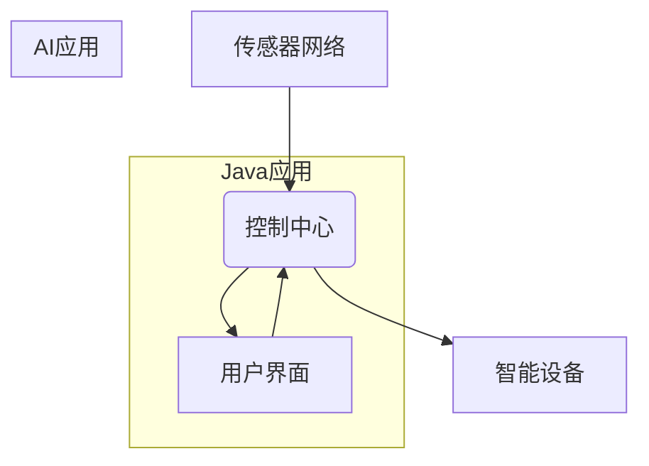

> Java, 智能家居, AI, 机器学习, 深度学习, 物联网, 数据分析, 语音交互

## 1. 背景介绍

智能家居已成为现代生活的重要组成部分，它通过将各种智能设备连接起来，实现自动化控制和个性化服务，为人们带来更加便捷、舒适和安全的居住体验。随着物联网技术的快速发展和人工智能技术的不断进步，智能家居行业迎来了新的发展机遇。

Java作为一种成熟、稳定、跨平台的编程语言，在软件开发领域拥有广泛的应用。其丰富的库函数、强大的开发工具和庞大的开发者社区，使其成为构建智能家居解决方案的理想选择。

结合Java与AI，可以打造下一代智能家居解决方案，实现更智能、更个性化的家居体验。

## 2. 核心概念与联系

### 2.1 智能家居系统架构

智能家居系统通常由以下几个核心组件组成：

* **传感器网络:** 用于感知家居环境中的各种数据，例如温度、湿度、光照、气压、运动等。
* **控制中心:** 负责接收传感器数据、处理用户指令、控制智能设备。
* **智能设备:** 包括各种家用电器、照明设备、安全系统等，能够根据控制中心的指令进行自动化控制。
* **用户界面:** 用于用户与智能家居系统进行交互，例如手机APP、语音助手、触摸屏等。

### 2.2 Java与AI的结合

Java可以作为智能家居系统的核心编程语言，用于开发控制中心、用户界面等关键模块。而AI技术可以赋予智能家居系统更强大的智能化能力，例如：

* **机器学习:** 用于分析传感器数据，识别用户行为模式，并根据模式进行预测和自动化控制。
* **深度学习:** 用于处理更复杂的数据，例如图像、语音等，实现更精准的识别和理解。
* **自然语言处理:** 用于理解用户的语音指令，并将其转换为智能设备可执行的指令。

### 2.3 架构图



## 3. 核心算法原理 & 具体操作步骤

### 3.1  算法原理概述

智能家居系统中常用的算法包括：

* **聚类算法:** 用于将传感器数据进行分类，识别不同场景和用户行为模式。
* **回归算法:** 用于预测未来数据，例如温度、湿度等。
* **决策树算法:** 用于根据用户指令和传感器数据，做出自动化控制决策。

### 3.2  算法步骤详解

以聚类算法为例，其具体操作步骤如下：

1. **数据收集:** 收集传感器数据，例如温度、湿度、光照等。
2. **数据预处理:** 对数据进行清洗、归一化等处理，使其符合算法要求。
3. **算法选择:** 根据数据特点和应用场景，选择合适的聚类算法，例如K-Means算法。
4. **模型训练:** 使用训练数据训练聚类模型，使其能够识别不同场景和用户行为模式。
5. **数据预测:** 将新采集的数据输入模型，预测其所属的场景和用户行为模式。
6. **自动化控制:** 根据预测结果，自动控制智能设备，例如调节温度、开启灯光等。

### 3.3  算法优缺点

* **聚类算法:**
    * **优点:** 能够识别数据中的潜在结构，无需预先定义类别。
    * **缺点:** 难以解释模型决策，对噪声数据敏感。

### 3.4  算法应用领域

* **场景识别:** 识别用户当前的活动场景，例如睡觉、看电视、烹饪等。
* **行为模式分析:** 分析用户的行为模式，例如每天的作息时间、喜欢的温度等。
* **个性化服务:** 根据用户的行为模式和喜好，提供个性化的服务，例如自动调节灯光、播放音乐等。

## 4. 数学模型和公式 & 详细讲解 & 举例说明

### 4.1  数学模型构建

聚类算法的目标是将数据点划分为若干个簇，使得同一簇中的数据点彼此相似，而不同簇中的数据点彼此差异较大。

常用的距离度量方法包括欧氏距离、曼哈顿距离等。

### 4.2  公式推导过程

以K-Means算法为例，其核心思想是迭代地更新簇中心，使得每个数据点到其所属簇中心的距离最小。

**公式:**

* **簇中心更新公式:**

$$
\mu_k = \frac{1}{n_k} \sum_{i=1}^{n_k} x_i
$$

其中：

* $\mu_k$ 是第k个簇的中心点。
* $n_k$ 是第k个簇中数据点的数量。
* $x_i$ 是第i个数据点。

* **数据点分配公式:**

$$
c_i = \arg \min_k ||x_i - \mu_k||
$$

其中：

* $c_i$ 是第i个数据点所属的簇编号。
* $||x_i - \mu_k||$ 是第i个数据点到第k个簇中心的距离。

### 4.3  案例分析与讲解

假设我们有以下数据点：

```
(1, 2), (1.5, 1.8), (5, 8), (8, 8), (1, 0.5)
```

我们使用K-Means算法将这些数据点聚类成两个簇。

1. **随机初始化两个簇中心:**

$$
\mu_1 = (1, 2), \mu_2 = (5, 8)
$$

2. **根据距离分配数据点到簇:**

* (1, 2) 属于簇1
* (1.5, 1.8) 属于簇1
* (5, 8) 属于簇2
* (8, 8) 属于簇2
* (1, 0.5) 属于簇1

3. **更新簇中心:**

$$
\mu_1 = \frac{1}{3} [(1, 2) + (1.5, 1.8) + (1, 0.5)] = (1.17, 1.47)
$$

$$
\mu_2 = \frac{1}{2} [(5, 8) + (8, 8)] = (6.5, 8)
$$

4. **重复步骤2和步骤3，直到簇中心不再变化:**

最终得到两个簇的中心点：

$$
\mu_1 = (1.17, 1.47), \mu_2 = (6.5, 8)
$$

## 5. 项目实践：代码实例和详细解释说明

### 5.1  开发环境搭建

* **Java开发环境:** JDK 11 或更高版本，Eclipse 或 IntelliJ IDEA 等IDE。
* **AI库:** TensorFlow 或 PyTorch 等深度学习框架。
* **物联网平台:** AWS IoT Core、Azure IoT Hub 或阿里云物联网平台等。

### 5.2  源代码详细实现

```java
// 控制中心类
public class SmartHomeControlCenter {

    // ...

    // 根据传感器数据和用户指令，控制智能设备
    public void controlDevice(SensorData sensorData, String userCommand) {
        // ...
    }
}

// 传感器数据类
public class SensorData {
    private double temperature;
    private double humidity;
    private double lightIntensity;
    // ...

    // ...
}
```

### 5.3  代码解读与分析

* **SmartHomeControlCenter类:** 负责接收传感器数据、处理用户指令、控制智能设备。
* **SensorData类:** 用于存储传感器采集的数据。

### 5.4  运行结果展示

* **控制灯光:** 根据传感器数据和用户指令，自动调节灯光亮度。
* **调节温度:** 根据传感器数据和用户指令，自动调节空调温度。
* **安全报警:** 当传感器检测到异常情况时，发出报警提醒。

## 6. 实际应用场景

### 6.1  家庭场景

* **智能照明:** 根据时间、光照条件和用户指令，自动控制灯光开关和亮度。
* **智能空调:** 根据温度、湿度和用户指令，自动调节空调温度和风速。
* **智能安防:** 通过传感器检测入侵、烟雾、火灾等情况，并发出报警提醒。

### 6.2  商业场景

* **智能零售:** 通过传感器数据分析顾客行为，提供个性化商品推荐和促销服务。
* **智能办公:** 通过传感器数据优化办公环境，提高工作效率。
* **智能酒店:** 通过传感器数据提供个性化服务，例如自动调节房间温度、灯光和窗帘。

### 6.3  未来应用展望

* **更智能的场景识别:** 利用深度学习技术，识别更复杂和细粒度的场景，例如烹饪、阅读、运动等。
* **更个性化的服务:** 利用机器学习技术，分析用户的行为模式和喜好，提供更精准和个性化的服务。
* **更安全的智能家居:** 利用人工智能技术，增强智能家居的安全防护能力，例如识别恶意入侵和欺诈行为。

## 7. 工具和资源推荐

### 7.1  学习资源推荐

* **Java官方文档:** https://docs.oracle.com/javase/tutorial/
* **TensorFlow官方文档:** https://www.tensorflow.org/
* **PyTorch官方文档:** https://pytorch.org/

### 7.2  开发工具推荐

* **Eclipse:** https://www.eclipse.org/
* **IntelliJ IDEA:** https://www.jetbrains.com/idea/
* **AWS IoT Core:** https://aws.amazon.com/iot-core/
* **Azure IoT Hub:** https://azure.microsoft.com/en-us/services/iot-hub/

### 7.3  相关论文推荐

* **Deep Reinforcement Learning for Smart Home Automation:** https://arxiv.org/abs/1803.04977
* **A Survey on Machine Learning for Smart Homes:** https://arxiv.org/abs/1903.01977

## 8. 总结：未来发展趋势与挑战

### 8.1  研究成果总结

结合Java与AI，可以打造下一代智能家居解决方案，实现更智能、更个性化的家居体验。

### 8.2  未来发展趋势

* **更强大的AI能力:** 利用更先进的AI算法，例如强化学习和迁移学习，赋予智能家居系统更强大的智能化能力。
* **更丰富的设备连接:** 支持更多类型的智能设备连接，构建更完整的智能家居生态系统。
* **更安全的隐私保护:** 利用加密技术和联邦学习等方法，保障用户隐私安全。

### 8.3  面临的挑战

* **数据安全和隐私保护:** 智能家居系统需要处理大量用户数据，如何保障数据安全和隐私保护是一个重要挑战。
* **算法复杂度和计算资源:** 训练和部署复杂的AI模型需要大量的计算资源，如何降低算法复杂度和优化计算资源是一个技术难题。
* **标准化和互操作性:** 智能家居行业缺乏统一的标准和规范，不同设备和平台之间互操作性差，需要加强行业合作和标准制定。

### 8.4  研究展望

未来，智能家居将朝着更智能、更安全、更个性化的方向发展。

## 9. 附录：常见问题与解答

### 9.1  智能家居系统如何保证安全？

智能家居系统可以通过以下措施保证安全：

* **设备加密:** 使用加密技术保护设备通信和数据传输。
* **身份验证:** 使用强密码和多因素身份验证机制，防止未授权访问。
* **入侵检测:** 使用入侵检测系统，监控网络流量和设备行为，及时发现异常情况。

### 9.2  智能家居系统如何保护