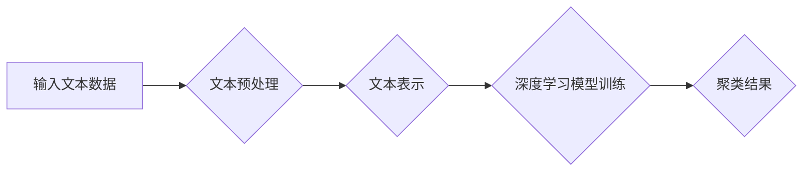

> 深度学习，文本聚类，K-means，层次聚类，主题模型，BERT，Word2Vec，自然语言处理

## 1. 背景介绍

文本聚类作为自然语言处理 (NLP) 中一项重要的任务，旨在将文本数据自动划分为若干个语义相似的类别。传统的文本聚类方法主要依赖于词袋模型 (Bag-of-Words) 和 TF-IDF 等特征工程技术，但这些方法难以捕捉文本中的语义关系和上下文信息。随着深度学习技术的快速发展，基于深度学习的文本聚类方法逐渐成为研究热点，取得了显著的成果。

深度学习模型能够自动学习文本的语义表示，并利用这些表示进行聚类，从而克服了传统方法的局限性。近年来，基于深度学习的文本聚类方法取得了显著的进展，例如：

* **Word2Vec 和 GloVe 等词嵌入模型** 可以将单词映射到低维向量空间，捕捉单词之间的语义相似性。
* **循环神经网络 (RNN)** 和 **长短期记忆网络 (LSTM)** 可以处理文本序列数据，学习文本的上下文信息。
* **Transformer 网络**，特别是 **BERT** 模型，能够捕捉长距离依赖关系，学习更丰富的文本语义表示。

## 2. 核心概念与联系

文本聚类本质上是将文本数据划分为若干个语义相似的类别，每个类别代表一个主题或概念。

**2.1  聚类算法**

聚类算法是将数据点划分为若干个簇的算法，每个簇包含相似的数据点。常见的聚类算法包括：

* **K-means 聚类:**  一种基于距离的聚类算法，需要事先指定聚类数 K。
* **层次聚类:**  一种将数据点逐步合并或分裂的聚类算法，可以生成不同层次的聚类结构。
* **DBSCAN 聚类:**  一种基于密度的聚类算法，可以发现任意形状的簇。

**2.2  文本表示**

文本表示是指将文本数据转换为机器可理解的数值向量。常用的文本表示方法包括：

* **词袋模型 (Bag-of-Words):**  将文本表示为单词出现的频率向量。
* **TF-IDF:**  一种权重词袋模型，将单词的权重根据其在文档中和整个语料库中的出现频率计算。
* **词嵌入模型:**  将单词映射到低维向量空间，捕捉单词之间的语义相似性。例如 Word2Vec 和 GloVe。

**2.3  深度学习模型**

深度学习模型可以自动学习文本的语义表示，并用于文本聚类。常见的深度学习模型包括：

* **循环神经网络 (RNN):**  可以处理文本序列数据，学习文本的上下文信息。
* **长短期记忆网络 (LSTM):**  一种改进的 RNN，可以更好地处理长文本序列。
* **Transformer 网络:**  特别是 BERT 模型，能够捕捉长距离依赖关系，学习更丰富的文本语义表示。

**2.4  流程图**



## 3. 核心算法原理 & 具体操作步骤

### 3.1  算法原理概述

基于深度学习的文本聚类算法通常包括以下步骤：

1. **文本预处理:**  对输入文本数据进行清洗、分词、去停用词等处理，以去除无关信息并提高聚类效果。
2. **文本表示:**  将预处理后的文本数据转换为机器可理解的数值向量，常用的方法包括词嵌入模型和深度学习模型的文本编码器。
3. **深度学习模型训练:**  使用训练数据训练深度学习模型，例如 RNN、LSTM 或 Transformer 网络，以学习文本的语义表示。
4. **聚类:**  使用训练好的深度学习模型对文本数据进行聚类，常用的聚类算法包括 K-means、层次聚类和 DBSCAN。
5. **结果评估:**  使用评价指标，例如 Silhouette Coefficient 和 Normalized Mutual Information，评估聚类结果的质量。

### 3.2  算法步骤详解

**3.2.1 文本预处理**

* **清洗:**  去除文本中的标点符号、HTML 标签等无关信息。
* **分词:**  将文本分割成单词或短语。
* **去停用词:**  去除常见的无意义词，例如“是”、“的”、“在”等。
* ** stemming/lemmatization:**  将词语还原到词根或词形规范。

**3.2.2 文本表示**

* **词嵌入模型:**  例如 Word2Vec 和 GloVe，将单词映射到低维向量空间，捕捉单词之间的语义相似性。
* **深度学习模型的文本编码器:**  例如 BERT 和 RoBERTa，可以学习更丰富的文本语义表示。

**3.2.3 深度学习模型训练**

* 选择合适的深度学习模型，例如 RNN、LSTM 或 Transformer 网络。
* 使用训练数据训练模型，并使用交叉验证等方法进行模型调参。

**3.2.4 聚类**

* 使用训练好的深度学习模型对文本数据进行聚类。
* 选择合适的聚类算法，例如 K-means、层次聚类或 DBSCAN。

**3.2.5 结果评估**

* 使用评价指标，例如 Silhouette Coefficient 和 Normalized Mutual Information，评估聚类结果的质量。

### 3.3  算法优缺点

**优点:**

* 能够捕捉文本中的语义关系和上下文信息。
* 自动学习文本表示，无需人工特征工程。
* 聚类效果通常优于传统方法。

**缺点:**

* 需要大量的训练数据。
* 训练过程复杂，计算资源消耗大。
* 模型解释性较差。

### 3.4  算法应用领域

* **文本分类:**  将文本数据自动分类到预定义的类别中。
* **主题模型:**  从文本数据中自动提取主题或概念。
* **文档相似度计算:**  计算两个文本文档之间的相似度。
* **用户画像:**  根据用户的文本数据构建用户画像。

## 4. 数学模型和公式 & 详细讲解 & 举例说明

### 4.1  数学模型构建

基于深度学习的文本聚类通常使用以下数学模型：

* **距离度量:**  例如欧氏距离、余弦相似度等，用于衡量两个文本向量之间的相似度。
* **聚类算法:**  例如 K-means、层次聚类等，用于将文本向量划分为若干个簇。

### 4.2  公式推导过程

**4.2.1 欧氏距离**

给定两个文本向量 $x$ 和 $y$，它们的欧氏距离定义为：

$$
d(x, y) = \sqrt{\sum_{i=1}^{n}(x_i - y_i)^2}
$$

其中，$n$ 是文本向量的维度。

**4.2.2 余弦相似度**

给定两个文本向量 $x$ 和 $y$，它们的余弦相似度定义为：

$$
\text{sim}(x, y) = \frac{x \cdot y}{||x|| ||y||}
$$

其中，$x \cdot y$ 是 $x$ 和 $y$ 的点积，$||x||$ 和 $||y||$ 分别是 $x$ 和 $y$ 的模长。

**4.2.3 K-means 聚类**

K-means 聚类算法的目标是将数据点划分为 $K$ 个簇，每个簇的中心点是该簇中所有数据点的平均值。

算法步骤：

1. 随机选择 $K$ 个数据点作为初始聚类中心。
2. 将每个数据点分配到距离其最近的聚类中心所属的簇。
3. 计算每个簇的中心点。
4. 重复步骤 2 和 3，直到聚类中心不再变化。

### 4.3  案例分析与讲解

**4.3.1 文本聚类案例**

假设我们有一组新闻文章，需要将其聚类到不同的主题类别中。我们可以使用基于深度学习的文本聚类算法，例如 BERT 模型，对这些新闻文章进行聚类。

**4.3.2 案例分析**

* **文本预处理:**  对新闻文章进行清洗、分词、去停用词等处理。
* **文本表示:**  使用 BERT 模型对新闻文章进行编码，得到每个文章的文本向量表示。
* **聚类:**  使用 K-means 聚类算法将新闻文章向量划分为不同的主题类别。
* **结果评估:**  使用 Silhouette Coefficient 和 Normalized Mutual Information 等指标评估聚类结果的质量。

## 5. 项目实践：代码实例和详细解释说明

### 5.1  开发环境搭建

* Python 3.6+
* TensorFlow 或 PyTorch 深度学习框架
* NLTK 或 SpaCy 自然语言处理库
* Gensim 词嵌入库

### 5.2  源代码详细实现

```python
import tensorflow as tf
from tensorflow.keras.layers import Embedding, LSTM, Dense
from sklearn.cluster import KMeans

# 文本预处理
def preprocess_text(text):
    # ...

# 文本表示
def text_embedding(text):
    # ...

# 深度学习模型训练
def train_model(texts, labels):
    # ...

# 聚类
def cluster_texts(texts):
    # ...

# 运行代码
texts = preprocess_text(news_articles)
embeddings = text_embedding(texts)
model = train_model(embeddings, labels)
clusters = cluster_texts(embeddings)
```

### 5.3  代码解读与分析

* **文本预处理:**  代码中定义了 `preprocess_text` 函数，用于对文本数据进行清洗、分词、去停用词等处理。
* **文本表示:**  代码中定义了 `text_embedding` 函数，用于使用深度学习模型对文本数据进行编码，得到每个文章的文本向量表示。
* **深度学习模型训练:**  代码中定义了 `train_model` 函数，用于训练深度学习模型，例如 RNN 或 LSTM 网络。
* **聚类:**  代码中定义了 `cluster_texts` 函数，用于使用 K-means 聚类算法将文本向量划分为不同的主题类别。

### 5.4  运行结果展示

运行代码后，可以得到每个新闻文章所属的主题类别，并可以根据主题类别对新闻文章进行分组和展示。

## 6. 实际应用场景

### 6.1  文本分类

基于深度学习的文本聚类可以用于自动将文本数据分类到预定义的类别中，例如：

* **垃圾邮件分类:**  将电子邮件分类为垃圾邮件或正常邮件。
* **情感分析:**  将文本数据分类为正向、负向或中性情感。
* **新闻主题分类:**  将新闻文章分类到不同的主题类别中，例如政治、财经、体育等。

### 6.2  主题模型

基于深度学习的文本聚类可以用于从文本数据中自动提取主题或概念，例如：

* **文档主题建模:**  从一组文档中提取主题，并为每个文档分配主题权重。
* **社交媒体话题分析:**  从社交媒体数据中提取热门话题，并分析话题的传播趋势。

### 6.3  文档相似度计算

基于深度学习的文本聚类可以用于计算两个文本文档之间的相似度，例如：

* **信息检索:**  根据用户查询，从文档库中检索出与查询最相关的文档。
* **文本摘要:**  从长文本中提取出最重要的部分，生成文本摘要。

### 6.4  未来应用展望

随着深度学习技术的不断发展，基于深度学习的文本聚类方法将在更多领域得到应用，例如：

* **个性化推荐:**  根据用户的文本数据，推荐个性化的商品、服务或内容。
* **医疗诊断:**  从患者的病历和检查报告中提取诊断信息，辅助医生进行诊断。
* **法律文本分析:**  从法律文本中提取关键信息，辅助律师进行法律研究和案件分析。

## 7. 工具和资源推荐

### 7.1  学习资源推荐

