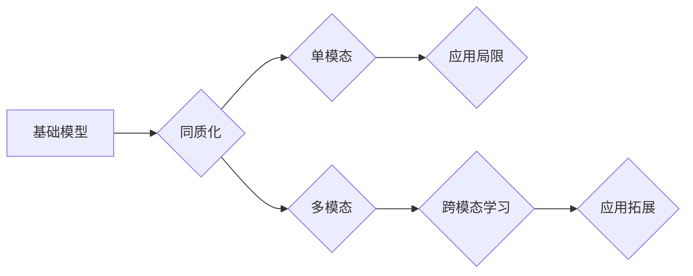

> 基础模型、同质化、多模态模型、大语言模型、图像生成、文本理解、跨模态学习、应用场景

## 1. 背景介绍

近年来，人工智能领域取得了令人瞩目的进展，其中基础模型扮演着越来越重要的角色。基础模型是指在海量数据上预训练的强大通用模型，能够在各种下游任务中表现出卓越的性能。例如，GPT-3、BERT、DALL-E 2 等都是著名的基础模型。

基础模型的出现，标志着人工智能发展进入了一个新的阶段。它们打破了传统人工特征工程的局限，能够自动学习数据中的复杂模式和关系，从而实现更智能、更灵活的应用。然而，随着基础模型的快速发展，也出现了新的挑战和问题，其中之一就是基础模型的同质化问题。

## 2. 核心概念与联系

**2.1 基础模型的同质化**

基础模型的同质化是指不同研究机构或公司开发的基础模型在架构、训练数据、训练方法等方面存在高度相似性，导致模型性能差异不大，缺乏创新和多样性。

**2.2 多模态模型的优势**

多模态模型是指能够处理多种类型数据的模型，例如文本、图像、音频、视频等。与单模态模型相比，多模态模型能够更好地理解和交互于真实世界，具有更强的表达能力和应用潜力。

**2.3 同质化与多模态的联系**

基础模型的同质化问题，一方面限制了模型的多样性和创新性，另一方面也阻碍了多模态模型的发展。因为现有的基础模型大多是单模态的，缺乏跨模态学习的能力。

**2.4 Mermaid 流程图**



## 3. 核心算法原理 & 具体操作步骤

**3.1 算法原理概述**

多模态模型的训练目标是学习不同模态之间的关系和映射，从而实现跨模态理解和生成。常用的算法包括：

* **自监督学习:** 利用同一模态或不同模态之间的关系，训练模型学习数据中的潜在表示。
* **迁移学习:** 利用预训练好的单模态模型，迁移到多模态任务中，提高训练效率和性能。
* **对抗训练:** 利用生成对抗网络 (GAN) 的思想，训练模型生成逼真的多模态数据，提高模型的鲁棒性和泛化能力。

**3.2 算法步骤详解**

1. **数据预处理:** 将不同模态的数据进行清洗、格式化和转换，使其能够被模型理解。
2. **特征提取:** 利用预训练好的模型或手工设计的特征提取器，从不同模态的数据中提取特征表示。
3. **模态融合:** 将不同模态的特征进行融合，形成统一的表示。常用的融合方法包括：
    * **早期融合:** 在特征提取阶段将不同模态的特征进行拼接或连接。
    * **晚期融合:** 在模型输出阶段将不同模态的预测结果进行融合。
    * **跨模态注意力机制:** 利用注意力机制学习不同模态之间的重要关系，动态地权衡不同模态的贡献。
4. **模型训练:** 利用训练数据和融合后的特征，训练多模态模型。常用的损失函数包括交叉熵损失、均方误差损失等。
5. **模型评估:** 利用测试数据评估模型的性能，常用的指标包括准确率、召回率、F1-score等。

**3.3 算法优缺点**

* **优点:**
    * 能够处理多种类型的数据，更好地理解和交互于真实世界。
    * 具有更强的表达能力和应用潜力。
* **缺点:**
    * 训练数据量大，计算资源消耗高。
    * 模型结构复杂，训练难度大。

**3.4 算法应用领域**

* **图像字幕生成:** 将图像转换为文本描述。
* **视频理解:** 理解视频内容，例如动作识别、事件检测等。
* **文本到图像生成:** 根据文本描述生成图像。
* **跨模态检索:** 根据文本或图像查询其他模态的数据。
* **机器人交互:** 帮助机器人理解和响应人类的语音、图像和动作指令。

## 4. 数学模型和公式 & 详细讲解 & 举例说明

**4.1 数学模型构建**

多模态模型通常采用神经网络架构，将不同模态的数据映射到一个共同的特征空间。

**4.2 公式推导过程**

假设我们有一个包含文本和图像的多模态数据集，其中每个样本包含一个文本序列 $x$ 和一个图像 $y$。

* **文本编码器:** 使用一个预训练好的文本编码器，例如BERT，将文本序列 $x$ 编码为一个文本向量 $h_x$。
* **图像编码器:** 使用一个预训练好的图像编码器，例如ResNet，将图像 $y$ 编码为一个图像向量 $h_y$。
* **模态融合层:** 将文本向量 $h_x$ 和图像向量 $h_y$ 进行融合，形成一个统一的表示 $h$。常用的融合方法包括：
    * **拼接:** 将 $h_x$ 和 $h_y$ 直接拼接在一起。
    * **注意力机制:** 利用注意力机制学习 $h_x$ 和 $h_y$ 之间的权重，动态地融合不同模态的信息。

**4.3 案例分析与讲解**

例如，在图像字幕生成任务中，多模态模型需要根据图像 $y$ 生成相应的文本描述 $x$。

* **输入:** 图像 $y$
* **编码:** 将图像 $y$ 编码为图像向量 $h_y$。
* **解码:** 使用一个文本解码器，例如GPT，将图像向量 $h_y$ 转换为文本描述 $x$。

**4.4 数学公式**

* 文本编码器输出: $h_x = f_x(x)$
* 图像编码器输出: $h_y = f_y(y)$
* 模态融合层输出: $h = g(h_x, h_y)$
* 文本解码器输出: $x = f_z(h)$

其中，$f_x$, $f_y$, $g$, $f_z$ 分别表示文本编码器、图像编码器、模态融合层和文本解码器的参数函数。

## 5. 项目实践：代码实例和详细解释说明

**5.1 开发环境搭建**

* Python 3.7+
* PyTorch 1.7+
* CUDA 10.2+

**5.2 源代码详细实现**

```python
import torch
import torch.nn as nn

class MultiModalModel(nn.Module):
    def __init__(self, text_encoder, image_encoder, fusion_layer):
        super(MultiModalModel, self).__init__()
        self.text_encoder = text_encoder
        self.image_encoder = image_encoder
        self.fusion_layer = fusion_layer

    def forward(self, text, image):
        text_embedding = self.text_encoder(text)
        image_embedding = self.image_encoder(image)
        fused_embedding = self.fusion_layer(text_embedding, image_embedding)
        return fused_embedding

# 实例化模型
text_encoder = BERT(pretrained=True)
image_encoder = ResNet(pretrained=True)
fusion_layer = AttentionFusion()
model = MultiModalModel(text_encoder, image_encoder, fusion_layer)

# 训练模型
optimizer = torch.optim.Adam(model.parameters(), lr=0.001)
loss_fn = nn.CrossEntropyLoss()

for epoch in range(num_epochs):
    for batch in dataloader:
        text, image, label = batch
        output = model(text, image)
        loss = loss_fn(output, label)
        optimizer.zero_grad()
        loss.backward()
        optimizer.step()

```

**5.3 代码解读与分析**

* 代码首先定义了一个多模态模型类 `MultiModalModel`，包含文本编码器、图像编码器和模态融合层。
* 然后实例化模型，并使用 Adam 优化器和交叉熵损失函数进行训练。
* 训练过程循环遍历数据集，计算模型输出与真实标签之间的损失，并使用梯度下降算法更新模型参数。

**5.4 运行结果展示**

训练完成后，可以将模型应用于实际场景，例如图像字幕生成、视频理解等。

## 6. 实际应用场景

**6.1 图像字幕生成**

多模态模型可以根据图像生成相应的文本描述，例如为盲人生成图像描述，为搜索引擎提供图像理解能力。

**6.2 视频理解**

多模态模型可以理解视频内容，例如识别动作、检测事件、生成视频摘要等。

**6.3 文本到图像生成**

多模态模型可以根据文本描述生成图像，例如为用户生成个性化头像，为创意写作提供图像素材。

**6.4 跨模态检索**

多模态模型可以根据文本或图像查询其他模态的数据，例如在图像库中搜索与文本描述相匹配的图像。

**6.5 机器人交互**

多模态模型可以帮助机器人理解和响应人类的语音、图像和动作指令，实现更自然的人机交互。

**6.6 未来应用展望**

随着多模态模型的不断发展，其应用场景将更加广泛，例如：

* **虚拟现实和增强现实:** 为虚拟世界提供更沉浸式的体验。
* **医疗保健:** 辅助医生诊断疾病、分析医学影像。
* **教育:** 提供个性化的学习体验、辅助残障人士学习。
* **艺术创作:** 帮助艺术家创作新的艺术作品。

## 7. 工具和资源推荐

**7.1 学习资源推荐**

* **书籍:**
    * 《深度学习》
    * 《计算机视觉:算法与应用》
    * 《自然语言处理》
* **在线课程:**
    * Coursera: 深度学习
    * Udacity: 计算机视觉
    * fast.ai: 深度学习

**7.2 开发工具推荐**

* **框架:** PyTorch, TensorFlow
* **库:** OpenCV, PIL, NLTK
* **平台:** Google Colab, Kaggle

**7.3 相关论文推荐**

* **多模态学习:**
    * Multimodal Learning with Deep Neural Networks
    * A Survey on Multimodal Learning
* **图像字幕生成:**
    * Show, Attend and Tell: Neural Image Captioning with Visual Attention
    * Image Captioning with Deep Recurrent Neural Networks

## 8. 总结：未来发展趋势与挑战

**8.1 研究成果总结**

近年来，多模态模型取得了显著进展，在图像字幕生成、视频理解、文本到图像生成等任务中取得了优异的性能。

**8.2 未来发展趋势**

* **模型规模和能力的提升:** 随着计算资源的不断发展，多模态模型的规模和能力将进一步提升，能够处理更复杂的任务。
* **跨模态知识的共享和迁移:** 研究如何更好地共享和迁移不同模态之间的知识，提高模型的泛化能力。
* **多模态数据生成和合成:** 研究如何生成高质量的多模态数据，缓解数据稀缺问题。
* **解释性和可解释性:** 研究如何提高多模态模型的解释性和可解释性，使其能够更好地被人类理解和信任。

**8.3 面临的挑战**

* **数据标注成本高:** 多模态数据的标注成本很高，难以获得大规模标注数据集。
* **模型训练复杂度高:** 多模态模型的训练复杂度高，需要大量的计算资源和时间。
* **模态之间的关系复杂:** 不同模态之间的关系复杂多样，难以用数学模型完全描述。

**8.4 研究展望**

未来，多模态模型将继续朝着更智能、