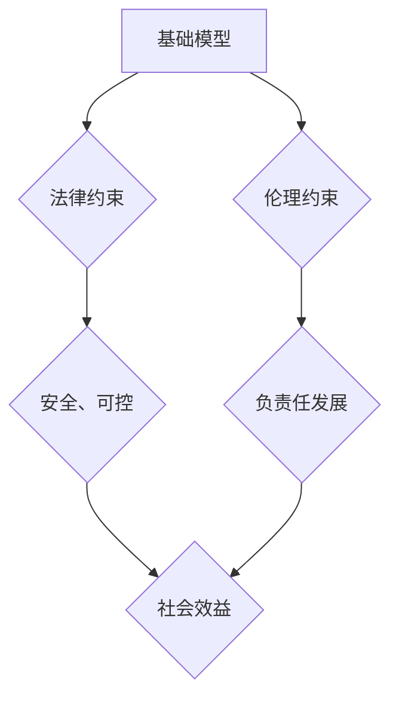

> 基础模型，法律约束，伦理约束，人工智能，偏见，透明度，可解释性，责任

## 1. 背景介绍

基础模型（Foundation Models）是近年来人工智能领域发展迅速的代表性技术之一。它们通常是规模庞大、训练数据海量的深度学习模型，能够在广泛的应用场景中进行泛化学习，例如文本生成、图像识别、机器翻译等。基础模型的强大能力为人工智能的广泛应用提供了基础，但也带来了新的法律和伦理挑战。

随着基础模型的应用日益广泛，其潜在的风险也逐渐显现。例如，基础模型可能被用于生成虚假信息、传播仇恨言论、侵犯个人隐私等。此外，基础模型的训练数据可能包含社会偏见，导致模型输出结果存在歧视性。这些问题引发了人们对基础模型法律和伦理约束的关注。

## 2. 核心概念与联系

**2.1 基础模型**

基础模型是指在海量数据上进行预训练的深度学习模型，具有强大的泛化能力，能够在多种下游任务中进行微调。

**2.2 法律约束**

法律约束是指由国家或其他具有法律效力的机构制定的规则和规范，用于规范社会行为，维护社会秩序。

**2.3 伦理约束**

伦理约束是指基于道德原则和社会价值观制定的规范，用于指导人们的行为，促进社会良性发展。

**2.4 核心概念联系**

基础模型的开发和应用需要遵循法律和伦理约束，以确保其安全、可控和负责任地发展。法律约束为基础模型的开发和应用提供了明确的边界和规范，而伦理约束则提供了更深层的指导和思考，帮助我们评估基础模型的潜在影响，并制定相应的应对措施。



## 3. 核心算法原理 & 具体操作步骤

**3.1 算法原理概述**

基础模型的训练通常基于深度学习算法，例如Transformer模型。这些算法通过学习大量数据中的模式和关系，构建复杂的特征表示，从而实现对各种任务的泛化学习能力。

**3.2 算法步骤详解**

1. **数据收集和预处理:** 收集大量文本、图像、音频等数据，并进行清洗、格式化等预处理操作。
2. **模型架构设计:** 根据任务需求设计深度学习模型的架构，例如Transformer、BERT等。
3. **模型训练:** 使用预处理后的数据对模型进行训练，通过调整模型参数，使其能够学习数据中的模式和关系。
4. **模型评估:** 使用测试数据评估模型的性能，并根据评估结果进行模型调优。
5. **模型部署:** 将训练好的模型部署到实际应用场景中，例如文本生成、图像识别等。

**3.3 算法优缺点**

**优点:**

* 强大的泛化能力：基础模型能够在多种下游任务中进行微调，实现跨任务学习。
* 高效的训练效率：利用大规模数据和并行计算，基础模型的训练效率较高。
* 持续的改进：随着数据量的增加和算法的改进，基础模型的性能不断提升。

**缺点:**

* 训练成本高昂：基础模型的训练需要大量的计算资源和时间，成本较高。
* 数据依赖性强：基础模型的性能取决于训练数据的质量和数量，数据偏差会导致模型输出结果存在问题。
* 可解释性差：深度学习模型的内部机制复杂，难以解释模型的决策过程。

**3.4 算法应用领域**

基础模型在各个领域都有广泛的应用，例如：

* 自然语言处理：文本生成、机器翻译、问答系统等。
* 图像识别：物体检测、图像分类、图像生成等。
* 语音识别：语音转文本、语音合成等。
* 代码生成：自动代码生成、代码修复等。

## 4. 数学模型和公式 & 详细讲解 & 举例说明

**4.1 数学模型构建**

基础模型的训练通常基于最大似然估计（Maximum Likelihood Estimation，MLE）或交叉熵损失函数（Cross-Entropy Loss Function）。

**4.2 公式推导过程**

假设训练数据为{(x1, y1), (x2, y2), ..., (xn, yn)}，其中xi为输入数据，yi为目标输出。

* **最大似然估计:**

MLE的目标是找到模型参数θ，使得模型在训练数据上的似然概率最大化。

$$
\theta = \arg\max_ \theta P(Y|X, \theta)
$$

* **交叉熵损失函数:**

交叉熵损失函数用于衡量模型预测结果与真实输出之间的差异。

$$
L(\theta) = -\frac{1}{n} \sum_{i=1}^{n} y_i \log p(y_i|x_i, \theta)
$$

其中，p(yi|xi, θ)为模型预测输出yi的概率。

**4.3 案例分析与讲解**

例如，在文本生成任务中，基础模型需要学习语言的语法和语义规则，并根据输入文本生成下一个单词。

训练过程中，模型会根据输入文本序列和目标单词序列，计算交叉熵损失函数的值。通过反向传播算法，模型会更新参数，使得损失函数值逐渐减小，最终达到生成符合语义和语法规则的文本的目标。

## 5. 项目实践：代码实例和详细解释说明

**5.1 开发环境搭建**

使用Python语言和深度学习框架TensorFlow或PyTorch搭建开发环境。

**5.2 源代码详细实现**

```python
# 使用TensorFlow框架实现基础模型训练
import tensorflow as tf

# 定义模型架构
model = tf.keras.Sequential([
    tf.keras.layers.Embedding(input_dim=vocab_size, output_dim=embedding_dim),
    tf.keras.layers.LSTM(units=hidden_size),
    tf.keras.layers.Dense(units=vocab_size, activation='softmax')
])

# 编译模型
model.compile(optimizer='adam', loss='sparse_categorical_crossentropy', metrics=['accuracy'])

# 训练模型
model.fit(x_train, y_train, epochs=num_epochs, batch_size=batch_size)

# 保存模型
model.save('model.h5')
```

**5.3 代码解读与分析**

* 代码首先定义了模型架构，包括嵌入层、LSTM层和全连接层。
* 嵌入层将单词映射到低维向量空间。
* LSTM层用于学习文本序列中的长短依赖关系。
* 全连接层将LSTM层的输出映射到目标单词的概率分布。
* 代码然后编译模型，指定优化器、损失函数和评价指标。
* 最后，代码训练模型，并保存训练好的模型。

**5.4 运行结果展示**

训练完成后，可以使用测试数据评估模型的性能，并根据评估结果进行模型调优。

## 6. 实际应用场景

基础模型在各个领域都有广泛的应用，例如：

* **自然语言处理:**

    * 文本生成：自动生成新闻报道、小说、诗歌等。
    * 机器翻译：将文本从一种语言翻译成另一种语言。
    * 问答系统：根据用户的问题，从知识库中找到答案。

* **图像识别:**

    * 物体检测：识别图像中存在的物体，并定位其位置。
    * 图像分类：将图像分类到不同的类别中。
    * 图像生成：根据文本描述生成图像。

* **语音识别:**

    * 语音转文本：将语音信号转换为文本。
    * 语音合成：将文本转换为语音信号。

**6.4 未来应用展望**

基础模型的应用前景广阔，未来可能在以下领域得到更广泛的应用：

* **个性化推荐:** 根据用户的兴趣和行为，推荐个性化的商品、服务和内容。
* **医疗诊断:** 辅助医生进行疾病诊断，提高诊断准确率。
* **教育辅助:** 提供个性化的学习辅导，帮助学生提高学习效率。

## 7. 工具和资源推荐

**7.1 学习资源推荐**

* **书籍:**

    * 《深度学习》
    * 《自然语言处理》

* **在线课程:**

    * Coursera
    * edX

**7.2 开发工具推荐**

* **深度学习框架:** TensorFlow, PyTorch
* **编程语言:** Python

**7.3 相关论文推荐**

* 《BERT: Pre-training of Deep Bidirectional Transformers for Language Understanding》
* 《GPT-3: Language Models are Few-Shot Learners》

## 8. 总结：未来发展趋势与挑战

**8.1 研究成果总结**

基础模型在人工智能领域取得了显著的进展，为各种应用场景提供了强大的工具。

**8.2 未来发展趋势**

* 模型规模的进一步扩大
* 训练数据的多样化和高质量化
* 模型可解释性和透明度的提升
* 跨模态基础模型的开发

**8.3 面临的挑战**

* 训练成本高昂
* 数据偏差和公平性问题
* 安全性和隐私保护问题
* 伦理和社会影响问题

**8.4 研究展望**

未来研究需要关注基础模型的安全性、可解释性和伦理问题，并探索新的训练方法和模型架构，以推动基础模型的健康发展。

## 9. 附录：常见问题与解答

**9.1 如何选择合适的基础模型？**

选择合适的基础模型需要根据具体的应用场景和任务需求进行考虑。例如，对于文本生成任务，可以选择GPT-3等文本生成模型；对于图像识别任务，可以选择ResNet、EfficientNet等图像识别模型。

**9.2 如何解决基础模型的训练成本问题？**

可以采用以下方法降低基础模型的训练成本：

* 使用云计算平台进行训练
* 采用模型压缩和剪枝技术
* 利用分布式训练技术

**9.3 如何保证基础模型的安全性？**

可以采用以下方法保证基础模型的安全性：

* 对训练数据进行严格的筛选和清洗
* 使用对抗训练技术提高模型的鲁棒性
* 对模型输出进行安全审计

**9.4 如何解决基础模型的伦理问题？**

需要制定相应的伦理规范和政策，并加强对基础模型的监督和管理，以确保其安全、可控和负责任地发展。


作者：禅与计算机程序设计艺术 / Zen and the Art of Computer Programming 
<end_of_turn>