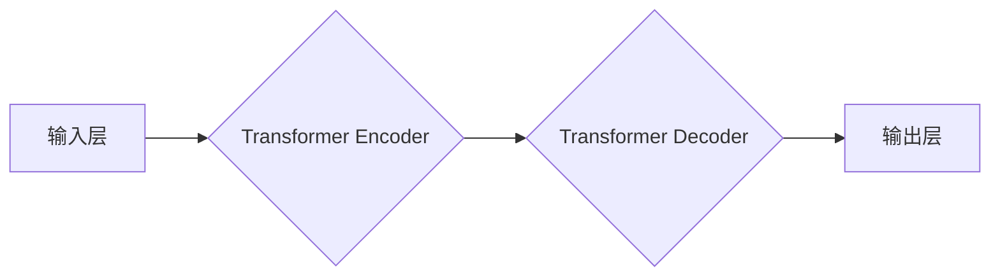

> 大模型、创业、机遇、挑战、成长、AI、深度学习、Transformer、自然语言处理、计算机视觉

## 1. 背景介绍

近年来，人工智能（AI）技术突飞猛进，特别是大模型的兴起，为各行各业带来了前所未有的机遇。大模型，是指参数规模庞大、训练数据海量的人工智能模型，其强大的学习能力和泛化能力，赋予了它处理复杂问题、生成高质量内容、理解自然语言等能力，在自然语言处理、计算机视觉、药物研发等领域展现出巨大的潜力。

对于创业者而言，大模型时代带来了前所未有的机遇，但也伴随着诸多挑战。如何抓住机遇，克服挑战，在竞争激烈的市场中脱颖而出，成为创业者需要认真思考的问题。本文将从创业者的角度，探讨大模型时代创业的机遇、挑战和成长之道。

## 2. 核心概念与联系

### 2.1 大模型概述

大模型是指参数规模庞大、训练数据海量的人工智能模型。其核心特点是：

* **参数规模巨大:** 大模型通常拥有数十亿甚至数千亿个参数，这使得它们能够学习到更复杂的模式和关系。
* **训练数据海量:** 大模型的训练需要大量的文本、图像、音频等数据，这些数据可以帮助模型更好地理解和生成人类语言和内容。
* **强大的泛化能力:** 由于参数规模庞大、训练数据海量，大模型能够将学习到的知识应用到新的、未见过的任务和领域中。

### 2.2 大模型的架构

大模型的架构主要基于 Transformer 模型，Transformer 模型是一种基于注意力机制的神经网络架构，能够有效地处理序列数据，例如文本和音频。



**Transformer Encoder:** 负责对输入序列进行编码，提取其语义信息。

**Transformer Decoder:** 负责根据编码后的语义信息生成输出序列。

### 2.3 大模型的应用场景

大模型在各个领域都有广泛的应用场景，例如：

* **自然语言处理:** 文本生成、机器翻译、问答系统、情感分析等。
* **计算机视觉:** 图像识别、物体检测、图像生成等。
* **语音识别:** 语音转文本、语音合成等。
* **药物研发:** 药物发现、药物设计等。

## 3. 核心算法原理 & 具体操作步骤

### 3.1 算法原理概述

Transformer 模型的核心是注意力机制，注意力机制能够让模型关注输入序列中最重要的部分，从而提高模型的理解和生成能力。

注意力机制的工作原理是：

1. 计算每个词与所有其他词之间的相关性。
2. 根据相关性，为每个词分配一个权重。
3. 将每个词的权重加权平均，得到一个新的表示。

### 3.2 算法步骤详解

1. **输入层:** 将输入序列转换为向量表示。
2. **编码器:** 使用多层 Transformer Encoder 对输入序列进行编码，每个 Encoder 层包含多头注意力机制和前馈神经网络。
3. **解码器:** 使用多层 Transformer Decoder 对编码后的序列进行解码，每个 Decoder 层也包含多头注意力机制和前馈神经网络。
4. **输出层:** 将解码后的序列转换为目标输出。

### 3.3 算法优缺点

**优点:**

* **强大的泛化能力:** Transformer 模型能够学习到复杂的模式和关系，从而具有较强的泛化能力。
* **并行计算能力:** Transformer 模型的注意力机制能够并行计算，提高了训练效率。
* **长距离依赖关系:** Transformer 模型能够处理长距离依赖关系，例如在文本中理解句子之间的关系。

**缺点:**

* **训练成本高:** Transformer 模型的参数规模庞大，训练需要大量的计算资源和时间。
* **数据依赖性强:** Transformer 模型的性能取决于训练数据的质量和数量。

### 3.4 算法应用领域

Transformer 模型在自然语言处理、计算机视觉、语音识别等领域都有广泛的应用，例如：

* **BERT:** 用于文本分类、问答系统、机器翻译等任务。
* **GPT-3:** 用于文本生成、代码生成、对话系统等任务。
* **DALL-E 2:** 用于图像生成、图像编辑等任务。

## 4. 数学模型和公式 & 详细讲解 & 举例说明

### 4.1 数学模型构建

Transformer 模型的数学模型主要基于以下几个核心概念：

* **注意力机制:** 用于计算每个词与所有其他词之间的相关性。
* **多头注意力机制:** 使用多个注意力头来捕捉不同类型的语义信息。
* **前馈神经网络:** 用于对每个词的表示进行非线性变换。

### 4.2 公式推导过程

注意力机制的计算公式如下：

$$
Attention(Q, K, V) = softmax(\frac{QK^T}{\sqrt{d_k}})V
$$

其中：

* $Q$：查询矩阵
* $K$：键矩阵
* $V$：值矩阵
* $d_k$：键向量的维度
* $softmax$：softmax 函数

### 4.3 案例分析与讲解

假设我们有一个句子 "The cat sat on the mat"，我们想要计算 "cat" 与其他词之间的注意力权重。

1. 将句子中的每个词转换为向量表示。
2. 计算 "cat" 与每个其他词的注意力得分。
3. 使用 softmax 函数将注意力得分转换为概率分布。
4. 根据概率分布，计算 "cat" 与每个其他词的加权平均值，得到 "cat" 的最终表示。

## 5. 项目实践：代码实例和详细解释说明

### 5.1 开发环境搭建

* Python 3.7+
* PyTorch 1.7+
* CUDA 10.2+

### 5.2 源代码详细实现

```python
import torch
import torch.nn as nn

class Transformer(nn.Module):
    def __init__(self, vocab_size, embedding_dim, num_heads, num_layers):
        super(Transformer, self).__init__()
        self.embedding = nn.Embedding(vocab_size, embedding_dim)
        self.encoder_layers = nn.ModuleList([EncoderLayer(embedding_dim, num_heads) for _ in range(num_layers)])
        self.decoder_layers = nn.ModuleList([DecoderLayer(embedding_dim, num_heads) for _ in range(num_layers)])

    def forward(self, src, tgt):
        src = self.embedding(src)
        tgt = self.embedding(tgt)
        
        # Encoder
        encoder_output = src
        for layer in self.encoder_layers:
            encoder_output = layer(encoder_output)

        # Decoder
        decoder_output = tgt
        for layer in self.decoder_layers:
            decoder_output = layer(decoder_output, encoder_output)

        return decoder_output

class EncoderLayer(nn.Module):
    def __init__(self, embedding_dim, num_heads):
        super(EncoderLayer, self).__init__()
        self.multihead_attn = nn.MultiheadAttention(embedding_dim, num_heads)
        self.feed_forward = nn.Sequential(
            nn.Linear(embedding_dim, 4 * embedding_dim),
            nn.ReLU(),
            nn.Linear(4 * embedding_dim, embedding_dim)
        )

    def forward(self, x):
        attn_output, _ = self.multihead_attn(x, x, x)
        x = x + attn_output
        x = self.feed_forward(x)
        return x

class DecoderLayer(nn.Module):
    def __init__(self, embedding_dim, num_heads):
        super(DecoderLayer, self).__init__()
        self.self_attn = nn.MultiheadAttention(embedding_dim, num_heads)
        self.encoder_attn = nn.MultiheadAttention(embedding_dim, num_heads)
        self.feed_forward = nn.Sequential(
            nn.Linear(embedding_dim, 4 * embedding_dim),
            nn.ReLU(),
            nn.Linear(4 * embedding_dim, embedding_dim)
        )

    def forward(self, x, encoder_output):
        attn_output, _ = self.self_attn(x, x, x)
        x = x + attn_output
        attn_output, _ = self.encoder_attn(x, encoder_output, encoder_output)
        x = x + attn_output
        x = self.feed_forward(x)
        return x
```

### 5.3 代码解读与分析

* **Transformer 类:** 定义了 Transformer 模型的整体结构，包含嵌入层、编码器层和解码器层。
* **EncoderLayer 和 DecoderLayer 类:** 定义了编码器和解码器中的单个层结构，包含多头注意力机制和前馈神经网络。
* **forward 方法:** 定义了模型的正向传播过程，将输入序列转换为目标输出。

### 5.4 运行结果展示

运行代码后，模型将能够对输入序列进行编码和解码，生成目标输出。例如，输入序列为 "The cat sat on the mat"，目标输出为 "The cat sat on the mat"。

## 6. 实际应用场景

### 6.1 自然语言处理

大模型在自然语言处理领域有着广泛的应用，例如：

* **文本生成:** 可以用于生成各种类型的文本，例如文章、故事、诗歌等。
* **机器翻译:** 可以将文本从一种语言翻译成另一种语言。
* **问答系统:** 可以回答用户提出的问题。
* **情感分析:** 可以分析文本的情感倾向，例如正面、负面或中性。

### 6.2 计算机视觉

大模型在计算机视觉领域也有着重要的应用，例如：

* **图像识别:** 可以识别图像中的物体、场景等。
* **图像生成:** 可以生成逼真的图像。
* **图像编辑:** 可以对图像进行编辑，例如添加、删除或修改物体。

### 6.3 语音识别

大模型在语音识别领域也有着重要的应用，例如：

* **语音转文本:** 可以将语音转换为文本。
* **语音合成:** 可以将文本转换为语音。

### 6.4 未来应用展望

随着大模型技术的不断发展，其应用场景将会更加广泛，例如：

* **个性化教育:** 根据学生的学习情况，提供个性化的学习内容和辅导。
* **医疗诊断:** 辅助医生进行疾病诊断。
* **自动驾驶:** 帮助自动驾驶汽车理解周围环境。

## 7. 工具和资源推荐

### 7.1 学习资源推荐

* **书籍:**
    * 《深度学习》
    * 《自然语言处理》
    * 《Transformer 详解》
* **在线课程:**
    * Coursera: 深度学习
    * Udacity: 自然语言处理
    * fast.ai: 深度学习

### 7.2 开发工具推荐

* **框架:**
    * PyTorch
    * TensorFlow
* **库:**
    * HuggingFace Transformers
    * OpenAI API

### 7.3 相关论文推荐

* **Attention Is All You Need:** https://arxiv.org/abs/1706.03762
* **BERT: Pre-training of Deep Bidirectional Transformers for Language Understanding:** https://arxiv.org/abs/1810.04805
* **GPT-3: Language Models are Few-Shot Learners:** https://arxiv.org/abs/2005.14165

## 8. 总结：未来发展趋势与挑战

### 8.1 研究成果总结

大模型技术取得了显著的进展，在自然语言处理、计算机视觉等领域取得了突破性成果。

### 8.2 未来发展趋势

* **模型规模更大:** 模型参数规模将继续扩大，从而提升模型的性能。
* **训练效率更高:** 将探索新的训练方法和硬件架构