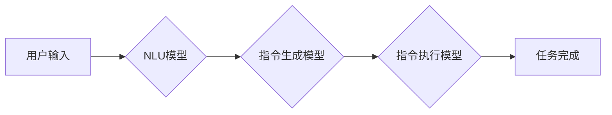

> 大规模语言模型，自动构建指令，自然语言理解，深度学习，Transformer，指令生成，应用场景

## 1. 背景介绍

近年来，大规模语言模型（LLM）在自然语言处理领域取得了令人瞩目的成就。从文本生成、翻译到问答和代码编写，LLM展现出强大的能力，深刻地改变了我们与计算机交互的方式。然而，LLM的应用通常依赖于精心设计的特定任务指令，这限制了其灵活性和通用性。自动构建指令，使得LLM能够更有效地理解用户意图，并执行更复杂的任务，成为一个重要的研究方向。

传统的指令设计通常需要人工经验和专业知识，耗时费力，且难以适应不断变化的用户需求。自动构建指令则可以利用LLM自身的学习能力，从文本数据中学习用户意图和任务需求，自动生成相应的指令，从而实现更灵活、更智能的交互体验。

## 2. 核心概念与联系

### 2.1 自然语言理解 (NLU)

NLU是自动构建指令的核心技术之一，旨在使计算机能够理解人类语言的含义。NLU模型通常通过深度学习技术，例如Transformer网络，学习语言的语法结构和语义关系，从而识别文本中的关键信息，例如实体、关系和意图。

### 2.2 指令生成 (Instruction Generation)

指令生成是指根据用户输入的文本，自动生成相应的指令。这需要模型能够理解用户意图，并将其转化为机器可执行的指令。指令生成模型通常基于Transformer网络，并结合NLU模型的输出，学习不同类型指令与用户意图之间的映射关系。

### 2.3 指令执行 (Instruction Execution)

指令执行是指根据生成的指令，执行相应的任务。这通常需要调用其他应用程序或服务，例如搜索引擎、数据库或图像处理工具。指令执行模型需要能够理解指令的语义，并将其转化为具体的操作步骤。

**Mermaid 流程图**



## 3. 核心算法原理 & 具体操作步骤

### 3.1 算法原理概述

自动构建指令的核心算法通常基于深度学习技术，特别是Transformer网络。Transformer网络具有强大的序列建模能力，能够捕捉文本中的长距离依赖关系，从而更好地理解用户意图和任务需求。

自动构建指令的算法流程一般包括以下步骤：

1. **文本预处理:** 将用户输入的文本进行清洗、分词和标记等预处理操作，使其能够被模型理解。
2. **NLU模型分析:** 将预处理后的文本输入到NLU模型中，识别文本中的关键信息，例如实体、关系和意图。
3. **指令生成模型训练:** 利用NLU模型的输出和相应的指令对，训练指令生成模型，使其能够学习不同类型指令与用户意图之间的映射关系。
4. **指令生成:** 将NLU模型的输出作为输入，通过训练好的指令生成模型，自动生成相应的指令。
5. **指令执行:** 将生成的指令输入到指令执行模型中，执行相应的任务。

### 3.2 算法步骤详解

1. **文本预处理:**

   - **清洗:** 去除文本中的停用词、标点符号和HTML标签等无关信息。
   - **分词:** 将文本分割成一个个独立的词语或短语。
   - **标记:** 为文本中的词语或短语添加相应的标签，例如词性标签、实体标签等。

2. **NLU模型分析:**

   - 将预处理后的文本输入到NLU模型中，例如BERT、RoBERTa或XLNet模型。
   - NLU模型会根据其训练数据和模型结构，分析文本中的语义关系和意图。
   - NLU模型的输出通常是一个向量表示，包含了文本的关键信息和语义特征。

3. **指令生成模型训练:**

   - 使用NLU模型的输出和相应的指令对进行训练。
   - 指令生成模型通常是基于Transformer网络的序列生成模型，例如GPT-3或T5模型。
   - 训练目标是让模型能够根据NLU模型的输出，生成与用户意图相匹配的指令。

4. **指令生成:**

   - 将NLU模型的输出作为输入，通过训练好的指令生成模型，自动生成相应的指令。
   - 指令生成模型会根据NLU模型的输出和其训练数据，选择最合适的指令来执行用户的意图。

5. **指令执行:**

   - 将生成的指令输入到指令执行模型中，例如一个基于规则的系统或一个基于代理的系统。
   - 指令执行模型会根据指令的内容，调用相应的应用程序或服务，执行用户的任务。

### 3.3 算法优缺点

**优点:**

- **自动化:** 自动构建指令可以自动化指令设计流程，减少人工干预。
- **灵活性:** 自动构建指令可以根据用户需求动态生成指令，适应不断变化的用户场景。
- **通用性:** 自动构建指令可以应用于多种任务类型，提高LLM的通用性。

**缺点:**

- **数据依赖:** 自动构建指令算法依赖于大量的文本数据进行训练，数据质量直接影响模型性能。
- **复杂性:** 自动构建指令算法本身比较复杂，需要专业的技术人员进行开发和维护。
- **安全风险:** 自动构建指令可能存在安全风险，例如恶意指令的生成和执行。

### 3.4 算法应用领域

自动构建指令技术在多个领域具有广泛的应用前景，例如：

- **智能客服:** 自动构建指令可以帮助智能客服系统更好地理解用户问题，并提供更准确的回复。
- **个性化教育:** 自动构建指令可以根据学生的学习进度和需求，自动生成个性化的学习任务和辅导内容。
- **代码生成:** 自动构建指令可以帮助程序员自动生成代码，提高开发效率。
- **游戏开发:** 自动构建指令可以帮助游戏开发者创建更智能和更具交互性的游戏体验。

## 4. 数学模型和公式 & 详细讲解 & 举例说明

### 4.1 数学模型构建

自动构建指令的数学模型通常基于Transformer网络，其核心是注意力机制和多头注意力机制。

**注意力机制:**

注意力机制允许模型关注输入序列中与当前任务最相关的部分，从而提高模型的理解能力。注意力机制的计算公式如下：

$$
Attention(Q, K, V) = softmax(\frac{QK^T}{\sqrt{d_k}})V
$$

其中：

- $Q$：查询矩阵
- $K$：键矩阵
- $V$：值矩阵
- $d_k$：键向量的维度
- $softmax$：softmax函数

**多头注意力机制:**

多头注意力机制是将多个注意力机制并行执行，并将其结果进行融合，从而提高模型的表达能力。

### 4.2 公式推导过程

多头注意力机制的计算过程可以总结为以下步骤：

1. 将输入序列 $X$ 分成多个子序列 $X_1, X_2, ..., X_h$，其中 $h$ 是多头数量。
2. 对每个子序列 $X_i$，计算其对应的查询矩阵 $Q_i$、键矩阵 $K_i$ 和值矩阵 $V_i$。
3. 对每个子序列 $X_i$，计算其对应的注意力权重 $A_i$。
4. 将每个子序列 $X_i$ 的注意力权重 $A_i$ 与其值矩阵 $V_i$ 进行加权求和，得到每个子序列的输出 $O_i$。
5. 将所有子序列的输出 $O_1, O_2, ..., O_h$ 进行拼接，得到最终的输出 $O$。

### 4.3 案例分析与讲解

例如，在自动构建指令的任务中，NLU模型可以识别用户输入的文本中包含的实体、关系和意图。这些信息可以作为输入，传递给指令生成模型。指令生成模型会根据NLU模型的输出，以及其训练数据中的指令-意图映射关系，生成相应的指令。

## 5. 项目实践：代码实例和详细解释说明

### 5.1 开发环境搭建

自动构建指令的项目实践通常需要以下开发环境：

- **操作系统:** Linux 或 macOS
- **编程语言:** Python
- **深度学习框架:** TensorFlow 或 PyTorch
- **文本处理库:** NLTK 或 spaCy
- **代码版本控制系统:** Git

### 5.2 源代码详细实现

以下是一个简单的自动构建指令的代码示例，使用Python和Transformers库实现：

```python
from transformers import pipeline

# 加载预训练的NLU模型
nlp = pipeline("text-classification", model="bert-base-uncased")

# 用户输入的文本
text = "我想查询今天的天气预报。"

# 使用NLU模型分析文本
result = nlp(text)

# 从NLU模型的输出中提取意图
intent = result[0]["label"]

# 根据意图生成相应的指令
if intent == "weather":
    instruction = "查询今天的天气预报"
else:
    instruction = "无法理解您的意图"

# 打印生成的指令
print(instruction)
```

### 5.3 代码解读与分析

这段代码首先加载了一个预训练的NLU模型，然后使用该模型分析用户的文本输入。NLU模型会识别文本中的意图，并将其输出为一个标签。

根据NLU模型的输出，代码会生成相应的指令。在这个例子中，如果NLU模型识别出用户的意图是“天气”，则代码会生成“查询今天的天气预报”的指令。

### 5.4 运行结果展示

运行这段代码后，输出结果为：

```
查询今天的天气预报
```

## 6. 实际应用场景

### 6.1 智能客服

自动构建指令可以帮助智能客服系统更好地理解用户的提问，并提供更准确的回复。例如，用户可能会问“我的订单什么时候发货？”，NLU模型可以识别出用户的意图是查询订单状态，并根据此意图自动生成相应的指令，查询订单信息并返回给用户。

### 6.2 个性化教育

自动构建指令可以根据学生的学习进度和需求，自动生成个性化的学习任务和辅导内容。例如，如果学生在数学方面遇到困难，自动构建指令可以根据学生的学习记录和错题分析，生成针对性的数学练习和辅导视频。

### 6.3 代码生成

自动构建指令可以帮助程序员自动生成代码，提高开发效率。例如，用户可以输入“创建一个函数，用于计算两个数的和”，自动构建指令可以根据用户的描述，生成相应的代码片段。

### 6.4 未来应用展望

随着大规模语言模型和自动构建指令技术的不断发展，其应用场景将更加广泛，例如：

- **自动写作:** 自动构建指令可以帮助用户自动生成各种类型的文本，例如新闻报道、小说、诗歌等。
- **跨语言沟通:** 自动构建指令可以帮助用户跨语言进行沟通，例如将中文翻译成英文，并生成相应的英文指令。
- **人机交互:** 自动构建指令可以使人机交互更加自然和智能，例如通过语音或图像进行指令输入。

## 7. 工具和资源推荐

### 7.1 学习资源推荐

- **论文:**
    - "BERT: Pre-training of Deep Bidirectional Transformers for Language Understanding"
    - "Attention Is All You Need"
    - "T5: Text-to-Text Transfer Transformer"
- **博客:**
    - The Illustrated Transformer
    - Jay Alammar's Blog
- **在线课程:**
    - Deep Learning Specialization (Coursera)
    - Natural Language Processing with Deep Learning (Udacity)

### 7.2 开发工具推荐

- **Transformers库:** https://huggingface.co/transformers/
- **TensorFlow:** https://www.tensorflow.org/
- **PyTorch:** https://pytorch.org/

### 7.3 相关论文推荐

- "Instruction Tuning for Text-Based Tasks"
- "Zero-Shot Instruction Following with Large Language Models"
- "Scaling Laws for Neural Language Models"

## 8. 总结：未来发展趋势与挑战