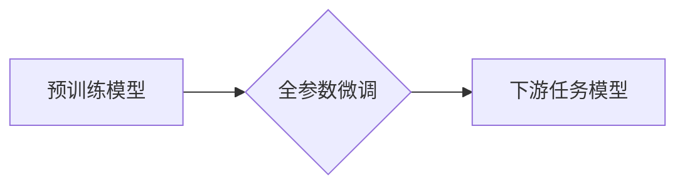

> 大语言模型、全参数微调、Transformer、BERT、GPT、Fine-tuning、NLP、深度学习

## 1. 背景介绍

近年来，深度学习在自然语言处理 (NLP) 领域取得了显著进展，大语言模型 (LLM) 作为其重要组成部分，展现出强大的文本生成、理解和翻译能力。这些模型通常基于 Transformer 架构，通过训练海量文本数据，学习到丰富的语言表示和语法规则。然而，现有的预训练模型往往在特定任务上的表现尚不理想，需要针对特定领域或任务进行微调。

全参数微调 (Full Parameter Fine-tuning) 是一种常用的微调方法，它将预训练模型的所有参数都参与到下游任务的训练中。这种方法能够充分利用预训练模型的知识，并使其在目标任务上获得更好的性能。然而，全参数微调也存在一些挑战，例如训练时间长、计算资源消耗大等。

## 2. 核心概念与联系

### 2.1 预训练模型

预训练模型是指在大量通用文本数据上进行训练的语言模型，它已经学习到语言的通用知识和规律。常见的预训练模型包括 BERT、GPT 等。

### 2.2 微调

微调是指在预训练模型的基础上，针对特定任务进行进一步训练的过程。通过微调，可以使预训练模型在目标任务上获得更好的性能。

### 2.3 全参数微调

全参数微调是指将预训练模型的所有参数都参与到下游任务的训练中。这种方法能够充分利用预训练模型的知识，并使其在目标任务上获得更好的性能。

**Mermaid 流程图**



## 3. 核心算法原理 & 具体操作步骤

### 3.1 算法原理概述

全参数微调的核心思想是，将预训练模型的所有参数作为可训练参数，并将其应用于下游任务的训练。通过调整这些参数，模型能够更好地适应目标任务的数据分布和需求。

### 3.2 算法步骤详解

1. **加载预训练模型:** 从预训练模型库中加载预训练模型的权重。
2. **调整模型结构:** 根据下游任务的需求，可能需要对预训练模型的结构进行调整，例如添加新的层或删除某些层。
3. **准备训练数据:** 收集和预处理下游任务的训练数据。
4. **定义损失函数:** 选择合适的损失函数来衡量模型在目标任务上的性能。
5. **训练模型:** 使用优化算法 (例如 Adam) 对模型的所有参数进行训练，直到达到预设的性能指标。
6. **评估模型:** 在验证集或测试集上评估模型的性能，并根据结果进行调整。

### 3.3 算法优缺点

**优点:**

* 能够充分利用预训练模型的知识，提高模型性能。
* 适用于各种下游任务，包括文本分类、情感分析、问答等。

**缺点:**

* 训练时间长，计算资源消耗大。
* 容易过拟合，需要进行适当的正则化。

### 3.4 算法应用领域

全参数微调在各种 NLP 任务中都有广泛的应用，例如:

* 文本分类: 识别文本的类别，例如情感分析、主题分类等。
* 问答系统: 回答用户提出的问题。
* 机器翻译: 将文本从一种语言翻译成另一种语言。
* 文本生成: 生成新的文本，例如故事、诗歌、代码等。

## 4. 数学模型和公式 & 详细讲解 & 举例说明

### 4.1 数学模型构建

全参数微调的核心是使用梯度下降算法来更新模型的参数。模型的输出可以表示为：

$$
y = f(x; \theta)
$$

其中：

* $y$ 是模型的输出。
* $x$ 是输入数据。
* $f$ 是模型的激活函数。
* $\theta$ 是模型的参数。

损失函数用来衡量模型的输出与真实值的差异。常用的损失函数包括交叉熵损失、均方误差等。

### 4.2 公式推导过程

梯度下降算法的目标是找到使损失函数最小化的参数值。梯度下降算法的更新公式为：

$$
\theta = \theta - \alpha \nabla L(\theta)
$$

其中：

* $\alpha$ 是学习率。
* $\nabla L(\theta)$ 是损失函数关于参数 $\theta$ 的梯度。

### 4.3 案例分析与讲解

假设我们有一个文本分类任务，目标是将文本分类为正类或负类。我们可以使用全参数微调来训练一个 BERT 模型进行文本分类。

1. **加载预训练模型:** 从预训练模型库中加载 BERT 模型的权重。
2. **调整模型结构:** 将 BERT 模型的输出层替换为一个分类层，用于输出正类或负类的概率。
3. **准备训练数据:** 收集和预处理文本分类数据集，并将其分为训练集、验证集和测试集。
4. **定义损失函数:** 使用交叉熵损失函数来衡量模型的输出与真实值的差异。
5. **训练模型:** 使用梯度下降算法对模型的所有参数进行训练，直到验证集上的性能达到预设的指标。

## 5. 项目实践：代码实例和详细解释说明

### 5.1 开发环境搭建

* Python 3.7+
* PyTorch 1.7+
* Transformers 4.0+

### 5.2 源代码详细实现

```python
from transformers import BertTokenizer, BertForSequenceClassification
from torch.utils.data import DataLoader, TensorDataset

# 加载预训练模型和分词器
model_name = "bert-base-uncased"
tokenizer = BertTokenizer.from_pretrained(model_name)
model = BertForSequenceClassification.from_pretrained(model_name, num_labels=2)

# 准备训练数据
train_texts = ["This is a positive sentence.", "This is a negative sentence."]
train_labels = [1, 0]

# 将文本转换为模型输入格式
train_encodings = tokenizer(train_texts, truncation=True, padding=True)

# 创建训练数据集
train_dataset = TensorDataset(torch.tensor(train_encodings["input_ids"]),
                             torch.tensor(train_encodings["attention_mask"]),
                             torch.tensor(train_labels))

# 创建数据加载器
train_dataloader = DataLoader(train_dataset, batch_size=16)

# 训练模型
optimizer = torch.optim.AdamW(model.parameters(), lr=2e-5)
for epoch in range(3):
    for batch in train_dataloader:
        input_ids, attention_mask, labels = batch
        outputs = model(input_ids=input_ids, attention_mask=attention_mask, labels=labels)
        loss = outputs.loss
        loss.backward()
        optimizer.step()
        optimizer.zero_grad()

# 保存训练好的模型
model.save_pretrained("fine_tuned_bert")
```

### 5.3 代码解读与分析

这段代码演示了如何使用 Transformers 库对 BERT 模型进行全参数微调。

1. **加载预训练模型和分词器:** 使用 `from_pretrained` 方法加载预训练模型和分词器。
2. **准备训练数据:** 收集和预处理训练数据，并将其转换为模型输入格式。
3. **创建训练数据集和数据加载器:** 使用 `TensorDataset` 和 `DataLoader` 创建训练数据集和数据加载器。
4. **训练模型:** 使用梯度下降算法训练模型，并记录训练过程中的损失值。
5. **保存训练好的模型:** 使用 `save_pretrained` 方法保存训练好的模型。

### 5.4 运行结果展示

训练完成后，可以将训练好的模型用于新的文本分类任务。

## 6. 实际应用场景

全参数微调在各种 NLP 应用场景中都有广泛的应用，例如:

### 6.1 文本分类

* **情感分析:** 分析文本的情感倾向，例如正面、负面或中性。
* **主题分类:** 将文本分类为不同的主题类别，例如新闻、体育、财经等。
* **垃圾邮件过滤:** 识别垃圾邮件和正常邮件。

### 6.2 问答系统

* **搜索引擎:** 回答用户提出的问题，例如“北京的首都是什么？”。
* **聊天机器人:** 与用户进行对话，并回答用户的提问。

### 6.3 机器翻译

* **跨语言沟通:** 将文本从一种语言翻译成另一种语言，例如英语翻译成中文。

### 6.4 文本生成

* **故事创作:** 生成新的故事文本。
* **诗歌创作:** 生成新的诗歌文本。
* **代码生成:** 生成新的代码文本。

### 6.5 未来应用展望

随着大语言模型的不断发展，全参数微调将在更多领域得到应用，例如:

* **个性化推荐:** 根据用户的兴趣和偏好，推荐个性化的内容。
* **医疗诊断:** 辅助医生进行疾病诊断。
* **法律分析:** 分析法律文本，并提供法律建议。

## 7. 工具和资源推荐

### 7.1 学习资源推荐

* **Hugging Face Transformers:** https://huggingface.co/docs/transformers/index
* **BERT 官方论文:** https://arxiv.org/abs/1810.04805
* **GPT 官方论文:** https://openai.com/blog/language-unsupervised/

### 7.2 开发工具推荐

* **PyTorch:** https://pytorch.org/
* **TensorFlow:** https://www.tensorflow.org/

### 7.3 相关论文推荐

* **BERT: Pre-training of Deep Bidirectional Transformers for Language Understanding**
* **GPT: Generative Pre-trained Transformer**
* **XLNet: Generalized Autoregressive Pretraining for Language Understanding**

## 8. 总结：未来发展趋势与挑战

### 8.1 研究成果总结

全参数微调是一种有效的训练大语言模型的方法，能够在各种下游任务中取得优异的性能。近年来，随着预训练模型的不断发展，全参数微调技术也取得了显著进展，例如:

* **模型规模的扩大:** 预训练模型的规模不断扩大，例如 GPT-3、PaLM 等，这使得模型能够学习到更丰富的语言知识。
* **训练数据的丰富:** 预训练模型的训练数据也越来越丰富，包括文本、代码、图像等多种类型的数据。
* **微调方法的改进:** 除了全参数微调，还出现了其他微调方法，例如参数效率微调、知识蒸馏等，这些方法能够进一步提高模型的性能和效率。

### 8.2 未来发展趋势

未来，全参数微调技术将朝着以下方向发展:

* **更小规模的模型:** 研究更小规模但性能更优的模型，以降低训练成本和资源消耗。
* **更有效的微调方法:** 开发更有效的微调方法，例如基于知识的微调、迁移学习等，以提高模型的泛化能力和效率。
* **多模态微调:** 将文本、图像、音频等多种模态数据融合在一起进行微调，以构建更强大的多模态模型。

### 8.3 面临的挑战

全参数微调技术也面临一些挑战:

* **训练成本高:** 训练大型语言模型需要大量的计算资源和时间。
* **过拟合风险:** 全参数微调容易导致模型过拟合，需要进行适当的正则化。
* **数据偏差:** 预训练模型和微调数据可能存在偏差，这会影响模型的性能和公平性。

### 8.4 研究展望

未来，我们需要继续研究全参数微调技术，以解决上述挑战，并将其应用于更多领域。

## 9. 附录：常见问题与解答

### 9.1 什么是全参数微调？

全参数微调是指将预训练模型的所有参数都参与到下游任务的训练中。

### 9.2 全参数微调的优点和缺点是什么？

**优点:**

*