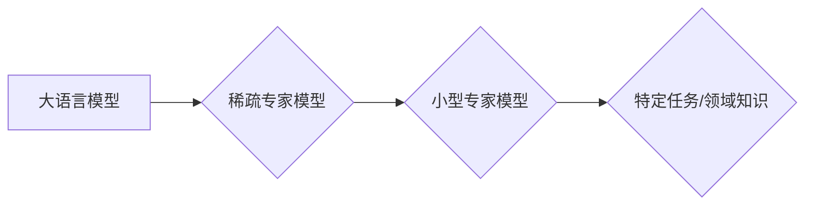

> 大语言模型，稀疏专家模型，Transformer，注意力机制，知识蒸馏，高效训练，应用场景

## 1. 背景介绍

近年来，大语言模型（Large Language Models，LLMs）在自然语言处理领域取得了显著进展，展现出强大的文本生成、翻译、问答和代码生成能力。这些模型通常基于Transformer架构，并通过海量文本数据进行预训练，能够捕捉语言的复杂结构和语义关系。然而，LLMs也面临着一些挑战，例如训练成本高、模型规模庞大、部署效率低等。

稀疏专家模型（Sparse Expert Models）作为一种新的模型架构，旨在解决这些问题。它将大型模型分解成多个小型专家模型，每个专家模型只负责处理特定类型的任务或领域知识。通过将模型分解和稀疏化，稀疏专家模型可以显著降低训练成本和模型规模，同时保持良好的性能。

## 2. 核心概念与联系

### 2.1  大语言模型

大语言模型是指参数量巨大、训练数据海量的人工智能模型，能够理解和生成人类语言。它们通常基于Transformer架构，并通过自监督学习的方式进行预训练。

### 2.2  稀疏专家模型

稀疏专家模型是一种将大型模型分解成多个小型专家模型的架构。每个专家模型只负责处理特定类型的任务或领域知识，并通过路由机制将输入分配到合适的专家模型进行处理。

### 2.3  连接关系

大语言模型通常过于庞大，难以高效训练和部署。稀疏专家模型通过将模型分解成多个小型专家模型，可以降低训练成本和模型规模，同时保持良好的性能。

**Mermaid 流程图**



## 3. 核心算法原理 & 具体操作步骤

### 3.1  算法原理概述

稀疏专家模型的核心算法原理是将大型模型分解成多个小型专家模型，并通过路由机制将输入分配到合适的专家模型进行处理。

### 3.2  算法步骤详解

1. **模型分解:** 将大型模型分解成多个小型专家模型，每个专家模型负责处理特定类型的任务或领域知识。
2. **路由机制:** 设计路由机制，根据输入特征将输入分配到合适的专家模型进行处理。
3. **专家模型训练:** 训练每个小型专家模型，使其能够高效处理其负责的任务或领域知识。
4. **模型融合:** 将多个专家模型的输出进行融合，得到最终的输出结果。

### 3.3  算法优缺点

**优点:**

* 降低训练成本和模型规模
* 提高模型效率和部署速度
* 增强模型的泛化能力和鲁棒性

**缺点:**

* 路由机制的设计较为复杂
* 专家模型之间的交互需要进一步研究

### 3.4  算法应用领域

* 自然语言处理：文本分类、情感分析、机器翻译
* 图像识别：目标检测、图像分类
* 语音识别：语音转文本、语音合成
* 其他领域：推荐系统、医疗诊断

## 4. 数学模型和公式 & 详细讲解 & 举例说明

### 4.1  数学模型构建

假设我们有N个专家模型，每个专家模型的参数为θi，输入为x，输出为yi。

**路由函数:**

$$r_i(x) = \frac{exp(f_i(x))}{\sum_{j=1}^{N} exp(f_j(x))}$$

其中，$f_i(x)$是专家模型i对输入x的评分函数。

**最终输出:**

$$y = \sum_{i=1}^{N} r_i(x) y_i$$

### 4.2  公式推导过程

路由函数的作用是根据输入x分配到每个专家模型的权重。评分函数$f_i(x)$可以根据专家模型i的知识和输入x的特征进行设计。

最终输出是所有专家模型输出的加权平均值，权重由路由函数决定。

### 4.3  案例分析与讲解

例如，在文本分类任务中，我们可以将大型模型分解成多个小型专家模型，每个专家模型负责处理特定类型的文本类别。

路由函数可以根据输入文本的主题和关键词分配到合适的专家模型进行分类。

## 5. 项目实践：代码实例和详细解释说明

### 5.1  开发环境搭建

* Python 3.7+
* PyTorch 1.7+
* CUDA 10.2+

### 5.2  源代码详细实现

```python
import torch
import torch.nn as nn

class ExpertModel(nn.Module):
    def __init__(self, input_size, hidden_size):
        super(ExpertModel, self).__init__()
        self.linear1 = nn.Linear(input_size, hidden_size)
        self.linear2 = nn.Linear(hidden_size, 1)

    def forward(self, x):
        x = torch.relu(self.linear1(x))
        x = self.linear2(x)
        return x

class SparseExpertModel(nn.Module):
    def __init__(self, num_experts, input_size, hidden_size):
        super(SparseExpertModel, self).__init__()
        self.experts = nn.ModuleList([ExpertModel(input_size, hidden_size) for _ in range(num_experts)])
        self.routing_layer = nn.Linear(input_size, num_experts)

    def forward(self, x):
        logits = self.routing_layer(x)
        probs = torch.softmax(logits, dim=-1)
        outputs = [expert(x) * prob for expert, prob in zip(self.experts, probs)]
        return torch.sum(outputs, dim=0)

# 实例化模型
model = SparseExpertModel(num_experts=4, input_size=10, hidden_size=64)

# 输入数据
input_data = torch.randn(1, 10)

# 模型输出
output = model(input_data)

print(output)
```

### 5.3  代码解读与分析

* `ExpertModel`类定义了每个小型专家模型的结构，包含两层全连接层。
* `SparseExpertModel`类定义了稀疏专家模型的结构，包含多个`ExpertModel`实例和一个路由层。
* 路由层将输入数据分配到不同的专家模型。
* 模型输出是所有专家模型输出的加权平均值。

### 5.4  运行结果展示

运行代码后，会输出一个包含多个专家模型输出的加权平均值的结果。

## 6. 实际应用场景

### 6.1  自然语言处理

* **文本分类:** 将大型文本分类模型分解成多个小型专家模型，每个专家模型负责处理特定类型的文本类别。
* **情感分析:** 将大型情感分析模型分解成多个小型专家模型，每个专家模型负责处理特定类型的文本情感。
* **机器翻译:** 将大型机器翻译模型分解成多个小型专家模型，每个专家模型负责处理特定语言对的翻译任务。

### 6.2  图像识别

* **目标检测:** 将大型目标检测模型分解成多个小型专家模型，每个专家模型负责检测特定类型的目标。
* **图像分类:** 将大型图像分类模型分解成多个小型专家模型，每个专家模型负责分类特定类型的图像。

### 6.3  语音识别

* **语音转文本:** 将大型语音转文本模型分解成多个小型专家模型，每个专家模型负责识别特定类型的语音特征。
* **语音合成:** 将大型语音合成模型分解成多个小型专家模型，每个专家模型负责合成特定类型的语音。

### 6.4  未来应用展望

稀疏专家模型在未来将有更广泛的应用场景，例如：

* **个性化推荐:** 根据用户的兴趣和偏好，构建个性化的推荐模型。
* **医疗诊断:** 根据患者的症状和病史，构建精准的医疗诊断模型。
* **自动驾驶:** 根据车辆周围环境信息，构建安全的自动驾驶模型。

## 7. 工具和资源推荐

### 7.1  学习资源推荐

* **论文:**
    * Sparse Transformer
    * Mixture of Experts
* **博客:**
    * Towards Data Science
    * Machine Learning Mastery

### 7.2  开发工具推荐

* **PyTorch:** 深度学习框架
* **TensorFlow:** 深度学习框架
* **Hugging Face Transformers:** 预训练模型库

### 7.3  相关论文推荐

* **Sparse Transformer**
* **Mixture of Experts**
* **Efficient Transformer**

## 8. 总结：未来发展趋势与挑战

### 8.1  研究成果总结

稀疏专家模型是一种高效的深度学习模型架构，能够有效降低训练成本和模型规模，同时保持良好的性能。

### 8.2  未来发展趋势

* **更有效的路由机制:** 设计更有效的路由机制，能够更好地分配输入到合适的专家模型。
* **专家模型的动态调整:** 研究专家模型的动态调整机制，能够根据输入数据和任务需求动态调整专家模型的结构和参数。
* **跨模态稀疏专家模型:** 研究跨模态稀疏专家模型，能够处理不同类型的输入数据，例如文本、图像和音频。

### 8.3  面临的挑战

* **路由机制的设计复杂度:** 设计有效的路由机制仍然是一个挑战，需要考虑输入数据的复杂性和专家模型之间的交互关系。
* **专家模型之间的协同学习:** 提高专家模型之间的协同学习能力，能够更好地融合专家模型的知识和经验。
* **模型的可解释性:** 提高稀疏专家模型的可解释性，能够更好地理解模型的决策过程。

### 8.4  研究展望

稀疏专家模型在未来将继续是一个重要的研究方向，有望在更多领域得到应用。

## 9. 附录：常见问题与解答

### 9.1  Q1: 稀疏专家模型的训练效率如何？

**A1:** 稀疏专家模型的训练效率比大型模型更高，因为每个专家模型的规模较小，训练时间更短。

### 9.2  Q2: 稀疏专家模型的性能如何？

**A2:** 稀疏专家模型的性能可以与大型模型相媲美，甚至在某些特定任务上表现更好。

### 9.3  Q3: 稀疏专家模型的应用场景有哪些？

**A3:** 稀疏专家模型的应用场景广泛，包括自然语言处理、图像识别、语音识别等领域。


作者：禅与计算机程序设计艺术 / Zen and the Art of Computer Programming 
<end_of_turn>