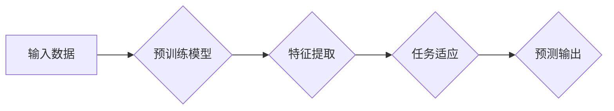

> 少样本学习，元学习，迁移学习，数据效率，深度学习，模型压缩

## 1. 背景介绍

在深度学习领域，海量数据一直被视为训练高性能模型的关键要素。然而，现实世界中获取大量标注数据往往面临着成本高、时间长、数据稀缺等挑战。这使得深度学习模型的应用场景受到限制，尤其是在一些特定领域或任务上，数据标注成本更是难以承受。

为了解决数据瓶颈问题，少样本学习 (Few-Shot Learning) 应运而生。少样本学习是指在极少样本数据的情况下，能够训练出具有良好泛化能力的深度学习模型。它旨在降低模型对大量标注数据的依赖，从而拓展深度学习的应用范围。

## 2. 核心概念与联系

少样本学习的核心思想是利用少量样本数据，结合先验知识或迁移学习的策略，帮助模型快速学习新的任务。

**2.1 核心概念**

* **元学习 (Meta-Learning):** 元学习旨在学习学习方法，即如何快速适应新的任务。它通过在多个任务上进行训练，学习到通用的学习策略，从而能够在新的、从未见过的任务上快速进行适应。
* **迁移学习 (Transfer Learning):** 迁移学习是指利用已训练好的模型在新的任务上进行训练。它通过将预训练模型的知识迁移到新的任务中，可以减少新的任务所需的训练数据量。

**2.2 联系**

少样本学习可以看作是元学习和迁移学习的结合。元学习为少样本学习提供了学习策略，而迁移学习则为少样本学习提供了先验知识。

**2.3 流程图**



## 3. 核心算法原理 & 具体操作步骤

### 3.1 算法原理概述

少样本学习算法通常分为以下几类：

* **基于原型的方法:** 将新样本与已知样本进行比较，将其分类到最近的原型类别中。
* **基于度量的方法:** 计算新样本与已知样本之间的距离，将其分类到距离最近的类别中。
* **基于嵌入的方法:** 将样本映射到一个低维空间中，使得同一类别的样本更接近，不同类别的样本更远离。

### 3.2 算法步骤详解

以基于原型的方法为例，其具体操作步骤如下：

1. **预训练:** 在一个大规模数据集上预训练一个深度学习模型，例如卷积神经网络 (CNN) 或循环神经网络 (RNN)。
2. **特征提取:** 使用预训练模型提取新样本的特征。
3. **原型生成:** 在每个类别中选择一些样本作为原型，这些原型代表了该类别的特征。
4. **分类:** 将新样本与每个类别的原型进行比较，将其分类到距离最近的原型类别中。

### 3.3 算法优缺点

**优点:**

* 数据效率高，能够在少量样本数据下进行训练。
* 能够适应新的任务，具有良好的泛化能力。

**缺点:**

* 对原型选择的敏感性较高，原型选择不当会导致模型性能下降。
* 对于类别数量较多或样本分布不均匀的任务，效果可能不佳。

### 3.4 算法应用领域

少样本学习在以下领域具有广泛的应用前景:

* **图像识别:** 在图像分类、目标检测、图像分割等任务中，能够利用少量标注数据进行训练。
* **自然语言处理:** 在文本分类、情感分析、机器翻译等任务中，能够利用少量标注数据进行训练。
* **语音识别:** 在语音识别、语音合成等任务中，能够利用少量标注数据进行训练。

## 4. 数学模型和公式 & 详细讲解 & 举例说明

### 4.1 数学模型构建

假设我们有 $N$ 个类别，每个类别有 $K$ 个样本，总共有 $M = N \times K$ 个样本。我们使用一个 $D$ 维的特征向量来表示每个样本，记为 $x_i$，其中 $i = 1, 2, ..., M$。

### 4.2 公式推导过程

基于原型的方法的核心思想是将新样本与已知样本进行比较，将其分类到最近的原型类别中。

假设我们有一个新样本 $x_n$，我们需要将其分类到哪个类别中。我们可以使用以下公式计算 $x_n$ 与每个类别的原型之间的距离：

$$
d(x_n, c_i) = \min_{x_j \in c_i} ||x_n - x_j||
$$

其中，$c_i$ 表示第 $i$ 个类别，$x_j$ 表示第 $i$ 个类别中的一个样本，$||\cdot||$ 表示欧氏距离。

我们选择距离最近的类别的原型作为 $x_n$ 的类别。

### 4.3 案例分析与讲解

例如，我们有一个图像分类任务，需要将图像分类到“猫”，“狗”和“鸟”三个类别中。我们使用一个预训练的 CNN 模型提取图像的特征，并将每个类别的样本作为原型。

当我们有一个新的图像 $x_n$ 时，我们可以使用上述公式计算 $x_n$ 与每个类别的原型的距离。如果 $x_n$ 与“猫”类别的原型距离最近，则将其分类到“猫”类别中。

## 5. 项目实践：代码实例和详细解释说明

### 5.1 开发环境搭建

* Python 3.6+
* TensorFlow 2.0+
* PyTorch 1.0+

### 5.2 源代码详细实现

```python
import tensorflow as tf

# 定义一个简单的基于原型的方法
class FewShotClassifier:
    def __init__(self, num_classes, embedding_dim):
        self.num_classes = num_classes
        self.embedding_dim = embedding_dim
        self.prototypes = tf.Variable(tf.random.normal([num_classes, embedding_dim]))

    def train(self, X, y):
        # 计算每个类别的原型
        for i in range(self.num_classes):
            class_indices = tf.where(y == i)
            self.prototypes[i] = tf.reduce_mean(X[class_indices], axis=0)

    def predict(self, X):
        # 计算每个样本与每个类别的原型的距离
        distances = tf.norm(X[:, None, :] - self.prototypes[None, :, :], axis=2)
        # 选择距离最近的类别
        predictions = tf.argmin(distances, axis=1)
        return predictions

# 示例代码
# 假设我们有 3 个类别，每个类别有 5 个样本
num_classes = 3
embedding_dim = 10
X = tf.random.normal([15, embedding_dim])
y = tf.constant([0, 0, 0, 1, 1, 1, 2, 2, 2, 0, 0, 0, 1, 1, 1])

# 创建一个基于原型的方法
classifier = FewShotClassifier(num_classes, embedding_dim)

# 训练模型
classifier.train(X, y)

# 预测新样本
new_X = tf.random.normal([5, embedding_dim])
predictions = classifier.predict(new_X)

# 打印预测结果
print(predictions)
```

### 5.3 代码解读与分析

* **FewShotClassifier 类:** 定义了一个简单的基于原型的方法。
* **__init__ 方法:** 初始化模型参数，包括类别数量、嵌入维度和原型向量。
* **train 方法:** 训练模型，计算每个类别的原型。
* **predict 方法:** 预测新样本的类别。
* **示例代码:** 展示了如何使用 FewShotClassifier 类进行训练和预测。

### 5.4 运行结果展示

运行上述代码，会输出一个包含 5 个预测结果的张量。每个结果代表一个新样本的预测类别。

## 6. 实际应用场景

少样本学习在以下实际应用场景中具有显著优势:

* **医疗诊断:** 利用少量病历数据进行疾病诊断，提高诊断准确率。
* **金融风险评估:** 利用少量交易数据进行风险评估，降低金融风险。
* **个性化推荐:** 利用少量用户行为数据进行个性化推荐，提高用户体验。

### 6.4 未来应用展望

随着深度学习技术的不断发展，少样本学习的研究也取得了长足的进步。未来，少样本学习将应用于更多领域，例如：

* **自动驾驶:** 利用少量标注数据进行自动驾驶训练，提高自动驾驶安全性。
* **机器人控制:** 利用少量示范数据进行机器人控制训练，提高机器人控制精度。
* **自然语言生成:** 利用少量文本数据进行自然语言生成训练，提高自然语言生成质量。

## 7. 工具和资源推荐

### 7.1 学习资源推荐

* **书籍:**
    * 《Few-Shot Learning》 by Timothy Hospedales
    * 《Meta-Learning with Neural Networks》 by Adam Santoro
* **论文:**
    * 《Prototypical Networks for Few-Shot Learning》 by Snell et al.
    * 《Matching Networks for One Shot Learning》 by Vinyals et al.
* **在线课程:**
    * Coursera: Deep Learning Specialization
    * Udacity: Machine Learning Engineer Nanodegree

### 7.2 开发工具推荐

* **TensorFlow:** https://www.tensorflow.org/
* **PyTorch:** https://pytorch.org/
* **Keras:** https://keras.io/

### 7.3 相关论文推荐

* 《Few-Shot Learning with Meta-Learning》 by Finn et al.
* 《Learning to Learn with Gradient Descent by Example》 by Wang et al.
* 《MAML: Model-Agnostic Meta-Learning》 by Finn et al.

## 8. 总结：未来发展趋势与挑战

### 8.1 研究成果总结

少样本学习取得了显著的进展，在图像识别、自然语言处理等领域取得了令人瞩目的成果。

### 8.2 未来发展趋势

* **更有效的学习策略:** 研究更有效的元学习策略，提高模型的学习效率和泛化能力。
* **跨模态少样本学习:** 研究跨模态少样本学习，例如将图像和文本数据结合起来进行训练。
* **可解释性:** 研究少样本学习模型的可解释性，提高模型的透明度和可信度。

### 8.3 面临的挑战

* **数据标注成本:** 即使在少样本学习中，数据标注仍然是一个成本高昂的任务。
* **模型复杂度:** 少样本学习模型通常比较复杂，训练和部署成本较高。
* **泛化能力:** 少样本学习模型在新的任务或数据分布下，泛化能力仍然存在挑战。

### 8.4 研究展望

少样本学习是一个充满挑战和机遇的领域，未来将继续吸引大量的研究者投入其中。随着技术的不断发展，少样本学习将为深度学习的应用带来新的突破，推动人工智能技术向更广泛的领域扩展。

## 9. 附录：常见问题与解答

**Q1: 少样本学习和迁移学习有什么区别？**

**A1:** 少样本学习和迁移学习都是为了解决数据不足的问题，但侧重点不同。少样本学习侧重于利用少量样本数据进行训练，而迁移学习侧重于利用预训练模型的知识进行迁移。

**Q2: 少样本学习的应用场景有哪些？**

**A2:** 少样本学习的应用场景非常广泛，例如图像识别、自然语言处理、语音识别、医疗诊断、金融风险评估等。

**Q3: 少样本学习的未来发展趋势是什么？**

**A3:** 少样本学习的未来发展趋势包括更有效的学习策略、跨模态少样本学习、可解释性等。


作者：禅与计算机程序设计艺术 / Zen and the Art of Computer Programming 
<end_of_turn>