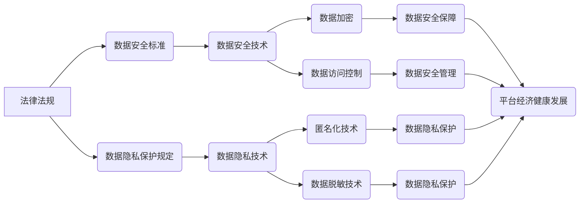

> 平台经济、数据监管、数据安全、隐私保护、数据治理、法律法规、技术手段、伦理规范

## 1. 背景介绍

平台经济作为数字经济的重要组成部分，以其连接用户、商家和服务，创造巨大价值而迅速发展。然而，平台经济的蓬勃发展也带来了数据安全、隐私保护等一系列挑战。平台掌握着海量用户数据，这些数据一旦泄露或被滥用，将可能造成严重后果。因此，建立健全的数据监管体系，保障数据安全和用户隐私，成为当务之急。

**1.1 平台经济的特点和数据挑战**

平台经济的核心是通过搭建平台，连接不同主体，实现资源的共享和价值的创造。平台经济的特点包括：

* **数据驱动:** 平台经济的核心竞争力在于数据，平台通过收集、分析和利用用户数据，提供个性化服务、精准营销等。
* **网络效应:** 平台经济具有网络效应，用户越多，平台价值越高，反之亦然。
* **数据集中化:** 平台掌握着海量用户数据，这些数据集中在平台服务器上，更容易成为攻击目标。

**1.2 数据监管的必要性**

数据监管的必要性体现在以下几个方面：

* **保障用户隐私:** 用户数据是个人隐私的重要组成部分，平台应保护用户的个人信息，防止泄露和滥用。
* **维护市场公平:** 平台数据垄断可能导致市场竞争失衡，损害消费者利益。
* **促进社会稳定:** 数据安全问题可能引发社会不安，甚至威胁国家安全。

## 2. 核心概念与联系

**2.1 数据监管的核心概念**

数据监管的核心概念包括：

* **数据安全:** 指保护数据免受未经授权的访问、使用、披露、修改或销毁。
* **数据隐私:** 指个人信息在收集、使用、存储和处理过程中受到保护的权利。
* **数据治理:** 指对数据进行规划、管理、控制和监督，确保数据质量、安全性和合规性。

**2.2 数据监管与平台经济的关系**

平台经济的发展离不开数据的驱动，而数据监管则是保障平台经济健康发展的必要条件。数据监管可以帮助平台经济：

* **建立信任:** 通过加强数据安全和隐私保护，平台可以赢得用户的信任。
* **促进创新:** 数据监管可以为平台提供明确的规则和规范，鼓励平台创新和发展。
* **实现可持续发展:** 数据监管可以帮助平台经济建立可持续发展模式，避免因数据问题而陷入困境。

**2.3 数据监管体系的架构**

数据监管体系是一个复杂的系统，涉及法律法规、技术手段、伦理规范等多方面。



## 3. 核心算法原理 & 具体操作步骤

**3.1 算法原理概述**

数据监管的核心算法原理包括：

* **数据加密算法:** 用于保护数据在传输和存储过程中的安全。常见的加密算法包括AES、RSA等。
* **数据访问控制算法:** 用于控制对数据的访问权限，确保只有授权用户才能访问数据。常见的访问控制算法包括RBAC、MAC等。
* **数据匿名化算法:** 用于去除数据中可识别个人身份的信息，保护用户隐私。常见的匿名化算法包括k-匿名、l-多样性等。

**3.2 算法步骤详解**

**3.2.1 数据加密算法**

1. 选择合适的加密算法和密钥。
2. 对数据进行加密处理，将明文转换为密文。
3. 将密文存储或传输。
4. 在解密时，使用相同的密钥对密文进行解密，恢复明文。

**3.2.2 数据访问控制算法**

1. 定义用户角色和权限。
2. 为每个资源分配访问权限。
3. 根据用户的角色和权限，控制用户对资源的访问。

**3.2.3 数据匿名化算法**

1. 识别数据中可识别个人身份的信息。
2. 使用匿名化算法去除这些信息，使数据无法被识别为特定个人。
3. 对匿名化后的数据进行安全存储和使用。

**3.3 算法优缺点**

**3.3.1 数据加密算法**

* **优点:** 可以有效保护数据安全，防止未经授权的访问。
* **缺点:** 密钥管理复杂，如果密钥泄露，数据将无法解密。

**3.3.2 数据访问控制算法**

* **优点:** 可以细粒度地控制对数据的访问权限，提高数据安全。
* **缺点:** 需要复杂的权限管理系统，维护成本较高。

**3.3.3 数据匿名化算法**

* **优点:** 可以保护用户隐私，防止数据被用于识别特定个人。
* **缺点:** 匿名化后的数据可能无法满足所有应用场景的需求。

**3.4 算法应用领域**

* **数据加密算法:** 用于保护银行交易数据、医疗记录、个人信息等敏感数据。
* **数据访问控制算法:** 用于控制对企业内部数据的访问权限，防止数据泄露。
* **数据匿名化算法:** 用于保护用户隐私，例如在市场调研、医疗研究等领域。

## 4. 数学模型和公式 & 详细讲解 & 举例说明

**4.1 数学模型构建**

数据监管的数学模型可以基于概率论、信息论等理论构建。例如，可以建立一个数据泄露风险模型，将数据泄露的概率与数据敏感度、安全措施等因素进行关联。

**4.2 公式推导过程**

假设数据泄露的概率为P(D)，数据敏感度为S，安全措施强度为M。则可以建立一个简单的数学模型：

$$P(D) = f(S, M)$$

其中，f(S, M)是一个函数，描述了数据敏感度和安全措施强度对数据泄露概率的影响。

**4.3 案例分析与讲解**

例如，假设一个平台存储了用户的姓名、地址、电话号码等敏感信息。如果平台采取了数据加密、访问控制等安全措施，则数据泄露的概率会降低。反之，如果平台没有采取有效的安全措施，则数据泄露的概率会增加。

## 5. 项目实践：代码实例和详细解释说明

**5.1 开发环境搭建**

* 操作系统: Ubuntu 20.04
* 编程语言: Python 3.8
* 开发工具: Jupyter Notebook

**5.2 源代码详细实现**

```python
# 数据加密示例
from cryptography.fernet import Fernet

# 生成密钥
key = Fernet.generate_key()
fernet = Fernet(key)

# 加密数据
message = "This is a secret message".encode()
encrypted_message = fernet.encrypt(message)

# 解密数据
decrypted_message = fernet.decrypt(encrypted_message)

print(f"加密后的数据: {encrypted_message}")
print(f"解密后的数据: {decrypted_message.decode()}")

# 数据访问控制示例
class User:
    def __init__(self, username, role):
        self.username = username
        self.role = role

class Resource:
    def __init__(self, name, permissions):
        self.name = name
        self.permissions = permissions

def check_permission(user, resource):
    if user.role in resource.permissions:
        return True
    else:
        return False

# 创建用户和资源
user1 = User("admin", "admin")
resource1 = Resource("data", ["admin"])

# 检查用户对资源的访问权限
if check_permission(user1, resource1):
    print(f"{user1.username} has permission to access {resource1.name}")
else:
    print(f"{user1.username} does not have permission to access {resource1.name}")
```

**5.3 代码解读与分析**

* 数据加密示例：使用Fernet库实现数据加密和解密。
* 数据访问控制示例：使用类和函数模拟用户角色和资源权限，实现对资源的访问控制。

**5.4 运行结果展示**

* 数据加密示例：输出加密后的数据和解密后的数据。
* 数据访问控制示例：输出用户是否具有访问资源的权限。

## 6. 实际应用场景

**6.1 平台经济中的数据监管实践**

* **电商平台:** 对用户购物记录、支付信息等敏感数据进行加密和匿名化处理，保障用户隐私。
* **社交平台:** 对用户聊天记录、个人信息等数据进行访问控制，防止数据泄露。
* **出行平台:** 对用户行程轨迹、定位信息等数据进行安全存储和使用，保护用户隐私。

**6.2 数据监管的未来发展趋势**

* **人工智能技术应用:** 利用人工智能技术，实现数据自动识别、分类、标记等，提高数据监管效率。
* **区块链技术应用:** 利用区块链技术，实现数据安全、透明、不可篡改，增强数据监管的可靠性。
* **跨境数据监管合作:** 加强国际合作，建立跨境数据监管机制，应对全球化数据挑战。

**6.3 未来应用展望**

数据监管将成为平台经济发展的重要保障，推动平台经济健康、可持续发展。数据监管技术将不断创新，为平台经济提供更安全、更有效的保障。

## 7. 工具和资源推荐

**7.1 学习资源推荐**

* **书籍:**
    * 《数据安全与隐私保护》
    * 《数据治理》
* **网站:**
    * 国家网络安全和信息化管理局
    * 中国互联网协会

**7.2 开发工具推荐**

* **数据加密工具:** OpenSSL, GPG
* **数据访问控制工具:** Apache Ranger, Keycloak
* **数据匿名化工具:** OpenRefine, Data Anonymizer

**7.3 相关论文推荐**

* 《数据隐私保护技术综述》
* 《基于区块链技术的隐私保护方案》

## 8. 总结：未来发展趋势与挑战

**8.1 研究成果总结**

本文介绍了平台经济的数据监管体系，包括核心概念、算法原理、实践案例等。数据监管是平台经济健康发展的必要条件，需要政府、企业和个人共同努力，建立健全的数据监管体系。

**8.2 未来发展趋势**

数据监管将朝着更加智能化、自动化、可持续的方向发展。人工智能、区块链等新技术将被广泛应用于数据监管领域，提高数据监管的效率和可靠性。

**8.3 面临的挑战**

数据监管面临着许多挑战，例如：

* **技术挑战:** 数据监管技术不断发展，需要不断更新和完善。
* **法律法规挑战:** 数据监管法律法规体系尚不完善，需要不断完善和完善。
* **伦理挑战:** 数据监管涉及到个人隐私和数据安全等伦理问题，需要谨慎处理。

**8.4 研究展望**

未来，数据监管研究将重点关注以下几个方面：

* **人工智能技术在数据监管中的应用研究**
* **区块链技术在数据监管中的应用研究**
* **数据监管法律法规体系的完善研究**
* **数据监管伦理问题的探讨研究**

## 9. 附录：常见问题与解答

**9.1 如何保护我的个人数据？**

* 选择信誉良好的平台和服务提供商。
* 仔细阅读平台和服务提供商的隐私政策。
* 设置强密码，并定期更换密码。
* 使用数据加密工具保护敏感数据。
* 谨慎分享个人信息。

**9.2 平台如何保障我的数据安全？**

* 平台应采取有效的安全措施，例如数据