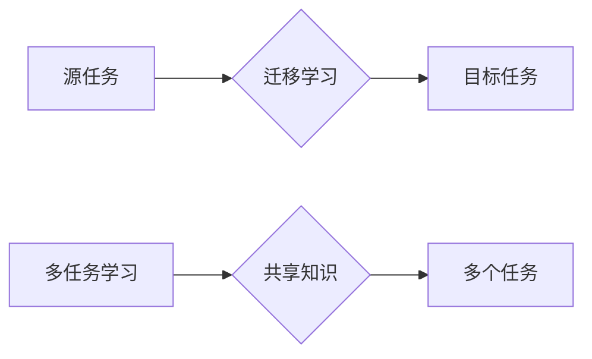

> 强化学习，迁移学习，多任务学习，RL，迁移，多任务，算法，应用

## 1. 背景介绍

强化学习 (Reinforcement Learning, RL) 作为机器学习领域的重要分支，旨在训练智能体在环境中通过与环境交互学习最优策略，以最大化累积奖励。然而，传统的 RL 方法通常需要大量的样本数据和训练时间，这在现实世界中往往难以实现。

迁移学习 (Transfer Learning) 和多任务学习 (Multi-Task Learning) 作为解决 RL 训练效率和数据稀缺性的有效手段，近年来得到了广泛的研究和应用。

迁移学习旨在利用已训练好的模型在源任务上的知识迁移到目标任务，从而提高目标任务的学习效率。多任务学习则训练一个模型同时学习多个相关任务，通过共享知识和参数，提升每个任务的学习性能。

## 2. 核心概念与联系

**2.1 迁移学习**

迁移学习的核心思想是将已学习到的知识从一个源任务迁移到另一个目标任务。源任务和目标任务之间存在一定的相似性，例如，在图像分类任务中，源任务可以是识别猫狗的图像，目标任务可以是识别鸟类的图像。

**2.2 多任务学习**

多任务学习是指训练一个模型同时学习多个相关任务。这些任务共享一些共同的特征或知识，例如，在自然语言处理任务中，源任务可以是文本分类，目标任务可以是文本摘要。

**2.3 迁移学习与多任务学习的联系**

迁移学习和多任务学习可以相互补充，共同提高 RL 算法的效率和性能。

* 多任务学习可以看作一种特殊的迁移学习，其中源任务和目标任务是同一个模型学习的不同部分。
* 迁移学习可以应用于多任务学习，例如，在训练多任务 RL 算法时，可以利用已训练好的单任务 RL 模型作为源任务，迁移知识到新的多任务 RL 模型。

**2.4 迁移学习与多任务学习的流程图**



## 3. 核心算法原理 & 具体操作步骤

### 3.1  算法原理概述

迁移学习和多任务学习在 RL 算法中主要通过以下两种方式实现：

* **参数共享:** 在训练过程中，源任务和目标任务共享一部分模型参数，从而实现知识迁移。
* **知识蒸馏:** 将已训练好的源任务模型的知识“蒸馏”到目标任务模型中，例如，将源任务模型的输出概率分布作为目标任务模型的教师信号。

### 3.2  算法步骤详解

**3.2.1 迁移学习步骤**

1. **预训练:** 在源任务上训练一个 RL 模型，使其获得一定的知识和能力。
2. **迁移:** 将预训练模型的参数迁移到目标任务模型中。
3. **微调:** 在目标任务上对迁移后的模型进行微调，使其适应目标任务的具体环境和奖励函数。

**3.2.2 多任务学习步骤**

1. **任务定义:** 定义多个相关任务，并确定任务之间的共享知识和差异。
2. **模型设计:** 设计一个能够同时学习多个任务的 RL 模型，例如，使用多头注意力机制或分支结构。
3. **联合训练:** 在所有任务的数据上联合训练 RL 模型，使其学习共享知识和任务特异性知识。

### 3.3  算法优缺点

**3.3.1 迁移学习**

* **优点:** 可以显著提高目标任务的学习效率，减少训练时间和数据需求。
* **缺点:** 需要找到合适的源任务，源任务和目标任务之间需要有一定的相似性。

**3.3.2 多任务学习**

* **优点:** 可以提升每个任务的学习性能，并提高模型的泛化能力。
* **缺点:** 需要设计合理的模型结构和训练策略，否则可能会导致任务之间的负迁移。

### 3.4  算法应用领域

* **机器人控制:** 利用已训练好的机器人控制模型迁移到新的机器人平台或任务场景。
* **游戏 AI:** 利用已训练好的游戏 AI 模型迁移到新的游戏环境或游戏策略。
* **医疗诊断:** 利用已训练好的医疗图像分析模型迁移到新的疾病诊断任务。

## 4. 数学模型和公式 & 详细讲解 & 举例说明

### 4.1  数学模型构建

**4.1.1 迁移学习模型**

假设源任务的模型参数为 $\theta_s$，目标任务的模型参数为 $\theta_t$。迁移学习模型的目标是找到一个 $\theta_t$，使得目标任务的性能最大化，同时利用源任务的知识。

可以采用以下公式来表示目标任务模型的更新：

$$
\theta_t = \theta_t + \alpha \cdot \nabla_{\theta_t} J(\theta_t) + \beta \cdot \nabla_{\theta_s} J(\theta_s)
$$

其中：

* $J(\theta_t)$ 是目标任务的损失函数。
* $\nabla_{\theta_t} J(\theta_t)$ 是目标任务损失函数对目标任务模型参数的梯度。
* $\nabla_{\theta_s} J(\theta_s)$ 是源任务损失函数对源任务模型参数的梯度。
* $\alpha$ 和 $\beta$ 是学习率，控制源任务知识迁移的程度。

**4.1.2 多任务学习模型**

多任务学习模型通常使用共享参数结构，例如，在每个任务的输出层添加不同的权重矩阵，以适应不同的任务输出。

假设有 $N$ 个任务，每个任务的输出为 $y_i$，模型的输出为 $f(x; \theta)$，其中 $x$ 是输入特征，$\theta$ 是模型参数。

多任务学习模型的目标是最小化所有任务的损失函数的加权平均值：

$$
L(\theta) = \sum_{i=1}^{N} \lambda_i \cdot L_i(y_i, f(x; \theta))
$$

其中：

* $L_i(y_i, f(x; \theta))$ 是第 $i$ 个任务的损失函数。
* $\lambda_i$ 是第 $i$ 个任务的权重，控制每个任务对模型的影响程度。

### 4.2  公式推导过程

**4.2.1 迁移学习模型参数更新公式推导**

目标是找到一个 $\theta_t$，使得目标任务的性能最大化，同时利用源任务的知识。

可以采用梯度下降法来更新模型参数：

$$
\theta_t = \theta_t - \eta \cdot \nabla_{\theta_t} J(\theta_t)
$$

其中：

* $\eta$ 是学习率。

为了利用源任务的知识，可以将源任务的梯度信息添加到目标任务的梯度更新中：

$$
\theta_t = \theta_t - \eta \cdot (\nabla_{\theta_t} J(\theta_t) + \beta \cdot \nabla_{\theta_s} J(\theta_s))
$$

其中：

* $\beta$ 是控制源任务知识迁移程度的系数。

**4.2.2 多任务学习模型损失函数推导**

多任务学习模型的目标是最小化所有任务的损失函数的加权平均值。

可以采用以下公式来表示多任务学习模型的损失函数：

$$
L(\theta) = \sum_{i=1}^{N} \lambda_i \cdot L_i(y_i, f(x; \theta))
$$

其中：

* $L_i(y_i, f(x; \theta))$ 是第 $i$ 个任务的损失函数。
* $\lambda_i$ 是第 $i$ 个任务的权重，控制每个任务对模型的影响程度。

### 4.3  案例分析与讲解

**4.3.1 迁移学习案例分析**

在图像分类任务中，可以利用已训练好的猫狗识别模型迁移到鸟类识别任务。

* 源任务：猫狗识别
* 目标任务：鸟类识别

可以将猫狗识别模型的参数迁移到鸟类识别模型中，然后在鸟类图像数据上进行微调，从而提高鸟类识别模型的性能。

**4.3.2 多任务学习案例分析**

在自然语言处理任务中，可以训练一个多任务学习模型同时学习文本分类和文本摘要任务。

* 任务 1：文本分类
* 任务 2：文本摘要

可以共享模型的词嵌入层和编码层，并在每个任务的输出层添加不同的权重矩阵，以适应不同的任务输出。

## 5. 项目实践：代码实例和详细解释说明

### 5.1  开发环境搭建

* Python 3.7+
* TensorFlow 2.0+
* PyTorch 1.0+

### 5.2  源代码详细实现

```python
# 迁移学习示例代码

import tensorflow as tf

# 定义源任务模型
class SourceModel(tf.keras.Model):
    def __init__(self):
        super(SourceModel, self).__init__()
        # ... 模型结构定义 ...

    def call(self, x):
        # ... 模型前向传播过程 ...

# 定义目标任务模型
class TargetModel(tf.keras.Model):
    def __init__(self):
        super(TargetModel, self).__init__()
        # ... 模型结构定义 ...

    def call(self, x):
        # ... 模型前向传播过程 ...

# 加载预训练的源任务模型
source_model = tf.keras.models.load_model('source_model.h5')

# 迁移源任务模型的参数到目标任务模型
target_model.set_weights(source_model.get_weights())

# 微调目标任务模型
target_model.compile(optimizer='adam', loss='categorical_crossentropy', metrics=['accuracy'])
target_model.fit(target_data, target_labels, epochs=10)

```

### 5.3  代码解读与分析

* 源任务模型和目标任务模型的结构可以根据具体任务进行调整。
* `source_model.get_weights()` 函数获取源任务模型的参数。
* `target_model.set_weights()` 函数将源任务模型的参数迁移到目标任务模型中。
* 微调目标任务模型的步骤与训练新模型类似，只是需要使用迁移后的模型作为起点。

### 5.4  运行结果展示

* 运行结果可以根据具体任务和数据集进行评估，例如，使用准确率、召回率、F1-score 等指标来衡量模型性能。

## 6. 实际应用场景

### 6.1  机器人控制

* 利用已训练好的机器人控制模型迁移到新的机器人平台或任务场景，例如，将一个在仿真环境中训练好的机器人控制模型迁移到真实的物理环境中。

### 6.2  游戏 AI

* 利用已训练好的游戏 AI 模型迁移到新的游戏环境或游戏策略，例如，将一个在经典游戏中的 AI 模型迁移到新的游戏环境中。

### 6.3  医疗诊断

* 利用已训练好的医疗图像分析模型迁移到新的疾病诊断任务，例如，将一个用于癌症检测的模型迁移到其他疾病的诊断任务中。

### 6.4  未来应用展望

* 随着 RL 算法和迁移学习技术的不断发展，在更多领域应用，例如，自动驾驶、个性化推荐、金融风险管理等。

## 7. 工具和资源推荐

### 7.1  学习资源推荐

* **书籍:**
    * Reinforcement Learning: An Introduction by Richard S. Sutton and Andrew G. Barto
    * Deep Reinforcement Learning Hands-On by Maxim Lapan
* **在线课程:**
    * Deep Reinforcement Learning Specialization by DeepLearning.AI
    * Reinforcement Learning by David Silver (University of DeepMind)

### 7.2  开发工具推荐

*