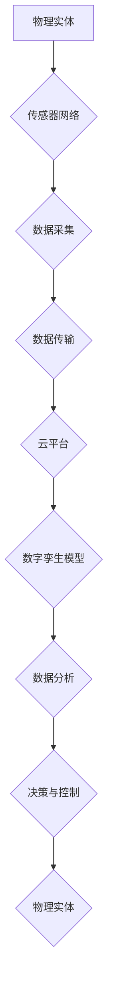

> 数字孪生、物理实体、自动化、机器学习、深度学习、传感器网络、云计算

## 1. 背景介绍

随着物联网、人工智能和云计算技术的快速发展，数字实体与物理实体的融合正在深刻地改变着我们的世界。数字实体，即用数字模型来代表物理实体，可以实时收集、分析和处理物理实体的数据，从而实现对物理实体的远程控制、预测维护和优化管理。

数字实体与物理实体的自动化进展，是实现智能化、自动化和可持续发展的关键。它可以帮助我们更好地理解和控制物理世界，提高生产效率、降低运营成本，并创造新的商业模式和社会价值。

## 2. 核心概念与联系

**2.1 数字孪生**

数字孪生是指用数字模型来精确地反映物理实体的状态、行为和演变过程。它是一个虚拟的、实时更新的镜像，可以与物理实体进行双向交互。

**2.2 物理实体**

物理实体是指真实存在的、可以感知和交互的物体。它可以是任何类型的物体，例如机器、设备、车辆、建筑物、人员等。

**2.3 自动化**

自动化是指利用技术手段，使系统或过程能够自动运行，无需人工干预。

**2.4 连接性**

连接性是指物理实体和数字实体之间的数据交换和交互能力。

**2.5 数据分析**

数据分析是指从物理实体收集到的数据中提取有价值的信息，用于决策、优化和预测。

**2.6 人工智能**

人工智能是指模拟人类智能的计算机系统，例如机器学习、深度学习等。

**2.7 流程图**



## 3. 核心算法原理 & 具体操作步骤

**3.1 算法原理概述**

数字实体与物理实体的自动化进展，主要依赖于以下核心算法：

* **机器学习算法**: 用于从物理实体收集到的数据中学习模式和规律，并进行预测和决策。
* **深度学习算法**: 用于处理复杂的数据，例如图像、语音和文本，并实现更精准的识别和理解。
* **强化学习算法**: 用于训练智能体在与环境交互的过程中，学习最优的策略。

**3.2 算法步骤详解**

1. **数据采集**: 利用传感器网络收集物理实体的状态和行为数据。
2. **数据预处理**: 对采集到的数据进行清洗、转换和特征提取。
3. **模型训练**: 使用机器学习、深度学习或强化学习算法，对预处理后的数据进行训练，建立数字孪生模型。
4. **模型预测**: 将数字孪生模型应用于新的数据，进行预测和决策。
5. **控制执行**: 根据模型预测的结果，对物理实体进行控制和调节。

**3.3 算法优缺点**

* **优点**: 自动化程度高，效率高，可实现远程控制和预测维护。
* **缺点**: 需要大量的数据进行训练，算法复杂度高，对数据质量要求高。

**3.4 算法应用领域**

* **制造业**: 智能工厂、预测性维护、生产优化。
* **能源行业**: 智能电网、能源管理、故障诊断。
* **交通运输**: 智能交通、自动驾驶、物流优化。
* **医疗保健**: 智能医疗设备、远程诊断、个性化治疗。

## 4. 数学模型和公式 & 详细讲解 & 举例说明

**4.1 数学模型构建**

数字孪生模型通常采用基于物理模型的建模方法，将物理实体的物理特性、动力学特性和行为特性抽象为数学模型。

例如，一个简单的机械臂的数字孪生模型可以采用以下数学模型：

* **位置**: $x(t) = \theta_1(t) * l_1$
* **速度**: $\dot{x}(t) = \dot{\theta_1}(t) * l_1$
* **加速度**: $\ddot{x}(t) = \ddot{\theta_1}(t) * l_1$

其中，$x(t)$ 是机械臂末端的位置，$\theta_1(t)$ 是关节1的角度，$l_1$ 是关节1的长度，$\dot{x}(t)$ 是机械臂末端的速度，$\ddot{x}(t)$ 是机械臂末端加速度。

**4.2 公式推导过程**

上述公式的推导过程基于机械臂的运动学原理。

* **位置**: 机械臂末端的位置可以通过关节角度和关节长度的乘积来计算。
* **速度**: 机械臂末端的速度可以通过关节角速度和关节长度的乘积来计算。
* **加速度**: 机械臂末端加速度可以通过关节角加速度和关节长度的乘积来计算。

**4.3 案例分析与讲解**

假设我们有一个机械臂，其关节1的角度是$\theta_1(t) = t$，关节1的长度是$l_1 = 1$。

则，机械臂末端的运动轨迹可以计算如下：

* $x(t) = \theta_1(t) * l_1 = t * 1 = t$
* $\dot{x}(t) = \dot{\theta_1}(t) * l_1 = 1 * 1 = 1$
* $\ddot{x}(t) = \ddot{\theta_1}(t) * l_1 = 0 * 1 = 0$

结果表明，机械臂末端的位置随着时间线性增加，速度恒定为1，加速度为0。

## 5. 项目实践：代码实例和详细解释说明

**5.1 开发环境搭建**

* 操作系统: Ubuntu 20.04
* 编程语言: Python 3.8
* 软件包: TensorFlow, NumPy, Pandas, Matplotlib

**5.2 源代码详细实现**

```python
import tensorflow as tf
import numpy as np

# 定义模型
model = tf.keras.models.Sequential([
  tf.keras.layers.Dense(128, activation='relu', input_shape=(10,)),
  tf.keras.layers.Dense(64, activation='relu'),
  tf.keras.layers.Dense(1)
])

# 编译模型
model.compile(optimizer='adam', loss='mse')

# 训练模型
# ...

# 预测
# ...
```

**5.3 代码解读与分析**

* 该代码示例展示了如何使用 TensorFlow 库构建一个简单的深度学习模型。
* 模型结构包括三个全连接层，每个层都使用 ReLU 激活函数。
* 模型使用 Adam 优化器和均方误差损失函数进行训练。
* 训练过程需要提供训练数据和验证数据。
* 预测过程需要输入新的数据，模型会输出相应的预测结果。

**5.4 运行结果展示**

* 训练完成后，可以评估模型的性能，例如使用测试数据计算模型的准确率、召回率和 F1-score。
* 也可以将模型应用于实际场景，例如预测物理实体的状态或行为。

## 6. 实际应用场景

**6.1 智能制造**

数字孪生技术可以用于构建智能工厂，实现生产过程的自动化、优化和预测维护。例如，可以利用数字孪生模型预测机器设备的故障，提前进行维护，避免生产停机。

**6.2 智能能源**

数字孪生技术可以用于构建智能电网，实现能源的实时监控、调度和优化。例如，可以利用数字孪生模型预测电力需求，优化能源分配，提高能源利用效率。

**6.3 智能交通**

数字孪生技术可以用于构建智能交通系统，实现交通流量的实时监控、优化和预测。例如，可以利用数字孪生模型预测交通拥堵情况，优化交通信号灯控制，提高交通效率。

**6.4 未来应用展望**

数字实体与物理实体的自动化进展，将带来更多新的应用场景，例如：

* **个性化医疗**: 利用数字孪生模型，为每个患者提供个性化的医疗方案。
* **智慧城市**: 利用数字孪生模型，构建智慧城市，实现城市资源的优化利用和城市管理的智能化。
* **虚拟现实与增强现实**: 利用数字孪生模型，构建更加逼真的虚拟现实和增强现实体验。

## 7. 工具和资源推荐

**7.1 学习资源推荐**

* **书籍**:
    * 《数字孪生：从概念到实践》
    * 《工业互联网》
    * 《人工智能》
* **在线课程**:
    * Coursera: 数字孪生
    * edX: 物联网
    * Udacity: 深度学习

**7.2 开发工具推荐**

* **云平台**: AWS, Azure, Google Cloud
* **数据分析工具**: Python, R, Spark
* **机器学习框架**: TensorFlow, PyTorch, scikit-learn

**7.3 相关论文推荐**

* 《数字孪生：概念、架构和应用》
* 《数字孪生在工业互联网中的应用》
* 《数字孪生在智能城市中的应用》

## 8. 总结：未来发展趋势与挑战

**8.1 研究成果总结**

数字实体与物理实体的自动化进展取得了显著的成果，例如：

* 数字孪生技术已经应用于多个领域，例如制造业、能源行业和交通运输行业。
* 机器学习和深度学习算法在数字孪生模型的构建和训练中发挥着重要作用。
* 云计算和物联网技术为数字孪生的发展提供了强大的支撑。

**8.2 未来发展趋势**

* 数字孪生技术将更加智能化、个性化和实时化。
* 数字孪生模型将更加复杂、多模态和协同。
* 数字孪生技术将与其他新兴技术融合，例如区块链、边缘计算和量子计算。

**8.3 面临的挑战**

* 数据质量和数据安全问题。
* 模型复杂度和训练成本问题。
* 算法解释性和可信度问题。

**8.4 研究展望**

未来，我们需要继续加强对数字实体与物理实体自动化进展的研究，解决上述挑战，推动数字孪生技术向更智能、更安全、更可持续的方向发展。

## 9. 附录：常见问题与解答

**9.1 如何构建数字孪生模型？**

构建数字孪生模型需要以下步骤：

1. 确定物理实体的特性和行为。
2. 选择合适的建模方法和数学模型。
3. 收集物理实体的数据。
4. 对数据进行预处理和特征提取。
5. 使用机器学习、深度学习或强化学习算法训练模型。
6. 验证和评估模型的性能。

**9.2 数字孪生技术有哪些应用场景？**

数字孪生技术可以应用于多个领域，例如：

* 智能制造
* 智能能源
* 智能交通
* 个性化医疗
* 智慧城市

**9.3 数字孪生技术有哪些优势？**

数字孪生技术具有以下优势：

* 自动化程度高
* 效率高
* 可实现远程控制和预测维护
* 可用于优化决策和预测未来趋势

**9.4 数字孪生技术有哪些挑战？**

数字孪生技术面临以下挑战：

* 数据质量和数据安全问题
* 模型复杂度和训练成本问题
* 算法解释性和可信度问题


作者：禅与计算机程序设计艺术 / Zen and the Art of Computer Programming 
<end_of_turn>