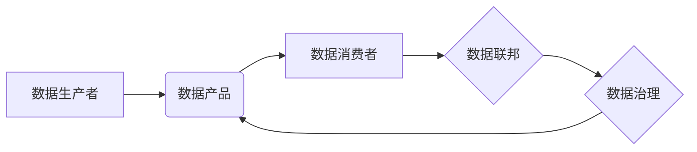

> 数据mesh,数据平台,去中心化,数据治理,数据联邦,数据可信

## 1. 背景介绍

随着数据量的爆炸式增长，传统的集中式数据架构已经难以满足现代企业对数据管理、分析和应用的需求。集中式数据架构存在着数据孤岛、数据冗余、数据一致性问题等诸多弊端，难以实现数据资源的灵活利用和高效共享。

数据mesh 作为一种新兴的数据架构模式，旨在通过去中心化、数据所有权和数据自治的理念，构建一个更加灵活、高效、可扩展的数据平台。它将数据视为一种产品，赋予数据生产者和消费者更多的自主权，并通过数据联邦和数据治理机制，确保数据质量、安全和一致性。

## 2. 核心概念与联系

数据mesh 的核心概念包括：

* **去中心化:** 数据不再集中在单一的数据仓库或数据湖中，而是分布在各个数据域中，每个数据域拥有自己的数据产品和数据治理机制。
* **数据所有权:** 数据的所有权归属于数据生产者，他们负责数据产品的开发、维护和治理。
* **数据自治:** 数据消费者可以自主选择和使用他们需要的數據产品，无需依赖于数据中心或数据管理员。
* **数据联邦:** 数据mesh 通过数据联邦机制，将分散的数据进行整合和分析，实现数据共享和协同。
* **数据治理:** 数据mesh 通过数据标准、数据质量控制和数据安全机制，确保数据质量、安全和一致性。

**数据mesh 架构图:**



## 3. 核心算法原理 & 具体操作步骤

### 3.1  算法原理概述

数据mesh 的核心算法原理包括数据联邦、数据一致性算法和数据安全算法。

* **数据联邦:** 数据联邦算法用于将分散的数据进行整合和分析，实现数据共享和协同。常见的联邦学习算法可以用于训练模型，而无需将原始数据传输到中央服务器。
* **数据一致性算法:** 数据一致性算法用于确保数据在不同数据域中的一致性。常见的算法包括分布式事务、数据同步和数据版本控制。
* **数据安全算法:** 数据安全算法用于保护数据安全和隐私。常见的算法包括加密、身份验证和访问控制。

### 3.2  算法步骤详解

**数据联邦算法步骤:**

1. **数据划分:** 将原始数据划分为多个数据域，每个数据域拥有自己的数据产品。
2. **模型训练:** 每个数据域使用本地数据训练模型，并共享模型参数。
3. **模型融合:** 将所有数据域的模型参数进行融合，训练出一个全局模型。
4. **模型部署:** 部署全局模型，用于对所有数据域的数据进行预测或分析。

**数据一致性算法步骤:**

1. **数据定义:** 定义数据标准和数据格式，确保数据在不同数据域中的一致性。
2. **数据同步:** 定期同步数据域之间的数据，确保数据一致性。
3. **数据版本控制:** 使用版本控制机制，跟踪数据变化，并确保数据回滚和恢复。

**数据安全算法步骤:**

1. **数据加密:** 使用加密算法对数据进行加密，防止未授权访问。
2. **身份验证:** 使用身份验证机制，验证用户身份，确保数据访问权限。
3. **访问控制:** 使用访问控制机制，控制用户对数据的访问权限。

### 3.3  算法优缺点

**数据联邦算法:**

* **优点:** 保护数据隐私，提高数据安全。
* **缺点:** 训练速度较慢，模型精度可能较低。

**数据一致性算法:**

* **优点:** 确保数据一致性，提高数据质量。
* **缺点:** 需要复杂的系统架构，维护成本较高。

**数据安全算法:**

* **优点:** 保护数据安全，防止数据泄露。
* **缺点:** 可能增加数据处理成本，影响数据访问效率。

### 3.4  算法应用领域

数据mesh 的核心算法在以下领域具有广泛的应用前景:

* **医疗保健:** 保护患者隐私，实现医疗数据的共享和协同分析。
* **金融服务:** 提高金融数据的安全性和一致性，支持风险管理和欺诈检测。
* **制造业:** 优化生产流程，提高设备效率和产品质量。
* **零售业:** 个性化推荐，提高客户体验和销售额。

## 4. 数学模型和公式 & 详细讲解 & 举例说明

### 4.1  数学模型构建

数据mesh 的核心算法可以抽象为以下数学模型:

* **数据联邦模型:**

$$
\theta = \text{aggregate}(\theta_1, \theta_2, ..., \theta_n)
$$

其中，$\theta$ 表示全局模型参数，$\theta_i$ 表示第 $i$ 个数据域的模型参数，aggregate 表示模型参数聚合函数。

* **数据一致性模型:**

$$
\text{consistency}(D_1, D_2) = \text{similarity}(D_1, D_2) > \theta
$$

其中，$D_1$ 和 $D_2$ 表示两个数据域的数据，similarity 表示数据相似度函数，$\theta$ 表示一致性阈值。

* **数据安全模型:**

$$
\text{security}(D) = \text{encryption}(D) \cap \text{authentication}(U) \cap \text{authorization}(U, D)
$$

其中，$D$ 表示数据，$U$ 表示用户，encryption 表示加密函数，authentication 表示身份验证函数，authorization 表示访问控制函数。

### 4.2  公式推导过程

数据联邦模型的推导过程如下:

1. 每个数据域使用本地数据训练模型，得到模型参数 $\theta_i$。
2. 将所有数据域的模型参数进行聚合，得到全局模型参数 $\theta$。
3. 聚合函数可以是平均值、加权平均值或其他聚合函数。

### 4.3  案例分析与讲解

**案例:**

假设有两个数据域，分别拥有用户购买历史数据和用户浏览记录数据。

* 数据域 1: 用户购买历史数据
* 数据域 2: 用户浏览记录数据

可以使用数据联邦算法训练一个推荐模型，该模型可以根据用户的购买历史和浏览记录，推荐用户感兴趣的产品。

**分析:**

* 数据域 1 和数据域 2 可以分别训练自己的推荐模型。
* 然后，将两个数据域的模型参数进行聚合，得到一个全局推荐模型。
* 全局推荐模型可以用于对所有用户的推荐。

**讲解:**

数据联邦算法可以保护用户隐私，因为用户数据不会被传输到中央服务器。

## 5. 项目实践：代码实例和详细解释说明

### 5.1  开发环境搭建

* 操作系统: Ubuntu 20.04
* 编程语言: Python 3.8
* 框架: PySpark

### 5.2  源代码详细实现

```python
# 数据联邦算法示例代码

from pyspark.sql import SparkSession

# 初始化 SparkSession
spark = SparkSession.builder.appName("DataMesh").getOrCreate()

# 数据域 1 数据
data1 = spark.createDataFrame([
    ("user1", "product1"),
    ("user1", "product2"),
    ("user2", "product3"),
])

# 数据域 2 数据
data2 = spark.createDataFrame([
    ("user1", "product4"),
    ("user2", "product5"),
    ("user3", "product6"),
])

# 数据联邦算法
def aggregate_models(model1, model2):
    # 模型参数聚合函数
    # ...

# 聚合模型参数
global_model = aggregate_models(model1, model2)

# 保存全局模型
global_model.save("global_model")

# 停止 SparkSession
spark.stop()
```

### 5.3  代码解读与分析

* 代码首先初始化 SparkSession，用于创建 Spark 上下文。
* 然后，定义两个数据域的数据，分别存储在 `data1` 和 `data2` 中。
* `aggregate_models` 函数用于聚合两个模型参数，实现数据联邦算法。
* 最后，将聚合后的模型参数保存为 `global_model`，并停止 SparkSession。

### 5.4  运行结果展示

运行上述代码后，将生成一个 `global_model` 文件，该文件包含聚合后的模型参数。

## 6. 实际应用场景

### 6.1  医疗保健

数据mesh 可以帮助医疗机构实现患者数据的共享和协同分析，提高医疗诊断和治疗效率。

* **数据源:** 患者电子病历、基因数据、影像数据等。
* **应用场景:** 疾病诊断、个性化治疗、药物研发等。

### 6.2  金融服务

数据mesh 可以帮助金融机构提高金融数据的安全性和一致性，支持风险管理和欺诈检测。

* **数据源:** 交易记录、客户信息、信用评分等。
* **应用场景:** 风险评估、欺诈检测、个性化金融服务等。

### 6.3  制造业

数据mesh 可以帮助制造企业优化生产流程，提高设备效率和产品质量。

* **数据源:** 设备传感器数据、生产线数据、产品质量数据等。
* **应用场景:** 预测性维护、生产流程优化、产品质量控制等。

### 6.4  未来应用展望

数据mesh 的应用场景还在不断扩展，未来将应用于更多领域，例如教育、零售、能源等。

## 7. 工具和资源推荐

### 7.1  学习资源推荐

* **书籍:**
    * Data Mesh: Delivering the Next Generation of Data Architecture
    * Building a Data Mesh: A Practical Guide

* **博客:**
    * https://www.data-mesh.org/
    * https://www.linkedin.com/pulse/data-mesh-what-why-how-zakir-khan/

### 7.2  开发工具推荐

* **Apache Spark:** 用于大规模数据处理和分析。
* **Apache Kafka:** 用于数据流处理和消息队列。
* **Docker:** 用于容器化应用部署。

### 7.3  相关论文推荐

* Data Mesh: A New Paradigm for Data Architecture
* Federated Learning: Strategies for Improving Communication Efficiency

## 8. 总结：未来发展趋势与挑战

### 8.1  研究成果总结

数据mesh 作为一种新兴的数据架构模式，已经取得了一定的研究成果，并得到了越来越多的关注和实践。

### 8.2  未来发展趋势

* **数据联邦技术的进步:** 随着联邦学习等技术的不断发展，数据联邦将更加高效、安全和可靠。
* **数据治理机制的完善:** 数据mesh 需要完善的数据治理机制，确保数据质量、安全和一致性。
* **生态系统建设:** 数据mesh 需要构建一个完善的生态系统，包括工具、平台和社区支持。

### 8.3  面临的挑战

* **技术复杂性:** 数据mesh 的实现需要克服技术上的挑战，例如数据联邦、数据一致性和数据安全。
* **组织文化变革:** 数据mesh 需要改变组织的文化和工作方式，例如数据所有权和数据自治。
* **标准化和互操作性:** 数据mesh 需要建立标准和规范，确保不同数据域的数据互操作性。

### 8.4  研究展望

未来，数据mesh 研究将继续深入，探索更有效的算法、更完善的治理机制和更强大的生态系统。


## 9. 附录：常见问题与解答

**常见问题:**

* 数据mesh 和数据湖有什么区别？
* 数据mesh 如何保证数据安全？
* 数据mesh 如何实现数据一致性？

**解答:**

* 数据mesh 和数据湖都是分布式数据存储架构，但数据mesh 更加注重数据自治和数据联邦，而数据湖则更加注重数据存储和查询。
* 数据mesh 通过加密、身份验证和访问控制等机制保证数据安全。
* 数据mesh 通过数据标准、数据同步和数据版本控制等机制实现数据一致性。


