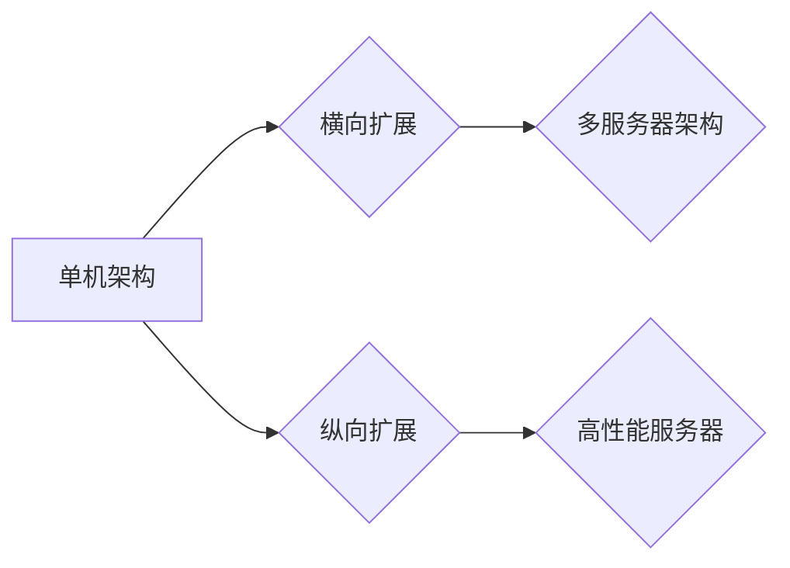

>  横向扩展，纵向扩展，云计算，分布式系统，高可用性，性能优化，架构设计

## 1. 背景介绍

随着互联网和移动互联网的蓬勃发展，应用程序的规模和用户数量呈指数级增长。传统的单机架构已经难以满足现代应用对高性能、高可用性和可扩展性的需求。为了应对这些挑战，横向扩展和纵向扩展成为了两种重要的系统架构模式。

横向扩展（Horizontal Scaling）是指通过增加服务器数量来扩展系统容量，而纵向扩展（Vertical Scaling）是指通过升级单个服务器的硬件资源来提高系统性能。两种扩展模式各有优缺点，选择哪种模式取决于具体的应用场景和需求。

## 2. 核心概念与联系

**2.1 横向扩展**

横向扩展的核心思想是将应用程序的负载分摊到多个服务器上，每个服务器负责处理一部分请求。通过增加服务器数量，可以提高系统的处理能力和吞吐量。

**2.2 纵向扩展**

纵向扩展的核心思想是升级单个服务器的硬件资源，例如CPU、内存和硬盘，从而提高服务器的处理能力和性能。

**2.3 横向扩展与纵向扩展的联系**

横向扩展和纵向扩展都是为了提高系统性能和容量的两种方法。它们之间存在着密切的联系，有时可以相互配合使用。例如，在初期阶段，可以使用纵向扩展来提高系统性能，而在后期阶段，随着用户数量和业务规模的增长，可以采用横向扩展来进一步扩展系统容量。

**2.4 横向扩展与纵向扩展的架构图**



## 3. 核心算法原理 & 具体操作步骤

**3.1 算法原理概述**

横向扩展和纵向扩展的实现都需要依赖于一些核心算法和技术，例如负载均衡、数据分片、分布式数据库等。这些算法和技术共同保证了系统的高可用性、高性能和可扩展性。

**3.2 算法步骤详解**

**3.2.1 负载均衡**

负载均衡算法的作用是将用户请求分发到不同的服务器上，避免单个服务器过载。常见的负载均衡算法包括轮询算法、加权轮询算法、最小连接数算法等。

**3.2.2 数据分片**

数据分片是指将数据库中的数据按照一定的规则分割成多个部分，分别存储在不同的服务器上。数据分片可以提高数据库的读写性能和扩展性。常见的数据库分片算法包括哈希分片、范围分片等。

**3.2.3 分布式数据库**

分布式数据库是指将数据库数据分散存储在多个服务器上，并通过分布式协议进行管理和访问。分布式数据库可以提供更高的可用性和扩展性，并能够应对大规模数据的存储和处理需求。

**3.3 算法优缺点**

**3.3.1 负载均衡算法**

* **优点:** 能够有效地将用户请求分发到不同的服务器上，提高系统的整体性能和可用性。
* **缺点:** 算法的复杂度和性能会影响系统的效率。

**3.3.2 数据分片算法**

* **优点:** 能够提高数据库的读写性能和扩展性。
* **缺点:** 数据分片需要进行复杂的规划和管理，并可能导致数据冗余和一致性问题。

**3.3.3 分布式数据库**

* **优点:** 提供更高的可用性和扩展性，并能够应对大规模数据的存储和处理需求。
* **缺点:** 分布式数据库的开发和维护难度较高，并可能存在数据一致性问题。

**3.4 算法应用领域**

* **电商平台:** 为了应对高峰期的大量访问流量，电商平台通常采用横向扩展和负载均衡技术。
* **社交媒体:** 社交媒体平台需要处理海量用户数据和消息，通常采用数据分片和分布式数据库技术。
* **在线游戏:** 在线游戏需要提供高性能和低延迟的游戏体验，通常采用横向扩展、负载均衡和分布式数据库技术。

## 4. 数学模型和公式 & 详细讲解 & 举例说明

**4.1 数学模型构建**

横向扩展和纵向扩展的性能可以利用数学模型进行分析和预测。例如，我们可以使用以下公式来计算横向扩展带来的性能提升：

$$
Throughput = N * Throughput_per_server
$$

其中：

* Throughput：系统的整体吞吐量
* N：服务器的数量
* Throughput_per_server：每个服务器的吞吐量

**4.2 公式推导过程**

该公式的推导过程基于以下假设：

* 每个服务器处理能力相同
* 服务器之间没有通信延迟
* 用户请求均匀分布

**4.3 案例分析与讲解**

假设一个系统有1台服务器，每秒可以处理100个请求，如果横向扩展到2台服务器，则系统的吞吐量将提升到200个请求每秒。

**4.4 纵向扩展的数学模型**

纵向扩展的性能提升可以通过升级服务器的硬件资源来实现。例如，如果升级服务器的CPU性能，可以提高每个服务器的处理能力。

$$
Throughput = Throughput_per_server * CPU_performance
$$

其中：

* Throughput：系统的整体吞吐量
* Throughput_per_server：每个服务器的吞吐量
* CPU_performance：CPU性能

**4.5 案例分析与讲解**

假设一个系统有1台服务器，每秒可以处理100个请求，如果升级服务器的CPU性能，使其每秒可以处理150个请求，则系统的吞吐量将提升到150个请求每秒。

## 5. 项目实践：代码实例和详细解释说明

**5.1 开发环境搭建**

为了演示横向扩展和纵向扩展的实现，我们可以使用以下开发环境：

* 操作系统：Linux
* 编程语言：Python
* Web框架：Flask
* 数据库：MySQL

**5.2 源代码详细实现**

**5.2.1 横向扩展代码示例**

```python
from flask import Flask, request
from threading import Thread

app = Flask(__name__)

# 定义一个全局变量，用于存储服务器列表
servers = []

# 定义一个函数，用于处理用户请求
def handle_request(request):
    # 处理用户请求逻辑
    return "Hello, World!"

# 定义一个函数，用于启动服务器
def start_server(server_id):
    # 启动服务器
    print(f"Server {server_id} started.")
    # 注册服务器到服务器列表
    servers.append(server_id)

# 注册路由
@app.route("/")
def index():
    # 获取用户请求
    request = request.get_data()
    # 将请求分发到不同的服务器
    server_id = request % len(servers)
    # 调用处理请求的函数
    response = handle_request(request)
    # 返回响应
    return response

# 启动多个服务器
for i in range(5):
    Thread(target=start_server, args=(i,)).start()

if __name__ == "__main__":
    app.run(host="0.0.0.0", port=5000)
```

**5.2.2 纵向扩展代码示例**

```python
from flask import Flask, request
from threading import Thread

app = Flask(__name__)

# 定义一个函数，用于处理用户请求
def handle_request(request):
    # 处理用户请求逻辑
    return "Hello, World!"

# 注册路由
@app.route("/")
def index():
    # 获取用户请求
    request = request.get_data()
    # 调用处理请求的函数
    response = handle_request(request)
    # 返回响应
    return response

if __name__ == "__main__":
    app.run(host="0.0.0.0", port=5000)
```

**5.3 代码解读与分析**

**5.3.1 横向扩展代码示例**

该代码示例演示了如何使用多个服务器来处理用户请求。

* 首先，定义了一个服务器列表，用于存储服务器的ID。
* 然后，定义了一个函数，用于处理用户请求。
* 接着，定义了一个路由，用于处理用户访问根路径的请求。
* 在路由函数中，获取用户请求，并根据请求的ID选择一个服务器处理请求。
* 最后，启动多个服务器，并注册它们到服务器列表。

**5.3.2 纵向扩展代码示例**

该代码示例演示了如何使用单个服务器来处理用户请求，并通过升级服务器的硬件资源来提高性能。

* 首先，定义了一个函数，用于处理用户请求。
* 然后，定义了一个路由，用于处理用户访问根路径的请求。
* 在路由函数中，获取用户请求，并调用处理请求的函数。
* 最后，启动服务器，并运行应用程序。

**5.4 运行结果展示**

运行上述代码示例，可以观察到横向扩展和纵向扩展的效果。

* 横向扩展：当访问量增加时，系统可以自动将请求分发到不同的服务器，从而提高系统的吞吐量。
* 纵向扩展：当升级服务器的硬件资源时，单个服务器的处理能力会提高，从而提高系统的性能。

## 6. 实际应用场景

**6.1 电商平台**

电商平台需要处理大量的用户访问请求，以及商品信息、订单信息等海量数据。横向扩展和纵向扩展技术可以帮助电商平台提高系统的性能和可用性，应对高峰期的大量访问流量。

**6.2 社交媒体**

社交媒体平台需要处理海量用户数据和消息，以及用户之间的互动和分享。数据分片和分布式数据库技术可以帮助社交媒体平台提高数据的存储和处理效率，并提供更高的可用性和扩展性。

**6.3 在线游戏**

在线游戏需要提供高性能和低延迟的游戏体验，以及支持大量的玩家同时在线。横向扩展、负载均衡和分布式数据库技术可以帮助在线游戏平台提高系统的性能和稳定性，并提供更流畅的游戏体验。

**6.4 未来应用展望**

随着云计算、大数据和人工智能等技术的不断发展，横向扩展和纵向扩展技术将得到更广泛的应用。例如，在云计算环境中，可以利用虚拟机和容器技术实现更灵活的横向扩展；在人工智能领域，可以利用分布式计算技术实现更强大的模型训练和推理能力。

## 7. 工具和资源推荐

**7.1 学习资源推荐**

* **书籍:**
    * 《分布式系统的设计与演进》
    * 《云计算架构设计》
    * 《高性能网站设计与实现》
* **在线课程:**
    * Coursera: Distributed Systems
    * Udemy: Cloud Computing Architectures
    * edX: High Performance Web Design and Implementation

**7.2 开发工具推荐**

* **容器化平台:** Docker, Kubernetes
* **云计算平台:** AWS, Azure, GCP
* **数据库:** MySQL, PostgreSQL, MongoDB

**7.3 相关论文推荐**

* **Paxos算法:** Lamport, Leslie. "The Part-Time Parliament."
* **CAP定理:** Brewer, Eric. "This Week's Topic in Distributed Systems."
* **一致性哈希算法:** Karger, David, et al. "Consistent hashing and random trees: Distributed caching protocols for large datas."

## 8. 总结：未来发展趋势与挑战

**8.1 研究成果总结**

横向扩展和纵向扩展技术已经取得了显著的成果，并广泛应用于各种领域。这些技术能够有效地提高系统的性能、可用性和扩展性，满足现代应用对高性能和高可用性的需求。

**8.2 未来发展趋势**

未来，横向扩展和纵向扩展技术将继续发展，并朝着以下几个方向发展：

* **更智能的自动化:** 利用人工智能和机器学习技术，实现更智能的横向扩展和纵向扩展自动化，例如自动识别系统瓶颈，并自动调整资源配置。
* **更细粒度的