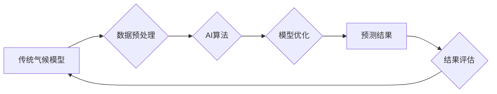

> 气候模型，人工智能，自然灾害预测，机器学习，深度学习，时间序列分析，数据可视化

## 1. 背景介绍

气候变化已成为全球面临的严峻挑战，其带来的极端天气事件，如洪水、干旱、热浪和风暴，给人类社会和生态系统带来了巨大威胁。准确预测自然灾害，是减轻灾害影响、保障人民生命财产安全的重要手段。传统的气候模型虽然在模拟气候系统方面取得了进展，但其预测精度仍然有限，难以捕捉到复杂的气候变化模式。近年来，人工智能（AI）技术蓬勃发展，为气候模型预测提供了新的思路和方法。

## 2. 核心概念与联系

**2.1 气候模型**

气候模型是模拟地球气候系统复杂相互作用的数学模型。它通过一系列方程描述大气、海洋、陆地和冰川等不同要素之间的物理、化学和生物过程，并根据初始条件和边界条件进行数值计算，预测未来气候变化趋势。

**2.2 人工智能**

人工智能是指模拟人类智能行为的计算机系统。它涵盖了机器学习、深度学习、自然语言处理、计算机视觉等多个领域。

**2.3 AI在气候模型预测中的应用**

AI技术可以与传统气候模型相结合，提升预测精度和效率。主要应用方式包括：

* **数据增强:** 利用AI算法生成更多模拟数据，丰富训练数据集，提高模型泛化能力。
* **特征提取:** AI算法可以自动提取气候数据中的关键特征，为模型提供更有效的输入信息。
* **模型优化:** AI算法可以优化气候模型的参数和结构，提高模型预测精度。
* **异常检测:** AI算法可以识别气候数据中的异常值，帮助预警极端天气事件。

**2.4 架构图**



## 3. 核心算法原理 & 具体操作步骤

**3.1 算法原理概述**

在气候模型预测中，常用的AI算法包括：

* **机器学习:** 利用历史数据训练模型，学习气候变化规律，预测未来趋势。
* **深度学习:** 使用多层神经网络，提取气候数据中的复杂特征，提高预测精度。
* **时间序列分析:** 分析气候数据的时间序列特征，预测未来值。

**3.2 算法步骤详解**

以机器学习为例，其步骤如下：

1. **数据收集:** 收集历史气候数据，包括气温、降水、风速等指标。
2. **数据预处理:** 对数据进行清洗、转换、归一化等处理，使其适合模型训练。
3. **模型选择:** 根据数据特点和预测目标，选择合适的机器学习算法，如线性回归、支持向量机、决策树等。
4. **模型训练:** 利用训练数据训练模型，调整模型参数，使其能够准确预测未来气候变化。
5. **模型评估:** 利用测试数据评估模型性能，计算预测精度、召回率等指标。
6. **模型部署:** 将训练好的模型部署到生产环境中，用于实时预测气候变化。

**3.3 算法优缺点**

* **机器学习:** 优点：易于实现，训练速度快；缺点：对数据质量要求高，难以捕捉复杂非线性关系。
* **深度学习:** 优点：能够学习复杂特征，预测精度高；缺点：训练时间长，对数据量要求高。
* **时间序列分析:** 优点：适用于预测时间序列数据；缺点：难以捕捉非线性变化。

**3.4 算法应用领域**

* **极端天气预警:** 预测洪水、干旱、热浪、风暴等极端天气事件。
* **气候变化趋势预测:** 预测未来气候变化趋势，为应对气候变化提供决策依据。
* **农业生产预测:** 预测未来气候条件，为农业生产提供指导。
* **水资源管理:** 预测未来水资源状况，为水资源管理提供决策依据。

## 4. 数学模型和公式 & 详细讲解 & 举例说明

**4.1 数学模型构建**

气候模型通常基于物理定律，构建数学方程组来描述气候系统各个要素之间的相互作用。例如，大气层中的温度变化可以由热力学方程描述，海洋中的水流可以由 Navier-Stokes 方程描述。

**4.2 公式推导过程**

具体的公式推导过程取决于所选择的模型类型和研究对象。例如，预测气温变化的模型可能需要考虑太阳辐射、大气对流、地表反射等因素，并利用热力学方程和微分方程进行推导。

**4.3 案例分析与讲解**

以气温预测为例，一个简单的数学模型可以表示为：

$$T(t) = T_0 + \alpha \cdot S(t) + \beta \cdot C(t)$$

其中：

* $T(t)$ 表示时间 $t$ 时的气温。
* $T_0$ 表示初始气温。
* $S(t)$ 表示时间 $t$ 时的太阳辐射强度。
* $C(t)$ 表示时间 $t$ 时的云量。
* $\alpha$ 和 $\beta$ 是模型参数，代表太阳辐射和云量对气温的影响程度。

通过收集历史气温、太阳辐射和云量数据，可以利用机器学习算法训练模型，确定 $\alpha$ 和 $\beta$ 的最佳值，从而预测未来气温变化。

## 5. 项目实践：代码实例和详细解释说明

**5.1 开发环境搭建**

* 操作系统：Linux/macOS/Windows
* Python 版本：3.7+
* 必要的库：NumPy、Pandas、Scikit-learn、TensorFlow/PyTorch

**5.2 源代码详细实现**

```python
import numpy as np
from sklearn.linear_model import LinearRegression

# 1. 数据加载
data = np.loadtxt('climate_data.csv', delimiter=',')
X = data[:, :-1]  # 特征数据
y = data[:, -1]  # 目标数据

# 2. 数据预处理
X_train, X_test, y_train, y_test = train_test_split(X, y, test_size=0.2)

# 3. 模型训练
model = LinearRegression()
model.fit(X_train, y_train)

# 4. 模型评估
y_pred = model.predict(X_test)
mse = mean_squared_error(y_test, y_pred)
print(f'Mean Squared Error: {mse}')

# 5. 模型部署
# 将训练好的模型保存为文件，以便后续使用
joblib.dump(model, 'climate_model.pkl')
```

**5.3 代码解读与分析**

* 代码首先加载气候数据，并将数据分为特征数据和目标数据。
* 然后，代码使用 train_test_split 函数将数据分为训练集和测试集。
* 接着，代码使用 LinearRegression 类创建线性回归模型，并使用 fit 函数训练模型。
* 训练完成后，代码使用 predict 函数预测测试集数据，并计算模型的均方误差 (MSE)。
* 最后，代码使用 joblib 库将训练好的模型保存为文件，以便后续使用。

**5.4 运行结果展示**

运行代码后，会输出模型的均方误差值。MSE 值越小，模型的预测精度越高。

## 6. 实际应用场景

**6.1 极端天气预警**

AI技术可以帮助预测洪水、干旱、热浪、风暴等极端天气事件，为灾害防治提供决策依据。例如，利用AI算法分析历史天气数据和遥感数据，可以预测未来24小时内可能发生的洪水区域，并及时发出预警。

**6.2 气候变化趋势预测**

AI技术可以帮助预测未来气候变化趋势，为应对气候变化提供决策依据。例如，利用AI算法分析全球气候模型数据，可以预测未来50年内全球平均气温变化趋势，并评估不同减排方案的效果。

**6.3 农业生产预测**

AI技术可以帮助预测未来气候条件，为农业生产提供指导。例如，利用AI算法分析历史气温、降水和土壤湿度数据，可以预测未来一季度的作物产量，并为农民提供最佳种植方案。

**6.4 未来应用展望**

随着AI技术的不断发展，其在气候模型预测中的应用将更加广泛和深入。例如，未来可能出现：

* 更精准的极端天气预警系统，能够提前预警更细致的灾害区域和时间。
* 更全面的气候变化趋势预测，能够预测不同地区和不同行业的气候变化影响。
* 更智能的农业生产管理系统，能够根据实时气候条件动态调整种植方案，提高农业生产效率。

## 7. 工具和资源推荐

**7.1 学习资源推荐**

* **书籍:**
    * "Deep Learning" by Ian Goodfellow, Yoshua Bengio, and Aaron Courville
    * "Hands-On Machine Learning with Scikit-Learn, Keras & TensorFlow" by Aurélien Géron
* **在线课程:**
    * Coursera: Machine Learning by Andrew Ng
    * edX: Artificial Intelligence by Columbia University

**7.2 开发工具推荐**

* **Python:** 广泛应用于数据科学和机器学习领域。
* **NumPy:** 用于数值计算和数组操作。
* **Pandas:** 用于数据分析和处理。
* **Scikit-learn:** 用于机器学习算法的实现和评估。
* **TensorFlow/PyTorch:** 用于深度学习模型的开发和训练。

**7.3 相关论文推荐**

* "Climate Change Prediction Using Machine Learning" by A. Kumar et al.
* "Deep Learning for Climate Modeling" by J. Liu et al.
* "Time Series Analysis for Climate Change Prediction" by S. Chen et al.

## 8. 总结：未来发展趋势与挑战

**8.1 研究成果总结**

AI技术在气候模型预测领域取得了显著进展，能够提高预测精度、效率和可视化程度。

**8.2 未来发展趋势**

* **模型复杂度提升:** 开发更复杂的深度学习模型，能够捕捉更精细的气候变化模式。
* **数据融合:** 将不同类型的数据融合在一起，例如遥感数据、气象观测数据、社会经济数据，提高模型预测精度。
* **实时预测:** 开发实时更新的气候模型预测系统，能够及时预警极端天气事件。

**8.3 面临的挑战**

* **数据质量:** 气候数据往往存在缺失、噪声和不一致性，需要进行有效的数据清洗和预处理。
* **模型 interpretability:** 深度学习模型的内部机制难以理解，需要开发更可解释的模型，以便更好地理解预测结果。
* **计算资源:** 训练大型深度学习模型需要大量的计算资源，需要开发更有效的训练算法和硬件平台。

**8.4 研究展望**

未来，AI技术将继续推动气候模型预测的发展，为应对气候变化提供更精准、更有效的解决方案。


## 9. 附录：常见问题与解答

**9.1 如何选择合适的AI算法？**

选择合适的AI算法取决于具体应用场景和数据特点。例如，对于预测气温变化，线性回归模型可能足够准确；而对于预测复杂的气候模式，深度学习模型可能更合适。

**9.2 如何处理气候数据中的缺失值？**

常用的处理方法包括：

* **删除缺失数据:** 如果缺失数据量较少，可以删除缺失数据。
* **插值法:** 使用周围数据进行插值，填充缺失数据。
* **模型学习:** 使用机器学习模型学习缺失数据的规律，进行预测。

**9.3 如何评估AI模型的预测精度？**

常用的评估指标包括：

* **均方误差 (MSE):** 衡量预测值与真实值之间的平均平方差。
* **平均绝对误差 (MAE):** 衡量预测值与真实