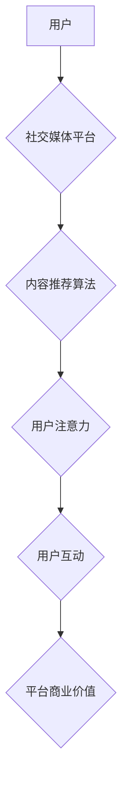

>  注意力经济,社交媒体营销,用户体验,算法,数据分析,内容策略

## 1. 背景介绍

在当今数字时代，信息爆炸式增长，用户面临着来自各个方向的纷繁信息冲击。在这种情况下，人们的注意力成为了稀缺的资源，也被称为“注意力经济”。社交媒体作为信息传播和用户互动的重要平台，在“注意力经济”中扮演着至关重要的角色。

社交媒体平台通过各种算法和机制，试图吸引用户的注意力，并将其转化为商业价值。然而，过度追求流量和广告收益，往往会牺牲用户体验，导致用户流失和平台信任度下降。因此，如何在不牺牲用户体验的情况下，有效地吸引受众，成为了社交媒体营销的重大挑战。

## 2. 核心概念与联系

### 2.1 注意力经济

注意力经济是指在信息过载的时代，人们对信息的筛选和选择能力成为重要的经济资源。注意力是有限的，而信息是无限的，因此，如何获取和利用用户的注意力成为了企业和平台争夺的焦点。

### 2.2 社交媒体营销

社交媒体营销是指利用社交媒体平台，通过内容创作、互动传播、用户关系管理等方式，实现品牌推广、用户增长和商业目标的营销活动。

### 2.3 用户体验

用户体验是指用户使用产品或服务时，所感受到的整体感受和满意度。良好的用户体验可以提升用户粘性，增强用户忠诚度，最终促进商业成功。

**Mermaid 流程图**



## 3. 核心算法原理 & 具体操作步骤

### 3.1 算法原理概述

社交媒体平台的推荐算法通常基于用户的历史行为、兴趣偏好、社交关系等数据，通过机器学习和深度学习技术，预测用户可能感兴趣的内容，并将其推荐给用户。

常见的推荐算法包括：

* **协同过滤算法:** 基于用户的相似性或物品的相似性，推荐用户可能感兴趣的物品。
* **内容基准算法:** 基于内容的特征和标签，推荐与用户兴趣相符的内容。
* **混合推荐算法:** 结合协同过滤算法和内容基准算法，提高推荐效果。

### 3.2 算法步骤详解

1. **数据收集:** 收集用户的历史行为数据，例如浏览记录、点赞记录、评论记录、分享记录等。
2. **数据预处理:** 对收集到的数据进行清洗、转换和特征提取，以便于算法训练。
3. **模型训练:** 选择合适的推荐算法，并利用训练数据训练模型。
4. **模型评估:** 使用测试数据评估模型的性能，例如准确率、召回率、覆盖率等。
5. **模型部署:** 将训练好的模型部署到线上环境，用于实时推荐内容。

### 3.3 算法优缺点

**优点:**

* **个性化推荐:** 可以根据用户的兴趣偏好，推荐更符合用户需求的内容。
* **提高用户粘性:** 通过推荐更感兴趣的内容，可以提高用户在平台上的停留时间和互动频率。
* **提升商业价值:** 通过推荐更相关的广告，可以提高广告转化率和商业收益。

**缺点:**

* **数据依赖:** 推荐算法依赖于大量用户行为数据，如果数据质量不高，会影响推荐效果。
* **算法偏差:** 算法可能会存在偏差，导致推荐结果不公平或不准确。
* **用户隐私:** 数据收集和使用可能会侵犯用户的隐私。

### 3.4 算法应用领域

推荐算法广泛应用于各种领域，例如：

* **电商平台:** 推荐商品、优惠券、促销活动等。
* **视频平台:** 推荐视频、电视剧、电影等。
* **音乐平台:** 推荐歌曲、专辑、音乐人等。
* **新闻平台:** 推荐新闻、文章、博客等。

## 4. 数学模型和公式 & 详细讲解 & 举例说明

### 4.1 数学模型构建

推荐算法通常使用评分模型来预测用户对物品的评分。一个简单的评分模型可以使用线性回归，将用户的特征和物品的特征作为输入，预测用户对物品的评分。

**线性回归模型:**

$$
\hat{r}_{ui} = \beta_0 + \beta_1 x_{u1} + \beta_2 x_{u2} + ... + \beta_n x_{un} + \gamma_1 y_{i1} + \gamma_2 y_{i2} + ... + \gamma_m y_{im}
$$

其中:

* $\hat{r}_{ui}$: 预计用户 $u$ 对物品 $i$ 的评分。
* $x_{uj}$: 用户 $u$ 的第 $j$ 个特征。
* $y_{ik}$: 物品 $i$ 的第 $k$ 个特征。
* $\beta_j$: 用户特征的权重。
* $\gamma_k$: 物品特征的权重。

### 4.2 公式推导过程

线性回归模型的目标是找到最佳的权重 $\beta$ 和 $\gamma$，使得预测评分与实际评分之间的误差最小。可以使用最小二乘法来求解最佳权重。

最小二乘法:

$$
\min_{\beta, \gamma} \sum_{u, i} (r_{ui} - \hat{r}_{ui})^2
$$

其中:

* $r_{ui}$: 用户 $u$ 对物品 $i$ 的实际评分。

### 4.3 案例分析与讲解

假设我们有一个电商平台，想要推荐商品给用户。我们可以使用用户的购买历史、浏览记录、评分等数据作为用户特征，以及商品的类别、价格、品牌等数据作为商品特征。

通过训练线性回归模型，我们可以预测用户对不同商品的评分。然后，我们可以根据预测评分，推荐用户可能感兴趣的商品。

## 5. 项目实践：代码实例和详细解释说明

### 5.1 开发环境搭建

* Python 3.x
* TensorFlow 或 PyTorch
* Jupyter Notebook

### 5.2 源代码详细实现

```python
import tensorflow as tf

# 定义模型
model = tf.keras.Sequential([
    tf.keras.layers.Dense(64, activation='relu', input_shape=(10,)),
    tf.keras.layers.Dense(32, activation='relu'),
    tf.keras.layers.Dense(1)
])

# 编译模型
model.compile(optimizer='adam', loss='mse')

# 训练模型
model.fit(X_train, y_train, epochs=10)

# 预测评分
predictions = model.predict(X_test)
```

### 5.3 代码解读与分析

* 我们使用 TensorFlow 库构建了一个简单的线性回归模型。
* 模型包含三个全连接层，分别有 64、32 和 1 个神经元。
* 激活函数使用 ReLU 函数。
* 损失函数使用均方误差 (MSE)。
* 优化器使用 Adam 优化器。
* 我们使用训练数据训练模型 10 个 epochs。
* 训练完成后，我们可以使用测试数据预测评分。

### 5.4 运行结果展示

训练完成后，我们可以评估模型的性能，例如使用均方根误差 (RMSE) 来衡量预测评分与实际评分之间的差异。

## 6. 实际应用场景

### 6.1 内容推荐

社交媒体平台可以利用推荐算法，推荐用户可能感兴趣的内容，例如新闻、文章、视频、图片等。

### 6.2 广告投放

社交媒体平台可以利用推荐算法，精准地将广告投放到目标用户面前，提高广告转化率。

### 6.3 社交关系分析

社交媒体平台可以利用推荐算法，分析用户的社交关系，推荐用户可能认识的人或组织。

### 6.4 未来应用展望

随着人工智能技术的不断发展，推荐算法将会更加智能化、个性化和精准化。未来，推荐算法将会在更多领域得到应用，例如：

* **教育:** 推荐个性化的学习内容和学习资源。
* **医疗:** 推荐个性化的医疗方案和健康建议。
* **金融:** 推荐个性化的理财产品和投资建议。

## 7. 工具和资源推荐

### 7.1 学习资源推荐

* **书籍:**
    * 《推荐系统实践》
    * 《深度学习》
* **在线课程:**
    * Coursera: 机器学习
    * Udacity: 深度学习

### 7.2 开发工具推荐

* **TensorFlow:** 开源深度学习框架。
* **PyTorch:** 开源深度学习框架。
* **Scikit-learn:** 机器学习库。

### 7.3 相关论文推荐

* **Collaborative Filtering for Implicit Feedback Datasets**
* **Deep Learning for Recommender Systems**

## 8. 总结：未来发展趋势与挑战

### 8.1 研究成果总结

注意力经济与社交媒体营销的结合，推动了推荐算法的发展，并取得了显著的成果。推荐算法能够有效地个性化推荐内容，提高用户粘性和商业价值。

### 8.2 未来发展趋势

未来，推荐算法将会更加智能化、个性化和精准化。

* **多模态推荐:** 将文本、图像、音频等多种数据类型融合在一起，进行更全面的用户画像和内容理解。
* **联邦学习:** 在保护用户隐私的前提下，利用分布式数据进行模型训练。
* **强化学习:** 利用强化学习算法，动态调整推荐策略，以最大化用户满意度和商业收益。

### 8.3 面临的挑战

* **数据隐私:** 数据收集和使用可能会侵犯用户的隐私，需要采取有效的隐私保护措施。
* **算法偏差:** 算法可能会存在偏差，导致推荐结果不公平或不准确，需要进行算法公平性评估和改进。
* **用户信任:** 过度推荐或推送不相关内容，可能会导致用户信任下降，需要注重用户体验和个性化推荐。

### 8.4 研究展望

未来，需要进一步研究如何构建更加公平、透明、可解释的推荐算法，并探索推荐算法在更多领域的新应用场景。

## 9. 附录：常见问题与解答

### 9.1 如何评估推荐算法的性能？

常用的评估指标包括：

* **准确率:** 推荐结果与实际用户偏好的匹配程度。
* **召回率:** 推荐系统能够召回用户真实偏好的物品比例。
* **覆盖率:** 推荐系统能够覆盖用户所有偏好的物品比例。
* **NDCG:** Normalized Discounted Cumulative Gain，衡量推荐结果的排序质量。

### 9.2 如何解决推荐算法的冷启动问题？

冷启动问题是指推荐算法在用户或物品数据不足时，难以给出准确的推荐结果。

一些解决方案包括：

* **利用用户相似性:** 从与新用户相似的用户那里获取推荐信息。
* **利用物品相似性:** 从与新物品相似的物品那里获取推荐信息。
* **使用协同过滤算法:** 利用用户对其他物品的评分信息，预测用户对新物品的评分。

### 9.3 如何避免推荐算法的偏差？

算法偏差是指推荐算法由于数据或算法本身的原因，导致推荐结果不公平或不准确。

一些解决方案包括：

* **使用多样化的训练数据:** 确保训练数据能够代表不同用户群体和物品类别。
* **进行算法公平性评估:** 定期评估算法的公平性，并进行必要的调整。
* **透明化算法:** 使算法的决策过程更加透明，以便于用户理解和监督。


作者：禅与计算机程序设计艺术 / Zen and the Art of Computer Programming 
<end_of_turn>