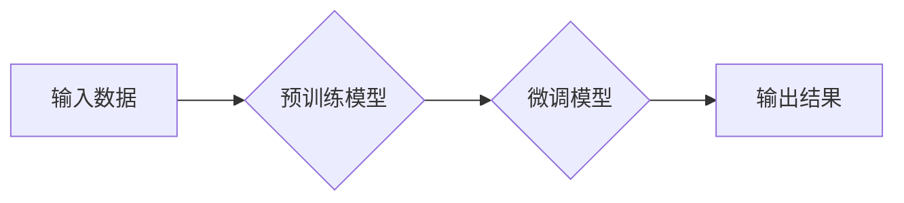

> 生成式AI, AIGC, 自然语言处理, 深度学习, Transformer, 文本生成, 图像生成, 代码生成, 商业应用

## 1. 背景介绍

近年来，人工智能（AI）技术取得了飞速发展，特别是生成式人工智能（AIGC）领域，展现出强大的潜力和应用前景。AIGC是指能够根据输入信息生成新内容的AI模型，例如文本、图像、音频、视频等。与传统的AI模型相比，AIGC更注重创造性和创新性，能够突破人类的想象力，为人们带来全新的体验和价值。

AIGC技术的兴起，得益于以下几个关键因素：

* **深度学习算法的进步:** 深度学习算法，特别是Transformer模型的出现，为AIGC提供了强大的学习和生成能力。Transformer模型能够捕捉文本中的长距离依赖关系，生成更流畅、更自然的文本内容。
* **海量数据量的积累:**  互联网时代，海量数据被不断生成和积累，为AIGC模型提供了充足的训练数据。
* **计算能力的提升:**  近年来，计算能力的飞速发展，使得训练大型AIGC模型成为可能。

## 2. 核心概念与联系

AIGC的核心概念包括：

* **生成模型:**  生成模型是一种能够学习数据分布并生成新数据的机器学习模型。
* **深度学习:**  深度学习是一种基于多层神经网络的机器学习方法，能够学习复杂的数据模式。
* **Transformer:**  Transformer是一种新型的深度学习架构，能够有效地处理序列数据，例如文本和音频。

**AIGC架构**



## 3. 核心算法原理 & 具体操作步骤

### 3.1  算法原理概述

AIGC的核心算法原理是基于深度学习的生成模型，例如：

* **变分自编码器 (VAE):**  VAE是一种生成模型，通过学习数据的潜在表示来生成新数据。
* **生成对抗网络 (GAN):**  GAN由两个网络组成：生成器和鉴别器。生成器试图生成逼真的数据，而鉴别器试图区分真实数据和生成数据。两者相互竞争，最终生成器能够生成逼真的数据。
* **Transformer:**  Transformer是一种强大的序列数据处理模型，能够捕捉文本中的长距离依赖关系，生成更流畅、更自然的文本内容。

### 3.2  算法步骤详解

以文本生成为例，使用Transformer模型进行AIGC的具体操作步骤如下：

1. **数据预处理:**  收集文本数据，进行清洗、分词、词向量化等预处理操作。
2. **模型训练:**  使用预训练的Transformer模型，对预处理后的文本数据进行训练，学习文本的语言模式和结构。
3. **文本生成:**  输入一个文本提示或种子词，模型根据训练得到的知识和模式，生成新的文本内容。

### 3.3  算法优缺点

**优点:**

* 生成能力强，能够生成高质量、逼真的文本、图像、音频等内容。
* 适应性强，能够处理多种类型的数据和任务。
* 可扩展性强，能够训练出规模更大的模型，提升生成能力。

**缺点:**

* 训练成本高，需要大量的计算资源和训练数据。
* 模型解释性差，难以理解模型的生成机制。
* 存在潜在的风险，例如生成虚假信息、恶意内容等。

### 3.4  算法应用领域

AIGC技术在各个领域都有广泛的应用前景，例如：

* **内容创作:**  自动生成新闻报道、小说、诗歌、剧本等内容。
* **营销推广:**  生成个性化的广告文案、产品描述、社交媒体内容等。
* **教育培训:**  生成个性化的学习内容、考试题、教学辅助材料等。
* **艺术创作:**  生成音乐、绘画、雕塑等艺术作品。

## 4. 数学模型和公式 & 详细讲解 & 举例说明

### 4.1  数学模型构建

AIGC模型通常基于深度学习框架，例如TensorFlow或PyTorch。这些框架提供了一系列预定义的层和操作，可以方便地构建复杂的深度学习模型。

### 4.2  公式推导过程

AIGC模型的训练过程通常使用反向传播算法，通过优化模型参数来最小化预测误差。反向传播算法的核心是链式法则，用于计算梯度。

**链式法则:**

$$
\frac{d}{dx} f(g(x)) = f'(g(x)) \cdot g'(x)
$$

其中，$f$和$g$是两个函数，$x$是输入变量。

### 4.3  案例分析与讲解

以文本生成为例，可以使用Transformer模型进行训练。Transformer模型的解码器部分使用注意力机制，可以捕捉文本中的长距离依赖关系。

**注意力机制:**

$$
Attention(Q, K, V) = softmax(\frac{QK^T}{\sqrt{d_k}})V
$$

其中，$Q$, $K$, $V$分别是查询矩阵、键矩阵和值矩阵，$d_k$是键向量的维度。

## 5. 项目实践：代码实例和详细解释说明

### 5.1  开发环境搭建

AIGC项目开发环境通常需要以下软件和工具：

* Python编程语言
* 深度学习框架 (例如TensorFlow或PyTorch)
* GPU加速器
* 数据处理工具 (例如Pandas或NumPy)

### 5.2  源代码详细实现

以下是一个使用PyTorch训练文本生成模型的简单代码示例：

```python
import torch
import torch.nn as nn

class TextGenerator(nn.Module):
    def __init__(self, vocab_size, embedding_dim, hidden_dim):
        super(TextGenerator, self).__init__()
        self.embedding = nn.Embedding(vocab_size, embedding_dim)
        self.lstm = nn.LSTM(embedding_dim, hidden_dim)
        self.fc = nn.Linear(hidden_dim, vocab_size)

    def forward(self, x):
        embedded = self.embedding(x)
        output, (hidden, cell) = self.lstm(embedded)
        output = self.fc(output[:, -1, :])
        return output

# ... 模型训练代码 ...
```

### 5.3  代码解读与分析

* `TextGenerator`类定义了一个简单的文本生成模型，包含嵌入层、LSTM层和全连接层。
* `embedding`层将单词转换为向量表示。
* `lstm`层使用LSTM网络处理文本序列，捕捉长距离依赖关系。
* `fc`层将LSTM输出映射到词汇表大小，生成下一个单词的概率分布。

### 5.4  运行结果展示

训练完成后，可以使用模型生成新的文本内容。例如，输入一个种子词，模型可以根据训练得到的知识和模式，生成一段相关的文本。

## 6. 实际应用场景

### 6.1  内容创作

AIGC可以用于自动生成各种类型的文本内容，例如：

* **新闻报道:**  根据事件数据自动生成新闻报道，提高新闻生产效率。
* **小说创作:**  根据用户提供的主题和人物设定，自动生成小说情节和文本。
* **诗歌创作:**  根据用户提供的韵律和主题，自动生成诗歌作品。

### 6.2  营销推广

AIGC可以用于生成个性化的营销内容，例如：

* **广告文案:**  根据目标用户画像，自动生成吸引人的广告文案。
* **产品描述:**  根据产品特性，自动生成详细的产品描述。
* **社交媒体内容:**  根据品牌风格和目标用户，自动生成社交媒体内容。

### 6.3  教育培训

AIGC可以用于生成个性化的教育内容，例如：

* **学习内容:**  根据学生的学习进度和知识点，自动生成个性化的学习内容。
* **考试题:**  根据课程内容和考试标准，自动生成考试题。
* **教学辅助材料:**  自动生成教学视频、PPT等辅助材料。

### 6.4  未来应用展望

AIGC技术的未来应用前景广阔，例如：

* **虚拟助手:**  开发更智能、更自然的虚拟助手，能够理解和响应用户的自然语言指令。
* **个性化推荐:**  根据用户的兴趣和偏好，自动生成个性化的商品推荐、内容推荐等。
* **跨语言沟通:**  实现实时、准确的跨语言翻译，打破语言障碍。

## 7. 工具和资源推荐

### 7.1  学习资源推荐

* **书籍:**
    * 《深度学习》
    * 《自然语言处理》
    * 《生成对抗网络》
* **在线课程:**
    * Coursera: 深度学习
    * Udacity: 自然语言处理
    * fast.ai: 深度学习

### 7.2  开发工具推荐

* **深度学习框架:**
    * TensorFlow
    * PyTorch
    * Keras
* **数据处理工具:**
    * Pandas
    * NumPy
* **文本处理工具:**
    * NLTK
    * SpaCy

### 7.3  相关论文推荐

* 《Attention Is All You Need》
* 《Generative Adversarial Networks》
* 《BERT: Pre-training of Deep Bidirectional Transformers for Language Understanding》

## 8. 总结：未来发展趋势与挑战

### 8.1  研究成果总结

AIGC技术取得了显著的进展，能够生成高质量、逼真的文本、图像、音频等内容。

### 8.2  未来发展趋势

* **模型规模和能力的提升:**  训练更大规模的AIGC模型，提升生成能力和质量。
* **多模态生成:**  实现文本、图像、音频等多模态内容的联合生成。
* **个性化定制:**  根据用户的需求和偏好，生成个性化的内容。
* **伦理和安全问题:**  解决AIGC技术带来的伦理和安全问题，例如虚假信息生成、版权侵权等。

### 8.3  面临的挑战

* **数据获取和标注:**  AIGC模型需要大量的训练数据，数据获取和标注成本高。
* **模型训练和部署:**  训练大型AIGC模型需要大量的计算资源，部署成本高。
* **模型解释性和可控性:**  AIGC模型的生成机制难以理解，缺乏可控性。

### 8.4  研究展望

未来，AIGC技术将继续发展，在更多领域发挥重要作用。需要加强对AIGC技术的伦理和安全问题的研究，确保其安全、可控地应用于社会。

## 9. 附录：常见问题与解答

### 9.1  AIGC和传统AI的区别是什么？

传统AI模型通常是针对特定任务训练的，而AIGC模型能够生成新的内容，具有更强的创造性和泛化能力。

### 9.2  AIGC技术有哪些应用场景？

AIGC技术在内容创作、营销推广、教育培训、虚拟助手等领域都有广泛的应用场景。

### 9.3  如何训练一个AIGC模型？

训练AIGC模型需要大量的训练数据、强大的计算资源和专业的机器学习知识。

### 9.4  AIGC技术有哪些伦理和安全问题？

AIGC技术可能带来虚假信息生成、版权侵权、偏见放大等伦理和安全问题。

### 9.5  AIGC技术的未来发展趋势是什么？

AIGC技术将朝着模型规模和能力的提升、多模态生成、个性化定制等方向发展。


作者：禅与计算机程序设计艺术 / Zen and the Art of Computer Programming 
<end_of_turn>