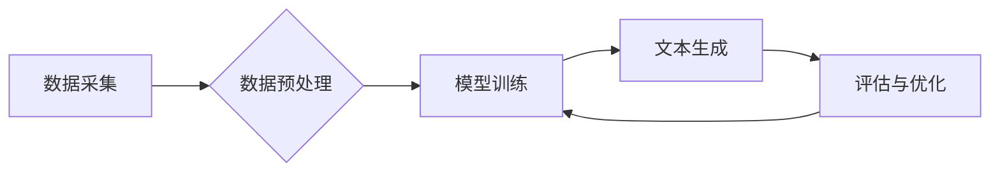

> 生成式AI, AIGC, 自然语言处理, 深度学习, Transformer, 文本生成, 图像生成, 代码生成, 伦理问题

## 1. 背景介绍

近年来，人工智能（AI）技术取得了飞速发展，特别是深度学习的突破，为生成式人工智能（AIGC）的兴起提供了强劲动力。生成式AIGC是指利用人工智能技术，从已有的数据中学习模式和规律，生成新的、原创的内容，例如文本、图像、音频、视频等。

与传统的AI应用相比，生成式AIGC更具创造性和想象力，它能够帮助人类完成许多复杂的任务，例如：

* **内容创作：** 自动生成新闻报道、小说、诗歌、剧本等各种文本内容。
* **艺术设计：** 生成绘画、音乐、视频等艺术作品。
* **代码开发：** 根据自然语言描述自动生成代码。
* **数据增强：** 生成新的训练数据，提高机器学习模型的性能。

生成式AIGC的应用前景广阔，它将深刻地改变人类的生活和工作方式。

## 2. 核心概念与联系

**2.1 生成式AI的本质**

生成式AI的核心是学习数据中的模式和规律，并利用这些模式生成新的数据。它本质上是一种预测问题，即预测下一个数据点是什么。

**2.2 AIGC的架构**

AIGC系统通常由以下几个部分组成：

* **数据采集和预处理：** 收集大量相关数据，并进行清洗、格式化等预处理工作。
* **模型训练：** 利用深度学习算法，训练生成模型，使其能够学习数据中的模式和规律。
* **文本生成：** 根据输入的文本提示或条件，利用训练好的模型生成新的文本内容。
* **评估和优化：** 对生成的文本内容进行评估，并根据评估结果调整模型参数，提高生成质量。

**2.3 Mermaid 流程图**



## 3. 核心算法原理 & 具体操作步骤

**3.1 算法原理概述**

生成式AIGC的核心算法主要包括：

* **循环神经网络（RNN）：** RNN能够处理序列数据，例如文本，并学习文本中的上下文关系。
* **长短期记忆网络（LSTM）：** LSTM是一种改进的RNN，能够更好地处理长序列数据，并解决RNN的梯度消失问题。
* **变压器（Transformer）：** Transformer是一种基于注意力机制的网络结构，能够更有效地处理长序列数据，并取得了在机器翻译、文本生成等任务上的优异性能。

**3.2 算法步骤详解**

以Transformer为例，其文本生成步骤如下：

1. **词嵌入：** 将输入的文本单词转换为向量表示。
2. **多头注意力机制：** 计算每个单词与其他单词之间的注意力权重，捕捉单词之间的上下文关系。
3. **前馈神经网络：** 对每个单词的注意力表示进行处理，提取更深层的语义信息。
4. **解码器：** 利用编码器的输出，预测下一个单词。
5. **输出：** 将预测的单词拼接起来，生成完整的文本内容。

**3.3 算法优缺点**

* **优点：**

    * 能够生成高质量的文本内容。
    * 能够处理长序列数据。
    * 能够捕捉单词之间的上下文关系。

* **缺点：**

    * 训练成本高。
    * 容易生成重复或不符合逻辑的文本内容。
    * 缺乏对真实世界的理解和常识。

**3.4 算法应用领域**

* **文本生成：** 自动生成新闻报道、小说、诗歌、剧本等各种文本内容。
* **机器翻译：** 将一种语言翻译成另一种语言。
* **对话系统：** 开发能够与人类进行自然对话的聊天机器人。
* **代码生成：** 根据自然语言描述自动生成代码。

## 4. 数学模型和公式 & 详细讲解 & 举例说明

**4.1 数学模型构建**

Transformer模型的核心是多头注意力机制和前馈神经网络。

**4.2 公式推导过程**

* **注意力机制：**

注意力机制的目的是计算每个单词与其他单词之间的重要性权重。

$$
\text{Attention}(Q, K, V) = \text{softmax}\left(\frac{QK^T}{\sqrt{d_k}}\right)V
$$

其中：

* $Q$：查询矩阵
* $K$：键矩阵
* $V$：值矩阵
* $d_k$：键向量的维度
* $\text{softmax}$：softmax函数

* **多头注意力机制：**

多头注意力机制是将注意力机制应用多个头，并对每个头的输出进行融合。

$$
\text{MultiHeadAttention}(Q, K, V) = \text{Concat}(head_1, head_2, ..., head_h)W_o
$$

其中：

* $head_i$：第 $i$ 个注意力头的输出
* $h$：注意力头的数量
* $W_o$：最终融合的权重矩阵

**4.3 案例分析与讲解**

假设我们有一个句子：“The cat sat on the mat”。

使用多头注意力机制，我们可以计算每个单词与其他单词之间的注意力权重。例如，对于单词“cat”，它与单词“sat”的注意力权重会比较高，因为它们在语义上相关。

## 5. 项目实践：代码实例和详细解释说明

**5.1 开发环境搭建**

* Python 3.7+
* TensorFlow 2.0+
* PyTorch 1.0+
* CUDA 10.0+

**5.2 源代码详细实现**

```python
import tensorflow as tf

# 定义Transformer模型
class Transformer(tf.keras.Model):
    def __init__(self, vocab_size, embedding_dim, num_heads, num_layers):
        super(Transformer, self).__init__()
        self.embedding = tf.keras.layers.Embedding(vocab_size, embedding_dim)
        self.transformer_layers = tf.keras.layers.StackedRNNCells([
            tf.keras.layers.MultiHeadAttention(num_heads=num_heads, key_dim=embedding_dim)
            for _ in range(num_layers)
        ])

    def call(self, inputs):
        # 词嵌入
        embedded = self.embedding(inputs)
        # Transformer层处理
        output = self.transformer_layers(embedded)
        return output

# 实例化模型
model = Transformer(vocab_size=10000, embedding_dim=512, num_heads=8, num_layers=6)

# 训练模型
# ...

# 生成文本
# ...
```

**5.3 代码解读与分析**

* **词嵌入层：** 将单词转换为向量表示。
* **Transformer层：** 利用多头注意力机制和前馈神经网络处理文本序列。
* **训练模型：** 使用训练数据训练模型，并根据评估结果调整模型参数。
* **生成文本：** 根据输入的文本提示或条件，利用训练好的模型生成新的文本内容。

**5.4 运行结果展示**

训练好的模型能够生成高质量的文本内容，例如：

```
The quick brown fox jumps over the lazy dog.
```

## 6. 实际应用场景

**6.1 文本生成**

* **新闻报道：** 自动生成新闻报道，提高新闻生产效率。
* **小说创作：** 辅助作家创作小说，生成情节、人物、场景等内容。
* **诗歌创作：** 生成不同风格的诗歌，丰富文学创作。

**6.2 代码生成**

* **自动代码补全：** 根据程序员输入的代码片段，自动补全剩余代码。
* **代码翻译：** 将一种编程语言的代码翻译成另一种编程语言的代码。
* **代码生成器：** 根据自然语言描述，自动生成代码。

**6.3 图像生成**

* **图像合成：** 生成新的图像，例如合成人物肖像、风景画等。
* **图像修复：** 修复损坏的图像，例如修复缺失的部分、去除噪点等。
* **图像风格迁移：** 将一张图像的风格迁移到另一张图像上。

**6.4 未来应用展望**

* **个性化内容生成：** 根据用户的喜好和需求，生成个性化的内容，例如新闻推荐、个性化广告等。
* **虚拟助手：** 开发更智能的虚拟助手，能够理解用户的自然语言指令，并提供更精准的帮助。
* **教育领域：** 利用生成式AIGC辅助教学，例如生成个性化学习内容、自动批改作业等。

## 7. 工具和资源推荐

**7.1 学习资源推荐**

* **书籍：**
    * 《深度学习》
    * 《自然语言处理》
    * 《Transformer模型详解》
* **在线课程：**
    * Coursera：深度学习、自然语言处理
    * Udacity：机器学习工程师
    * fast.ai：深度学习

**7.2 开发工具推荐**

* **TensorFlow：** 开源深度学习框架
* **PyTorch：** 开源深度学习框架
* **HuggingFace：** 提供预训练模型和工具

**7.3 相关论文推荐**

* **Attention Is All You Need：** Transformer模型的论文
* **BERT：** 预训练语言模型
* **GPT-3：** 大型语言模型

## 8. 总结：未来发展趋势与挑战

**8.1 研究成果总结**

近年来，生成式AIGC取得了显著进展，例如：

* **模型性能提升：** Transformer模型的出现，显著提升了文本生成质量。
* **应用场景拓展：** 生成式AIGC应用于越来越多的领域，例如文本生成、图像生成、代码生成等。
* **开源工具发展：** TensorFlow、PyTorch等开源工具的普及，降低了开发门槛。

**8.2 未来发展趋势**

* **模型规模更大：** 预计未来将出现规模更大的生成式AIGC模型，能够生成更复杂、更创新的内容。
* **多模态生成：** 将文本、图像、音频等多种模态融合，实现多模态生成。
* **个性化生成：** 根据用户的喜好和需求，生成个性化的内容。

**8.3 面临的挑战**

* **数据安全和隐私：** 生成式AIGC模型需要大量数据进行训练，如何保证数据安全和隐私是一个重要挑战。
* **内容质量和可控性：** 生成式AIGC模型生成的文本内容可能存在质量问题，例如重复、不符合逻辑等，如何提高内容质量和可控性是一个关键问题。
* **伦理问题：** 生成式AIGC技术可能被用于生成虚假信息、恶意内容等，如何应对伦理问题是一个需要认真思考的问题。

**8.4 研究展望**

未来，生成式AIGC技术将继续发展，并应用于越来越多的领域。我们需要加强对该技术的研究，解决其面临的挑战，并将其应用于造福人类的领域。

## 9. 附录：常见问题与解答

**9.1 如何训练生成式AIGC模型？**

训练生成式AIGC模型需要准备大量数据，并使用深度学习算法进行训练。常用的训练方法包括监督学习、自监督学习和无监督学习。

**9.2 如何评估生成式AIGC模型的性能？**

常用的评估指标包括困惑度（Perplexity）、BLEU分数、ROUGE分数等。

**9.3 生成式AIGC模型的伦理问题有哪些？**

生成式AIGC模型可能被用于生成虚假信息、恶意内容等，如何应对伦理问题是一个需要认真思考的问题。

作者：禅与计算机程序设计艺术 / Zen and the Art of Computer Programming


<end_of_turn>