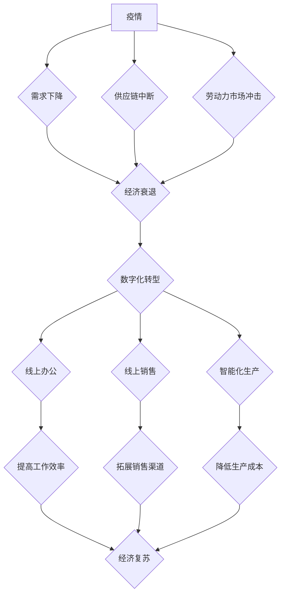

> 疫情、全球经济、数字化转型、供应链、人工智能、大数据、云计算、远程办公、经济复苏

## 1. 背景介绍

2019年末，新冠肺炎疫情爆发，迅速蔓延全球，对人类社会造成了前所未有的冲击。疫情不仅对公共卫生体系造成巨大压力，也对全球经济造成严重影响。各国采取了封锁、隔离等措施，导致生产链中断、消费需求下降，全球经济陷入衰退。

疫情的冲击凸显了全球经济的脆弱性，也加速了数字化转型的进程。企业被迫转向线上办公、线上销售等模式，对人工智能、大数据、云计算等技术的依赖度不断提高。

## 2. 核心概念与联系

**2.1 疫情对经济的影响**

疫情对经济的影响主要体现在以下几个方面：

* **需求下降:** 疫情导致消费者信心下降，消费支出减少，企业投资意愿降低，从而导致需求下降。
* **供应链中断:** 疫情导致跨国运输受阻，生产材料供应链中断，企业生产受到影响。
* **劳动力市场冲击:** 疫情导致部分企业倒闭，失业率上升，劳动力市场出现紧张局势。

**2.2 数字化转型与经济复苏**

数字化转型是应对疫情冲击、促进经济复苏的重要途径。

* **线上办公:** 疫情促使企业加速采用远程办公模式，提高工作效率，降低办公成本。
* **线上销售:** 疫情推动电商平台发展，线上销售模式成为主流，为企业提供了新的销售渠道。
* **智能化生产:** 疫情加速了工业互联网、智能制造等技术的应用，提高了生产效率，降低了生产成本。

**2.3 核心概念架构**



## 3. 核心算法原理 & 具体操作步骤

**3.1 算法原理概述**

疫情冲击下，经济复苏需要依靠数据驱动决策、智能化优化。人工智能算法在预测经济趋势、优化资源配置、提高生产效率等方面发挥着重要作用。

**3.2 算法步骤详解**

1. **数据收集:** 收集疫情相关数据、经济指标数据、企业运营数据等，构建完整的经济数据模型。
2. **数据预处理:** 对收集到的数据进行清洗、转换、标准化等处理，确保数据质量。
3. **模型训练:** 利用机器学习算法，对预处理后的数据进行训练，建立预测经济趋势、优化资源配置等模型。
4. **模型评估:** 对训练好的模型进行评估，验证模型的准确性和有效性。
5. **模型部署:** 将经过评估的模型部署到生产环境中，用于预测经济趋势、优化资源配置等实际应用。

**3.3 算法优缺点**

* **优点:** 能够快速、准确地预测经济趋势，优化资源配置，提高生产效率。
* **缺点:** 需要大量的数据支持，模型训练需要专业技术人员，模型的准确性受数据质量影响。

**3.4 算法应用领域**

* **经济预测:** 预测经济增长率、通货膨胀率、失业率等经济指标。
* **风险管理:** 识别和评估经济风险，制定风险应对策略。
* **资源配置:** 优化资源分配，提高资源利用效率。
* **供应链管理:** 预测供应链风险，优化供应链流程。

## 4. 数学模型和公式 & 详细讲解 & 举例说明

**4.1 数学模型构建**

我们可以使用时间序列模型来预测经济指标。例如，ARIMA模型是一种常用的时间序列模型，它可以捕捉时间序列数据的自相关性和趋势性。

**4.2 公式推导过程**

ARIMA模型的公式如下：

$$
y_t = c + \phi_1 y_{t-1} + \phi_2 y_{t-2} + ... + \phi_p y_{t-p} + \theta_1 \epsilon_{t-1} + \theta_2 \epsilon_{t-2} + ... + \theta_q \epsilon_{t-q} + \epsilon_t
$$

其中：

* $y_t$ 是时间t的经济指标值。
* $c$ 是截距项。
* $\phi_i$ 是自回归系数。
* $p$ 是自回归阶数。
* $\theta_i$ 是移动平均系数。
* $q$ 是移动平均阶数。
* $\epsilon_t$ 是时间t的随机误差项。

**4.3 案例分析与讲解**

假设我们想要预测一个国家的GDP增长率。我们可以收集该国的GDP增长率历史数据，并使用ARIMA模型进行预测。

首先，我们需要确定ARIMA模型的参数，例如$p$、$q$等。可以使用信息准则，例如AIC、BIC等，来选择最优的参数。

然后，我们可以使用训练好的ARIMA模型对未来的GDP增长率进行预测。

## 5. 项目实践：代码实例和详细解释说明

**5.1 开发环境搭建**

* 操作系统: Ubuntu 20.04
* Python 版本: 3.8
* 必要的库: pandas, numpy, statsmodels

**5.2 源代码详细实现**

```python
import pandas as pd
from statsmodels.tsa.arima.model import ARIMA

# 加载数据
data = pd.read_csv('gdp_growth_rate.csv', index_col='Year')

# 训练ARIMA模型
model = ARIMA(data['GDP Growth Rate'], order=(5,1,0))
model_fit = model.fit()

# 预测未来5年的GDP增长率
forecast = model_fit.predict(start=len(data), end=len(data)+4)

# 打印预测结果
print(forecast)
```

**5.3 代码解读与分析**

* 首先，我们使用pandas库加载GDP增长率历史数据。
* 然后，我们使用statsmodels库中的ARIMA模型训练模型。
* 在训练模型时，我们需要指定模型的阶数，例如$(5,1,0)$。
* 训练好的模型可以用于预测未来GDP增长率。

**5.4 运行结果展示**

运行代码后，会输出未来5年的GDP增长率预测值。

## 6. 实际应用场景

**6.1 经济预测:**

政府和金融机构可以使用人工智能算法预测经济增长率、通货膨胀率、失业率等经济指标，制定经济政策和投资策略。

**6.2 风险管理:**

银行和保险公司可以使用人工智能算法识别和评估经济风险，制定风险应对策略。

**6.3 资源配置:**

企业可以使用人工智能算法优化资源分配，提高资源利用效率。

**6.4 未来应用展望:**

随着人工智能技术的不断发展，其在经济领域应用的场景将更加广泛。例如，可以用于个性化金融服务、智能供应链管理、精准营销等。

## 7. 工具和资源推荐

**7.1 学习资源推荐:**

* **书籍:**
    * 《深度学习》
    * 《机器学习实战》
* **在线课程:**
    * Coursera: 机器学习
    * edX: 深度学习

**7.2 开发工具推荐:**

* **Python:** 
    * pandas
    * numpy
    * scikit-learn
    * TensorFlow
    * PyTorch

**7.3 相关论文推荐:**

* **《机器学习在经济预测中的应用》**
* **《人工智能在金融风险管理中的应用》**

## 8. 总结：未来发展趋势与挑战

**8.1 研究成果总结:**

疫情冲击下，人工智能算法在经济领域发挥了重要作用，为经济复苏提供了新的思路和方法。

**8.2 未来发展趋势:**

* **模型更加精准:** 随着数据量的增加和算法的改进，经济预测模型将更加精准。
* **应用场景更加广泛:** 人工智能算法将在更多经济领域得到应用，例如个性化金融服务、智能供应链管理等。
* **技术更加融合:** 人工智能技术将与其他技术更加融合，例如大数据、云计算等，形成更加强大的协同效应。

**8.3 面临的挑战:**

* **数据质量:** 人工智能算法的准确性依赖于数据质量，如何获取高质量的数据仍然是一个挑战。
* **算法解释性:** 一些人工智能算法的决策过程难以解释，这可能会导致人们对算法的信任度降低。
* **伦理问题:** 人工智能算法在经济领域应用可能会带来一些伦理问题，例如算法偏见、数据隐私等，需要引起重视。

**8.4 研究展望:**

未来，我们需要继续加强人工智能算法的研究，提高其准确性和解释性，并关注人工智能算法在经济领域应用的伦理问题，确保人工智能技术能够更好地服务于人类社会。

## 9. 附录：常见问题与解答

**9.1 如何选择合适的ARIMA模型参数？**

可以使用信息准则，例如AIC、BIC等，来选择最优的参数。

**9.2 人工智能算法的预测结果是否总是准确的？**

人工智能算法的预测结果受数据质量和模型复杂度的影响，并不总是准确的。

**9.3 人工智能算法在经济领域应用可能会带来哪些伦理问题？**

例如算法偏见、数据隐私等问题。

作者：禅与计算机程序设计艺术 / Zen and the Art of Computer Programming


<end_of_turn>