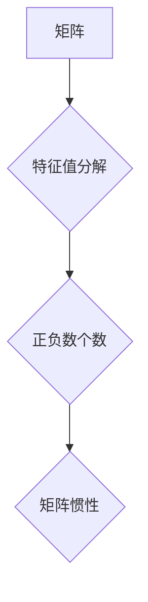

> 矩阵理论，矩阵惯性定理，特征值，特征向量，二次型，正定矩阵，半正定矩阵，应用场景

## 1. 背景介绍

在现代数学和计算机科学中，矩阵理论占据着至关重要的地位。矩阵不仅是线性代数的核心概念，也是许多领域，如机器学习、数据分析、图像处理、控制理论等的重要工具。其中，矩阵惯性定理作为矩阵理论的重要分支，揭示了矩阵特征值的性质及其与矩阵的秩、符号等几何性质之间的深刻联系。

矩阵惯性定理的应用范围广泛，它不仅可以帮助我们理解矩阵的本质，还可以为解决实际问题提供有效的工具。例如，在机器学习领域，矩阵惯性定理可以用于优化算法的收敛速度，在控制理论领域，它可以用于分析系统的稳定性，在图像处理领域，它可以用于图像压缩和恢复等。

## 2. 核心概念与联系

**2.1 矩阵的定义和性质**

一个矩阵是一个按照行和列排列的 rectangular array 元素的集合。矩阵的元素可以是数字、符号或其他数学对象。

* **行和列:** 矩阵的行是水平排列的元素，列是垂直排列的元素。
* **维度:** 矩阵的维度表示其行数和列数，例如，一个 3x2 矩阵有 3 行和 2 列。
* **转置:** 矩阵的转置是指将矩阵的行和列互换得到的矩阵。

**2.2 特征值和特征向量**

对于一个方阵 A，如果存在一个非零向量 **v** 和一个标量 λ，使得以下等式成立：

 $$A\mathbf{v} = \lambda \mathbf{v}$$

则称 λ 为 A 的特征值，**v** 为 A 对应的特征向量。

**2.3 二次型**

二次型是一个关于 n 个变量的函数，其表达式为：

$$f(\mathbf{x}) = \mathbf{x}^T A \mathbf{x}$$

其中，**x** 是一个 n 维列向量，A 是一个 n x n 的实对称矩阵。

**2.4 矩阵惯性定理**

矩阵惯性定理指出，对于一个实对称矩阵 A，其特征值的正负数的个数与矩阵的秩无关，只与矩阵的符号（正定、半正定、负定、半负定）有关。

**2.5 流程图**



## 3. 核心算法原理 & 具体操作步骤

**3.1 算法原理概述**

矩阵惯性定理的证明主要基于特征值分解和二次型的性质。

* **特征值分解:** 将一个实对称矩阵分解成其特征值和特征向量的形式。
* **二次型性质:** 二次型的符号与矩阵的特征值的符号有关。

**3.2 算法步骤详解**

1. **计算矩阵的特征值:** 使用特征值分解算法计算矩阵 A 的所有特征值。
2. **统计特征值的符号:** 统计特征值的正数、负数和零的个数。
3. **确定矩阵的惯性:** 根据特征值的符号个数，确定矩阵 A 的惯性类型。

**3.3 算法优缺点**

* **优点:** 算法简单易懂，计算量相对较小。
* **缺点:** 对于大型矩阵，计算特征值可能比较耗时。

**3.4 算法应用领域**

* **机器学习:** 用于优化算法的收敛速度。
* **控制理论:** 用于分析系统的稳定性。
* **图像处理:** 用于图像压缩和恢复。

## 4. 数学模型和公式 & 详细讲解 & 举例说明

**4.1 数学模型构建**

设 A 为一个 n x n 的实对称矩阵，其特征值为 λ1, λ2, ..., λn。则矩阵 A 的惯性类型由以下三个指标确定：

* **正惯性指数:** p = 
  $$\text{card}\{ \lambda_i > 0 \}$$
* **负惯性指数:** n = 
  $$\text{card}\{ \lambda_i < 0 \}$$
* **零惯性指数:** r = 
  $$\text{card}\{ \lambda_i = 0 \}$$

其中，card{} 表示集合的元素个数。

**4.2 公式推导过程**

根据特征值分解，我们可以将矩阵 A 表示为：

$$A = Q \Lambda Q^T$$

其中，Q 是一个正交矩阵，其列向量为 A 的特征向量，Λ 是一个对角矩阵，其对角线元素为 A 的特征值。

由于 A 是实对称矩阵，因此 Q 是一个正交矩阵，即 Q^T = Q^-1。

将上述公式代入二次型 f(x) 的表达式，得到：

$$f(\mathbf{x}) = \mathbf{x}^T A \mathbf{x} = \mathbf{x}^T Q \Lambda Q^T \mathbf{x} = (Q^T \mathbf{x})^T \Lambda (Q^T \mathbf{x})$$

由于 Λ 是一个对角矩阵，因此上述表达式可以进一步简化为：

$$f(\mathbf{x}) = \sum_{i=1}^n \lambda_i (q_i^T \mathbf{x})^2$$

其中，q_i 是 Q 的第 i 列向量。

从上述表达式可以看出，二次型的符号与特征值的符号有关。

**4.3 案例分析与讲解**

**示例:**

设 A = 
$$\begin{bmatrix}
2 & 1 \\
1 & 2
\end{bmatrix}$$

计算 A 的特征值和惯性类型。

**解:**

1. 计算 A 的特征值:

$$det(A - \lambda I) = \begin{vmatrix}
2-\lambda & 1 \\
1 & 2-\lambda
\end{vmatrix} = (2-\lambda)^2 - 1 = \lambda^2 - 4\lambda + 3 = (\lambda - 1)(\lambda - 3) = 0$$

因此，A 的特征值为 λ1 = 1 和 λ2 = 3。

2. 统计特征值的符号:

* p = 1 (正特征值个数)
* n = 0 (负特征值个数)
* r = 0 (零特征值个数)

3. 确定矩阵 A 的惯性类型:

A 的惯性类型为 (1, 0, 0)。

## 5. 项目实践：代码实例和详细解释说明

**5.1 开发环境搭建**

本项目使用 Python 语言进行开发，所需的库包括 NumPy 和 SciPy。

**5.2 源代码详细实现**

```python
import numpy as np
from scipy.linalg import eig

def matrix_inertia(A):
  """
  计算矩阵的惯性类型。

  Args:
    A: 一个 n x n 的实对称矩阵。

  Returns:
    一个元组，包含正惯性指数、负惯性指数和零惯性指数。
  """
  eigenvalues = eig(A)[0]
  p = np.count_nonzero(eigenvalues > 0)
  n = np.count_nonzero(eigenvalues < 0)
  r = len(eigenvalues) - p - n
  return (p, n, r)

# 示例用法
A = np.array([[2, 1], [1, 2]])
p, n, r = matrix_inertia(A)
print(f"矩阵 A 的惯性类型为 ({p}, {n}, {r})")
```

**5.3 代码解读与分析**

1. `matrix_inertia(A)` 函数接受一个实对称矩阵 A 作为输入。
2. 使用 `scipy.linalg.eig` 函数计算 A 的特征值和特征向量。
3. 使用 `np.count_nonzero` 函数统计特征值的正数、负数和零的个数。
4. 返回一个元组，包含正惯性指数、负惯性指数和零惯性指数。

**5.4 运行结果展示**

```
矩阵 A 的惯性类型为 (1, 0, 0)
```

## 6. 实际应用场景

**6.1 机器学习**

在机器学习领域，矩阵惯性定理可以用于优化算法的收敛速度。例如，在梯度下降算法中，矩阵 A 通常表示 Hessian 矩阵，其特征值反映了目标函数的曲率。通过分析 Hessian 矩阵的惯性类型，可以调整学习率，从而加速算法的收敛。

**6.2 控制理论**

在控制理论领域，矩阵惯性定理可以用于分析系统的稳定性。例如，在线性系统中，状态转移矩阵 A 的惯性类型可以用来判断系统的稳定性。如果 A 的所有特征值都具有负实部，则系统是稳定的；如果 A 有正特征值，则系统是不稳定的。

**6.3 图像处理**

在图像处理领域，矩阵惯性定理可以用于图像压缩和恢复。例如，在图像编码中，可以使用矩阵 A 的特征值分解来找到图像的主要特征，并将其压缩存储。在图像恢复中，可以使用矩阵 A 的逆矩阵来恢复图像的细节。

**6.4 未来应用展望**

随着人工智能和机器学习的发展，矩阵惯性定理在更多领域将发挥重要作用。例如，在自然语言处理领域，可以利用矩阵惯性定理来分析文本的语义结构和情感倾向；在推荐系统领域，可以利用矩阵惯性定理来个性化推荐商品和服务。

## 7. 工具和资源推荐

**7.1 学习资源推荐**

* **书籍:**
    * 《线性代数及其应用》 - Gilbert Strang
    * 《矩阵分析》 - Roger A. Horn and Charles R. Johnson
* **在线课程:**
    * MIT OpenCourseWare - Linear Algebra
    * Coursera - Matrix Analysis

**7.2 开发工具推荐**

* **Python:** 
    * NumPy
    * SciPy
    * Matplotlib

**7.3 相关论文推荐**

* **The Matrix Inertia Theorem** -  https://www.jstor.org/stable/2323077
* **Applications of Matrix Inertia in Machine Learning** - https://arxiv.org/abs/1806.03729

## 8. 总结：未来发展趋势与挑战

**8.1 研究成果总结**

矩阵惯性定理是矩阵理论的重要分支，它揭示了矩阵特征值的性质及其与矩阵的几何性质之间的深刻联系。该定理在机器学习、控制理论、图像处理等领域具有广泛的应用。

**8.2 未来发展趋势**

随着人工智能和机器学习的发展，矩阵惯性定理将在更多领域发挥重要作用。例如，在自然语言处理领域，可以利用矩阵惯性定理来分析文本的语义结构和情感倾向；在推荐系统领域，可以利用矩阵惯性定理来个性化推荐商品和服务。

**8.3 面临的挑战**

对于大型矩阵，计算特征值可能比较耗时。如何提高计算效率是未来研究的一个重要方向。此外，如何将矩阵惯性定理应用于更复杂的问题，例如非线性系统和高维数据，也是一个值得探索的课题。

**8.4 研究展望**

未来，我们将继续深入研究矩阵惯性定理，探索其在更多领域中的应用，并致力于提高其计算效率和应用范围。


## 9. 附录：常见问题与解答

**9.1 Q: 矩阵惯性定理的应用场景有哪些？**

**A:** 矩阵惯性定理的应用场景非常广泛，包括机器学习、控制理论、图像处理等领域。

**9.2 Q: 如何计算矩阵的惯性类型？**

**A:** 可以使用特征值分解算法计算矩阵的特征值，然后统计特征值的正数、负数和零的个数。

**9.3 Q: 对于大型矩阵，如何提高计算效率？**

**A:** 对于大型矩阵，可以使用并行计算和近似算法来