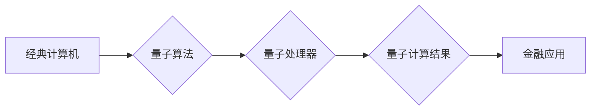

> 量子计算，金融科技，风险管理，投资策略，量子算法，量子模拟，金融市场预测

## 1. 背景介绍

金融行业一直是科技创新的前沿阵地，从传统的银行业务到现代的数字金融，科技驱动着金融行业的不断发展和变革。近年来，量子计算作为一项颠覆性的新技术，逐渐引起了金融领域的广泛关注。其强大的计算能力和独特的量子特性，为金融行业带来了前所未有的机遇，有望彻底改变金融服务、风险管理、投资策略等多个领域。

量子计算的核心在于利用量子力学原理，例如叠加和纠缠，构建出超越经典计算机的计算模型。这使得量子计算机能够解决一些经典计算机难以处理的复杂问题，例如大规模优化、模拟复杂系统等。在金融领域，这些优势可以被应用于以下几个关键方面：

* **风险管理:** 量子计算可以帮助金融机构更准确地评估和管理风险。例如，量子模拟可以用于模拟复杂的金融市场波动，帮助机构更好地预测市场风险和制定风险控制策略。
* **投资策略:** 量子算法可以帮助金融机构开发更优的投资策略。例如，量子优化算法可以帮助机构寻找最优投资组合，最大化收益并最小化风险。
* **欺诈检测:** 量子计算可以帮助金融机构更有效地识别和预防欺诈行为。例如，量子机器学习算法可以用于分析海量交易数据，识别异常交易模式并及时报警。
* **定价模型:** 量子计算可以帮助金融机构构建更精确的定价模型。例如，量子模拟可以用于模拟复杂的金融衍生品，帮助机构更准确地定价这些复杂的金融工具。

## 2. 核心概念与联系

### 2.1 量子计算基础

量子计算的核心概念是利用量子力学原理来进行计算。经典计算机使用比特来存储信息，比特可以是0或1。而量子计算机使用量子比特（qubit）来存储信息，量子比特可以处于0、1或两者叠加态。叠加态意味着量子比特可以同时代表0和1，这使得量子计算机能够并行处理大量信息，从而实现比经典计算机更快的计算速度。

此外，量子比特还具有纠缠特性。纠缠意味着两个或多个量子比特之间存在一种特殊的关联，即使它们相隔很远，改变一个量子比特的状态也会立即影响其他量子比特的状态。这种纠缠特性使得量子计算机能够进行更复杂的计算，并解决一些经典计算机无法解决的问题。

### 2.2 量子算法与金融应用

量子算法是专门为量子计算机设计的算法，能够利用量子计算机的独特特性实现更快的计算速度和更高的计算效率。一些重要的量子算法包括：

* ** Shor 算法:** 用于快速分解大整数，对加密算法构成威胁，但也可能用于加速金融交易的安全性验证。
* ** Grover 算法:** 用于加速搜索算法，可以帮助金融机构更快地找到所需的信息，例如客户数据、交易记录等。
* **量子模拟算法:** 用于模拟复杂的物理系统，例如金融市场，可以帮助金融机构更准确地预测市场波动和风险。

### 2.3 量子计算架构

量子计算架构通常由以下几个部分组成：

* **量子处理器:** 负责执行量子计算，包含大量量子比特和控制电路。
* **量子控制系统:** 用于控制量子处理器，将经典计算机的指令转换为量子操作。
* **量子软件平台:** 提供开发和运行量子算法的工具和环境。

**Mermaid 流程图**



## 3. 核心算法原理 & 具体操作步骤

### 3.1 算法原理概述

本文将重点介绍量子模拟算法在金融领域的应用。量子模拟算法利用量子计算机的特性，模拟复杂的物理系统，例如金融市场。

金融市场是一个复杂的系统，受多种因素影响，例如经济数据、政策变化、市场情绪等。这些因素相互作用，导致市场价格波动，难以预测市场走向。

传统的金融模型通常基于经典计算，难以准确模拟金融市场的复杂性。而量子模拟算法可以利用量子叠加和纠缠特性，模拟金融市场中大量资产和交易的相互作用，从而获得更准确的市场预测结果。

### 3.2 算法步骤详解

1. **构建量子模型:** 将金融市场建模为一个量子系统，每个量子比特代表一个资产或交易。
2. **定义量子操作:** 根据金融市场的规则和特征，定义相应的量子操作，例如交易、价格变化、风险评估等。
3. **运行量子模拟:** 将量子模型和量子操作输入量子处理器，运行量子模拟程序。
4. **分析量子结果:** 从量子计算结果中提取相关信息，例如资产价格波动、市场风险等，并将其转化为可理解的金融指标。

### 3.3 算法优缺点

**优点:**

* **更准确的模拟:** 量子模拟算法可以更准确地模拟金融市场的复杂性，获得更精确的市场预测结果。
* **更快的计算速度:** 量子计算机的并行计算能力可以加速金融模拟过程，提高计算效率。
* **探索新策略:** 量子模拟算法可以帮助金融机构探索新的投资策略和风险管理方法。

**缺点:**

* **技术难度高:** 量子计算技术还处于发展初期，量子算法的开发和应用需要高水平的专业知识和技术能力。
* **硬件成本高:** 量子计算机的硬件成本很高，目前还难以普及。
* **算法可解释性低:** 一些量子算法的计算过程难以理解，这可能会影响金融机构对结果的信任。

### 3.4 算法应用领域

* **风险管理:** 量子模拟可以用于模拟金融市场波动，帮助机构评估和管理风险。
* **投资策略:** 量子算法可以帮助机构开发更优的投资策略，最大化收益并最小化风险。
* **定价模型:** 量子模拟可以用于模拟复杂的金融衍生品，帮助机构更准确地定价这些金融工具。
* **欺诈检测:** 量子机器学习算法可以用于分析海量交易数据，识别异常交易模式并及时报警。

## 4. 数学模型和公式 & 详细讲解 & 举例说明

### 4.1 数学模型构建

金融市场可以被建模为一个复杂的网络，其中每个节点代表一个资产，边代表资产之间的关联关系。例如，股票A和股票B之间存在正相关关系，则它们之间存在一条边，表示股票A的价格上涨会推动股票B的价格上涨。

量子模拟金融市场时，可以使用量子网络来表示这个金融市场。每个量子比特代表一个资产，量子比特的状态代表资产的价格。量子网络中的边代表资产之间的关联关系，量子操作则模拟资产之间的相互作用，例如交易、价格变化等。

### 4.2 公式推导过程

量子模拟金融市场时，需要使用量子力学公式来描述资产之间的相互作用。例如，可以使用薛定谔方程来描述资产价格随时间的变化。

薛定谔方程是一个描述量子系统演化的微分方程，其形式如下：

$$i\hbar \frac{\partial}{\partial t} \Psi(t) = \hat{H} \Psi(t)$$

其中：

* $i$ 是虚数单位
* $\hbar$ 是约化普朗克常数
* $\Psi(t)$ 是描述量子系统的波函数
* $\hat{H}$ 是哈密顿算符，描述系统的能量

在金融市场中，哈密顿算符可以包含资产的价格、交易量、风险等因素。通过求解薛定谔方程，可以得到资产价格随时间的变化规律，从而预测市场走向。

### 4.3 案例分析与讲解

例如，我们可以使用量子模拟算法来预测股票价格的波动。首先，我们将股票市场建模为一个量子网络，每个量子比特代表一个股票。然后，我们将定义相应的量子操作，例如交易、价格变化等。最后，我们将运行量子模拟程序，并分析量子计算结果，例如股票价格的波动幅度、涨跌趋势等。

通过量子模拟，我们可以获得更准确的股票价格预测结果，并帮助投资者做出更明智的投资决策。

## 5. 项目实践：代码实例和详细解释说明

### 5.1 开发环境搭建

为了进行量子模拟金融市场项目实践，我们需要搭建一个量子计算开发环境。

* **量子计算平台:** 选择一个量子计算平台，例如IBM Quantum Experience、Google Quantum AI、Microsoft Azure Quantum等。这些平台提供量子计算资源和开发工具。
* **编程语言:** 选择一种支持量子编程的语言，例如Python、Qiskit、Cirq等。
* **软件工具:** 安装必要的软件工具，例如量子模拟器、量子算法库等。

### 5.2 源代码详细实现

以下是一个简单的量子模拟金融市场代码示例，使用Python和Qiskit库实现：

```python
from qiskit import QuantumCircuit, Aer, execute

# 创建量子电路
qc = QuantumCircuit(2, 2)

# 应用量子门
qc.h(0)
qc.cx(0, 1)

# 测量量子比特
qc.measure([0, 1], [0, 1])

# 模拟量子电路
simulator = Aer.get_backend('qasm_simulator')
job = execute(qc, simulator, shots=1024)
result = job.result()
counts = result.get_counts(qc)

# 打印测量结果
print(counts)
```

### 5.3 代码解读与分析

这段代码实现了一个简单的量子电路，模拟了两个量子比特之间的相互作用。

* `QuantumCircuit(2, 2)` 创建一个包含两个量子比特和两个经典比特的量子电路。
* `qc.h(0)` 应用Hadamard门到第一个量子比特，将它置于叠加态。
* `qc.cx(0, 1)` 应用CNOT门，将第一个量子比特的状态复制到第二个量子比特。
* `qc.measure([0, 1], [0, 1])` 测量两个量子比特，并将结果存储到经典比特中。
* `execute(qc, simulator, shots=1024)` 模拟量子电路，运行1024次测量。
* `result.get_counts(qc)` 获取测量结果，并将其打印出来。

### 5.4 运行结果展示

运行这段代码后，会输出一个字典，其中包含每个测量结果的计数。例如，如果测量结果为(0, 0)的计数为512，则表示第一个量子比特处于0态，第二个量子比特也处于0态的概率为50%。

## 6. 实际应用场景

### 6.1 风险管理

量子模拟可以帮助金融机构更准确地评估和管理风险。例如，可以模拟不同市场情景下的资产价格波动，帮助机构制定更有效的风险控制策略。

### 6.2 投资策略

量子算法可以帮助金融机构开发更优的投资策略，例如寻找最优投资组合，最大化收益并最小化风险。

### 6.3 定价模型

量子模拟可以用于模拟复杂的金融衍生品，帮助机构更准确地定价这些金融工具。

### 6.4 未来应用展望

随着量子计算技术的不断发展，其在金融领域的应用将更加广泛和深入。例如，量子计算可以用于：

* **更精准的市场预测:** 量子模拟可以模拟更复杂的金融市场因素，提供更精准的市场预测结果。
* **个性化金融服务:** 量子计算可以帮助金融机构提供更个性化的金融服务，例如定制化的投资策略和风险管理方案。
* **金融欺诈检测:** 量子机器学习算法可以帮助金融机构更有效地识别和预防金融欺诈行为。

## 7. 工具和资源推荐

### 7.1 学习资源推荐

* **Qiskit:** https://qiskit.org/
* **Cirq:** https://quantumai.google/cirq
* **PennyLane:** https://pennylane.ai/
* **IBM Quantum Experience:** https://quantum-computing.ibm.com/

### 7.2 开发工具推荐

* **Jupyter Notebook:** https://jupyter.org/
* **VS Code:** https://code.visualstudio.com/

### 7.3 相关论文推荐

* **Quantum Computing for Finance:** https