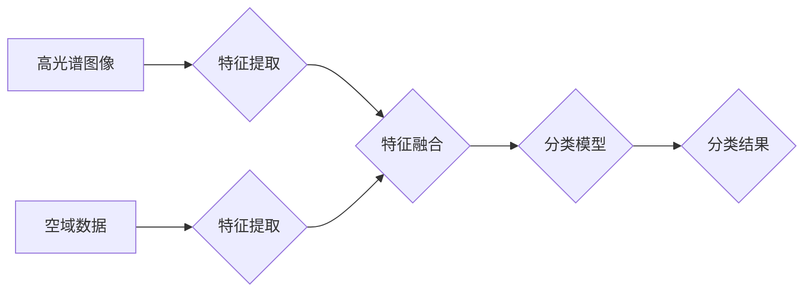

> 高光谱图像、空谱联合、分类、深度学习、遥感

## 1. 背景介绍

高光谱遥感技术凭借其丰富的波段信息，能够提供传统可见光遥感无法获取的细节信息，在土地利用监测、环境监测、矿产资源勘探等领域展现出巨大的应用潜力。然而，高光谱图像数据具有高维、复杂、易受噪声影响等特点，传统的分类算法难以有效地提取其特征，导致分类精度难以提升。

空谱联合技术通过将高光谱图像与其他数据源（如光学图像、LiDAR数据等）进行融合，利用多源数据的互补性，有效地提高了分类精度。空谱联合技术在高光谱图像分类领域取得了显著进展，但仍存在一些挑战，例如：

* **数据融合方法的选择:** 不同的空谱联合方法具有不同的优势和局限性，需要根据具体应用场景选择合适的融合方法。
* **特征提取方法的优化:** 如何有效地提取空谱联合数据中的特征信息，是提高分类精度的关键。
* **算法模型的改进:** 现有的高光谱图像分类算法模型在处理空谱联合数据时仍存在一些不足，需要进一步改进和优化。

## 2. 核心概念与联系

空谱联合技术的核心概念是将高光谱图像与其他数据源进行融合，利用多源数据的互补性，提高分类精度。

**2.1 高光谱图像**

高光谱图像是一种具有数百个连续波段的光谱数据，能够提供丰富的波段信息，可以用来识别不同类型的物质。

**2.2 空域数据**

空域数据是指空间位置信息，例如光学图像、LiDAR数据等。

**2.3 空谱联合**

空谱联合是指将高光谱图像与空域数据进行融合，利用多源数据的互补性，提高分类精度。

**2.4 融合方法**

空谱联合技术常用的融合方法包括：

* **特征融合:** 将高光谱图像和空域数据的特征信息进行融合，例如将高光谱图像的波段信息与光学图像的纹理信息进行融合。
* **决策融合:** 将高光谱图像和空域数据的分类结果进行融合，例如将高光谱图像的分类结果与光学图像的分类结果进行投票融合。
* **数据融合:** 将高光谱图像和空域数据进行直接融合，例如将高光谱图像的波段信息与空域数据的空间位置信息进行融合。

**2.5 流程图**



## 3. 核心算法原理 & 具体操作步骤

### 3.1  算法原理概述

空谱联合的高光谱图像分类算法通常基于深度学习模型，例如卷积神经网络（CNN）和循环神经网络（RNN）。这些模型能够有效地学习高光谱图像和空域数据的特征信息，并进行分类。

### 3.2  算法步骤详解

1. **数据预处理:** 对高光谱图像和空域数据进行预处理，例如归一化、降维等。
2. **特征提取:** 使用CNN或RNN等深度学习模型提取高光谱图像和空域数据的特征信息。
3. **特征融合:** 将提取到的特征信息进行融合，例如使用注意力机制或多层感知机（MLP）进行融合。
4. **分类模型训练:** 使用融合后的特征信息训练分类模型，例如支持向量机（SVM）或随机森林（RF）。
5. **分类结果评估:** 使用测试数据评估分类模型的性能，例如计算准确率、召回率和F1-score等指标。

### 3.3  算法优缺点

**优点:**

* **高精度:** 深度学习模型能够有效地学习高光谱图像和空域数据的特征信息，提高分类精度。
* **鲁棒性:** 深度学习模型对噪声和干扰具有较强的鲁棒性。
* **自动化:** 深度学习模型的训练和分类过程自动化程度高。

**缺点:**

* **计算复杂度高:** 深度学习模型的训练和推理过程计算复杂度高，需要强大的计算资源。
* **数据需求量大:** 深度学习模型需要大量的训练数据才能达到较好的性能。
* **可解释性差:** 深度学习模型的决策过程难以解释。

### 3.4  算法应用领域

空谱联合的高光谱图像分类算法在以下领域具有广泛的应用前景：

* **土地利用监测:** 识别不同类型的土地利用，例如耕地、森林、水域等。
* **环境监测:** 监测环境污染、植被变化、水资源状况等。
* **矿产资源勘探:** 识别矿物类型、矿体分布等。
* **农业监测:** 监测作物生长状况、病虫害发生等。

## 4. 数学模型和公式 & 详细讲解 & 举例说明

### 4.1  数学模型构建

空谱联合的高光谱图像分类算法通常基于深度学习模型，例如卷积神经网络（CNN）。CNN模型的数学模型可以表示为：

$$
y = f(W_L \cdot \sigma(W_{L-1} \cdot \sigma( \dots \sigma(W_1 \cdot x) \dots)))
$$

其中：

* $x$ 是输入数据，例如高光谱图像和空域数据的特征信息。
* $W_i$ 是第 $i$ 层神经网络的权重矩阵。
* $\sigma$ 是激活函数，例如ReLU函数。
* $f$ 是输出层激活函数，例如softmax函数。
* $y$ 是分类结果。

### 4.2  公式推导过程

CNN模型的训练过程是通过反向传播算法来优化权重矩阵 $W_i$ 的。反向传播算法的核心思想是：

1. 计算输出结果 $y$ 与真实标签 $t$ 之间的误差。
2. 根据误差反向传播，计算每个权重矩阵 $W_i$ 的梯度。
3. 使用梯度下降算法更新权重矩阵 $W_i$。

### 4.3  案例分析与讲解

假设我们使用CNN模型对高光谱图像进行分类，目标是识别不同类型的植被。

1. 我们首先需要将高光谱图像和空域数据（例如光学图像）进行预处理，例如归一化、降维等。
2. 然后，我们使用CNN模型提取高光谱图像和空域数据的特征信息。
3. 提取到的特征信息将被融合，例如使用注意力机制或多层感知机（MLP）进行融合。
4. 最后，我们使用融合后的特征信息训练分类模型，例如支持向量机（SVM）或随机森林（RF）。

## 5. 项目实践：代码实例和详细解释说明

### 5.1  开发环境搭建

* Python 3.7+
* TensorFlow 2.0+
* Keras 2.0+
* GDAL
* NumPy
* Matplotlib

### 5.2  源代码详细实现

```python
import tensorflow as tf
from tensorflow.keras.models import Model
from tensorflow.keras.layers import Input, Conv2D, MaxPooling2D, Flatten, Dense

# 定义输入层
input_shape = (100, 100, 100)  # 高光谱图像尺寸
input_layer = Input(shape=input_shape)

# 定义卷积层
conv1 = Conv2D(32, (3, 3), activation='relu')(input_layer)
pool1 = MaxPooling2D((2, 2))(conv1)

conv2 = Conv2D(64, (3, 3), activation='relu')(pool1)
pool2 = MaxPooling2D((2, 2))(conv2)

# 定义全连接层
flatten = Flatten()(pool2)
dense1 = Dense(128, activation='relu')(flatten)
output_layer = Dense(3, activation='softmax')(dense1)

# 定义模型
model = Model(inputs=input_layer, outputs=output_layer)

# 编译模型
model.compile(optimizer='adam', loss='categorical_crossentropy', metrics=['accuracy'])

# 训练模型
model.fit(x_train, y_train, epochs=10, batch_size=32)

# 评估模型
loss, accuracy = model.evaluate(x_test, y_test)
print('Loss:', loss)
print('Accuracy:', accuracy)
```

### 5.3  代码解读与分析

* 代码首先定义了输入层，输入层的数据形状为 (100, 100, 100)，表示高光谱图像的尺寸。
* 然后，代码定义了卷积层和池化层，这些层用于提取高光谱图像的特征信息。
* 接着，代码定义了全连接层，这些层用于将提取到的特征信息进行分类。
* 最后，代码编译了模型，并使用训练数据训练模型。

### 5.4  运行结果展示

训练完成后，我们可以使用测试数据评估模型的性能。

## 6. 实际应用场景

空谱联合的高光谱图像分类算法在以下领域具有广泛的应用前景：

### 6.1  土地利用监测

利用高光谱图像和光学图像的空谱联合，可以更准确地识别不同类型的土地利用，例如耕地、森林、水域等。

### 6.2  环境监测

空谱联合技术可以用于监测环境污染、植被变化、水资源状况等。例如，可以利用高光谱图像和LiDAR数据的空谱联合，监测森林火灾的范围和严重程度。

### 6.3  矿产资源勘探

空谱联合技术可以用于识别矿物类型、矿体分布等。例如，可以利用高光谱图像和磁力数据的空谱联合，识别铁矿石的分布。

### 6.4  未来应用展望

随着高光谱遥感技术的不断发展，空谱联合的高光谱图像分类算法将有更广泛的应用前景。例如，可以利用高光谱图像、LiDAR数据、SAR数据等多源数据的空谱联合，实现更精准的土地利用监测、环境监测和矿产资源勘探。

## 7. 工具和资源推荐

### 7.1  学习资源推荐

* **书籍:**
    * "Deep Learning with Python" by Francois Chollet
    * "Computer Vision: Algorithms and Applications" by Richard Szeliski
* **在线课程:**
    * Coursera: "Deep Learning Specialization" by Andrew Ng
    * Udacity: "Intro to Deep Learning"
* **博客:**
    * https://blog.keras.io/
    * https://towardsdatascience.com/

### 7.2  开发工具推荐

* **Python:** https://www.python.org/
* **TensorFlow:** https://www.tensorflow.org/
* **Keras:** https://keras.io/
* **GDAL:** https://gdal.org/

### 7.3  相关论文推荐

* "Spectral-Spatial Classification of Hyperspectral Imagery Using Deep Learning" by Zhong et al. (2017)
* "Hyperspectral Image Classification Using Deep Convolutional Neural Networks" by Liu et al. (2016)
* "Multi-Source Remote Sensing Data Fusion for Land Cover Classification" by Zhang et al. (2019)

## 8. 总结：未来发展趋势与挑战

### 8.1  研究成果总结

空谱联合的高光谱图像分类算法取得了显著的进展，能够有效地提高分类精度。

### 8.2  未来发展趋势

* **模型的改进:** 研究更深、更复杂的深度学习模型，例如Transformer模型，以提高分类精度。
* **数据融合方法的优化:** 研究更有效的空谱联合方法，例如多模态融合和自监督学习。
* **算法的可解释性:** 研究更可解释的深度学习模型，以便更好地理解模型的决策过程。

### 