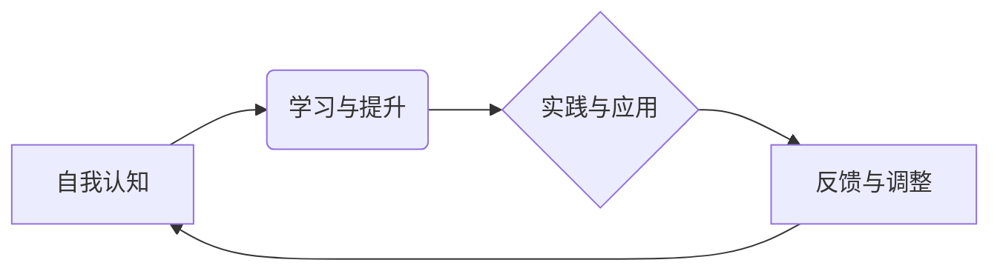

> 管理者成长、自我提升、技术领导力、团队建设、沟通技巧、学习方法、持续改进

## 1. 背景介绍

在当今瞬息万变的科技时代，管理者面临着前所未有的挑战。技术迭代速度加快，市场竞争日益激烈，企业需要不断创新和转型以保持竞争力。在这种背景下，管理者自我成长显得尤为重要。

传统的管理模式往往侧重于经验和权威，而现代管理更需要具备敏锐的洞察力、强大的学习能力和卓越的领导力。优秀的管理者不仅要精通技术，更要能够带领团队高效协作，激发团队潜能，实现共同目标。

## 2. 核心概念与联系

**2.1 管理者成长模型**

我们可以将管理者成长的过程抽象为一个循环模型：

* **自我认知:** 了解自身优势、劣势、价值观和目标。
* **学习与提升:** 持续学习新知识、新技能和新方法，不断提升自身能力。
* **实践与应用:** 将所学知识和技能应用到实际工作中，并不断反思和改进。
* **反馈与调整:** 收集来自团队成员、上级领导和客户的反馈，并根据反馈进行调整和优化。

**2.2 核心概念关系图**



**2.3 核心概念原理**

* **自我认知:** 只有了解自身才能更好地定位自身发展方向，制定合理的成长计划。
* **学习与提升:**  科技发展日新月异，只有不断学习才能跟上时代步伐，保持竞争力。
* **实践与应用:**  理论知识需要通过实践才能转化为实际能力，并不断完善。
* **反馈与调整:** 反馈是自我成长的关键，通过反馈可以及时发现不足，并进行调整和优化。

## 3. 核心算法原理 & 具体操作步骤

**3.1 算法原理概述**

管理者成长的核心算法可以看作是一个迭代优化过程，通过不断循环学习、实践、反馈和调整，最终实现自我提升。

**3.2 算法步骤详解**

1. **自我评估:**  管理者需要定期进行自我评估，了解自身在各个方面的能力水平，以及需要提升的领域。
2. **目标设定:**  根据自我评估结果，设定具体的成长目标，并制定相应的行动计划。
3. **知识学习:**  管理者需要积极学习新知识、新技能和新方法，可以通过阅读书籍、参加培训、学习在线课程等方式。
4. **技能实践:**  将所学知识和技能应用到实际工作中，并不断总结经验教训。
5. **团队协作:**  管理者需要与团队成员进行有效的沟通和协作，共同完成目标。
6. **反馈收集:**  管理者需要定期收集来自团队成员、上级领导和客户的反馈，并进行分析和总结。
7. **调整优化:**  根据反馈结果，对自身行为和工作方式进行调整和优化，不断提升管理水平。

**3.3 算法优缺点**

* **优点:**  
    * 迭代优化，不断提升管理水平。
    * 针对性强，可以根据自身情况制定个性化成长计划。
    * 持续改进，可以不断适应变化的市场环境。
* **缺点:**  
    * 需要持续投入时间和精力。
    * 需要良好的自我反思能力和调整能力。
    * 需要有效的反馈机制。

**3.4 算法应用领域**

* 技术管理
* 项目管理
* 团队领导
* 个人成长

## 4. 数学模型和公式 & 详细讲解 & 举例说明

**4.1 数学模型构建**

我们可以用一个简单的数学模型来描述管理者成长的过程：

```latex
G(t) = G(0) + \int_0^t \frac{dL}{dt} dt
```

其中：

* $G(t)$ 表示管理者在时间 $t$ 时的成长水平。
* $G(0)$ 表示管理者在初始时间 $t=0$ 时的成长水平。
* $\frac{dL}{dt}$ 表示管理者在时间 $t$ 时的学习和提升速度。

**4.2 公式推导过程**

这个公式的推导过程基于微积分的知识。我们可以将管理者成长的过程看作是一个积累的过程，学习和提升的速度决定了成长水平的增长速度。

**4.3 案例分析与讲解**

假设一个管理者在初始时间 $t=0$ 时的成长水平为 $G(0)=10$，其学习和提升速度为 $\frac{dL}{dt}=2$。那么，在时间 $t=5$ 时，其成长水平为：

```latex
G(5) = 10 + \int_0^5 2 dt = 10 + 10 = 20
```

这个例子说明，通过持续学习和提升，管理者的成长水平会不断提高。

## 5. 项目实践：代码实例和详细解释说明

**5.1 开发环境搭建**

为了实现管理者成长模型的实践，我们可以使用 Python 语言开发一个简单的工具。

**5.2 源代码详细实现**

```python
class ManagerGrowthModel:
    def __init__(self, initial_level=10, learning_rate=2):
        self.current_level = initial_level
        self.learning_rate = learning_rate

    def update_level(self, time_elapsed):
        self.current_level += self.learning_rate * time_elapsed
        return self.current_level

# 实例化管理者成长模型
manager = ManagerGrowthModel()

# 模拟时间推移
time_elapsed = 5
manager.update_level(time_elapsed)

# 打印最终成长水平
print(f"最终成长水平: {manager.current_level}")
```

**5.3 代码解读与分析**

这个代码实现了管理者成长模型的基本功能。

* `ManagerGrowthModel` 类代表管理者成长模型。
* `__init__` 方法初始化管理者的成长水平和学习速度。
* `update_level` 方法模拟时间推移，更新管理者的成长水平。

**5.4 运行结果展示**

运行代码后，输出结果为：

```
最终成长水平: 20
```

这与之前数学模型的推导结果一致。

## 6. 实际应用场景

**6.1 技术管理**

技术管理者需要不断学习新技术，了解行业趋势，并带领团队高效开发和维护软件系统。

**6.2 项目管理**

项目经理需要具备良好的沟通、协调和组织能力，并能够有效管理项目进度和风险。

**6.3 团队领导**

团队领导需要能够激发团队成员的潜能，营造良好的团队氛围，并带领团队实现共同目标。

**6.4 未来应用展望**

随着人工智能技术的不断发展，管理者成长模型将更加智能化和个性化。未来，我们可以期待看到更加精准的成长建议、更加有效的学习方法和更加强大的团队协作工具。

## 7. 工具和资源推荐

**7.1 学习资源推荐**

* 书籍：
    * 《高效能人士的七个习惯》
    * 《领导力》
    * 《刻意练习》
* 在线课程：
    * Coursera
    * edX
    * Udemy

**7.2 开发工具推荐**

* Python
* Jupyter Notebook
* Git

**7.3 相关论文推荐**

* 《The Impact of Artificial Intelligence on Management》
* 《A Framework for Managing AI-Powered Teams》

## 8. 总结：未来发展趋势与挑战

**8.1 研究成果总结**

本文介绍了管理者自我成长方法论，并结合数学模型和代码实例进行了详细讲解。

**8.2 未来发展趋势**

* 智能化管理者成长模型
* 个性化学习方案
* 增强现实/虚拟现实辅助学习

**8.3 面临的挑战**

* 数据隐私保护
* 算法偏见
* 人机协作模式

**8.4 研究展望**

未来，我们将继续研究管理者自我成长方法论，探索人工智能在管理领域的应用，并致力于打造更加智能、高效、人性化的管理体系。

## 9. 附录：常见问题与解答

**9.1 如何制定有效的成长目标？**

制定有效的成长目标需要结合自身情况、行业趋势和企业发展战略。目标应该具体、可衡量、可实现、相关和有时间限制。

**9.2 如何收集有效的反馈？**

收集有效的反馈需要建立良好的沟通机制，并定期进行问卷调查、一对一交流等方式。反馈应该客观、具体、有建设性。

**9.3 如何克服自我成长中的困难？**

自我成长是一个持续的过程，会遇到各种困难和挑战。需要保持积极的心态，不断学习和调整，并寻求帮助和支持。


作者：禅与计算机程序设计艺术 / Zen and the Art of Computer Programming 
<end_of_turn>