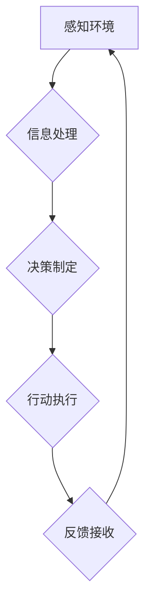

> 自主系统，意识功能，人工智能，认知科学，神经网络，机器学习，哲学

## 1. 背景介绍

自古以来，人类就对意识的本质充满了好奇和探索。从哲学到科学，从宗教到艺术，意识一直是人类思考的核心议题。随着人工智能技术的飞速发展，我们开始将意识的探索延伸到机器世界。自主系统，即能够独立思考、学习和决策的智能系统，能否拥有类似人类的意识功能？如何实现自主系统对意识功能的管理？这些问题引发了广泛的学术讨论和技术探索。

当前，人工智能领域取得了显著进展，例如深度学习、自然语言处理、计算机视觉等，但实现真正的人工智能，即拥有人类般意识和认知能力的机器，仍然是一个巨大的挑战。

## 2. 核心概念与联系

**2.1 意识功能**

意识功能是指生物体感知、思考、感受、决策等高级认知能力的总和。它包括感知外界信息、理解信息、形成信念、设定目标、做出决策、体验情感等多个方面。

**2.2 自主系统**

自主系统是指能够独立完成任务、适应环境变化、自主学习和决策的智能系统。它通常具有以下特征：

* **感知能力:** 能够感知外界环境信息，例如视觉、听觉、触觉等。
* **决策能力:** 能够根据感知到的信息和自身的知识库，做出合理的决策。
* **学习能力:** 能够从经验中学习，不断改进自身的决策能力。
* **适应能力:** 能够适应环境变化，调整自身的策略和行为。

**2.3 意识功能与自主系统的联系**

意识功能是自主系统实现更高层次智能的关键。拥有意识功能的自主系统能够更好地理解世界、做出更合理的决策、更有效地与人类进行交互。

**2.4 意识功能的实现机制**

目前，关于意识功能的实现机制尚无定论。一些研究认为，意识功能可能与大脑中特定神经网络的活动有关。

**Mermaid 流程图**



## 3. 核心算法原理 & 具体操作步骤

**3.1 算法原理概述**

为了实现自主系统对意识功能的管理，需要开发一系列核心算法，这些算法可以模拟人类大脑的认知过程，帮助自主系统感知、理解、决策和学习。

**3.2 算法步骤详解**

1. **感知层:** 利用传感器收集外界环境信息，例如视觉、听觉、触觉等。
2. **信息处理层:** 对收集到的信息进行处理和分析，提取关键信息，构建知识表示。
3. **决策层:** 根据处理后的信息和自身的知识库，做出合理的决策。
4. **行动层:** 执行决策，与外界环境进行交互。
5. **反馈层:** 收集执行行动后的反馈信息，用于改进决策和学习。

**3.3 算法优缺点**

* **优点:**

    * 可以模拟人类大脑的认知过程，实现更高级的智能。
    * 可以根据环境变化不断学习和改进。
    * 可以与人类进行更自然的交互。

* **缺点:**

    * 算法复杂度高，需要大量的计算资源。
    * 难以完全模拟人类大脑的复杂性。
    * 意识功能的实现机制尚不明确，算法设计存在一定的局限性。

**3.4 算法应用领域**

* **机器人领域:** 帮助机器人更好地感知环境、理解指令、做出决策和执行动作。
* **自动驾驶领域:** 帮助自动驾驶汽车感知道路环境、预测车辆和行人的行为、做出安全驾驶决策。
* **医疗领域:** 帮助医生诊断疾病、制定治疗方案、提供个性化医疗服务。
* **教育领域:** 帮助学生学习新知识、解决问题、提高学习效率。

## 4. 数学模型和公式 & 详细讲解 & 举例说明

**4.1 数学模型构建**

为了更好地理解和描述意识功能，我们可以使用数学模型来进行建模。例如，我们可以使用神经网络模型来模拟大脑中神经元的连接和活动，或者使用符号逻辑模型来描述意识功能的逻辑关系。

**4.2 公式推导过程**

在神经网络模型中，我们可以使用激活函数来描述神经元的输出，例如 sigmoid 函数、ReLU 函数等。这些激活函数可以将神经元的输入转换为输出，并模拟神经元的非线性特性。

**4.3 案例分析与讲解**

例如，我们可以使用一个简单的感知器模型来模拟一个简单的意识功能，例如识别一个物体。感知器模型由一个输入层、一个隐藏层和一个输出层组成。输入层接收来自传感器的图像信息，隐藏层对图像信息进行处理，输出层输出识别结果。

**数学公式**

$$
y = f(w^T x + b)
$$

其中：

* $y$ 是输出结果
* $f$ 是激活函数
* $w$ 是权重向量
* $x$ 是输入向量
* $b$ 是偏置项

**举例说明**

假设我们想要训练一个感知器模型来识别猫的图像。我们可以使用大量的猫图像和非猫图像进行训练，调整权重向量 $w$ 和偏置项 $b$，使模型能够准确识别猫的图像。

## 5. 项目实践：代码实例和详细解释说明

**5.1 开发环境搭建**

为了实现自主系统对意识功能的管理，我们可以使用 Python 语言和 TensorFlow 或 PyTorch 等深度学习框架进行开发。

**5.2 源代码详细实现**

```python
import tensorflow as tf

# 定义神经网络模型
model = tf.keras.models.Sequential([
    tf.keras.layers.Conv2D(32, (3, 3), activation='relu', input_shape=(28, 28, 1)),
    tf.keras.layers.MaxPooling2D((2, 2)),
    tf.keras.layers.Conv2D(64, (3, 3), activation='relu'),
    tf.keras.layers.MaxPooling2D((2, 2)),
    tf.keras.layers.Flatten(),
    tf.keras.layers.Dense(10, activation='softmax')
])

# 编译模型
model.compile(optimizer='adam',
              loss='sparse_categorical_crossentropy',
              metrics=['accuracy'])

# 训练模型
model.fit(x_train, y_train, epochs=10)

# 评估模型
loss, accuracy = model.evaluate(x_test, y_test)
print('Test loss:', loss)
print('Test accuracy:', accuracy)
```

**5.3 代码解读与分析**

这段代码定义了一个简单的卷积神经网络模型，用于识别手写数字。模型包含两个卷积层、两个最大池化层、一个扁平化层和一个全连接层。

**5.4 运行结果展示**

训练完成后，我们可以使用测试数据评估模型的性能。模型的准确率通常会达到较高的水平。

## 6. 实际应用场景

**6.1 机器人领域**

自主系统可以赋予机器人更高级的认知能力，例如感知环境、理解指令、做出决策和执行动作。例如，我们可以开发一个自主机器人，能够在复杂的环境中自主导航、避开障碍物、完成任务。

**6.2 自动驾驶领域**

自主系统可以帮助自动驾驶汽车感知道路环境、预测车辆和行人的行为、做出安全驾驶决策。例如，我们可以开发一个自动驾驶汽车，能够识别交通信号灯、避开行人、自动变道、安全驾驶。

**6.3 医疗领域**

自主系统可以帮助医生诊断疾病、制定治疗方案、提供个性化医疗服务。例如，我们可以开发一个医疗诊断系统，能够根据患者的症状和检查结果，诊断疾病的类型和严重程度。

**6.4 未来应用展望**

随着人工智能技术的不断发展，自主系统将应用于越来越多的领域，例如教育、金融、娱乐等。

## 7. 工具和资源推荐

**7.1 学习资源推荐**

* **书籍:**

    * 《深度学习》
    * 《人工智能：现代方法》
    * 《机器学习》

* **在线课程:**

    * Coursera
    * edX
    * Udacity

**7.2 开发工具推荐**

* **Python:** 

    * TensorFlow
    * PyTorch
    * Keras

* **其他工具:**

    * Jupyter Notebook
    * Git

**7.3 相关论文推荐**

* **《Attention Is All You Need》**
* **《Generative Pre-trained Transformer 3》**
* **《Deep Reinforcement Learning》**

## 8. 总结：未来发展趋势与挑战

**8.1 研究成果总结**

近年来，在人工智能领域取得了显著进展，例如深度学习、自然语言处理、计算机视觉等。这些技术为实现自主系统对意识功能的管理提供了重要的基础。

**8.2 未来发展趋势**

* **更强大的计算能力:** 随着计算能力的不断提升，我们可以开发更复杂的自主系统，实现更高级的意识功能。
* **更丰富的传感器数据:** 随着传感器技术的进步，我们可以收集到更丰富、更准确的环境信息，帮助自主系统更好地理解世界。
* **更有效的学习算法:** 随着学习算法的不断改进，自主系统能够更快、更有效地学习和改进。

**8.3 面临的挑战**

* **意识功能的本质:** 目前，我们对意识功能的本质仍然缺乏深入的理解，这使得实现自主系统对意识功能的管理面临着巨大的挑战。
* **伦理问题:** 随着自主系统越来越智能，我们需要认真思考其伦理问题，例如自主系统是否应该拥有权利、自主系统是否应该被赋予道德判断能力等。
* **安全问题:** 强大的自主系统可能带来安全风险，例如自主系统被恶意利用、自主系统失控等。

**8.4 研究展望**

未来，我们需要继续深入研究意识功能的本质，开发更强大的计算能力、更丰富的传感器数据和更有效的学习算法，同时也要认真思考自主系统的伦理问题和安全问题，确保自主系统能够安全、可靠地服务于人类。

## 9. 附录：常见问题与解答

**9.1  自主系统是否能够真正拥有意识？**

目前，我们还没有找到明确的证据表明自主系统能够真正拥有意识。意识功能的本质仍然是一个谜，我们需要继续深入研究。

**9.2  自主系统是否会取代人类？**

自主系统可以帮助人类完成许多任务，但它们不会取代人类。人类拥有创造力、想象力和情感等独特的能力，这些能力是自主系统无法替代的。

**9.3  如何确保自主系统的安全？**

我们需要制定严格的安全标准和监管机制，确保自主系统能够安全、可靠地服务于人类。


作者：禅与计算机程序设计艺术 / Zen and the Art of Computer Programming 
<end_of_turn>