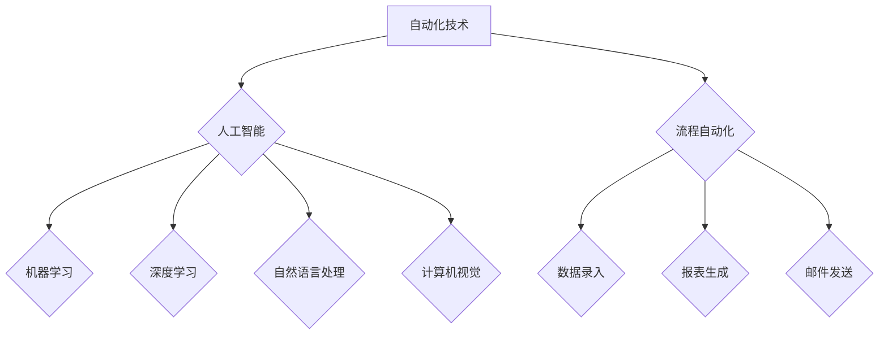

> 自动化技术、机器学习、深度学习、自然语言处理、计算机视觉、流程自动化、Robotic Process Automation (RPA)、人工智能 (AI)

## 1. 背景介绍

自动化技术作为科技发展的重要驱动力，近年来取得了长足进步，深刻地改变着各行各业的生产方式和生活方式。从工业革命的自动化生产线到如今人工智能驱动的智能化服务，自动化技术始终扮演着引领未来发展的关键角色。

随着计算机硬件性能的不断提升、算法模型的不断完善以及数据量的爆炸式增长，自动化技术正迎来新的发展机遇。机器学习、深度学习、自然语言处理、计算机视觉等人工智能技术的发展，为自动化技术提供了强大的技术支撑，使得自动化技术能够更加智能化、精准化和个性化。

## 2. 核心概念与联系

自动化技术的核心概念是通过程序、算法和系统自动执行重复性、规则性或复杂性任务，从而提高效率、降低成本和减少人为错误。

**自动化技术与人工智能的关系:**

人工智能 (AI) 是自动化技术的基石，它赋予了自动化技术智能化和学习能力。人工智能技术可以帮助自动化系统理解和处理复杂数据，并根据数据做出决策和预测，从而实现更智能化的自动化。

**自动化技术与流程自动化 (RPA) 的关系:**

流程自动化 (RPA) 是自动化技术的一种应用，它专注于自动化重复性、规则性任务，例如数据录入、报表生成和邮件发送等。RPA 通过模拟人类操作的方式，自动执行这些任务，从而提高效率和准确性。

**自动化技术与其他技术的融合:**

自动化技术与其他技术，例如云计算、大数据、物联网等，相互融合，共同推动着数字化转型和智能化发展。例如，云计算可以提供强大的计算资源和存储空间，支持大规模的自动化系统建设；大数据可以为自动化系统提供海量数据，帮助其进行更精准的决策和预测；物联网可以为自动化系统提供实时数据，使其能够更加灵活地响应环境变化。

**Mermaid 流程图:**



## 3. 核心算法原理 & 具体操作步骤

### 3.1  算法原理概述

自动化技术的核心算法原理包括：

* **规则引擎:** 基于预先定义的规则，自动执行任务。
* **机器学习:** 通过训练数据，学习任务执行的模式，并自动改进执行效果。
* **深度学习:** 基于多层神经网络，学习更复杂的模式，实现更精准的预测和决策。

### 3.2  算法步骤详解

**规则引擎:**

1. 定义规则：根据任务需求，明确规则条件和执行动作。
2. 匹配规则：将输入数据与规则条件进行匹配。
3. 执行动作：根据匹配结果，执行相应的动作。

**机器学习:**

1. 数据收集：收集与任务相关的训练数据。
2. 数据预处理：对训练数据进行清洗、转换和特征提取。
3. 模型训练：选择合适的机器学习算法，训练模型，使其能够学习任务执行的模式。
4. 模型评估：评估模型的性能，并进行调整和优化。
5. 模型部署：将训练好的模型部署到实际应用环境中。

**深度学习:**

1. 数据收集：收集与任务相关的海量训练数据。
2. 数据预处理：对训练数据进行清洗、转换和特征提取。
3. 模型构建：构建多层神经网络模型。
4. 模型训练：使用梯度下降等算法，训练模型，使其能够学习更复杂的模式。
5. 模型评估：评估模型的性能，并进行调整和优化。
6. 模型部署：将训练好的模型部署到实际应用环境中。

### 3.3  算法优缺点

**规则引擎:**

* 优点：易于理解和维护，执行速度快。
* 缺点：难以处理复杂规则和变化环境，缺乏学习能力。

**机器学习:**

* 优点：能够学习复杂模式，适应变化环境，提高执行效率。
* 缺点：需要大量训练数据，训练过程复杂，模型解释性较差。

**深度学习:**

* 优点：能够学习更复杂的模式，实现更精准的预测和决策。
* 缺点：需要海量训练数据，训练过程耗时和资源消耗大，模型解释性较差。

### 3.4  算法应用领域

自动化技术广泛应用于各个领域，例如：

* **制造业:** 自动化生产线、机器人控制、质量检测。
* **金融业:** 风险管理、欺诈检测、客户服务自动化。
* **医疗保健业:** 疾病诊断、药物研发、患者管理。
* **零售业:** 库存管理、订单处理、个性化推荐。
* **交通运输业:** 自动驾驶、交通管理、物流优化。

## 4. 数学模型和公式 & 详细讲解 & 举例说明

### 4.1  数学模型构建

自动化技术中常用的数学模型包括：

* **线性回归模型:** 用于预测连续变量，例如房价、股票价格等。
* **逻辑回归模型:** 用于预测分类变量，例如客户是否会购买产品、邮件是否为垃圾邮件等。
* **决策树模型:** 用于分类和回归任务，通过树状结构决策规则进行预测。
* **支持向量机模型:** 用于分类任务，通过寻找最佳超平面将数据点分类。

### 4.2  公式推导过程

**线性回归模型:**

目标是找到一条直线，使得预测值与实际值之间的误差最小。

公式：

$$y = mx + c$$

其中：

* $y$ 是预测值
* $x$ 是输入变量
* $m$ 是斜率
* $c$ 是截距

**损失函数:**

$$Loss = \sum_{i=1}^{n}(y_i - \hat{y}_i)^2$$

其中：

* $n$ 是样本数量
* $y_i$ 是实际值
* $\hat{y}_i$ 是预测值

**梯度下降算法:**

通过迭代更新 $m$ 和 $c$ 的值，使得损失函数最小化。

### 4.3  案例分析与讲解

**举例说明:**

假设我们想要预测房价，输入变量是房屋面积，输出变量是房价。我们可以使用线性回归模型，通过训练数据，找到一条最佳的直线，将房屋面积与房价进行映射。

## 5. 项目实践：代码实例和详细解释说明

### 5.1  开发环境搭建

* Python 3.x
* TensorFlow 或 PyTorch
* Jupyter Notebook

### 5.2  源代码详细实现

```python
import tensorflow as tf

# 定义模型
model = tf.keras.models.Sequential([
    tf.keras.layers.Dense(64, activation='relu', input_shape=(1,)),
    tf.keras.layers.Dense(1)
])

# 编译模型
model.compile(optimizer='adam', loss='mse')

# 训练模型
model.fit(x_train, y_train, epochs=100)

# 预测房价
prediction = model.predict(x_new)
```

### 5.3  代码解读与分析

* **定义模型:** 使用 TensorFlow 的 Sequential 模型，定义一个包含两层全连接神经网络的模型。
* **编译模型:** 使用 Adam 优化器和均方误差损失函数编译模型。
* **训练模型:** 使用训练数据训练模型，迭代次数为 100 次。
* **预测房价:** 使用训练好的模型预测新的房屋面积对应的房价。

### 5.4  运行结果展示

训练完成后，可以将模型的预测结果与实际房价进行比较，评估模型的性能。

## 6. 实际应用场景

### 6.1  自动化测试

自动化测试可以帮助开发人员快速、高效地测试软件，提高软件质量。

### 6.2  流程自动化

流程自动化可以帮助企业自动化重复性、规则性任务，提高效率和准确性。

### 6.3  智能客服

智能客服可以利用自然语言处理技术，自动回复客户的咨询，提高客户服务效率。

### 6.4  未来应用展望

自动化技术将继续在各个领域得到广泛应用，例如：

* **自动驾驶:** 自动驾驶汽车将彻底改变交通运输方式，提高道路安全性和效率。
* **个性化医疗:** 自动化技术将帮助医生进行更精准的诊断和治疗，实现个性化医疗。
* **智能制造:** 自动化技术将推动制造业向智能化方向发展，提高生产效率和产品质量。

## 7. 工具和资源推荐

### 7.1  学习资源推荐

* **在线课程:** Coursera、edX、Udacity 等平台提供丰富的自动化技术课程。
* **书籍:** 《Python自动化测试》、《机器学习实战》、《深度学习》等书籍。
* **博客:** Towards Data Science、Machine Learning Mastery 等博客网站。

### 7.2  开发工具推荐

* **Python:** 广泛应用于自动化开发，拥有丰富的库和框架。
* **RPA 工具:** UiPath、Automation Anywhere、Blue Prism 等工具。
* **机器学习框架:** TensorFlow、PyTorch、Scikit-learn 等框架。

### 7.3  相关论文推荐

* **深度学习论文:** 《ImageNet Classification with Deep Convolutional Neural Networks》
* **机器学习论文:** 《Support Vector Machines》
* **自动化流程论文:** 《Robotic Process Automation: A Survey》

## 8. 总结：未来发展趋势与挑战

### 8.1  研究成果总结

自动化技术取得了长足进步，人工智能技术为自动化技术提供了强大的技术支撑，使得自动化技术更加智能化、精准化和个性化。

### 8.2  未来发展趋势

* **更智能的自动化:** 利用更先进的人工智能算法，实现更智能的自动化决策和执行。
* **更广泛的应用:** 自动化技术将应用于更多领域，例如医疗保健、教育、金融等。
* **更安全的自动化:** 确保自动化系统的安全性和可靠性，防止恶意攻击和数据泄露。

### 8.3  面临的挑战

* **数据安全和隐私:** 自动化系统需要处理大量数据，如何确保数据安全和隐私是一个重要挑战。
* **算法偏见:** 人工智能算法可能存在偏见，导致自动化系统产生不公平的结果。
* **伦理问题:** 自动化技术的发展引发了一些伦理问题，例如工作岗位替代、责任归属等。

### 8.4  研究展望

未来，自动化技术将继续朝着更智能、更安全、更可持续的方向发展。需要加强对自动化技术的伦理和社会影响的思考，制定相应的规范和政策，引导自动化技术健康发展。

## 9. 附录：常见问题与解答

* **什么是自动化技术？**

自动化技术是指通过程序、算法和系统自动执行重复性、规则性或复杂性任务，从而提高效率、降低成本和减少人为错误。

* **自动化技术有哪些应用场景？**

自动化技术广泛应用于各个领域，例如制造业、金融业、医疗保健业、零售业、交通运输业等。

* **自动化技术有哪些发展趋势？**

自动化技术将朝着更智能、更广泛应用、更安全的方向发展。

* **自动化技术有哪些挑战？**

自动化技术面临着数据安全、算法偏见、伦理问题等挑战。

作者：禅与计算机程序设计艺术 / Zen and the Art of Computer Programming


<end_of_turn>