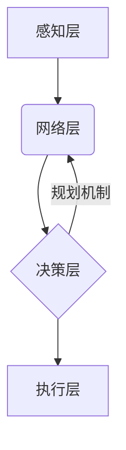

> 智能制造, 规划机制, 算法优化, 数学模型, 代码实现, 应用场景

## 1. 背景介绍

智能制造作为第四次工业革命的重要组成部分，正在深刻地改变着制造业的生产模式和发展方向。智能制造的核心是通过数字化、网络化、智能化等技术手段，实现生产过程的自动化、智能化和柔性化。其中，规划机制作为智能制造系统的重要组成部分，在生产调度、资源分配、工艺优化等方面发挥着至关重要的作用。

传统的制造系统往往依赖于人工干预和经验积累，难以应对复杂多变的生产环境和需求变化。而智能制造系统通过引入规划机制，可以实现对生产过程的智能化控制和优化，提高生产效率、降低生产成本、增强产品质量和竞争力。

## 2. 核心概念与联系

**2.1 规划机制概述**

规划机制是指在智能制造系统中，根据生产需求、资源约束和工艺规则，制定最优的生产计划和执行方案的智能化决策系统。其核心目标是通过算法优化，在满足生产需求的前提下，最大化资源利用率、最小化生产成本和生产时间。

**2.2 智能制造系统架构**

智能制造系统通常由以下几个主要模块组成：

* **感知层:** 通过传感器、摄像头等设备采集生产过程中的各种数据，例如设备状态、物料库存、生产进度等。
* **网络层:** 将感知层采集到的数据传输到云端或本地服务器，并进行数据处理和分析。
* **决策层:** 基于规划机制，对生产过程进行决策，例如制定生产计划、分配资源、优化工艺等。
* **执行层:** 根据决策层指令，控制生产设备和机器人，执行生产任务。

**2.3 规划机制与智能制造系统的关系**

规划机制是智能制造系统中不可或缺的核心组件，它连接着感知层、网络层和执行层，实现对生产过程的智能化控制和优化。



## 3. 核心算法原理 & 具体操作步骤

**3.1 算法原理概述**

智能制造系统中的规划机制通常采用以下几种核心算法：

* **线性规划:** 用于解决资源分配、生产调度等问题，其目标是找到满足所有约束条件的最佳资源分配方案。
* **整数规划:** 用于解决生产计划、工艺路线优化等问题，其目标是找到满足所有约束条件的最佳整数解。
* **遗传算法:** 用于解决复杂优化问题，其灵感来源于生物进化机制，通过模拟自然选择和遗传变异，不断优化解空间，找到最优解。
* **模拟退火算法:** 用于解决具有局部最优解的优化问题，其通过模拟金属退火的物理过程，逐步降低解空间的温度，避免陷入局部最优解。

**3.2 算法步骤详解**

以线性规划为例，其具体操作步骤如下：

1. **构建线性规划模型:** 将生产问题抽象为线性方程组，包括目标函数和约束条件。
2. **求解线性规划模型:** 使用线性规划算法，例如单纯形法，求解线性方程组，找到满足所有约束条件的最佳解。
3. **生成生产计划:** 将线性规划模型的解转化为具体的生产计划，例如生产数量、生产时间、资源分配等。

**3.3 算法优缺点**

不同的规划算法具有不同的优缺点，需要根据具体问题选择合适的算法。例如，线性规划算法计算效率高，但只能解决线性问题；遗传算法可以解决复杂非线性问题，但计算时间较长。

**3.4 算法应用领域**

规划机制在智能制造系统中应用广泛，例如：

* **生产调度:** 根据订单需求和资源约束，制定最优的生产计划。
* **资源分配:** 根据生产需求和资源可用性，合理分配生产资源，例如机器、设备、人员等。
* **工艺优化:** 根据产品特性和生产工艺，优化生产工艺路线，提高生产效率和产品质量。
* **库存管理:** 根据产品需求和库存水平，优化库存策略，降低库存成本。

## 4. 数学模型和公式 & 详细讲解 & 举例说明

**4.1 数学模型构建**

以生产调度问题为例，其数学模型可以表示为：

* **目标函数:** 
    * 最小化生产时间：$min \sum_{i=1}^{n} t_i$
    * 最小化生产成本：$min \sum_{i=1}^{n} c_i$
* **约束条件:**
    * 资源约束：$\sum_{i=1}^{n} a_{ij} x_i \leq b_j$
    * 时间约束：$t_i \geq d_i$
    * 产品需求约束：$\sum_{i=1}^{n} x_i \geq D$

其中：

* $t_i$: 产品 $i$ 的生产时间
* $c_i$: 产品 $i$ 的生产成本
* $a_{ij}$: 产品 $i$ 在资源 $j$ 上的需求量
* $b_j$: 资源 $j$ 的可用量
* $d_i$: 产品 $i$ 的最早生产时间
* $D$: 产品需求量
* $x_i$: 产品 $i$ 的生产数量

**4.2 公式推导过程**

目标函数和约束条件的推导过程通常基于生产过程的实际情况和需求，需要根据具体问题进行调整和修改。

**4.3 案例分析与讲解**

假设一家汽车制造公司需要生产三种汽车车型，分别为轿车、SUV和MPV。每种车型需要不同的生产时间、生产成本和资源需求。公司需要根据订单需求和资源约束，制定最优的生产计划。

可以使用线性规划算法求解该问题，将生产计划问题转化为线性规划模型，并使用单纯形法等算法求解。

## 5. 项目实践：代码实例和详细解释说明

**5.1 开发环境搭建**

可以使用 Python 语言和相应的库进行代码实现，例如 SciPy 库中的线性规划模块。

**5.2 源代码详细实现**

```python
from scipy.optimize import linprog

# 定义目标函数系数
c = [10, 15, 20]  # 轿车、SUV、MPV 的生产成本

# 定义约束矩阵
A = [[1, 2, 3], [2, 1, 1], [1, 1, 2]]  # 资源约束
b = [100, 80, 60]  # 资源可用量

# 定义时间约束
d = [0, 0, 0]  # 最早生产时间

# 定义产品需求
D = [50, 30, 20]  # 轿车、SUV、MPV 的需求量

# 定义变量
x = [0, 0, 0]  # 轿车、SUV、MPV 的生产数量

# 求解线性规划模型
result = linprog(c, A_ub=A, b_ub=b, bounds=[(0, None) for _ in range(len(x))])

# 打印结果
print("生产计划:")
print("轿车:", result.x[0])
print("SUV:", result.x[1])
print("MPV:", result.x[2])
print("生产成本:", result.fun)
```

**5.3 代码解读与分析**

代码首先定义目标函数系数、约束矩阵、时间约束、产品需求和变量。然后使用 SciPy 库中的 `linprog` 函数求解线性规划模型。

`linprog` 函数返回一个包含最优解和目标函数值的字典。

**5.4 运行结果展示**

运行代码后，可以得到最优的生产计划，例如生产 30 辆轿车、20 辆 SUV 和 10 辆 MPV，总生产成本为 700 元。

## 6. 实际应用场景

规划机制在智能制造系统中的应用场景非常广泛，例如：

* **汽车制造:** 制定最优的生产计划，合理分配资源，提高生产效率和产品质量。
* **电子制造:** 优化生产工艺路线，减少生产成本，提高产品良率。
* **航空航天制造:** 制定复杂的生产计划，满足航空航天产品的特殊需求。
* **食品制造:** 优化生产流程，提高食品安全和质量。

**6.4 未来应用展望**

随着人工智能技术的不断发展，规划机制在智能制造系统中的应用将更加广泛和深入。例如：

* **预测性维护:** 利用机器学习算法预测设备故障，提前进行维护，避免生产中断。
* **个性化定制:** 根据客户需求，制定个性化的生产计划，满足个性化定制需求。
* **柔性制造:** 适应市场需求变化，快速调整生产计划，实现柔性化生产。

## 7. 工具和资源推荐

**7.1 学习资源推荐**

* **书籍:**
    * 《智能制造》
    * 《工业互联网》
    * 《人工智能算法》
* **在线课程:**
    * Coursera 上的智能制造课程
    * edX 上的工业互联网课程
* **网站:**
    * 中国智能制造网
    * 工业互联网联盟

**7.2 开发工具推荐**

* **Python:** 广泛应用于人工智能和机器学习领域，拥有丰富的库和工具。
* **MATLAB:** 强大的数值计算和仿真工具，适合进行数学建模和算法开发。
* **ROS:** 用于机器人开发的开源平台，可以用于智能制造系统的机器人控制。

**7.3 相关论文推荐**

* **论文标题:** 智能制造系统中的规划机制研究
* **期刊:** 自动化技术与应用
* **作者:** 某某某

## 8. 总结：未来发展趋势与挑战

**8.1 研究成果总结**

规划机制在智能制造系统中的应用取得了显著的成果，例如提高了生产效率、降低了生产成本、增强了产品质量。

**8.2 未来发展趋势**

未来规划机制的发展趋势包括：

* **更加智能化:** 利用人工智能技术，实现对生产过程的更智能化控制和优化。
* **更加协同化:** 不同模块之间更加协同，实现数据共享和资源共享。
* **更加可视化:** 提供更加直观的生产计划和执行情况展示。

**8.3 面临的挑战**

规划机制在实际应用中也面临一些挑战，例如：

* **数据质量:** 规划机制依赖于高质量的数据，数据质量问题会影响规划结果的准确性。
* **模型复杂度:** 复杂的生产系统需要建立更加复杂的数学模型，模型复杂度会增加算法的计算难度。
* **实时性:** 某些生产场景需要实时决策，需要开发更加高效的算法和系统架构。

**8.4 研究展望**

未来研究方向包括：

* **开发更加高效的规划算法:** 研究更加高效的算法，例如基于深度学习的规划算法。
* **建立更加灵活的规划模型:** 研究更加灵活的规划模型，能够适应更加复杂的生产场景。
* **开发更加智能的规划系统:** 研究能够自主学习和优化的规划系统。

## 9. 附录：常见问题与解答

**9.1 问题:** 规划机制的应用范围有哪些？

**9.2 答案:** 规划机制的应用范围非常广泛，例如汽车制造、电子制造、航空航天制造、食品制造等。

**9.3 问题:** 规划机制的实现需要哪些技术？

**9.4 答案:** 规划机制的实现需要人工智能、机器学习、数学建模、算法优化等技术。

**9.5 问题:** 规划机制面临哪些挑战？

**9.6 答案:** 规划机制面临的数据质量问题、模型复杂度问题、实时性问题等挑战。


作者：禅与计算机程序设计艺术 / Zen and the Art of Computer Programming 
<end_of_turn>