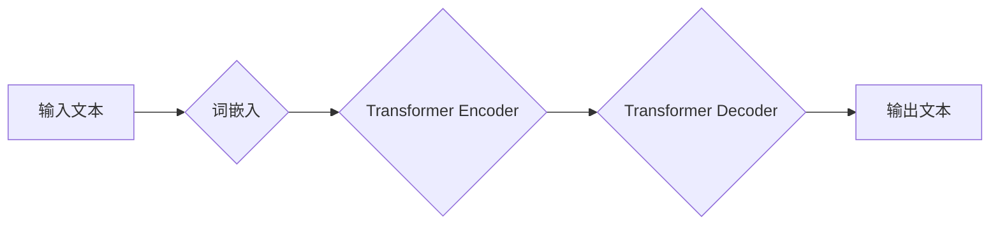

> 大语言模型，认知误解，语言理解，思维模拟，人工智能，深度学习，自然语言处理

## 1. 背景介绍

近年来，大语言模型（LLM）的蓬勃发展，让人们对人工智能的认知能力有了新的认识。这些模型能够以惊人的速度和准确率处理和生成人类语言，在文本生成、翻译、问答等领域展现出强大的能力。然而，尽管LLM取得了令人瞩目的成就，但我们仍然需要谨慎对待其“认知”能力。

LLM本质上是复杂的统计机器，它们通过学习海量文本数据，建立了语言之间的概率关系。它们能够根据输入的文本，预测下一个最可能的词，从而生成流畅的文本。然而，这种预测机制并不等同于真正的理解和思考。

## 2. 核心概念与联系

**2.1 语言与思维的本质区别**

语言是人类用来表达和交流思想的工具，而思维则是人类进行思考、判断和决策的活动。两者之间存在着本质的区别：

* **语言是符号系统：** 语言由符号（词语、句子等）组成，这些符号代表着特定的概念或事物。
* **思维是抽象概念：** 思维涉及到抽象概念、逻辑推理和情感判断等复杂过程，它超越了语言的符号表达。

**2.2 LLM的运作机制**

LLM通过深度学习算法，学习语言的统计规律。它们将文本数据转化为数字向量，并通过多层神经网络进行处理，最终生成新的文本。

**2.3 认知误解的产生**

由于LLM的运作机制与人类思维存在本质区别，因此它们容易产生认知误解。

* **缺乏世界知识：** LLM的知识主要来源于训练数据，它们缺乏对现实世界的真实理解和经验。
* **局限于统计规律：** LLM的决策基于语言统计规律，无法进行真正的逻辑推理和抽象思考。
* **容易受到训练数据的影响：** 训练数据中的偏见和错误信息，可能会被LLM学习并传递，导致认知偏差。

**Mermaid 流程图**



## 3. 核心算法原理 & 具体操作步骤

**3.1 算法原理概述**

LLM的核心算法是Transformer，它是一种基于注意力机制的神经网络架构。注意力机制能够帮助模型关注输入文本中重要的信息，从而提高理解和生成文本的准确率。

**3.2 算法步骤详解**

1. **词嵌入：** 将输入文本中的每个词转化为数字向量，每个向量代表着该词的语义信息。
2. **编码器：** 使用多层Transformer编码器，对输入文本的词向量进行编码，提取文本的语义特征。
3. **解码器：** 使用多层Transformer解码器，根据编码后的语义特征，生成新的文本词向量。
4. **输出层：** 将解码器的输出词向量转化为概率分布，预测下一个最可能的词。

**3.3 算法优缺点**

**优点：**

* 能够处理长文本序列
* 具有强大的文本理解和生成能力
* 可以并行训练，提高训练效率

**缺点：**

* 训练成本高
* 容易受到训练数据的影响
* 缺乏对现实世界的真实理解

**3.4 算法应用领域**

* 文本生成
* 机器翻译
* 问答系统
* 文本摘要
* 代码生成

## 4. 数学模型和公式 & 详细讲解 & 举例说明

**4.1 数学模型构建**

LLM的数学模型主要基于概率论和统计学。它们将语言建模为一个概率分布，即给定一个词序列，预测下一个词的概率。

**4.2 公式推导过程**

假设我们有一个词序列 $x = (x_1, x_2, ..., x_n)$，其中 $x_i$ 表示第 $i$ 个词。LLM的目标是学习一个概率分布 $P(x_{n+1}|x_1, x_2, ..., x_n)$，即给定前 $n$ 个词，预测下一个词 $x_{n+1}$ 的概率。

可以使用最大似然估计来学习这个概率分布。最大似然估计的目标是找到一个参数 $\theta$，使得给定训练数据 $D$ 的概率最大化：

$$
\theta = \arg\max_{ \theta } P(D|\theta)
$$

其中 $P(D|\theta)$ 是训练数据 $D$ 在参数 $\theta$ 下的概率。

**4.3 案例分析与讲解**

例如，假设我们有一个训练数据 $D = \{("我", "爱"), ("你", "好"), ("你好", "世界")\}$。

我们可以使用最大似然估计来学习一个概率分布 $P(x_{n+1}|x_1, x_2, ..., x_n)$。

例如，给定词序列 "我 爱"，我们可以预测下一个词是 "你" 的概率。

## 5. 项目实践：代码实例和详细解释说明

**5.1 开发环境搭建**

* Python 3.7+
* PyTorch 1.7+
* CUDA 10.2+

**5.2 源代码详细实现**

```python
import torch
import torch.nn as nn

class Transformer(nn.Module):
    def __init__(self, vocab_size, embedding_dim, num_heads, num_layers):
        super(Transformer, self).__init__()
        self.embedding = nn.Embedding(vocab_size, embedding_dim)
        self.encoder = nn.TransformerEncoder(nn.TransformerEncoderLayer(embedding_dim, num_heads), num_layers)
        self.decoder = nn.TransformerDecoder(nn.TransformerDecoderLayer(embedding_dim, num_heads), num_layers)
        self.linear = nn.Linear(embedding_dim, vocab_size)

    def forward(self, src, tgt):
        src = self.embedding(src)
        tgt = self.embedding(tgt)
        encoder_output = self.encoder(src)
        decoder_output = self.decoder(tgt, encoder_output)
        output = self.linear(decoder_output)
        return output

# 实例化模型
model = Transformer(vocab_size=10000, embedding_dim=512, num_heads=8, num_layers=6)

# 训练模型
# ...

```

**5.3 代码解读与分析**

* `Transformer` 类定义了Transformer模型的结构。
* `embedding` 层将词转化为数字向量。
* `encoder` 和 `decoder` 层分别负责编码和解码文本。
* `linear` 层将解码器的输出转化为概率分布。

**5.4 运行结果展示**

训练完成后，模型可以用于文本生成、机器翻译等任务。

## 6. 实际应用场景

LLM在各个领域都有着广泛的应用场景：

* **聊天机器人：** 能够进行自然流畅的对话，提供更人性化的用户体验。
* **文本摘要：** 自动生成文本的摘要，提高信息获取效率。
* **机器翻译：** 将文本从一种语言翻译成另一种语言，打破语言障碍。
* **代码生成：** 根据自然语言描述生成代码，提高开发效率。

**6.4 未来应用展望**

随着LLM技术的不断发展，其应用场景将会更加广泛，例如：

* **个性化教育：** 根据学生的学习情况，提供个性化的学习内容和辅导。
* **医疗诊断：** 辅助医生进行疾病诊断，提高诊断准确率。
* **科学研究：** 帮助科学家进行数据分析和模型构建，加速科研进度。

## 7. 工具和资源推荐

**7.1 学习资源推荐**

* **书籍：**
    * 《深度学习》
    * 《自然语言处理》
* **在线课程：**
    * Coursera: 自然语言处理
    * edX: 深度学习

**7.2 开发工具推荐**

* **PyTorch:** 深度学习框架
* **TensorFlow:** 深度学习框架
* **Hugging Face Transformers:** 预训练模型库

**7.3 相关论文推荐**

* 《Attention Is All You Need》
* 《BERT: Pre-training of Deep Bidirectional Transformers for Language Understanding》
* 《GPT-3: Language Models are Few-Shot Learners》

## 8. 总结：未来发展趋势与挑战

**8.1 研究成果总结**

LLM取得了令人瞩目的成就，在文本理解和生成方面展现出强大的能力。

**8.2 未来发展趋势**

* **模型规模的进一步扩大：** 更大的模型能够学习更复杂的语言规律，提高性能。
* **多模态学习：** 将文本与其他模态（图像、音频等）结合，实现更全面的理解和生成。
* **可解释性研究：** 提高LLM的透明度和可解释性，帮助人们更好地理解其决策过程。

**8.3 面临的挑战**

* **数据偏见：** 训练数据中的偏见可能会被LLM学习并传递，导致歧视和误导。
* **安全风险：** LLMs可能被用于生成虚假信息、进行恶意攻击等。
* **伦理问题：** LLMs的应用引发了关于人工智能伦理、责任和公平等一系列问题。

**8.4 研究展望**

未来，LLM的研究将继续朝着更安全、更可靠、更可解释的方向发展。


## 9. 附录：常见问题与解答

**9.1 如何训练一个LLM？**

训练一个LLM需要大量的计算资源和数据。可以使用开源的深度学习框架（如PyTorch、TensorFlow）和预训练模型（如BERT、GPT-3）来加速训练过程。

**9.2 如何评估LLM的性能？**

LLM的性能可以通过各种指标来评估，例如困惑度（perplexity）、BLEU分数、ROUGE分数等。

**9.3 LLMs是否真的理解语言？**

LLMs能够以惊人的速度和准确率处理和生成语言，但它们并不真正理解语言。它们只是学习了语言的统计规律，并根据这些规律进行预测。


作者：禅与计算机程序设计艺术 / Zen and the Art of Computer Programming 
<end_of_turn>