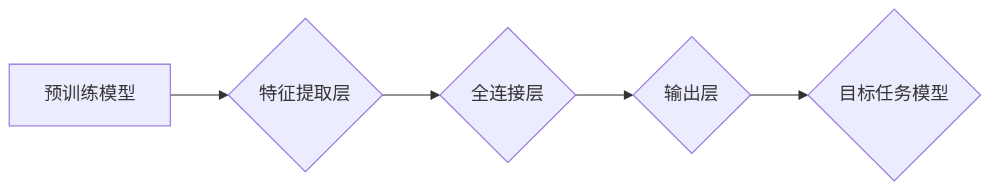

> 迁移学习, Transfer Learning, 深度学习, 计算机视觉, 自然语言处理, 模型迁移, 预训练模型, Fine-tuning

## 1. 背景介绍

在深度学习领域，训练一个强大的机器学习模型通常需要大量的 labeled 数据和大量的计算资源。然而，在许多实际应用场景中，获取大量 labeled 数据往往非常困难和昂贵。迁移学习 (Transfer Learning) 应运而生，它是一种利用已训练好的模型在新的任务上的学习方法，可以有效地解决数据稀缺问题。

迁移学习的核心思想是：将预先训练好的模型在源任务上的知识迁移到目标任务中，从而提高目标任务模型的性能。源任务和目标任务可以是相同的，也可以是不同的。例如，在图像分类任务中，我们可以使用在 ImageNet 数据集上预训练的模型，将其迁移到其他图像分类任务中，例如识别特定类型的水果或车辆。

## 2. 核心概念与联系

**2.1 迁移学习的类型**

迁移学习可以分为以下几种类型：

* **Inductive Transfer Learning:** 源任务和目标任务的数据分布不同，但目标任务的数据类型与源任务的数据类型相同。例如，使用在猫狗分类任务上预训练的模型，迁移到识别其他动物的分类任务中。
* **Transductive Transfer Learning:** 源任务和目标任务的数据分布相同，但目标任务的数据标签未知。例如，使用在图像分类任务上预训练的模型，迁移到图像相似度检索任务中。
* **Unsupervised Transfer Learning:** 源任务和目标任务的数据分布不同，并且目标任务的数据没有标签。例如，使用在无标签图像数据上预训练的模型，迁移到图像分类任务中。

**2.2 迁移学习的流程**



**2.3 迁移学习的优势**

* **提高模型性能:** 利用预训练模型的知识可以显著提高目标任务模型的性能，尤其是在数据稀缺的情况下。
* **减少训练时间和资源:** 迁移学习可以减少模型训练所需的时间和计算资源。
* **提升模型泛化能力:** 预训练模型已经学习了大量的通用特征，可以帮助目标任务模型更好地泛化到新的数据。

## 3. 核心算法原理 & 具体操作步骤

### 3.1  算法原理概述

迁移学习的核心算法是 **Fine-tuning**，即对预训练模型进行微调。

Fine-tuning 的过程通常包括以下步骤：

1. **选择预训练模型:** 根据目标任务选择合适的预训练模型。
2. **冻结部分层:** 将预训练模型中的一些层冻结，防止其参数更新。
3. **添加新的层:** 在预训练模型的基础上添加新的层，用于学习目标任务的特定知识。
4. **微调模型参数:** 使用目标任务的数据对模型进行微调，更新模型参数。

### 3.2  算法步骤详解

1. **数据准备:** 首先需要准备目标任务的数据集，并进行预处理，例如数据增强、归一化等。
2. **模型选择:** 选择合适的预训练模型，例如 ResNet、VGG、BERT 等。
3. **模型加载:** 加载预训练模型的权重。
4. **模型结构修改:** 根据目标任务的需求，修改模型结构，例如添加新的全连接层、调整输出层等。
5. **参数冻结:** 将预训练模型中的一些层冻结，防止其参数更新。
6. **微调训练:** 使用目标任务的数据对模型进行微调训练，更新模型参数。
7. **模型评估:** 使用验证集评估模型性能，并根据性能调整训练参数。
8. **模型部署:** 将训练好的模型部署到实际应用场景中。

### 3.3  算法优缺点

**优点:**

* **提高模型性能:** Fine-tuning 可以显著提高目标任务模型的性能，尤其是在数据稀缺的情况下。
* **减少训练时间和资源:** Fine-tuning 比从头训练模型需要更少的训练时间和计算资源。
* **提升模型泛化能力:** 预训练模型已经学习了大量的通用特征，可以帮助目标任务模型更好地泛化到新的数据。

**缺点:**

* **需要预训练模型:** Fine-tuning 需要使用预训练模型，如果预训练模型与目标任务不匹配，则效果可能不佳。
* **参数调整:** 需要根据目标任务调整模型结构和训练参数，这需要一定的经验和技巧。
* **过拟合风险:** 如果训练数据量较小，则容易出现过拟合问题。

### 3.4  算法应用领域

迁移学习在许多领域都有广泛的应用，例如：

* **计算机视觉:** 图像分类、目标检测、图像分割、人脸识别等。
* **自然语言处理:** 文本分类、情感分析、机器翻译、问答系统等。
* **语音识别:** 语音识别、语音合成、语音情感分析等。
* **医疗诊断:** 病理图像分析、疾病预测、药物研发等。

## 4. 数学模型和公式 & 详细讲解 & 举例说明

### 4.1  数学模型构建

迁移学习的数学模型通常基于深度神经网络，其目标是学习一个映射函数 f，将输入数据 x 映射到输出结果 y。

$$
f(x) = y
$$

其中，x 是输入数据，y 是输出结果。

### 4.2  公式推导过程

Fine-tuning 的核心思想是利用源任务预训练模型的知识，对目标任务模型进行微调。

假设源任务模型的参数为 θs，目标任务模型的参数为 θt。Fine-tuning 的目标是找到最佳的 θt 参数，使得目标任务模型在目标任务数据上取得最佳性能。

可以使用以下公式来更新目标任务模型的参数：

$$
\theta_t = \theta_t - \alpha \nabla_ {\theta_t} L(f(x), y)
$$

其中，α 是学习率，∇_ {\theta_t} L(f(x), y) 是目标任务损失函数 L(f(x), y) 对 θt 的梯度。

### 4.3  案例分析与讲解

例如，在图像分类任务中，我们可以使用在 ImageNet 数据集上预训练的 ResNet 模型，将其迁移到识别特定类型的水果的分类任务中。

在 Fine-tuning 的过程中，我们可以冻结 ResNet 模型的前几层，只更新后几层的参数。这样可以利用 ResNet 模型已经学习到的通用特征，同时也能让模型学习到特定类型的水果的特征。

## 5. 项目实践：代码实例和详细解释说明

### 5.1  开发环境搭建

* Python 3.6+
* TensorFlow 2.0+
* Keras 2.0+
* Jupyter Notebook

### 5.2  源代码详细实现

```python
import tensorflow as tf
from tensorflow.keras.applications import ResNet50
from tensorflow.keras.layers import Dense, GlobalAveragePooling2D
from tensorflow.keras.models import Model

# 加载预训练模型
base_model = ResNet50(weights='imagenet', include_top=False)

# 冻结预训练模型的层
for layer in base_model.layers:
    layer.trainable = False

# 添加新的全连接层
x = base_model.output
x = GlobalAveragePooling2D()(x)
x = Dense(1024, activation='relu')(x)
predictions = Dense(num_classes, activation='softmax')(x)

# 创建新的模型
model = Model(inputs=base_model.input, outputs=predictions)

# 编译模型
model.compile(optimizer='adam',
              loss='categorical_crossentropy',
              metrics=['accuracy'])

# 训练模型
model.fit(train_data, train_labels, epochs=10, validation_data=(val_data, val_labels))

# 保存模型
model.save('fruit_classifier.h5')
```

### 5.3  代码解读与分析

* **加载预训练模型:** 使用 `ResNet50(weights='imagenet', include_top=False)` 加载预训练的 ResNet50 模型，`weights='imagenet'` 表示使用 ImageNet 数据集预训练的模型权重，`include_top=False` 表示不包含预训练模型的顶部全连接层。
* **冻结预训练模型的层:** 使用 `layer.trainable = False` 将预训练模型的所有层冻结，防止其参数更新。
* **添加新的全连接层:** 在预训练模型的基础上添加新的全连接层，用于学习目标任务的特定知识。
* **创建新的模型:** 使用 `Model(inputs=base_model.input, outputs=predictions)` 创建新的模型，将预训练模型作为输入，新的全连接层作为输出。
* **编译模型:** 使用 `model.compile()` 编译模型，指定优化器、损失函数和评估指标。
* **训练模型:** 使用 `model.fit()` 训练模型，传入训练数据和标签，以及验证数据和标签。
* **保存模型:** 使用 `model.save()` 保存训练好的模型。

### 5.4  运行结果展示

训练完成后，可以使用 `model.evaluate()` 函数评估模型在验证集上的性能。

## 6. 实际应用场景

迁移学习在许多实际应用场景中都有广泛的应用，例如：

* **医疗诊断:** 使用在大型医学图像数据集上预训练的模型，迁移到识别特定疾病的图像分类任务中。
* **金融风险评估:** 使用在大量金融数据上预训练的模型，迁移到识别欺诈交易或评估信用风险的任务中。
* **个性化推荐:** 使用在用户行为数据上预训练的模型，迁移到个性化推荐任务中。

### 6.4  未来应用展望

随着深度学习技术的不断发展，迁移学习的应用场景将会更加广泛。

* **更小规模的数据集:** 迁移学习可以帮助在更小规模的数据集上训练出高性能的模型。
* **跨模态迁移:** 迁移学习可以应用于跨模态任务，例如将图像识别模型迁移到语音识别任务中。
* **联邦学习:** 迁移学习可以与联邦学习相结合，在保护数据隐私的前提下进行模型训练和迁移。

## 7. 工具和资源推荐

### 7.1  学习资源推荐

* **书籍:**
    * Deep Learning with Python by Francois Chollet
    * Transfer Learning in Natural Language Processing by Sebastian Ruder
* **在线课程:**
    * Coursera: Deep Learning Specialization
    * Udacity: Deep Learning Nanodegree
* **博客:**
    * Towards Data Science
    * Machine Learning Mastery

### 7.2  开发工具推荐

* **TensorFlow:** https://www.tensorflow.org/
* **PyTorch:** https://pytorch.org/
* **Keras:** https://keras.io/

### 7.3  相关论文推荐

* **ImageNet Classification with Deep Convolutional Neural Networks** by Alex Krizhevsky, Ilya Sutskever, and Geoffrey E. Hinton
* **Transfer Learning** by Pan, S. J., & Yang, Q.
* **BERT: Pre-training of Deep Bidirectional Transformers for Language Understanding** by Devlin, J., Chang, M. W., Lee, K., & Toutanova, K.

## 8. 总结：未来发展趋势与挑战

### 8.1  研究成果总结

迁移学习在近年来取得了显著的进展，在许多领域都取得了令人瞩目的成果。

* **模型性能提升:** 迁移学习可以显著提高目标任务模型的性能，尤其是在数据稀缺的情况下。
* **训练效率提升:** 迁移学习可以减少模型训练所需的时间和计算资源。
* **应用场景拓展:** 迁移学习的应用场景越来越广泛，涵盖了计算机视觉、自然语言处理、语音识别等多个领域。

### 8.2  未来发展趋势

* **更有效的迁移学习方法:** 研究更有效的迁移学习方法，例如跨模态迁移、联邦学习等。
* **更强大的预训练模型