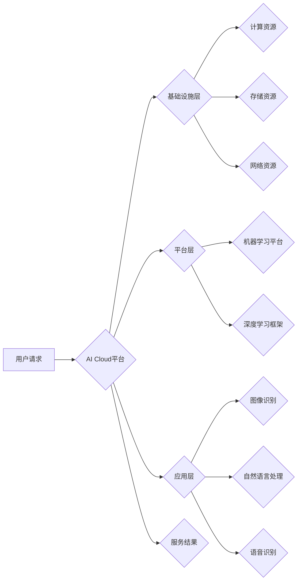

# AI Cloud的未来：贾扬清的愿景，打造云计算与AI的完美结合

> 关键词：

> AI Cloud, 云计算, 人工智能, 贾扬清, 深度学习, 混合云, 容器化, 自动化

## 1. 背景介绍

云计算已经成为当今数字经济的基础设施，为企业和个人提供了弹性、可扩展和经济高效的计算资源。而人工智能（AI）作为第四次工业革命的核心技术，正在深刻地改变着各行各业。两者结合，势必将催生出更加强大的应用场景和商业价值。

贾扬清，作为一位享誉全球的AI专家和云计算先驱，在其著作《AI Cloud的未来》中，提出了构建AI Cloud的愿景，旨在将云计算和AI完美融合，为用户提供一站式AI服务平台。

## 2. 核心概念与联系

AI Cloud的核心概念是将云计算的优势与AI技术的强大结合起来，构建一个能够提供端到端AI服务的平台。

**2.1 云计算与AI的融合**

云计算提供强大的计算资源、存储能力和网络带宽，为AI模型的训练和部署提供了基础设施支持。而AI技术则赋予了云计算平台智能化能力，能够自动学习、分析和决策。

**2.2 AI Cloud的架构**

AI Cloud的架构通常包含以下几个关键组件：

* **基础设施层:** 包括计算资源、存储资源、网络资源等，为AI模型的训练和部署提供基础支撑。
* **平台层:** 提供AI模型开发、训练、部署和管理的工具和服务，例如机器学习平台、深度学习框架等。
* **应用层:** 提供基于AI技术的应用服务，例如图像识别、自然语言处理、语音识别等。

**2.3 AI Cloud的优势**

* **弹性扩展:** 用户可以根据需求动态调整AI服务的资源配置，无需担心硬件成本和维护问题。
* **成本效益:** AI Cloud的共享资源模式可以降低用户的开发和部署成本。
* **快速迭代:** AI Cloud平台提供便捷的工具和服务，可以加速AI模型的开发和迭代。
* **智能化服务:** AI Cloud平台可以提供智能化的服务，例如自动模型优化、自动故障检测等。

**Mermaid 流程图**

## 3. 核心算法原理 & 具体操作步骤

### 3.1  算法原理概述

AI Cloud的核心算法原理主要基于深度学习技术，包括卷积神经网络（CNN）、循环神经网络（RNN）和Transformer等。这些算法能够学习数据中的复杂模式和关系，从而实现对图像、文本、语音等数据的智能处理。

### 3.2  算法步骤详解

1. **数据预处理:** 收集和清洗数据，将其转换为模型可以理解的格式。
2. **模型构建:** 选择合适的深度学习模型架构，并根据任务需求进行参数配置。
3. **模型训练:** 使用训练数据训练模型，调整模型参数以最小化预测误差。
4. **模型评估:** 使用测试数据评估模型的性能，例如准确率、召回率、F1-score等。
5. **模型部署:** 将训练好的模型部署到AI Cloud平台，提供给用户使用。

### 3.3  算法优缺点

**优点:**

* **高精度:** 深度学习算法能够学习数据中的复杂模式，实现高精度的预测和分类。
* **自动化学习:** 深度学习算法能够自动学习数据特征，无需人工特征工程。
* **可扩展性:** 深度学习算法可以利用云计算平台的强大计算资源进行训练和部署。

**缺点:**

* **数据依赖:** 深度学习算法需要大量的训练数据才能达到较高的精度。
* **计算资源消耗:** 深度学习模型训练需要大量的计算资源，成本较高。
* **可解释性差:** 深度学习模型的决策过程较为复杂，难以解释其预测结果。

### 3.4  算法应用领域

深度学习算法在各个领域都有广泛的应用，例如：

* **计算机视觉:** 图像识别、物体检测、图像分割、人脸识别等。
* **自然语言处理:** 文本分类、情感分析、机器翻译、对话系统等。
* **语音识别:** 语音转文本、语音助手等。
* **医疗诊断:** 病理图像分析、疾病预测等。
* **金融风险控制:** 欺诈检测、信用评分等。

## 4. 数学模型和公式 & 详细讲解 & 举例说明

### 4.1  数学模型构建

深度学习模型通常基于神经网络结构，其数学模型可以表示为一系列的矩阵运算和激活函数。

**4.1.1 神经网络结构**

神经网络由多个层组成，每一层包含多个神经元。神经元之间通过连接权重进行信息传递。

**4.1.2 激活函数**

激活函数用于引入非线性，使神经网络能够学习复杂的数据模式。常见的激活函数包括ReLU、Sigmoid和Tanh等。

**4.1.3 损失函数**

损失函数用于衡量模型预测结果与真实值的差异。常见的损失函数包括均方误差（MSE）、交叉熵损失（Cross-Entropy Loss）等。

### 4.2  公式推导过程

**4.2.1 前向传播**

前向传播过程是指输入数据通过神经网络层级传递，最终得到输出结果的过程。

**公式:**

$$
y = f(W^L x^L + b^L)
$$

其中：

* $y$ 是输出结果
* $f$ 是激活函数
* $W^L$ 是第 $L$ 层的权重矩阵
* $x^L$ 是第 $L$ 层的输入向量
* $b^L$ 是第 $L$ 层的偏置向量

**4.2.2 反向传播**

反向传播过程是指根据损失函数的梯度，调整神经网络的权重和偏置，以最小化损失函数值的过程。

**公式:**

$$
\Delta W = \eta \frac{\partial L}{\partial W}
$$

其中：

* $\Delta W$ 是权重更新量
* $\eta$ 是学习率
* $\frac{\partial L}{\partial W}$ 是损失函数对权重的梯度

### 4.3  案例分析与讲解

**4.3.1 图像分类**

使用CNN模型进行图像分类，例如识别猫和狗的图片。

**4.3.2 文本生成**

使用RNN模型进行文本生成，例如生成新闻文章或诗歌。

## 5. 项目实践：代码实例和详细解释说明

### 5.1  开发环境搭建

使用Python语言和相关的深度学习框架，例如TensorFlow或PyTorch，搭建AI Cloud开发环境。

### 5.2  源代码详细实现

使用深度学习框架的API，实现AI模型的训练和部署。

### 5.3  代码解读与分析

解释代码的逻辑结构和功能，以及模型训练和部署过程中的关键步骤。

### 5.4  运行结果展示

展示模型训练和部署的结果，例如准确率、召回率、运行时间等。

## 6. 实际应用场景

### 6.1  智能客服

使用AI Cloud平台构建智能客服系统，能够自动回答用户常见问题，提高客户服务效率。

### 6.2  精准营销

使用AI Cloud平台分析用户数据，进行精准营销，提高广告投放效果。

### 6.3  个性化推荐

使用AI Cloud平台分析用户行为，提供个性化商品推荐，提升用户体验。

### 6.4  未来应用展望

AI Cloud的应用场景将更加广泛，例如：

* **自动驾驶:** 使用AI Cloud平台构建自动驾驶系统，实现车辆自动驾驶。
* **医疗诊断:** 使用AI Cloud平台辅助医生进行疾病诊断，提高诊断准确率。
* **科学研究:** 使用AI Cloud平台加速科学研究，例如药物研发、材料科学等。

## 7. 工具和资源推荐

### 7.1  学习资源推荐

* **在线课程:** Coursera、edX、Udacity等平台提供深度学习相关的在线课程。
* **书籍:** 《深度学习》、《机器学习实战》等书籍。
* **开源项目:** TensorFlow、PyTorch等开源深度学习框架。

### 7.2  开发工具推荐

* **云计算平台:** AWS、Azure、GCP等云计算平台提供AI服务和工具。
* **深度学习框架:** TensorFlow、PyTorch、Keras等深度学习框架。
* **数据处理工具:** Pandas、NumPy等数据处理工具。

### 7.3  相关论文推荐

* **《ImageNet Classification with Deep Convolutional Neural Networks》**
* **《Attention Is All You Need》**
* **《BERT: Pre-training of Deep Bidirectional Transformers for Language Understanding》**

## 8. 总结：未来发展趋势与挑战

### 8.1  研究成果总结

AI Cloud的构建和发展取得了显著成果，为人工智能技术的应用提供了强大的平台支撑。

### 8.2  未来发展趋势

* **模型规模和复杂度提升:** 未来AI模型将更加庞大，更加复杂，能够处理更加复杂的任务。
* **边缘计算的融合:** AI Cloud将与边缘计算相结合，实现更低延迟、更高效率的AI服务。
* **联邦学习的应用:** 联邦学习技术将被广泛应用于AI Cloud，保障数据隐私安全。

### 8.3  面临的挑战

* **数据安全和隐私保护:** AI Cloud平台需要解决数据安全和隐私保护问题，确保用户数据的安全。
* **算法可解释性和信任度:** AI模型的决策过程难以解释，需要提高算法的可解释性和信任度。
* **人才短缺:** AI领域人才短缺，需要加强人才培养和引进。

### 8.4  研究展望

未来AI Cloud的研究方向将集中在以下几个方面：

* **更安全、更可靠的AI模型:** 研究更安全、更可靠的AI模型，提高模型的鲁棒性和安全性。
* **更智能、更人性化的AI服务:** 研究更智能、更人性化的AI服务，例如能够理解用户情感、提供个性化建议等。
* **AI Cloud的开源和标准化:** 推动AI Cloud的开源和标准化，促进AI技术的普及和发展。

## 9. 附录：常见问题与解答

### 9.1  AI Cloud与传统云计算有什么区别？

AI Cloud与传统云计算的主要区别在于，AI Cloud平台提供了一系列AI相关的工具和服务，例如机器学习平台、深度学习框架等，能够帮助用户更方便地开发和部署AI应用。

### 9.2  如何选择合适的AI Cloud平台？

选择合适的AI Cloud平台需要考虑以下因素：

* **平台功能:** 平台是否提供所需的AI工具和服务？
* **平台性能:** 平台的计算资源和存储资源是否满足需求？
* **平台价格:** 平台的收费模式是否合理？
* **平台安全性:** 平台是否能够保障数据安全和隐私？

### 9.3  AI Cloud的未来发展趋势是什么？

AI Cloud的未来发展趋势包括模型规模和复杂度提升、边缘计算的融合、联邦学习的应用等。

### 9.4  如何学习AI Cloud相关知识？

可以通过在线课程、书籍、开源项目等方式学习AI Cloud相关知识。

作者：禅与计算机程序设计艺术 / Zen and the Art of Computer Programming
