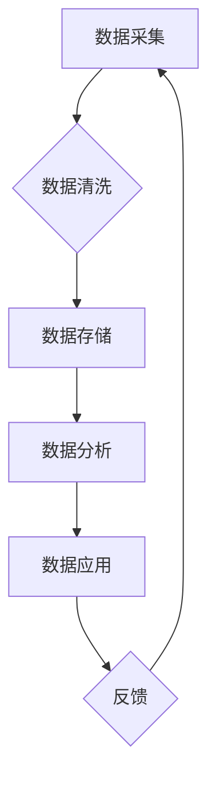

> AI DMP, 数据治理, 数据管理, 数据基建, 数据质量, 数据安全, 数据可信

## 1. 背景介绍

在当今数据爆炸的时代，数据已成为企业最重要的资产之一。然而，海量数据的价值难以挖掘，主要原因在于数据质量参差不齐、数据孤岛现象严重、数据安全风险高，以及缺乏有效的管理机制。为了解决这些问题，企业纷纷开始探索数据治理与管理的解决方案。

AI DMP（人工智能数据管理平台）应运而生，它利用人工智能技术，对数据进行全生命周期管理，从数据采集、存储、处理、分析到应用，实现数据价值的最大化。

## 2. 核心概念与联系

**2.1 数据治理**

数据治理是指企业对数据进行规划、组织、管理和控制的一系列活动，旨在确保数据的质量、一致性、安全性、合规性和可用性。

**2.2 数据管理**

数据管理是指企业对数据的收集、存储、维护、检索和利用等方面的管理活动，旨在确保数据的完整性、准确性和及时性。

**2.3 AI DMP**

AI DMP 是基于人工智能技术的平台，它将数据治理和数据管理相结合，通过人工智能算法，实现对数据的智能化管理。

**2.4 核心架构**



**2.5 核心功能**

* 数据质量管理：自动识别和修复数据质量问题，提高数据准确性和一致性。
* 数据安全管理：实现数据访问控制、数据加密和数据备份等安全措施，保障数据安全。
* 数据合规管理：帮助企业满足相关数据法规和标准的要求，确保数据合规性。
* 数据可信管理：建立数据溯源机制，提高数据可信度。

## 3. 核心算法原理 & 具体操作步骤

**3.1 算法原理概述**

AI DMP 中常用的算法包括：

* **机器学习算法**: 用于数据清洗、数据分类、数据预测等。
* **深度学习算法**: 用于复杂数据模式的识别和分析。
* **自然语言处理算法**: 用于文本数据分析和理解。

**3.2 算法步骤详解**

以数据清洗为例，其算法步骤如下：

1. 数据收集：从各种数据源收集数据。
2. 数据预处理：对数据进行格式转换、缺失值处理、异常值处理等预处理操作。
3. 数据清洗规则定义：根据业务需求，定义数据清洗规则，例如：格式规范、数据范围限制、数据一致性校验等。
4. 数据清洗执行：利用机器学习算法，自动识别和修复数据质量问题，例如：重复数据、错误数据、不完整数据等。
5. 数据质量评估：评估数据清洗效果，并根据评估结果进行调整和优化。

**3.3 算法优缺点**

* **优点**: 自动化程度高，效率高，能够处理海量数据，能够识别复杂的数据模式。
* **缺点**: 需要大量的训练数据，算法模型需要不断更新和优化，对数据质量要求较高。

**3.4 算法应用领域**

* 数据清洗：修复数据质量问题，提高数据准确性和一致性。
* 数据分类：将数据按照类别进行分类，例如：客户分类、产品分类等。
* 数据预测：根据历史数据，预测未来趋势，例如：销售预测、风险预测等。

## 4. 数学模型和公式 & 详细讲解 & 举例说明

**4.1 数学模型构建**

数据质量评估模型可以采用基于规则的模型或基于机器学习的模型。

* **基于规则的模型**: 

根据预先定义的规则，对数据进行评估，例如：数据完整性规则、数据一致性规则等。

* **基于机器学习的模型**: 

利用机器学习算法，从历史数据中学习数据质量特征，并建立数据质量评估模型。

**4.2 公式推导过程**

以基于机器学习的模型为例，其评估公式可以表示为：

$$
Q = f(D)
$$

其中：

* $Q$ 表示数据质量得分。
* $D$ 表示数据特征向量。
* $f(D)$ 表示机器学习模型的预测函数。

**4.3 案例分析与讲解**

假设我们想要评估客户数据的质量，可以将客户数据特征向量表示为：

$$
D = [年龄, 性别, 收入, 购买频率, 购买金额]
$$

我们可以利用机器学习算法，从历史客户数据中学习数据质量特征，并建立一个数据质量评估模型。例如，我们可以使用决策树算法，将客户数据分为不同质量等级，并根据每个等级的特征，计算出相应的质量得分。

## 5. 项目实践：代码实例和详细解释说明

**5.1 开发环境搭建**

* 操作系统：Linux
* 编程语言：Python
* 开发工具：Jupyter Notebook
* 库依赖：pandas, scikit-learn, TensorFlow

**5.2 源代码详细实现**

```python
import pandas as pd
from sklearn.model_selection import train_test_split
from sklearn.tree import DecisionTreeClassifier

# 数据加载
data = pd.read_csv('customer_data.csv')

# 数据预处理
# ...

# 特征选择
features = ['年龄', '性别', '收入', '购买频率', '购买金额']
X = data[features]
y = data['数据质量']

# 数据分割
X_train, X_test, y_train, y_test = train_test_split(X, y, test_size=0.2, random_state=42)

# 模型训练
model = DecisionTreeClassifier()
model.fit(X_train, y_train)

# 模型评估
accuracy = model.score(X_test, y_test)
print(f'模型准确率: {accuracy}')

# 数据预测
new_data = pd.DataFrame({
    '年龄': [30],
    '性别': ['男'],
    '收入': [50000],
    '购买频率': [10],
    '购买金额': [1000]
})
prediction = model.predict(new_data)
print(f'新数据质量预测: {prediction}')
```

**5.3 代码解读与分析**

* 代码首先加载数据，并进行预处理操作。
* 然后选择特征，并将数据分割为训练集和测试集。
* 利用决策树算法训练模型，并评估模型的准确率。
* 最后使用训练好的模型对新数据进行预测。

**5.4 运行结果展示**

运行结果将显示模型的准确率以及对新数据的质量预测结果。

## 6. 实际应用场景

AI DMP 在各个行业都有广泛的应用场景，例如：

* **金融行业**: 用于风险管理、欺诈检测、客户画像等。
* **电商行业**: 用于商品推荐、用户行为分析、精准营销等。
* **医疗行业**: 用于疾病诊断、药物研发、患者管理等。

**6.4 未来应用展望**

随着人工智能技术的不断发展，AI DMP 将在未来发挥更加重要的作用，例如：

* **数据驱动决策**: AI DMP 可以帮助企业利用数据进行更科学、更精准的决策。
* **个性化服务**: AI DMP 可以帮助企业提供更加个性化的服务，例如：个性化推荐、个性化营销等。
* **智能化运营**: AI DMP 可以帮助企业实现智能化运营，例如：自动化的数据处理、智能化的业务流程等。

## 7. 工具和资源推荐

**7.1 学习资源推荐**

* **书籍**:
    * 《数据科学实战》
    * 《机器学习》
    * 《深度学习》
* **在线课程**:
    * Coursera
    * edX
    * Udemy

**7.2 开发工具推荐**

* **数据处理工具**: pandas, NumPy
* **机器学习库**: scikit-learn, TensorFlow, PyTorch
* **数据可视化工具**: matplotlib, seaborn

**7.3 相关论文推荐**

* 《AI DMP: A Survey》
* 《Data Governance in the Age of AI》
* 《The Future of Data Management》

## 8. 总结：未来发展趋势与挑战

**8.1 研究成果总结**

AI DMP 作为一种新兴技术，在数据治理和数据管理领域取得了显著的成果，例如：

* 自动化程度提高
* 数据质量提升
* 数据安全保障

**8.2 未来发展趋势**

* **更智能化**: 利用更先进的人工智能算法，实现更智能的数据治理和数据管理。
* **更自动化**: 实现数据治理和数据管理的自动化，减少人工干预。
* **更可扩展**: 支持海量数据的处理和管理，满足企业不断增长的数据需求。

**8.3 面临的挑战**

* **数据隐私保护**: 如何保护用户数据隐私，是AI DMP发展面临的重要挑战。
* **算法可解释性**: 如何提高AI算法的可解释性，帮助用户理解算法的决策过程，也是一个重要的挑战。
* **人才缺口**: AI DMP领域人才缺口较大，需要加强人才培养和引进。

**8.4 研究展望**

未来，AI DMP 将继续朝着更智能化、更自动化、更可扩展的方向发展，并将在更多领域发挥重要作用。


## 9. 附录：常见问题与解答

**9.1 如何选择合适的AI DMP平台？**

选择AI DMP平台时，需要考虑以下因素：

* 企业规模和数据量
* 数据类型和数据质量
* 业务需求和应用场景
* 平台功能和性能
* 平台价格和服务

**9.2 如何保证数据安全？**

AI DMP平台需要采用多种安全措施，例如：数据加密、访问控制、数据备份等，保障数据安全。

**9.3 如何提高数据质量？**

AI DMP平台可以利用机器学习算法，自动识别和修复数据质量问题，提高数据质量。

**9.4 如何进行数据治理？**

数据治理需要建立一套完整的制度体系，包括数据标准、数据流程、数据安全等方面的规范，并定期进行评估和优化。


作者：禅与计算机程序设计艺术 / Zen and the Art of Computer Programming 
<end_of_turn>