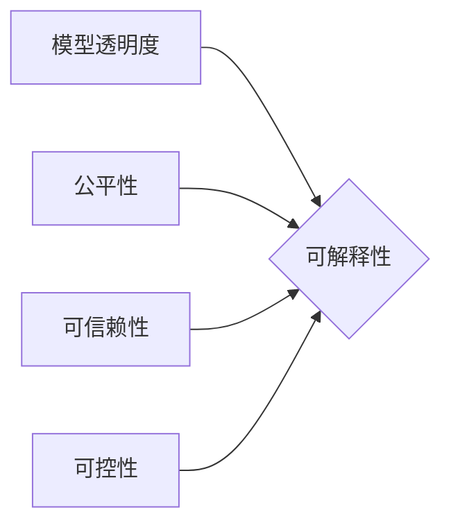

> AI大模型，可解释性，机器学习，深度学习，自然语言处理，计算机视觉，模型透明度，公平性，可信赖性

## 1. 背景介绍

近年来，人工智能（AI）技术取得了飞速发展，特别是深度学习模型在图像识别、自然语言处理等领域取得了突破性进展。然而，随着模型规模和复杂度的不断增加，其内部工作机制变得越来越难以理解，这导致了“黑盒”问题，即无法解释模型的决策过程。

可解释性（Explainability）是指能够理解和解释AI模型的决策过程的能力。对于AI模型来说，可解释性至关重要，因为它可以帮助我们：

* **提高模型的信任度:** 当我们能够理解模型的决策过程时，我们更容易信任其结果。
* **发现模型的偏差:** 可解释性可以帮助我们发现模型中的潜在偏差，并采取措施加以修正。
* **改进模型的性能:** 通过分析模型的决策过程，我们可以发现模型的不足之处，并进行改进。
* **促进AI技术的监管和伦理发展:** 可解释性可以帮助我们更好地理解AI技术的潜在风险，并制定相应的监管和伦理规范。

## 2. 核心概念与联系

可解释性是一个多方面的概念，涉及到多个领域，包括机器学习、计算机视觉、自然语言处理等。

**2.1  核心概念**

* **模型透明度:** 指模型的决策过程是否可以被人类理解和解释。
* **公平性:** 指模型的决策结果是否对所有用户都是公平的。
* **可信赖性:** 指模型的决策结果是否可靠和准确。
* **可控性:** 指人类能够对模型的决策过程进行控制和干预。

**2.2  联系**

可解释性与模型的透明度、公平性、可信赖性和可控性密切相关。

* **透明度**是可解释性的基础，只有模型的决策过程是透明的，才能对其进行解释。
* **公平性**是可解释性的一个重要目标，因为不公平的决策结果会损害用户的利益。
* **可信赖性**是可解释性的一个关键因素，只有当模型的决策结果是可靠的，才能被用户信任。
* **可控性**是可解释性的一个重要方面，因为人类应该能够对模型的决策过程进行控制和干预。

**2.3  Mermaid 流程图**



## 3. 核心算法原理 & 具体操作步骤

### 3.1  算法原理概述

可解释性算法旨在揭示AI模型的决策过程，并将其以人类可理解的方式呈现出来。常见的可解释性算法包括：

* **LIME (Local Interpretable Model-agnostic Explanations):** 基于局部线性模型对模型的决策进行解释。
* **SHAP (SHapley Additive exPlanations):** 基于博弈论的Shapley值来分配特征的重要性。
* **Partial Dependence Plots (PDP):** 通过分析特征对模型输出的影响来解释特征的重要性。
* **Individual Conditional Expectation (ICE):**  通过分析特征对单个样本的影响来解释特征的重要性。

### 3.2  算法步骤详解

以LIME算法为例，其具体操作步骤如下：

1. **选择一个样本:** 从模型的预测结果中选择一个样本。
2. **构建局部线性模型:** 在该样本附近构建一个局部线性模型，例如线性回归模型。
3. **解释模型决策:** 通过分析局部线性模型的系数，解释特征对该样本预测结果的影响。

### 3.3  算法优缺点

**LIME算法的优点:**

* 模型无关性: 可以应用于各种类型的机器学习模型。
* 局部解释性: 可以解释单个样本的预测结果。

**LIME算法的缺点:**

* 局部性: 只能解释单个样本的预测结果，无法解释模型全局的决策过程。
* 线性假设: 构建局部线性模型的假设可能不适用于所有模型。

### 3.4  算法应用领域

可解释性算法广泛应用于各个领域，例如：

* **医疗诊断:** 解释AI模型在诊断疾病方面的决策过程。
* **金融风险评估:** 解释AI模型在评估金融风险方面的决策过程。
* **自动驾驶:** 解释AI模型在驾驶决策方面的决策过程。

## 4. 数学模型和公式 & 详细讲解 & 举例说明

### 4.1  数学模型构建

LIME算法的核心思想是构建一个局部线性模型来近似原始模型的决策过程。假设原始模型为f(x)，其中x是输入特征向量，f(x)是模型的输出预测结果。LIME算法的目标是找到一个局部线性模型g(x)来近似f(x)，使得g(x)在原始模型的预测结果附近具有较高的准确性。

### 4.2  公式推导过程

LIME算法使用一个叫做“邻域”的概念来定义局部线性模型的范围。对于一个给定的样本x，LIME算法会选择一个邻域N(x)，包含与x相似的样本。然后，LIME算法会使用这些样本数据来训练一个局部线性模型g(x)。

LIME算法的目标函数是：

$$
L(g, f) = \sum_{x' \in N(x)} \left( f(x') - g(x') \right)^2
$$

其中，L(g, f)是LIME算法的目标函数，g是局部线性模型，f是原始模型，N(x)是样本x的邻域。

LIME算法的目标是找到一个局部线性模型g(x)来最小化目标函数L(g, f)。

### 4.3  案例分析与讲解

假设我们有一个分类模型，用于预测邮件是否为垃圾邮件。对于一个给定的邮件样本，LIME算法可以构建一个局部线性模型来解释模型的决策过程。例如，局部线性模型可能表明，邮件中包含“免费”和“奖品”这两个关键词，会增加邮件被分类为垃圾邮件的概率。

## 5. 项目实践：代码实例和详细解释说明

### 5.1  开发环境搭建

* Python 3.6+
* TensorFlow 2.0+
* scikit-learn 0.22+
* LIME库

### 5.2  源代码详细实现

```python
from lime import lime_tabular
from sklearn.linear_model import LogisticRegression

# 加载模型
model = LogisticRegression()
# ... 模型训练代码 ...

# 选择一个样本
sample_index = 0
sample = X[sample_index]

# 创建LIME解释器
explainer = lime_tabular.LimeTabularExplainer(X.values, feature_names=X.columns, class_names=model.classes_)

# 生成解释结果
explanation = explainer.explain_instance(sample, model.predict_proba, top_labels=1)

# 可视化解释结果
explanation.as_pyplot_figure()
```

### 5.3  代码解读与分析

* **加载模型:** 首先，我们需要加载已经训练好的机器学习模型。
* **选择样本:** 选择一个样本进行解释。
* **创建LIME解释器:** 创建一个LIME解释器对象，并指定特征名称和类别名称。
* **生成解释结果:** 使用LIME解释器解释模型对该样本的预测结果。
* **可视化解释结果:** 使用LIME提供的工具可视化解释结果。

### 5.4  运行结果展示

运行代码后，会生成一个可视化图，展示特征对模型预测结果的影响。

## 6. 实际应用场景

可解释性技术在各个领域都有着广泛的应用场景，例如：

* **医疗诊断:** 解释AI模型在诊断疾病方面的决策过程，帮助医生更好地理解模型的预测结果，并提高诊断的准确性。
* **金融风险评估:** 解释AI模型在评估金融风险方面的决策过程，帮助金融机构更好地理解风险，并制定更有效的风险管理策略。
* **自动驾驶:** 解释AI模型在驾驶决策方面的决策过程，帮助开发人员更好地理解模型的行为，并提高自动驾驶系统的安全性。

### 6.4  未来应用展望

随着AI技术的不断发展，可解释性技术将发挥越来越重要的作用。未来，可解释性技术将应用于更多领域，例如：

* **法律判决:** 解释AI模型在法律判决方面的决策过程，帮助法官更好地理解模型的预测结果，并提高判决的公正性。
* **教育评估:** 解释AI模型在教育评估方面的决策过程，帮助教师更好地了解学生的学习情况，并制定更有效的教学策略。

## 7. 工具和资源推荐

### 7.1  学习资源推荐

* **书籍:**
    * "Interpretable Machine Learning" by Christoph Molnar
    * "The Master Algorithm" by Pedro Domingos
* **在线课程:**
    * Coursera: "Machine Learning" by Andrew Ng
    * edX: "Artificial Intelligence" by Columbia University

### 7.2  开发工具推荐

* **LIME:** https://github.com/marcotcr/lime
* **SHAP:** https://github.com/slundberg/shap
* **TensorBoard:** https://www.tensorflow.org/tensorboard

### 7.3  相关论文推荐

* "Local Interpretable Model-agnostic Explanations" by Marco Tulio Ribeiro, Sameer Singh, and Carlos Guestrin
* "SHAP: A Unified Approach to Interpreting Model Predictions" by Scott Lundberg and Su-In Lee

## 8. 总结：未来发展趋势与挑战

### 8.1  研究成果总结

近年来，可解释性技术取得了显著进展，出现了许多新的算法和工具。这些算法和工具能够帮助我们更好地理解AI模型的决策过程，并提高模型的信任度和可靠性。

### 8.2  未来发展趋势

未来，可解释性技术将朝着以下几个方向发展：

* **更强大的解释能力:** 开发更强大的可解释性算法，能够解释更复杂的模型，并提供更深入的解释。
* **更广泛的应用场景:** 将可解释性技术应用于更多领域，例如法律、教育、医疗等。
* **更易于使用的工具:** 开发更易于使用的可解释性工具，方便非技术人员使用。

### 8.3  面临的挑战

可解释性技术也面临着一些挑战：

* **解释的准确性:** 现有的可解释性算法可能无法完全准确地解释模型的决策过程。
* **解释的复杂性:** 一些可解释性算法生成的解释结果可能过于复杂，难以理解。
* **解释的通用性:** 现有的可解释性算法可能无法适用于所有类型的模型。

### 8.4  研究展望

未来，我们需要继续研究和开发更强大的可解释性算法和工具，以更好地理解和信任AI模型。同时，我们还需要制定相应的规范和标准，以确保可解释性技术的健康发展。

## 9. 附录：常见问题与解答

**Q1: 为什么需要可解释性？**

**A1:** 需要可解释性是因为AI模型的决策过程往往是复杂的，难以理解。可解释性可以帮助我们更好地理解模型的决策过程，并提高模型的信任度和可靠性。

**Q2: 现有的可解释性算法有哪些？**

**A2:** 常见的可解释性算法包括LIME、SHAP、PDP和ICE等。

**Q3: 如何选择合适的可解释性算法？**

**A3:** 选择合适的可解释性算法需要考虑模型类型、解释目标和数据特点等因素。

**Q4: 可解释性技术的发展趋势是什么？**

**A4:** 未来，可解释性技术将朝着更强大的解释能力、更广泛的应用场景和更易于使用的工具的方向发展。


作者：禅与计算机程序设计艺术 / Zen and the Art of Computer Programming 
<end_of_turn>