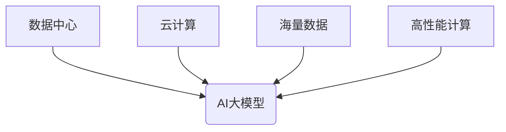

> AI大模型、数据中心、云计算、深度学习、机器学习、数据存储、数据处理、高性能计算

## 1. 背景介绍

近年来，人工智能（AI）技术取得了飞速发展，特别是深度学习算法的突破，使得AI大模型在自然语言处理、计算机视觉、语音识别等领域展现出强大的应用潜力。然而，AI大模型的训练和部署都需要海量数据和强大的计算资源，这推动了数据中心建设的快速发展。

数据中心作为AI大模型应用的基础设施，其规模、性能和可靠性直接影响着AI技术的进步和应用落地。随着AI技术的不断发展，数据中心将面临着更大的挑战和机遇。

## 2. 核心概念与联系

**2.1 数据中心**

数据中心是集中存储、处理和管理数据的物理设施，通常由大量服务器、网络设备、存储设备和电力系统组成。数据中心为企业和个人提供数据存储、计算、网络和安全服务。

**2.2 AI大模型**

AI大模型是指在海量数据上训练的深度学习模型，其参数数量巨大，具有强大的泛化能力和学习能力。常见的AI大模型包括GPT-3、BERT、DALL-E等。

**2.3 云计算**

云计算是一种按需提供的计算资源、存储资源和网络资源的服务模式，用户可以根据需要随时随地访问和使用这些资源。云计算为AI大模型的训练和部署提供了灵活、可扩展和成本效益高的解决方案。

**2.4 核心概念联系**

数据中心是AI大模型应用的基础设施，云计算为数据中心提供了灵活、可扩展和成本效益高的服务模式。AI大模型的训练和部署需要海量数据和强大的计算资源，而数据中心和云计算可以提供这些资源。



## 3. 核心算法原理 & 具体操作步骤

**3.1 算法原理概述**

AI大模型的训练主要基于深度学习算法，其中最常用的算法是反向传播算法。反向传播算法通过计算模型输出与真实值的误差，并根据误差反向传播更新模型参数，从而不断提高模型的预测精度。

**3.2 算法步骤详解**

1. **数据预处理:** 将原始数据进行清洗、转换和格式化，使其适合模型训练。
2. **模型构建:** 根据任务需求选择合适的深度学习模型架构，并初始化模型参数。
3. **前向传播:** 将预处理后的数据输入模型，并计算模型输出。
4. **损失函数计算:** 计算模型输出与真实值的误差，并使用损失函数衡量误差大小。
5. **反向传播:** 将误差反向传播到模型参数，并根据梯度下降算法更新模型参数。
6. **模型评估:** 使用验证集评估模型的性能，并根据评估结果调整模型参数和训练策略。
7. **模型保存:** 将训练好的模型保存下来，以便后续使用。

**3.3 算法优缺点**

**优点:**

* 强大的泛化能力：AI大模型在海量数据上训练，能够学习到复杂的模式和特征，从而具有较强的泛化能力。
* 高的预测精度：AI大模型的预测精度通常优于传统机器学习算法。
* 可扩展性强：AI大模型可以利用分布式训练技术，在多个节点上并行训练，从而提高训练速度和效率。

**缺点:**

* 训练成本高：AI大模型的训练需要海量数据和强大的计算资源，训练成本较高。
* 训练时间长：AI大模型的训练时间通常较长，可能需要数天甚至数周。
* 可解释性差：AI大模型的决策过程较为复杂，难以解释其决策依据。

**3.4 算法应用领域**

AI大模型在各个领域都有广泛的应用，例如：

* 自然语言处理：机器翻译、文本摘要、问答系统、聊天机器人等。
* 计算机视觉：图像识别、物体检测、图像分割、视频分析等。
* 语音识别：语音转文本、语音助手、语音搜索等。
* 金融领域：风险评估、欺诈检测、投资预测等。
* 医疗领域：疾病诊断、药物研发、医疗影像分析等。

## 4. 数学模型和公式 & 详细讲解 & 举例说明

**4.1 数学模型构建**

AI大模型的训练过程可以看作是一个优化问题，目标是找到模型参数，使得模型输出与真实值之间的误差最小化。

**4.2 公式推导过程**

损失函数通常使用均方误差（MSE）或交叉熵（Cross-Entropy）等函数来衡量模型输出与真实值之间的误差。

* 均方误差：

$$MSE = \frac{1}{n} \sum_{i=1}^{n} (y_i - \hat{y}_i)^2$$

其中，$y_i$ 是真实值，$\hat{y}_i$ 是模型输出，$n$ 是样本数量。

* 交叉熵：

$$Cross-Entropy = -\frac{1}{n} \sum_{i=1}^{n} y_i \log(\hat{y}_i) + (1-y_i) \log(1-\hat{y}_i)$$

其中，$y_i$ 是真实值（0或1），$\hat{y}_i$ 是模型输出（0到1之间的概率）。

**4.3 案例分析与讲解**

假设我们训练一个图像分类模型，目标是将图像分类为猫或狗。

* 训练数据：包含大量猫和狗的图像，以及对应的标签（猫或狗）。
* 模型输出：模型输出每个图像属于猫或狗的概率。
* 损失函数：使用交叉熵作为损失函数。

训练过程中，模型会不断调整参数，使得模型输出与真实标签之间的误差最小化。

## 5. 项目实践：代码实例和详细解释说明

**5.1 开发环境搭建**

* 操作系统：Linux
* 编程语言：Python
* 深度学习框架：TensorFlow或PyTorch
* 硬件环境：GPU

**5.2 源代码详细实现**

```python
import tensorflow as tf

# 定义模型结构
model = tf.keras.models.Sequential([
    tf.keras.layers.Conv2D(32, (3, 3), activation='relu', input_shape=(28, 28, 1)),
    tf.keras.layers.MaxPooling2D((2, 2)),
    tf.keras.layers.Conv2D(64, (3, 3), activation='relu'),
    tf.keras.layers.MaxPooling2D((2, 2)),
    tf.keras.layers.Flatten(),
    tf.keras.layers.Dense(10, activation='softmax')
])

# 定义损失函数和优化器
model.compile(loss='sparse_categorical_crossentropy',
              optimizer='adam',
              metrics=['accuracy'])

# 训练模型
model.fit(x_train, y_train, epochs=10)

# 评估模型
loss, accuracy = model.evaluate(x_test, y_test)
print('Test loss:', loss)
print('Test accuracy:', accuracy)
```

**5.3 代码解读与分析**

* 代码定义了一个简单的卷积神经网络模型，用于图像分类任务。
* 模型使用ReLU激活函数和最大池化层来提取图像特征。
* 损失函数使用稀疏类别交叉熵，优化器使用Adam优化算法。
* 模型训练使用训练数据，并评估模型性能使用测试数据。

**5.4 运行结果展示**

训练完成后，模型会输出测试集上的损失值和准确率。

## 6. 实际应用场景

**6.1 数据中心建设**

AI大模型的训练和部署需要海量数据和强大的计算资源，数据中心可以提供这些资源，并支持AI大模型的规模化部署。

**6.2 云计算平台**

云计算平台可以提供AI大模型的训练和部署服务，用户可以根据需要选择不同的模型和资源配置，并按需付费使用。

**6.3 企业应用**

AI大模型可以应用于各个行业的企业，例如：

* 金融行业：风险评估、欺诈检测、投资预测等。
* 医疗行业：疾病诊断、药物研发、医疗影像分析等。
* 制造行业：设备故障预测、生产过程优化等。

**6.4 未来应用展望**

随着AI技术的不断发展，AI大模型将在更多领域得到应用，例如：

* 自动驾驶：AI大模型可以用于车辆感知、决策和控制。
* 人机交互：AI大模型可以用于开发更自然、更智能的人机交互系统。
* 科学研究：AI大模型可以用于加速科学发现和创新。

## 7. 工具和资源推荐

**7.1 学习资源推荐**

* 深度学习书籍：
    * 《深度学习》
    * 《动手学深度学习》
* 在线课程：
    * Coursera深度学习课程
    * fast.ai深度学习课程

**7.2 开发工具推荐**

* 深度学习框架：TensorFlow、PyTorch
* 数据处理工具：Pandas、NumPy
* 可视化工具：Matplotlib、Seaborn

**7.3 相关论文推荐**

* 《Attention Is All You Need》
* 《BERT: Pre-training of Deep Bidirectional Transformers for Language Understanding》
* 《ImageNet Classification with Deep Convolutional Neural Networks》

## 8. 总结：未来发展趋势与挑战

**8.1 研究成果总结**

近年来，AI大模型取得了显著的进展，在各个领域展现出强大的应用潜力。

**8.2 未来发展趋势**

* 模型规模和能力的进一步提升
* 模型训练效率的提高
* 模型可解释性和安全性方面的研究
* 模型在更多领域和应用场景的推广

**8.3 面临的挑战**

* 数据获取和隐私保护
* 计算资源需求
* 模型可解释性和安全性
* 伦理和社会影响

**8.4 研究展望**

未来，AI大模型的研究将继续朝着更强大、更安全、更可解释的方向发展，并将在更多领域发挥重要作用。

## 9. 附录：常见问题与解答

**9.1 如何选择合适的AI大模型？**

选择合适的AI大模型需要根据具体的应用场景和需求进行考虑，例如：

* 任务类型：自然语言处理、计算机视觉、语音识别等。
* 数据规模：训练数据的大小和质量。
* 计算资源：训练和部署所需的计算资源。

**9.2 如何训练AI大模型？**

训练AI大模型需要使用深度学习框架，并根据模型架构和任务需求进行参数配置和训练。

**9.3 如何部署AI大模型？**

AI大模型可以部署在云计算平台、数据中心或边缘设备上，具体部署方式取决于应用场景和资源配置。


作者：禅与计算机程序设计艺术 / Zen and the Art of Computer Programming 
<end_of_turn>