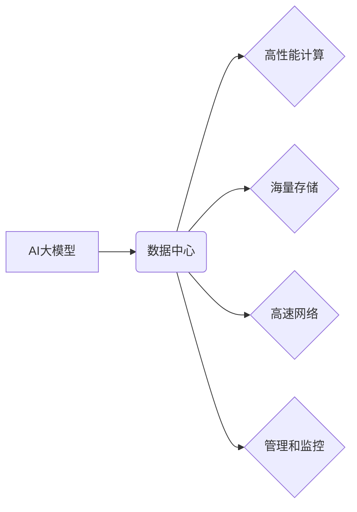

> AI大模型、数据中心、投资建设、架构设计、算法原理、实践应用、未来趋势

## 1. 背景介绍

近年来，人工智能（AI）技术取得了飞速发展，特别是大规模语言模型（LLM）的出现，如GPT-3、LaMDA等，展现出强大的文本生成、理解和翻译能力，为各行各业带来了革命性的变革。然而，训练和部署这些庞大的AI模型需要海量数据和强大的计算资源，这催生了专门用于AI大模型应用的数据中心建设需求。

传统的IT数据中心主要面向企业应用，侧重于存储、计算和网络基础设施，而AI大模型数据中心则需要具备更强大的计算能力、更高效的数据处理能力和更灵活的架构设计，以满足AI模型训练和推理的特殊需求。

## 2. 核心概念与联系

**2.1 AI大模型数据中心概念**

AI大模型数据中心是指专门为训练、部署和管理大型AI模型而构建的专用数据中心。它集成了高性能计算、海量存储、高速网络、人工智能加速器等关键技术，为AI模型的开发、训练和应用提供高效、可靠的平台。

**2.2 数据中心架构设计**

AI大模型数据中心架构设计需要考虑以下几个关键因素：

* **计算能力:** 训练大型AI模型需要大量的计算资源，因此数据中心需要配备高性能计算节点，例如GPU、TPU等加速器。
* **存储能力:** AI模型训练和推理需要海量数据，数据中心需要提供高容量、高性能的存储系统，例如分布式文件系统、对象存储等。
* **网络性能:** 高速、低延迟的网络是AI模型训练和推理的关键，数据中心需要采用高速网络技术，例如InfiniBand、RoCE等。
* **管理和监控:** 数据中心需要具备完善的管理和监控系统，以便实时监控系统运行状态、资源利用率和模型训练进度。

**2.3 核心概念关系图**



## 3. 核心算法原理 & 具体操作步骤

**3.1 算法原理概述**

深度学习是训练AI大模型的核心算法之一。它通过多层神经网络模拟人类大脑的学习过程，从海量数据中学习特征和模式，从而实现对文本、图像、语音等数据的理解和生成。

**3.2 算法步骤详解**

1. **数据预处理:** 将原始数据清洗、转换和格式化，使其适合深度学习模型的训练。
2. **模型构建:** 根据任务需求设计深度学习模型的结构，包括神经网络层数、节点数量、激活函数等参数。
3. **模型训练:** 使用训练数据训练深度学习模型，通过调整模型参数，使其能够准确地预测或生成目标输出。
4. **模型评估:** 使用测试数据评估模型的性能，例如准确率、召回率、F1-score等指标。
5. **模型部署:** 将训练好的模型部署到生产环境中，用于实际应用。

**3.3 算法优缺点**

**优点:**

* 能够学习复杂的数据模式，实现高精度预测和生成。
* 具有良好的泛化能力，能够应用于不同的任务和领域。

**缺点:**

* 训练深度学习模型需要大量的计算资源和时间。
* 模型参数数量庞大，难以解释和理解模型的决策过程。

**3.4 算法应用领域**

深度学习算法广泛应用于以下领域：

* 自然语言处理：文本分类、情感分析、机器翻译、对话系统等。
* 图像识别：物体检测、图像分类、人脸识别等。
* 语音识别：语音转文本、语音助手等。
* 医疗诊断：疾病预测、影像分析等。

## 4. 数学模型和公式 & 详细讲解 & 举例说明

**4.1 数学模型构建**

深度学习模型的核心是神经网络，它由多个层级的神经元组成。每个神经元接收来自上一层的输入信号，经过激活函数处理后，输出到下一层。

**4.2 公式推导过程**

神经网络的训练过程是通过反向传播算法来实现的。反向传播算法的核心思想是通过计算误差，反向传播到每一层的神经元，并调整每个神经元的权重和偏置，使得模型的输出更接近真实值。

**损失函数:** 用于衡量模型预测结果与真实值的差异。常见的损失函数包括均方误差（MSE）、交叉熵损失（Cross-Entropy Loss）等。

**梯度下降:** 用于更新模型参数的优化算法。梯度下降算法通过计算损失函数的梯度，沿着梯度负方向更新模型参数，从而降低损失函数的值。

**4.3 案例分析与讲解**

假设我们有一个简单的线性回归模型，用于预测房价。模型的输入特征包括房屋面积和房间数量，输出为房价。

损失函数可以定义为均方误差：

$$
L = \frac{1}{n} \sum_{i=1}^{n} (y_i - \hat{y}_i)^2
$$

其中：

* $L$ 是损失函数的值
* $n$ 是样本数量
* $y_i$ 是第 $i$ 个样本的真实房价
* $\hat{y}_i$ 是模型预测的第 $i$ 个样本的房价

梯度下降算法可以用来更新模型参数：

$$
\theta = \theta - \alpha \nabla L
$$

其中：

* $\theta$ 是模型参数
* $\alpha$ 是学习率
* $\nabla L$ 是损失函数的梯度

## 5. 项目实践：代码实例和详细解释说明

**5.1 开发环境搭建**

* 操作系统：Ubuntu 20.04
* Python 版本：3.8
* 深度学习框架：TensorFlow 2.x

**5.2 源代码详细实现**

```python
import tensorflow as tf

# 定义模型
model = tf.keras.models.Sequential([
    tf.keras.layers.Dense(64, activation='relu', input_shape=(2,)),
    tf.keras.layers.Dense(1)
])

# 编译模型
model.compile(optimizer='adam', loss='mse')

# 训练模型
model.fit(x_train, y_train, epochs=10)

# 评估模型
loss = model.evaluate(x_test, y_test)
print('Loss:', loss)

# 保存模型
model.save('house_price_model.h5')
```

**5.3 代码解读与分析**

* 代码首先定义了一个简单的线性回归模型，包含两层全连接神经元。
* 然后，模型使用Adam优化器和均方误差损失函数进行编译。
* 接着，模型使用训练数据进行训练，训练10个 epochs。
* 最后，模型使用测试数据进行评估，并保存训练好的模型。

**5.4 运行结果展示**

训练完成后，模型的损失值将输出到控制台，表示模型的预测精度。

## 6. 实际应用场景

AI大模型数据中心在各个领域都有广泛的应用场景：

* **金融科技:** 风险评估、欺诈检测、智能投资等。
* **医疗健康:** 疾病诊断、药物研发、个性化医疗等。
* **制造业:** 预测性维护、质量控制、智能制造等。
* **教育科技:** 个性化学习、智能辅导、自动批改等。

## 7. 工具和资源推荐

**7.1 学习资源推荐**

* 深度学习入门书籍：
    * 《深度学习》
    * 《动手学深度学习》
* 在线课程：
    * Coursera: 深度学习
    * Udacity: 深度学习工程师

**7.2 开发工具推荐**

* 深度学习框架：TensorFlow, PyTorch, Keras
* 云计算平台：AWS, Azure, GCP
* 数据存储系统：HDFS, Ceph, S3

**7.3 相关论文推荐**

* 《Attention Is All You Need》
* 《BERT: Pre-training of Deep Bidirectional Transformers for Language Understanding》
* 《GPT-3: Language Models are Few-Shot Learners》

## 8. 总结：未来发展趋势与挑战

**8.1 研究成果总结**

近年来，AI大模型技术取得了显著进展，模型规模不断扩大，性能不断提升。

**8.2 未来发展趋势**

* 模型规模进一步扩大，训练效率和性能将得到进一步提升。
* 模型泛化能力和鲁棒性将得到加强，能够应用于更广泛的场景。
* 模型解释性和可解释性将得到提高，能够更好地理解模型的决策过程。

**8.3 面临的挑战**

* 计算资源需求巨大，需要更高效的计算架构和算法。
* 数据安全和隐私保护问题需要得到有效解决。
* 模型的公平性和可解释性需要得到进一步研究。

**8.4 研究展望**

未来，AI大模型技术将继续朝着更强大、更智能、更安全的方向发展，为人类社会带来更多福祉。

## 9. 附录：常见问题与解答

**9.1 如何选择合适的AI大模型数据中心架构？**

选择合适的AI大模型数据中心架构需要根据具体的应用场景、模型规模、数据量和预算等因素进行综合考虑。

**9.2 如何保障AI大模型数据中心的安全性？**

需要采用多层次的安全防护措施，包括物理安全、网络安全、数据加密等，以保障数据安全和隐私保护。

**9.3 如何优化AI大模型的训练效率？**

可以采用分布式训练、模型压缩、模型并行等技术，提高训练效率。


作者：禅与计算机程序设计艺术 / Zen and the Art of Computer Programming 
<end_of_turn>