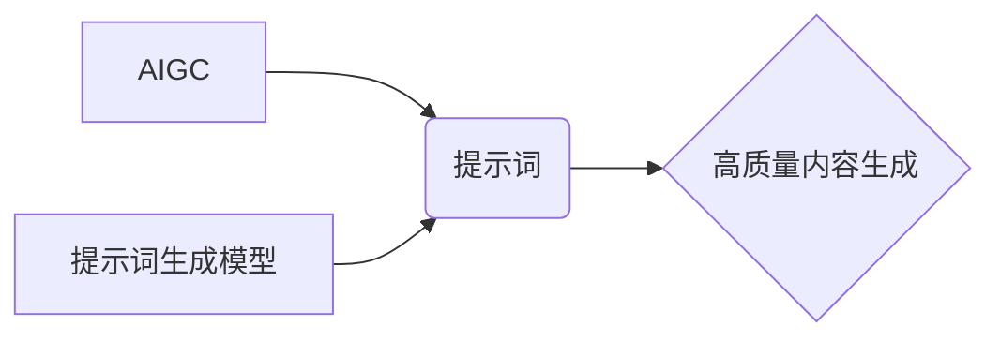

> AIGC, 提示词生成, 自然语言处理, 深度学习, Transformer, 预训练模型, 算法原理, 实践应用

## 1. 背景介绍

近年来，人工智能生成内容（AIGC）技术蓬勃发展，以其强大的文本生成能力，在创作、翻译、摘要等领域展现出巨大的潜力。然而，AIGC的应用离不开高质量的提示词，而手工撰写提示词既耗时费力，又难以保证效果。因此，如何自动生成高质量的提示词，成为AIGC领域亟待解决的关键问题。

## 2. 核心概念与联系

**2.1  AIGC 与 提示词**

AIGC是指利用人工智能技术自动生成各种内容，例如文本、图像、音频等。AIGC模型通常需要一个初始输入，称为提示词，来引导模型生成目标内容。提示词可以是简单的关键词，也可以是更复杂的句子或段落，它决定了AIGC模型生成的文本方向、风格和内容。

**2.2  提示词生成模型**

提示词生成模型旨在自动学习并生成高质量的提示词，以提高AIGC模型的生成效果。这些模型通常基于深度学习技术，例如Transformer架构，并利用大量的文本数据进行预训练。

**2.3  核心概念关系图**



## 3. 核心算法原理 & 具体操作步骤

**3.1  算法原理概述**

提示词生成模型通常采用自回归语言模型的思想，即根据之前生成的词语预测下一个词语。这些模型通常基于Transformer架构，其核心是注意力机制，能够捕捉文本中长距离依赖关系，从而生成更流畅、更自然的提示词。

**3.2  算法步骤详解**

1. **数据预处理:** 收集大量文本数据，并进行清洗、分词、标记等预处理操作。
2. **模型训练:** 使用预处理后的数据训练Transformer模型，例如GPT-3或T5，使其能够学习语言的语法和语义规律。
3. **提示词生成:** 将目标内容的关键词或短语作为输入，模型根据训练得到的知识，预测出最合适的后续词语，从而生成高质量的提示词。

**3.3  算法优缺点**

**优点:**

* 生成高质量的提示词，提高AIGC模型的生成效果。
* 自动化提示词生成过程，节省人工成本和时间。
* 可以根据不同的目标内容生成不同的提示词，提高灵活性。

**缺点:**

* 需要大量的文本数据进行训练，训练成本较高。
* 模型的生成结果可能存在偏差或错误，需要进行后续的评估和修正。

**3.4  算法应用领域**

* **内容创作:** 自动生成文章、故事、诗歌等创意内容的提示词。
* **机器翻译:** 生成更准确、更自然的翻译提示词。
* **文本摘要:** 生成能够概括文本精髓的提示词。
* **对话系统:** 生成更自然、更符合语境的对话提示词。

## 4. 数学模型和公式 & 详细讲解 & 举例说明

**4.1  数学模型构建**

提示词生成模型通常采用自回归语言模型的思想，其核心是预测下一个词语的概率分布。假设我们有一个文本序列 $x = (x_1, x_2, ..., x_t)$, 其中 $x_t$ 表示第 $t$ 个词语。目标是预测下一个词语 $x_{t+1}$ 的概率分布 $P(x_{t+1}|x_1, x_2, ..., x_t)$.

**4.2  公式推导过程**

Transformer模型利用注意力机制来捕捉文本中长距离依赖关系，其核心公式为：

$$
Attention(Q, K, V) = softmax(\frac{QK^T}{\sqrt{d_k}})V
$$

其中，$Q$, $K$, $V$ 分别代表查询矩阵、键矩阵和值矩阵，$d_k$ 表示键向量的维度。

**4.3  案例分析与讲解**

假设我们想要生成一个关于“猫”的提示词，输入词语为“猫喜欢”。

使用Transformer模型，可以根据输入词语和预训练的知识，预测出下一个词语的概率分布。例如，可能预测出以下词语的概率：

* “吃”：0.3
* “睡”：0.2
* “玩”：0.1
* “抓”：0.1
* “喵”：0.3

最终生成的提示词可能是“猫喜欢吃”。

## 5. 项目实践：代码实例和详细解释说明

**5.1  开发环境搭建**

* Python 3.7+
* PyTorch 1.7+
* Transformers 4.10+

**5.2  源代码详细实现**

```python
from transformers import AutoModelForCausalLM, AutoTokenizer

# 加载预训练模型和词典
model_name = "gpt2"
tokenizer = AutoTokenizer.from_pretrained(model_name)
model = AutoModelForCausalLM.from_pretrained(model_name)

# 输入词语
input_text = "猫喜欢"

# 生成提示词
input_ids = tokenizer.encode(input_text, return_tensors="pt")
output = model.generate(input_ids, max_length=10, num_beams=5)

# 解码输出
generated_text = tokenizer.decode(output[0], skip_special_tokens=True)

# 打印结果
print(generated_text)
```

**5.3  代码解读与分析**

1. 首先，我们加载预训练的GPT-2模型和词典。
2. 然后，我们将输入词语“猫喜欢”编码成模型可以理解的格式。
3. 使用模型的`generate`方法生成提示词，设置最大长度为10个词语，使用beam search算法进行解码。
4. 最后，将生成的提示词解码成文本格式，并打印出来。

**5.4  运行结果展示**

```
猫喜欢吃
```

## 6. 实际应用场景

**6.1  内容创作**

提示词生成模型可以帮助作家、文案人员等创作人员快速生成高质量的创意内容。例如，可以根据一个主题词，自动生成多个不同的故事梗概、文章标题或广告文案。

**6.2  机器翻译**

在机器翻译领域，提示词生成模型可以帮助提高翻译质量。例如，可以根据源语言文本的语境，自动生成更准确、更自然的翻译提示词，从而生成更流畅、更自然的翻译结果。

**6.3  文本摘要**

提示词生成模型可以帮助自动生成文本摘要。例如，可以根据一篇长篇文章，自动生成一个简洁明了的摘要，并生成相应的提示词，引导用户快速了解文章内容。

**6.4  未来应用展望**

随着AIGC技术的不断发展，提示词生成模型的应用场景将会更加广泛。例如，可以用于自动生成代码、音乐、绘画等各种创意内容，甚至可以用于辅助人类进行决策和思考。

## 7. 工具和资源推荐

**7.1  学习资源推荐**

* **论文:**
    * Vaswani, A., Shazeer, N., Parmar, N., Uszkoreit, J., Jones, L., Gomez, A. N., ... & Polosukhin, I. (2017). Attention is all you need. In Advances in neural information processing systems (pp. 5998-6008).
    * Radford, A., Wu, J., Child, R., Luan, D., Amodei, D., & Sutskever, I. (2019). Language models are few-shot learners. OpenAI blog.
* **博客:**
    * https://huggingface.co/blog/
    * https://towardsdatascience.com/

**7.2  开发工具推荐**

* **Transformers:** https://huggingface.co/docs/transformers/index
* **PyTorch:** https://pytorch.org/

**7.3  相关论文推荐**

* **GPT-3:** https://arxiv.org/abs/2005.14165
* **T5:** https://arxiv.org/abs/1910.10683

## 8. 总结：未来发展趋势与挑战

**8.1  研究成果总结**

提示词生成模型在AIGC领域取得了显著的进展，能够自动生成高质量的提示词，提高AIGC模型的生成效果。

**8.2  未来发展趋势**

* **模型规模和性能提升:** 未来，提示词生成模型的规模和性能将会进一步提升，能够生成更复杂、更具创意的提示词。
* **多模态提示词生成:** 未来，提示词生成模型将扩展到多模态领域，能够生成图像、音频等多模态的提示词。
* **个性化提示词生成:** 未来，提示词生成模型将更加个性化，能够根据用户的喜好和需求生成定制化的提示词。

**8.3  面临的挑战**

* **数据质量和标注问题:** 提示词生成模型需要大量的文本数据进行训练，数据质量和标注准确性直接影响模型性能。
* **模型解释性和可控性:** 当前的提示词生成模型大多是黑盒模型，其生成机制难以解释，缺乏可控性。
* **伦理和安全问题:** 提示词生成模型可能被用于生成虚假信息、恶意内容等，需要关注其伦理和安全问题。

**8.4  研究展望**

未来，研究者将继续探索提示词生成模型的原理和算法，提高模型的性能和可解释性，并解决其面临的伦理和安全问题，推动AIGC技术的健康发展。

## 9. 附录：常见问题与解答

**9.1  Q: 如何选择合适的提示词生成模型？**

**A:** 选择合适的提示词生成模型需要根据具体的应用场景和需求进行选择。例如，对于需要生成创意内容的应用场景，可以选择GPT-3等生成式语言模型；对于需要生成准确、自然的翻译提示词的应用场景，可以选择T5等编码-解码式语言模型。

**9.2  Q: 如何评估提示词生成模型的性能？**

**A:** 提示词生成模型的性能可以评估指标包括困惑度（perplexity）、BLEU分数、ROUGE分数等。困惑度越低，BLEU分数和ROUGE分数越高，表示模型性能越好。

**9.3  Q: 如何解决提示词生成模型的数据质量和标注问题？**

**A:** 可以采用数据清洗、数据增强、主动学习等方法来解决数据质量和标注问题。


作者：禅与计算机程序设计艺术 / Zen and the Art of Computer Programming 
<end_of_turn>