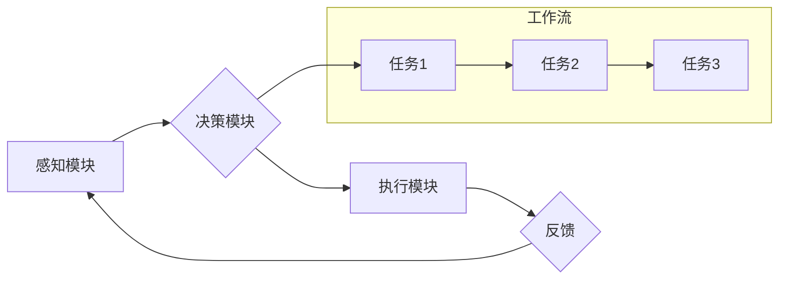

> AI代理,视频游戏,自适应机制,工作流,人工智能,游戏开发

## 1. 背景介绍

近年来，人工智能（AI）技术在各个领域取得了长足进步，并逐渐渗透到视频游戏行业。AI代理作为一种智能化游戏角色，能够自主学习、决策和行动，为玩家提供更具沉浸性和挑战性的游戏体验。然而，传统的AI代理通常依赖于预先设定的规则和行为树，缺乏对游戏环境的动态适应能力。随着游戏复杂度的不断提升，传统的AI代理面临着越来越大的挑战。

为了解决这一问题，研究者们提出了AI代理工作流（AI Agent WorkFlow）的概念，旨在构建一种能够根据游戏环境变化自适应调整行为的AI代理系统。AI代理工作流通过将AI代理的行为分解成一系列可执行的任务，并利用机器学习算法和状态机等技术，实现对任务执行顺序、参数和策略的动态调整，从而使AI代理能够更灵活地应对游戏中的各种情况。

## 2. 核心概念与联系

### 2.1 AI代理

AI代理是指能够自主学习、决策和行动的智能化游戏角色。它通常由以下几个核心组件组成：

* **感知模块:**负责收集游戏环境信息，例如玩家位置、游戏目标、敌方行动等。
* **决策模块:**根据感知到的信息，选择最优的行动策略。
* **执行模块:**执行决策模块确定的行动，例如移动、攻击、使用道具等。

### 2.2 工作流

工作流是一种描述业务流程的模型，它将业务流程分解成一系列可执行的任务，并定义了任务之间的执行顺序和依赖关系。

### 2.3 自适应机制

自适应机制是指AI代理能够根据游戏环境变化动态调整行为的机制。它通常利用机器学习算法和状态机等技术，对任务执行顺序、参数和策略进行调整。

**AI代理工作流架构图**



## 3. 核心算法原理 & 具体操作步骤

### 3.1 算法原理概述

AI代理工作流的核心算法原理是基于状态机和机器学习算法的结合。状态机用于描述AI代理的行为状态和状态转换规则，而机器学习算法则用于学习和优化任务执行策略。

### 3.2 算法步骤详解

1. **定义状态机:**根据游戏环境和AI代理的行为，定义AI代理可能处于的不同状态，以及状态之间的转换规则。
2. **设计任务库:**将AI代理的行为分解成一系列可执行的任务，并为每个任务定义相应的执行条件和目标。
3. **训练机器学习模型:**利用机器学习算法，训练一个模型来预测最佳的任务执行顺序和参数。
4. **构建工作流:**根据状态机和任务库，构建AI代理的工作流，定义任务之间的执行顺序和依赖关系。
5. **运行工作流:**根据游戏环境的变化，AI代理根据状态机规则切换状态，并根据机器学习模型的预测，执行相应的任务。

### 3.3 算法优缺点

**优点:**

* **自适应性强:**能够根据游戏环境变化动态调整行为。
* **可扩展性好:**可以轻松添加新的任务和行为。
* **可维护性高:**工作流的结构清晰，易于理解和维护。

**缺点:**

* **训练复杂:**需要大量的训练数据和计算资源。
* **实时性要求高:**需要实时地根据游戏环境变化调整行为。

### 3.4 算法应用领域

AI代理工作流在视频游戏行业具有广泛的应用前景，例如：

* **NPC行为设计:**为游戏中的非玩家角色（NPC）设计更智能、更逼真的行为。
* **游戏难度调节:**根据玩家的技能水平动态调整游戏难度。
* **游戏剧情生成:**利用AI代理工作流生成更具随机性和沉浸感的剧情。

## 4. 数学模型和公式 & 详细讲解 & 举例说明

### 4.1 数学模型构建

AI代理工作流的数学模型可以基于状态机和决策树的理论构建。

* **状态机:**每个状态代表AI代理的行为模式，状态之间的转换由条件触发。
* **决策树:**决策树用于表示AI代理在不同状态下，根据不同条件选择不同行动的策略。

### 4.2 公式推导过程

* **状态转移概率:**

$$P(s_t|s_{t-1},a_{t-1})$$

其中，$s_t$表示当前状态，$s_{t-1}$表示前一个状态，$a_{t-1}$表示前一个动作。

* **奖励函数:**

$$R(s_t,a_t)$$

其中，$s_t$表示当前状态，$a_t$表示当前动作。

* **价值函数:**

$$V(s_t) = \max_{a_t} \sum_{t=1}^{T} \gamma^t R(s_t,a_t)$$

其中，$\gamma$表示折扣因子，$T$表示时间步长。

### 4.3 案例分析与讲解

假设一个AI代理在游戏中需要寻找宝藏。我们可以构建一个状态机，其中每个状态代表AI代理的当前位置，例如“起点”、“房间A”、“房间B”等。状态之间的转换由AI代理的动作触发，例如“移动”、“打开门”等。

我们可以使用决策树来表示AI代理在不同状态下选择不同行动的策略。例如，在“起点”状态下，AI代理可以选择“向北移动”或“向东移动”。在“房间A”状态下，AI代理可以选择“打开门”或“继续探索”。

通过训练机器学习模型，我们可以学习到最佳的决策树，从而使AI代理能够更有效地寻找宝藏。

## 5. 项目实践：代码实例和详细解释说明

### 5.1 开发环境搭建

* **操作系统:** Linux/macOS/Windows
* **编程语言:** Python
* **库依赖:** TensorFlow/PyTorch、OpenAI Gym、Pygame

### 5.2 源代码详细实现

```python
# 导入必要的库
import tensorflow as tf
from openai_gym import make

# 创建游戏环境
env = make('CartPole-v1')

# 定义状态机
class StateMachine:
    def __init__(self):
        self.current_state = 'start'

    def transition(self, action):
        # 根据动作和当前状态，更新状态
        if self.current_state == 'start' and action == 'move_right':
            self.current_state = 'room_a'
        elif self.current_state == 'room_a' and action == 'open_door':
            self.current_state = 'room_b'
        # ...

# 定义任务库
tasks = {
    'move_right': lambda env: env.step(1)[0],
    'open_door': lambda env: env.step(2)[0],
    # ...
}

# 定义机器学习模型
model = tf.keras.Sequential([
    tf.keras.layers.Dense(128, activation='relu'),
    tf.keras.layers.Dense(64, activation='relu'),
    tf.keras.layers.Dense(len(tasks), activation='softmax')
])

# 训练模型
# ...

# 运行工作流
state_machine = StateMachine()
while True:
    # 获取当前状态
    current_state = state_machine.current_state

    # 根据状态选择任务
    task = model.predict(current_state)[0]

    # 执行任务
    task_name = list(tasks.keys())[list(tasks.values()).index(max(task))]
    tasks[task_name](env)

    # 更新状态
    state_machine.transition(task_name)
```

### 5.3 代码解读与分析

* **状态机:** `StateMachine`类定义了AI代理的行为状态和状态转换规则。
* **任务库:** `tasks`字典定义了AI代理可能执行的任务，以及每个任务的执行函数。
* **机器学习模型:** `model`是一个深度神经网络，用于预测最佳的任务执行顺序。
* **工作流:**主循环根据状态机规则切换状态，并根据机器学习模型的预测，执行相应的任务。

### 5.4 运行结果展示

运行代码后，AI代理将在游戏中根据状态机规则和机器学习模型的预测，执行相应的任务，例如移动、打开门等。最终目标是完成游戏中的特定任务，例如找到宝藏。

## 6. 实际应用场景

### 6.1 游戏NPC行为设计

AI代理工作流可以用于设计更智能、更逼真的游戏NPC行为。例如，在RPG游戏中，AI代理可以根据玩家的行为和对话，做出不同的反应，并提供更丰富的剧情体验。

### 6.2 游戏难度调节

AI代理工作流可以根据玩家的技能水平动态调整游戏难度。例如，在射击游戏中，AI代理可以根据玩家的射击精度和反应速度，调整敌人的攻击强度和移动速度。

### 6.3 游戏剧情生成

AI代理工作流可以用于生成更具随机性和沉浸感的剧情。例如，在冒险游戏中，AI代理可以根据玩家的选择和游戏环境的变化，生成不同的剧情分支和结局。

### 6.4 未来应用展望

随着AI技术的不断发展，AI代理工作流在视频游戏行业将有更广泛的应用前景。例如，可以用于生成更复杂的AI角色，实现更逼真的游戏世界，并为玩家提供更个性化的游戏体验。

## 7. 工具和资源推荐

### 7.1 学习资源推荐

* **书籍:**
    * 《Reinforcement Learning: An Introduction》
    * 《Deep Learning》
* **在线课程:**
    * Coursera: Reinforcement Learning Specialization
    * Udacity: Deep Learning Nanodegree

### 7.2 开发工具推荐

* **游戏引擎:** Unity、Unreal Engine
* **机器学习框架:** TensorFlow、PyTorch
* **AI代理库:** OpenAI Gym

### 7.3 相关论文推荐

* **《Deep Reinforcement Learning with Double Q-learning》**
* **《Proximal Policy Optimization Algorithms》**
* **《Asynchronous Methods for Deep Reinforcement Learning》**

## 8. 总结：未来发展趋势与挑战

### 8.1 研究成果总结

AI代理工作流为视频游戏行业带来了新的可能性，能够实现更智能、更逼真的游戏体验。

### 8.2 未来发展趋势

* **更复杂的AI角色:** 未来，AI代理工作流将用于设计更复杂的AI角色，例如具有情感、记忆和学习能力的角色。
* **更逼真的游戏世界:** AI代理工作流将用于构建更逼真的游戏世界，例如具有动态变化的环境和更复杂的NPC行为。
* **更个性化的游戏体验:** AI代理工作流将用于提供更个性化的游戏体验，例如根据玩家的喜好和行为，调整游戏难度和剧情。

### 8.3 面临的挑战

* **训练复杂度:** 训练复杂的AI代理工作流需要大量的计算资源和训练数据。
* **实时性要求:** AI代理工作流需要实时地根据游戏环境变化调整行为，这对计算性能提出了更高的要求。
* **伦理问题:** 随着AI代理越来越智能，其行为可能会引发伦理问题，例如AI代理是否具有自主意识，AI代理的行为是否会对玩家造成负面影响。

### 8.4 研究展望

未来，研究者们将继续探索AI代理工作流的应用潜力，并致力于解决其面临的挑战。相信随着技术的不断发展，AI代理工作流将为视频游戏行业带来更多创新和突破。

## 9. 附录：常见问题与解答

* **Q1: AI代理工作流与传统AI代理有什么区别？**

**A1