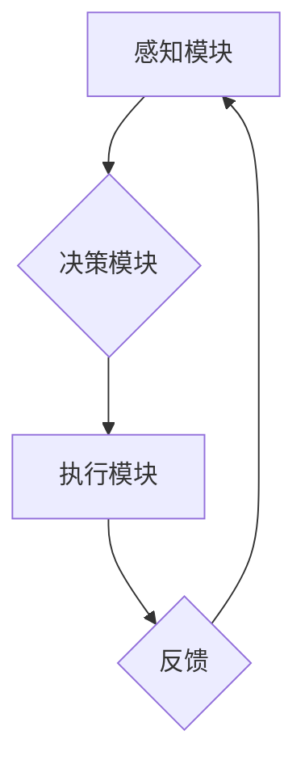

> 深度学习、智能代理、架构设计、可拓展性、算法原理、数学模型、项目实践

## 1. 背景介绍

深度学习作为人工智能领域最前沿的技术之一，在图像识别、自然语言处理、语音识别等领域取得了突破性的进展。智能代理作为一种能够自主学习和决策的智能体，在自动化、机器人、游戏等领域具有广泛的应用前景。将深度学习与智能代理相结合，可以构建出更智能、更灵活、更适应复杂环境的智能系统。

然而，构建高性能、可拓展的深度学习智能代理仍然面临着诸多挑战：

* **算法复杂性:** 深度学习算法本身非常复杂，需要大量的计算资源和训练数据。
* **架构设计:** 如何设计一个能够有效地整合深度学习模型和智能代理功能的架构是一个关键问题。
* **可拓展性:**  随着任务复杂度的增加，智能代理需要不断扩展其功能和知识库，而现有的架构往往难以满足这种需求。

## 2. 核心概念与联系

**2.1 深度学习**

深度学习是一种基于多层神经网络的机器学习方法。它能够从海量数据中学习复杂的特征表示，并进行高精度预测和决策。

**2.2 智能代理**

智能代理是一种能够自主感知环境、做出决策并执行行动的软件实体。它通常具有以下特征：

* **自主性:** 智能代理能够独立地感知环境信息并做出决策。
* **目标导向性:** 智能代理的行为目标是实现预先设定的目标。
* **交互性:** 智能代理能够与环境和其他代理进行交互。

**2.3 深度学习智能代理**

深度学习智能代理将深度学习算法与智能代理技术相结合，构建出能够自主学习、决策和执行任务的智能系统。

**2.4 架构设计**

深度学习智能代理的架构设计需要考虑以下几个方面：

* **感知模块:** 用于获取环境信息，例如图像、文本、传感器数据等。
* **决策模块:** 用于根据感知到的信息做出决策，例如选择行动、制定策略等。
* **执行模块:** 用于执行决策，例如控制机器人运动、生成文本等。
* **学习模块:** 用于更新模型参数，提高代理的学习能力。

**2.5 Mermaid 流程图**



## 3. 核心算法原理 & 具体操作步骤

### 3.1 算法原理概述

深度学习智能代理的核心算法通常是基于强化学习的，例如深度Q网络（DQN）和策略梯度算法。

* **强化学习:** 强化学习是一种监督学习方法，它通过奖励机制来引导智能代理学习最优的行为策略。

* **深度Q网络 (DQN):** DQN是一种结合深度神经网络和Q学习的算法，它能够学习一个状态-动作价值函数，用于评估在给定状态下执行特定动作的价值。

* **策略梯度算法:** 策略梯度算法通过优化策略网络的参数来最大化奖励的期望值。

### 3.2 算法步骤详解

**3.2.1 深度Q网络 (DQN)**

1. **初始化:** 初始化一个深度神经网络，作为Q网络，并随机初始化网络参数。
2. **经验回放:** 收集环境交互产生的经验数据，并将其存储在经验回放缓冲池中。
3. **训练:** 从经验回放缓冲池中随机抽取样本，并使用Q网络估计每个样本的状态-动作价值函数。
4. **更新:** 使用目标网络的价值函数作为目标值，通过反向传播算法更新Q网络的参数。
5. **目标网络更新:** 定期更新目标网络的参数，使其与Q网络保持一致。

**3.2.2 策略梯度算法**

1. **初始化:** 初始化一个策略网络，并随机初始化网络参数。
2. **采样:** 根据策略网络输出的概率分布，从动作空间中采样动作。
3. **执行:** 在环境中执行采样的动作，并获得奖励和下一个状态。
4. **更新:** 使用策略梯度算法更新策略网络的参数，使其能够最大化奖励的期望值。

### 3.3 算法优缺点

**3.3.1 深度Q网络 (DQN)**

* **优点:** 能够学习复杂的策略，并有效地解决离散动作空间的问题。
* **缺点:** 训练过程可能比较慢，并且容易出现震荡问题。

**3.3.2 策略梯度算法**

* **优点:** 训练过程相对稳定，并且能够学习连续动作空间的策略。
* **缺点:** 策略更新可能比较不稳定，并且需要仔细选择奖励函数。

### 3.4 算法应用领域

深度学习智能代理的算法在以下领域具有广泛的应用前景：

* **机器人控制:** 构建能够自主导航、避障、抓取物体的智能机器人。
* **游戏 AI:** 开发能够与人类玩家进行对抗的智能游戏对手。
* **自动驾驶:** 构建能够自主驾驶的自动驾驶汽车。
* **金融交易:** 开发能够进行智能投资和风险管理的金融交易系统。

## 4. 数学模型和公式 & 详细讲解 & 举例说明

### 4.1 数学模型构建

**4.1.1 状态空间:** 智能代理感知到的环境信息可以表示为一个状态向量，例如机器人位置、速度、传感器数据等。

**4.1.2 动作空间:** 智能代理可以执行的一系列动作，例如移动、旋转、抓取等，可以表示为一个动作空间。

**4.1.3 奖励函数:** 奖励函数用于评估智能代理在特定状态下执行特定动作的价值，它可以是一个标量值，例如完成任务的奖励或避免碰撞的惩罚。

**4.1.4 策略网络:** 策略网络是一个深度神经网络，它将状态向量作为输入，输出动作概率分布。

### 4.2 公式推导过程

**4.2.1 深度Q网络 (DQN)**

目标是学习一个状态-动作价值函数 $Q(s,a)$，它表示在状态 $s$ 下执行动作 $a$ 的期望累积奖励。

* **Bellman 方程:** $Q(s,a) = R(s,a) + \gamma \max_{a'} Q(s',a')$

其中:

* $R(s,a)$ 是在状态 $s$ 下执行动作 $a$ 得到的即时奖励。
* $\gamma$ 是折扣因子，控制未来奖励的权重。
* $s'$ 是执行动作 $a$ 后进入的下一个状态。

* **损失函数:** $L = \mathbb{E}[(y - Q(s,a))^2]$

其中:

* $y = R(s,a) + \gamma \max_{a'} Q(s',a')$ 是目标值。

**4.2.2 策略梯度算法**

目标是优化策略网络的参数，使其能够最大化奖励的期望值。

* **策略梯度:** $\nabla_{\theta} J(\theta) = \mathbb{E}_{\pi_{\theta}}[\nabla_{\theta} \log \pi_{\theta}(a|s) \cdot R(s,a)]$

其中:

* $J(\theta)$ 是策略网络的参数 $\theta$ 的奖励函数。
* $\pi_{\theta}(a|s)$ 是策略网络输出的动作概率分布。

### 4.3 案例分析与讲解

**4.3.1 CartPole 环境**

CartPole 环境是一个经典的强化学习环境，其中一个车在轨道上移动，需要通过控制车轮的角度来保持平衡。

* **状态空间:** 车的位置、速度、车轮的角度、车轮的速度。
* **动作空间:** 向左或向右转动车轮。
* **奖励函数:** 完成一个时间步的奖励为1，否则为0。

**4.3.2 DQN 算法应用**

使用 DQN 算法可以训练一个智能代理，能够在 CartPole 环境中保持平衡。

* **训练过程:** 智能代理在环境中交互，收集经验数据，并使用 DQN 算法更新 Q 网络的参数。
* **测试过程:** 使用训练好的 Q 网络，智能代理能够在新的环境中保持平衡。

## 5. 项目实践：代码实例和详细解释说明

### 5.1 开发环境搭建

* **操作系统:** Ubuntu 18.04
* **Python 版本:** 3.7
* **深度学习框架:** TensorFlow 2.0
* **其他依赖:** numpy, matplotlib

### 5.2 源代码详细实现

```python
import tensorflow as tf
import numpy as np

# 定义深度Q网络
class DQN(tf.keras.Model):
    def __init__(self, state_size, action_size):
        super(DQN, self).__init__()
        self.dense1 = tf.keras.layers.Dense(64, activation='relu')
        self.dense2 = tf.keras.layers.Dense(32, activation='relu')
        self.output = tf.keras.layers.Dense(action_size)

    def call(self, state):
        x = self.dense1(state)
        x = self.dense2(x)
        return self.output(x)

# 定义训练函数
def train(dqn, experience_replay_buffer, batch_size):
    # 从经验回放缓冲池中采样数据
    states, actions, rewards, next_states, dones = experience_replay_buffer.sample(batch_size)

    # 计算目标值
    with tf.GradientTape() as tape:
        # 使用目标网络计算下一个状态的 Q 值
        next_q_values = target_dqn(next_states)
        # 计算目标值
        targets = rewards + gamma * tf.reduce_max(next_q_values, axis=1) * (1 - dones)

    # 计算损失
    q_values = dqn(states)
    loss = tf.keras.losses.MeanSquaredError()(targets, q_values[:, actions])

    # 更新网络参数
    gradients = tape.gradient(loss, dqn.trainable_variables)
    optimizer.apply_gradients(zip(gradients, dqn.trainable_variables))

# ... 其他代码 ...
```

### 5.3 代码解读与分析

* **DQN 类:** 定义了深度Q网络的结构，包括两个全连接层和一个输出层。
* **train 函数:** 定义了训练函数，包括从经验回放缓冲池中采样数据、计算目标值、计算损失和更新网络参数。
* **其他代码:** 包括环境初始化、智能代理交互、经验数据存储等代码。

### 5.4 运行结果展示

训练完成后，智能代理能够在 CartPole 环境中保持平衡。

## 6. 实际应用场景

### 6.1 智能机器人控制

深度学习智能代理可以用于控制机器人执行复杂的任务，例如自主导航、避障、抓取物体等。

### 6.2 游戏 AI

深度学习智能代理可以用于开发能够与人类玩家进行对抗的智能游戏对手，例如围棋、Go、Dota 2 等。

### 6.3 自动驾驶

深度学习智能代理可以用于构建能够自主驾驶的自动驾驶汽车，例如感知环境、规划路径、控制车辆等。

### 6.4 未来应用展望

随着深度学习技术的不断发展，深度学习智能代理将在更多领域得到应用，例如医疗诊断、金融交易、个性化推荐等。

## 7. 工具和资源推荐

### 7.1 学习资源推荐

* **书籍:**
    * 深度学习
    * 强化学习
* **在线课程:**
    * Coursera: 深度学习
    * Udacity: 强化学习
* **博客:**
    * OpenAI Blog
    * DeepMind Blog

### 7.2 开发工具推荐

* **深度学习框架:** TensorFlow, PyTorch
* **强化学习库:** Stable Baselines3, Dopamine
* **仿真环境:** OpenAI Gym, MuJoCo

### 