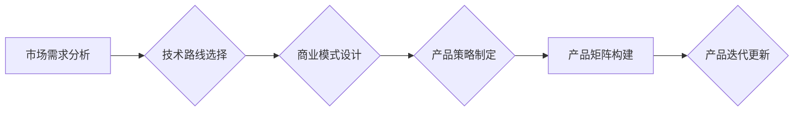

> AI创业,产品矩阵,商业模式,技术路线,市场定位,产品策略,数据驱动,敏捷开发

## 1. 背景介绍

人工智能（AI）技术近年来发展迅速，已渗透到各个行业，为企业带来了巨大的变革机遇。众多AI创业公司应运而生，致力于将AI技术应用于实际场景，创造新的价值。然而，在激烈的市场竞争中，如何构建一个成功的AI产品矩阵，成为AI创业公司面临的重大挑战。

传统的软件产品开发模式难以直接应用于AI领域。AI产品通常需要大量的训练数据、复杂的算法模型和强大的计算能力，其开发周期长、成本高，且需要不断迭代优化。因此，AI创业公司需要构建一个灵活、高效、数据驱动的产品矩阵，以应对市场变化和用户需求的不断演变。

## 2. 核心概念与联系

**2.1 产品矩阵的概念**

产品矩阵是指一个公司或组织为满足不同用户需求而开发的一系列产品或服务的组合。它通常以产品类别、功能、价格等维度进行组织和排列，形成一个清晰的结构，方便用户理解和选择。

**2.2 AI产品矩阵的特点**

与传统产品矩阵相比，AI产品矩阵具有以下特点：

* **数据驱动:** AI产品依赖于海量数据进行训练和优化，数据质量和数据量直接影响产品的性能和效果。
* **算法模型:** AI产品的核心是算法模型，模型的复杂度、精度和效率决定了产品的竞争力。
* **迭代更新:** AI产品需要不断迭代更新，以适应不断变化的市场环境和用户需求。
* **个性化定制:** AI产品可以根据用户的个性化需求进行定制，提供更精准的服务。

**2.3 AI产品矩阵的构建**

AI创业公司构建产品矩阵需要考虑以下几个关键因素：

* **市场需求:** 深入了解目标用户的需求和痛点，确定产品的核心价值。
* **技术路线:** 选择合适的AI技术路线，根据产品的特点和功能需求进行技术选型。
* **商业模式:** 设计合理的商业模式，确保产品的可持续发展。
* **产品策略:** 制定清晰的产品策略，明确产品的定位、目标用户和竞争优势。

**2.4 产品矩阵架构**



## 3. 核心算法原理 & 具体操作步骤

**3.1 算法原理概述**

深度学习是AI领域最热门的技术之一，其核心是多层神经网络。深度学习算法能够自动从海量数据中学习特征，并进行预测或分类。常见的深度学习算法包括卷积神经网络（CNN）、循环神经网络（RNN）和生成对抗网络（GAN）。

**3.2 算法步骤详解**

深度学习算法的训练过程通常包括以下步骤：

1. **数据预处理:** 将原始数据进行清洗、转换和格式化，使其适合深度学习模型的训练。
2. **模型构建:** 根据具体的应用场景选择合适的深度学习模型架构，并定义模型参数。
3. **模型训练:** 使用训练数据训练深度学习模型，通过调整模型参数，使模型的预测或分类性能达到最佳。
4. **模型评估:** 使用测试数据评估模型的性能，并进行必要的调整和优化。
5. **模型部署:** 将训练好的模型部署到实际应用场景中，用于进行预测或分类。

**3.3 算法优缺点**

**优点:**

* 能够自动学习特征，无需人工特征工程。
* 性能优异，在图像识别、自然语言处理等领域取得了突破性进展。
* 可处理海量数据，适用于大规模数据分析。

**缺点:**

* 训练数据量大，需要大量的计算资源和时间。
* 模型复杂度高，难以解释模型的决策过程。
* 对数据质量要求高，数据噪声或偏差会影响模型性能。

**3.4 算法应用领域**

深度学习算法广泛应用于以下领域：

* **图像识别:** 人脸识别、物体检测、图像分类。
* **自然语言处理:** 机器翻译、文本摘要、情感分析。
* **语音识别:** 语音转文本、语音助手。
* **推荐系统:** 商品推荐、内容推荐。
* **医疗诊断:** 病情预测、疾病诊断。

## 4. 数学模型和公式 & 详细讲解 & 举例说明

**4.1 数学模型构建**

深度学习模型通常基于神经网络结构，其数学模型可以表示为一系列的矩阵运算和激活函数。

**4.2 公式推导过程**

深度学习模型的训练过程基于梯度下降算法，其核心公式为：

$$
\theta = \theta - \alpha \nabla L(\theta)
$$

其中：

* $\theta$ 表示模型参数。
* $\alpha$ 表示学习率。
* $\nabla L(\theta)$ 表示损失函数 $L(\theta)$ 对参数 $\theta$ 的梯度。

**4.3 案例分析与讲解**

以卷积神经网络（CNN）为例，其数学模型可以表示为：

$$
y = f(W_L * ReLU(W_{L-1} * ... * ReLU(W_1 * x)) + b_L)
$$

其中：

* $x$ 表示输入数据。
* $W_i$ 表示第 $i$ 层卷积核。
* $ReLU$ 表示激活函数。
* $b_i$ 表示第 $i$ 层偏置项。
* $f$ 表示输出层激活函数。

## 5. 项目实践：代码实例和详细解释说明

**5.1 开发环境搭建**

使用Python语言和深度学习框架TensorFlow或PyTorch进行开发。

**5.2 源代码详细实现**

```python
import tensorflow as tf

# 定义模型结构
model = tf.keras.models.Sequential([
    tf.keras.layers.Conv2D(32, (3, 3), activation='relu', input_shape=(28, 28, 1)),
    tf.keras.layers.MaxPooling2D((2, 2)),
    tf.keras.layers.Conv2D(64, (3, 3), activation='relu'),
    tf.keras.layers.MaxPooling2D((2, 2)),
    tf.keras.layers.Flatten(),
    tf.keras.layers.Dense(10, activation='softmax')
])

# 编译模型
model.compile(optimizer='adam',
              loss='sparse_categorical_crossentropy',
              metrics=['accuracy'])

# 训练模型
model.fit(x_train, y_train, epochs=5)

# 评估模型
loss, accuracy = model.evaluate(x_test, y_test)
print('Test loss:', loss)
print('Test accuracy:', accuracy)
```

**5.3 代码解读与分析**

代码定义了一个简单的卷积神经网络模型，用于手写数字识别任务。模型包含两层卷积层、两层最大池化层、一层全连接层和一层输出层。

**5.4 运行结果展示**

训练完成后，模型可以用于预测新的手写数字图像。

## 6. 实际应用场景

**6.1 医疗诊断**

AI技术可以辅助医生进行疾病诊断，例如通过分析医学影像数据识别肿瘤、肺炎等疾病。

**6.2 金融风险控制**

AI算法可以分析金融数据，识别欺诈交易、预测信用风险等。

**6.3 智能客服**

AI聊天机器人可以提供24小时在线客服服务，解答用户常见问题。

**6.4 个性化推荐**

AI算法可以根据用户的兴趣爱好和行为数据，推荐个性化的商品、内容和服务。

**6.5 未来应用展望**

AI技术将继续在各个领域发挥重要作用，例如自动驾驶、机器人、个性化教育等。

## 7. 工具和资源推荐

**7.1 学习资源推荐**

* **在线课程:** Coursera、edX、Udacity等平台提供丰富的AI课程。
* **书籍:** 《深度学习》、《机器学习实战》等书籍是AI学习的经典教材。
* **开源项目:** TensorFlow、PyTorch等开源深度学习框架提供了丰富的学习资源和示例代码。

**7.2 开发工具推荐**

* **深度学习框架:** TensorFlow、PyTorch、Keras等框架提供了高效的深度学习开发工具。
* **云计算平台:** AWS、Azure、GCP等云计算平台提供了强大的计算资源和AI服务。
* **数据可视化工具:** Matplotlib、Seaborn等工具可以帮助可视化数据和模型结果。

**7.3 相关论文推荐**

* **ImageNet Classification with Deep Convolutional Neural Networks**
* **Attention Is All You Need**
* **Generative Adversarial Networks**

## 8. 总结：未来发展趋势与挑战

**8.1 研究成果总结**

近年来，AI技术取得了显著进展，在图像识别、自然语言处理等领域取得了突破性成果。

**8.2 未来发展趋势**

* **模型规模和复杂度提升:** 模型规模和复杂度将继续提升，以提高模型性能和泛化能力。
* **算法创新:** 新的AI算法将不断涌现，例如强化学习、联邦学习等。
* **边缘计算:** AI模型将部署到边缘设备，实现更低延迟和更高效率的计算。

**8.3 面临的挑战**

* **数据安全和隐私保护:** AI模型训练需要大量数据，如何保证数据安全和隐私保护是一个重要挑战。
* **算法可解释性和公平性:** AI模型的决策过程难以解释，如何确保算法的公平性和可解释性是一个重要问题。
* **伦理和社会影响:** AI技术的发展可能带来伦理和社会问题，需要进行深入的思考和讨论。

**8.4 研究展望**

未来，AI研究将继续朝着更安全、更可靠、更可解释的方向发展，并为人类社会带来更多福祉。

## 9. 附录：常见问题与解答

**9.1 如何选择合适的AI技术路线？**

选择合适的AI技术路线需要根据具体的应用场景和数据特点进行分析。

**9.2 如何保证AI模型的准确性和可靠性？**

需要使用高质量的数据进行训练，并进行充分的模型评估和测试。

**9.3 如何应对AI模型的伦理和社会问题？**

需要进行深入的伦理和社会讨论，制定相应的规范和政策。


作者：禅与计算机程序设计艺术 / Zen and the Art of Computer Programming 
<end_of_turn>