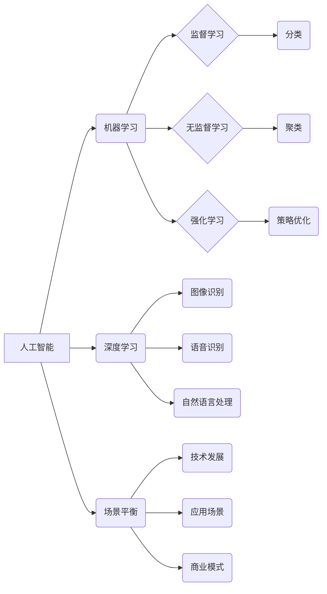

>  人工智能，创业，技术挑战，应用场景，场景平衡，算法原理，数学模型，项目实践，工具资源

## 1. 背景介绍

人工智能（AI）技术近年来发展迅速，已渗透到各个领域，为创业者带来了前所未有的机遇。AI创业，是指利用人工智能技术开发创新产品或服务，并将其商业化。然而，AI创业也面临着诸多挑战，技术难度高、应用场景不明确、商业模式难以确立等问题。

**1.1 AI 创业的机遇与挑战**

AI 创业的机遇主要体现在以下几个方面：

* **技术突破:**  深度学习、自然语言处理等 AI 技术取得了重大突破，为创业者提供了强大的工具和技术支撑。
* **市场需求:**  AI 技术在各个领域都有着巨大的市场需求，例如智能客服、精准营销、自动驾驶等。
* **政策扶持:**  各国政府都高度重视 AI 发展，出台了一系列政策措施来支持 AI 创业。

然而，AI 创业也面临着诸多挑战：

* **技术门槛高:**  AI 技术的研发和应用需要高水平的专业知识和技术能力。
* **数据获取困难:**  AI 算法的训练需要大量的数据，而获取高质量的数据往往非常困难。
* **商业模式不清晰:**  许多 AI 创业公司难以找到合适的商业模式，盈利能力不足。

**1.2  AI 创业的成功案例**

一些成功的 AI 创业案例表明，AI 技术在创业领域具有巨大的潜力。例如：

* **AlphaGo:**  DeepMind 公司开发的 AlphaGo 击败了世界围棋冠军，证明了 AI 技术在复杂决策领域的应用能力。
* **OpenAI:**  OpenAI 公司开发了 GPT-3 等强大的语言模型，在自然语言处理领域取得了突破。
* **ByteDance:**  ByteDance 公司利用 AI 技术开发了抖音、今日头条等短视频平台，获得了巨大的商业成功。

## 2. 核心概念与联系

**2.1  人工智能 (AI)**

人工智能 (AI) 是指模拟人类智能的计算机系统。AI 系统能够执行与人类类似的任务，例如学习、推理、决策、感知和语言理解。

**2.2  机器学习 (ML)**

机器学习 (ML) 是 AI 的一个子领域，它使计算机能够从数据中学习，并根据学习到的知识进行预测或决策。机器学习算法可以分为监督学习、无监督学习和强化学习三大类。

**2.3  深度学习 (DL)**

深度学习 (DL) 是机器学习的一个子领域，它使用多层神经网络来模拟人类大脑的学习过程。深度学习算法能够处理复杂的数据，并取得了在图像识别、语音识别、自然语言处理等领域取得了突破。

**2.4  场景平衡**

场景平衡是指在 AI 创业过程中，要平衡技术发展、应用场景和商业模式之间的关系。

**2.5  核心概念关系图**



## 3. 核心算法原理 & 具体操作步骤

**3.1  算法原理概述**

选择一个具体的 AI 算法，例如线性回归，并详细介绍其原理。

* **线性回归:**  线性回归是一种监督学习算法，用于预测连续值。它假设数据之间存在线性关系，并通过最小化误差来找到最佳拟合直线。

**3.2  算法步骤详解**

1. **数据准备:**  收集和预处理数据，包括特征选择、数据清洗和数据标准化。
2. **模型构建:**  根据线性回归模型的公式，构建模型参数。
3. **模型训练:**  使用训练数据训练模型，通过最小化误差函数来更新模型参数。
4. **模型评估:**  使用测试数据评估模型的性能，例如计算均方误差 (MSE) 或 R-squared 值。
5. **模型预测:**  使用训练好的模型对新数据进行预测。

**3.3  算法优缺点**

* **优点:**  线性回归算法简单易懂，计算效率高，易于实现。
* **缺点:**  线性回归算法只能处理线性关系，对非线性关系的预测能力较差。

**3.4  算法应用领域**

线性回归算法广泛应用于各个领域，例如：

* **预测分析:**  预测销售额、股票价格、客户流失率等。
* **风险评估:**  评估贷款风险、投资风险、欺诈风险等。
* **资源优化:**  优化资源分配、生产计划、物流配送等。

## 4. 数学模型和公式 & 详细讲解 & 举例说明

**4.1  数学模型构建**

线性回归模型的数学表达式为：

$$y = \beta_0 + \beta_1x_1 + \beta_2x_2 + ... + \beta_nx_n + \epsilon$$

其中：

* $y$ 是预测值
* $x_1, x_2, ..., x_n$ 是输入特征
* $\beta_0, \beta_1, \beta_2, ..., \beta_n$ 是模型参数
* $\epsilon$ 是误差项

**4.2  公式推导过程**

线性回归模型的目标是找到最佳的模型参数，使得预测值与真实值之间的误差最小。常用的误差函数是均方误差 (MSE)：

$$MSE = \frac{1}{n}\sum_{i=1}^{n}(y_i - \hat{y}_i)^2$$

其中：

* $n$ 是样本数量
* $y_i$ 是真实值
* $\hat{y}_i$ 是预测值

通过最小化 MSE，可以得到最佳的模型参数。

**4.3  案例分析与讲解**

假设我们想要预测房屋价格，输入特征包括房屋面积、房间数量、地理位置等。我们可以使用线性回归模型来建立房屋价格预测模型。

通过训练数据，我们可以得到最佳的模型参数，例如：

* $\beta_0 = 100000$
* $\beta_1 = 500$ (房屋面积每增加 1 平方米，价格增加 500 元)
* $\beta_2 = 10000$ (房间数量每增加 1 个，价格增加 10000 元)

根据这些参数，我们可以预测新房子的价格。例如，如果新房子的面积为 100 平方米，房间数量为 3 个，那么预测价格为：

$$y = 100000 + 500 * 100 + 10000 * 3 = 200000$$

## 5. 项目实践：代码实例和详细解释说明

**5.1  开发环境搭建**

使用 Python 语言和相关库，例如 scikit-learn，搭建 AI 创业项目开发环境。

**5.2  源代码详细实现**

```python
from sklearn.linear_model import LinearRegression
import pandas as pd

# 数据加载
data = pd.read_csv('housing_data.csv')

# 特征选择
features = ['area', 'rooms']
target = 'price'

# 数据分割
X = data[features]
y = data[target]

# 模型训练
model = LinearRegression()
model.fit(X, y)

# 模型预测
new_house = pd.DataFrame({'area': [100], 'rooms': [3]})
predicted_price = model.predict(new_house)

# 结果展示
print(f'预测价格: {predicted_price[0]}')
```

**5.3  代码解读与分析**

* 使用 scikit-learn 库中的 LinearRegression 类创建线性回归模型。
* 使用 pandas 库加载和处理数据。
* 选择合适的特征和目标变量。
* 将数据分割为训练集和测试集。
* 使用训练集训练模型。
* 使用测试集评估模型性能。
* 使用训练好的模型对新数据进行预测。

**5.4  运行结果展示**

运行代码后，会输出预测价格的结果。

## 6. 实际应用场景

**6.1  智能客服**

AI 驱动的智能客服可以自动回答客户常见问题，提高客户服务效率。

**6.2  精准营销**

AI 可以分析客户数据，进行精准营销，提高营销效果。

**6.3  自动驾驶**

AI 驱动的自动驾驶汽车可以感知周围环境，自动驾驶。

**6.4  未来应用展望**

AI 技术将在未来应用于更多领域，例如医疗保健、教育、金融等。

## 7. 工具和资源推荐

**7.1  学习资源推荐**

* **在线课程:**  Coursera、edX、Udacity 等平台提供丰富的 AI 课程。
* **书籍:**  《深度学习》、《机器学习实战》等书籍是 AI 学习的经典教材。
* **开源项目:**  TensorFlow、PyTorch 等开源项目提供了丰富的 AI 工具和资源。

**7.2  开发工具推荐**

* **Python:**  Python 是 AI 开发最常用的编程语言。
* **scikit-learn:**  scikit-learn 是 Python 的机器学习库。
* **TensorFlow:**  TensorFlow 是 Google 开发的开源深度学习框架。
* **PyTorch:**  PyTorch 是 Facebook 开发的开源深度学习框架。

**7.3  相关论文推荐**

* **AlphaGo论文:**  Silver, D., et al. (2017). Mastering the game of Go with deep neural networks and tree search. Nature, 550(7673), 354-359.
* **GPT-3论文:**  Brown, T. B., et al. (2020). Language models are few-shot learners. arXiv preprint arXiv:2005.14165.

## 8. 总结：未来发展趋势与挑战

**8.1  研究成果总结**

AI 技术取得了长足的进步，在各个领域都有着广泛的应用。

**8.2  未来发展趋势**

* **模型更加强大:**  未来 AI 模型将更加强大，能够处理更加复杂的数据，并取得更好的性能。
* **应用更加广泛:**  AI 技术将应用于更多领域，例如医疗保健、教育、金融等。
* **伦理问题更加突出:**  随着 AI 技术的发展，伦理问题将更加突出，需要社会各界共同探讨和解决。

**8.3  面临的挑战**

* **数据获取困难:**  AI 算法的训练需要大量的数据，而获取高质量的数据往往非常困难。
* **算法解释性不足:**  许多 AI 算法的内部机制难以解释，这使得 AI 的应用存在一定的风险。
* **伦理道德问题:**  AI 技术的发展可能会带来一些伦理道德问题，例如算法偏见、隐私泄露等。

**8.4  研究展望**

未来 AI 研究将更加注重模型的可解释性、安全性、伦理道德等方面。


## 9. 附录：常见问题与解答

**9.1  Q: 如何选择合适的 AI 算法？**

**A:** 选择合适的 AI 算法需要根据具体应用场景和数据特点进行选择。例如，对于预测连续值的问题，可以使用线性回归算法；对于分类问题，可以使用决策树算法或支持向量机算法。

**9.2  Q: 如何处理不平衡的数据集？**

**A:** 不平衡的数据集是指类别分布不均匀的数据集。处理不平衡数据集的方法包括：

* **过采样:**  对少数类样本进行复制，增加样本数量。
* **欠采样:**  对多数类样本进行删除，减少样本数量。
* **合成少数类样本:**  使用生成模型合成