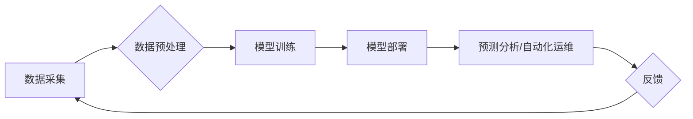

> 数字基础设施，人工智能，机器学习，深度学习，自动化运维，预测分析，优化算法，云计算

## 1. 背景介绍

数字基础设施是现代社会和经济发展的基石，它支撑着互联网、云计算、大数据等关键技术的发展和应用。随着数字经济的蓬勃发展，对数字基础设施的需求量呈指数级增长，传统的运维模式已难以满足日益复杂的业务需求。人工智能（AI）作为一门新兴技术，凭借其强大的数据处理能力和学习能力，为数字基础设施的优化和升级提供了新的思路和解决方案。

## 2. 核心概念与联系

**2.1 数字基础设施**

数字基础设施是指支撑数字经济运行和发展的硬件、软件、网络、数据等基础资源和服务体系。它包括：

* **计算资源:**  服务器、存储设备、网络设备等硬件资源。
* **网络基础设施:**  互联网、数据中心网络、企业内部网络等。
* **软件平台:**  操作系统、数据库、中间件等软件基础设施。
* **数据资源:**  海量数据、数据存储、数据分析等。

**2.2 人工智能**

人工智能是指模拟人类智能行为的计算机系统。它涵盖了多个领域，包括：

* **机器学习:**  使计算机能够从数据中学习并改进其性能。
* **深度学习:**  一种更高级的机器学习方法，利用多层神经网络模拟人类大脑的学习过程。
* **自然语言处理:**  使计算机能够理解和生成人类语言。
* **计算机视觉:**  使计算机能够“看”图像和视频，并从中提取信息。

**2.3 AI在数字基础设施中的应用**

AI技术可以应用于数字基础设施的各个方面，例如：

* **自动化运维:**  利用AI算法自动监控、诊断和修复系统故障，提高运维效率和可靠性。
* **预测分析:**  利用AI算法分析历史数据，预测未来系统性能和潜在风险，帮助提前做好准备。
* **资源优化:**  利用AI算法动态分配和优化资源，提高资源利用率和成本效益。
* **安全防护:**  利用AI算法识别和防御网络攻击，增强系统安全防护能力。

**2.4 AI应用架构**



## 3. 核心算法原理 & 具体操作步骤

### 3.1 算法原理概述

在AI应用于数字基础设施中，常用的算法包括机器学习、深度学习、强化学习等。

* **机器学习:**  通过训练模型，使模型能够从数据中学习并做出预测或决策。常见的机器学习算法包括线性回归、逻辑回归、决策树、支持向量机等。
* **深度学习:**  利用多层神经网络模拟人类大脑的学习过程，能够处理更复杂的数据和任务。常见的深度学习算法包括卷积神经网络（CNN）、循环神经网络（RNN）、生成对抗网络（GAN）等。
* **强化学习:**  通过奖励机制，训练模型在特定环境中做出最优决策。

### 3.2 算法步骤详解

以机器学习算法为例，其基本步骤如下：

1. **数据采集:**  从各种数据源收集相关数据，例如系统日志、监控数据、网络流量等。
2. **数据预处理:**  对收集到的数据进行清洗、转换、特征提取等处理，使其适合模型训练。
3. **模型选择:**  根据具体任务选择合适的机器学习算法模型。
4. **模型训练:**  利用训练数据训练模型，调整模型参数，使其能够准确地预测或决策。
5. **模型评估:**  利用测试数据评估模型的性能，例如准确率、召回率、F1-score等。
6. **模型部署:**  将训练好的模型部署到生产环境中，用于实际应用。
7. **模型监控:**  持续监控模型的性能，并根据需要进行模型更新和调整。

### 3.3 算法优缺点

**优点:**

* **自动化:**  AI算法可以自动化许多重复性任务，提高效率。
* **精准度:**  AI算法可以根据数据分析，做出更精准的预测和决策。
* **可扩展性:**  AI算法可以轻松扩展到更大的数据规模和更复杂的场景。

**缺点:**

* **数据依赖:**  AI算法需要大量的数据进行训练，数据质量直接影响模型性能。
* **解释性:**  一些AI算法的决策过程难以解释，这可能导致信任问题。
* **伦理风险:**  AI算法的应用可能带来一些伦理风险，例如算法偏见、隐私泄露等。

### 3.4 算法应用领域

AI算法在数字基础设施的应用领域非常广泛，例如：

* **自动化运维:**  自动监控系统状态、诊断故障、修复问题、部署更新等。
* **预测分析:**  预测服务器故障、网络流量峰值、用户行为等。
* **资源优化:**  动态分配和优化服务器资源、存储资源、网络带宽等。
* **安全防护:**  识别和防御网络攻击、恶意软件、数据泄露等。

## 4. 数学模型和公式 & 详细讲解 & 举例说明

### 4.1 数学模型构建

在AI应用于数字基础设施中，常用的数学模型包括线性回归模型、逻辑回归模型、支持向量机模型等。

**4.1.1 线性回归模型**

线性回归模型是一种用于预测连续数值的机器学习算法。其基本假设是，输入特征和输出变量之间存在线性关系。

**公式:**

$$y = w_0 + w_1x_1 + w_2x_2 + ... + w_nx_n + \epsilon$$

其中：

* $y$ 是预测的输出变量。
* $w_0, w_1, w_2, ..., w_n$ 是模型参数，需要通过训练得到。
* $x_1, x_2, ..., x_n$ 是输入特征。
* $\epsilon$ 是误差项。

**4.1.2 逻辑回归模型**

逻辑回归模型是一种用于预测分类问题的机器学习算法。其基本假设是，输入特征和输出类别之间存在非线性关系，可以通过sigmoid函数将线性组合映射到概率空间。

**公式:**

$$p(y=1|x) = \frac{1}{1 + e^{-(w_0 + w_1x_1 + w_2x_2 + ... + w_nx_n)}}$$

其中：

* $p(y=1|x)$ 是给定输入特征 $x$ 时，输出类别为 1 的概率。
* $w_0, w_1, w_2, ..., w_n$ 是模型参数，需要通过训练得到。
* $x_1, x_2, ..., x_n$ 是输入特征。

### 4.2 公式推导过程

公式推导过程通常涉及微积分、概率论、统计学等数学知识。

### 4.3 案例分析与讲解

以预测服务器故障为例，可以使用线性回归模型或逻辑回归模型进行预测。

* **线性回归模型:**  可以预测服务器故障发生的概率，例如预测服务器在未来 24 小时内发生故障的概率。
* **逻辑回归模型:**  可以将服务器状态分为“正常”和“故障”两类，预测服务器是否会发生故障。

## 5. 项目实践：代码实例和详细解释说明

### 5.1 开发环境搭建

* **操作系统:**  Linux (Ubuntu, CentOS 等)
* **编程语言:**  Python
* **机器学习库:**  Scikit-learn, TensorFlow, PyTorch 等
* **云平台:**  AWS, Azure, GCP 等

### 5.2 源代码详细实现

```python
# 使用Scikit-learn库实现线性回归模型
from sklearn.linear_model import LinearRegression
from sklearn.model_selection import train_test_split
from sklearn.metrics import mean_squared_error

# 假设数据为服务器CPU使用率和故障发生率
X = [[0.2], [0.4], [0.6], [0.8], [1.0]]  # CPU使用率
y = [0.1, 0.2, 0.3, 0.5, 0.8]  # 故障发生率

# 将数据分为训练集和测试集
X_train, X_test, y_train, y_test = train_test_split(X, y, test_size=0.2)

# 创建线性回归模型
model = LinearRegression()

# 训练模型
model.fit(X_train, y_train)

# 预测测试集数据
y_pred = model.predict(X_test)

# 计算模型性能
mse = mean_squared_error(y_test, y_pred)
print(f"Mean Squared Error: {mse}")
```

### 5.3 代码解读与分析

* **数据准备:**  首先需要准备训练数据，例如服务器CPU使用率和故障发生率。
* **数据分割:**  将数据分为训练集和测试集，用于训练模型和评估模型性能。
* **模型创建:**  使用Scikit-learn库创建线性回归模型。
* **模型训练:**  使用训练数据训练模型，调整模型参数。
* **模型预测:**  使用训练好的模型预测测试集数据。
* **模型评估:**  使用测试数据评估模型性能，例如计算均方误差（MSE）。

### 5.4 运行结果展示

运行代码后，会输出模型的均方误差值，该值越小，模型的预测性能越好。

## 6. 实际应用场景

### 6.1 自动化运维

AI可以用于自动化监控、诊断和修复系统故障，例如：

* **异常检测:**  利用机器学习算法分析系统日志和监控数据，识别异常行为，并自动报警。
* **故障诊断:**  利用深度学习算法分析故障症状，自动诊断故障原因，并提供解决方案。
* **自动化修复:**  利用强化学习算法训练模型，自动执行故障修复操作。

### 6.2 预测分析

AI可以用于预测未来系统性能和潜在风险，例如：

* **服务器故障预测:**  利用历史数据预测服务器故障发生的概率，提前做好准备。
* **网络流量预测:**  利用历史数据预测未来网络流量峰值，优化网络资源配置。
* **用户行为预测:**  利用用户行为数据预测用户需求，提供个性化服务。

### 6.3 资源优化

AI可以用于动态分配和优化资源，例如：

* **服务器资源调度:**  根据实际需求动态分配服务器资源，提高资源利用率。
* **存储资源管理:**  根据数据访问频率和存储需求，动态分配存储资源，降低存储成本。
* **网络带宽优化:**  根据网络流量情况，动态调整网络带宽分配，提高网络性能。

### 6.4 未来应用展望

AI在数字基础设施领域的应用前景广阔，未来可能出现以下应用场景：

* **智能运维:**  利用AI构建智能运维平台，实现自动化、智能化、可视化的运维管理。
* **自愈式基础设施:**  利用AI构建自愈式基础设施，能够自动检测和修复故障，提高系统可靠性。
* **个性化数字基础设施:**  利用AI根据用户需求定制化数字基础设施，提供个性化服务。

## 7. 工具和资源推荐

### 7.1 学习资源推荐

* **书籍:**
    * 《深度学习》
    * 《机器学习实战》
    * 《Python机器学习》
* **在线课程:**
    * Coursera: 深度学习
    * edX: 机器学习
    * Udacity: AI工程师

### 7.2 开发工具推荐

* **编程语言:**  Python
* **机器学习库:**  Scikit-learn, TensorFlow, PyTorch
* **云平台:**  AWS, Azure, GCP

### 7.3 相关论文推荐

* **《Attention Is All You Need》**
* **《BERT: Pre-training of Deep Bidirectional Transformers for Language Understanding》**
