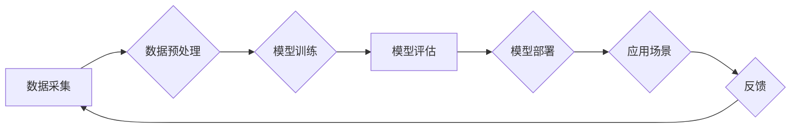

> 人工智能，局限性，特定领域，应用场景，伦理问题，未来发展

## 1. 背景介绍

人工智能（AI）近年来取得了令人瞩目的进展，在各个领域展现出强大的应用潜力。从语音识别、图像处理到自然语言理解，AI技术已经渗透到我们生活的方方面面。然而，尽管AI取得了如此巨大的成就，但我们也必须认识到，AI技术在特定领域的应用仍然存在着一些局限性。

## 2. 核心概念与联系

**2.1 AI技术概述**

人工智能是指模拟人类智能行为的计算机系统。它涵盖了多种技术，包括机器学习、深度学习、自然语言处理、计算机视觉等。

**2.2 特定领域应用**

AI技术在各个领域都有着广泛的应用，例如：

* **医疗保健:** AI可以辅助医生诊断疾病、预测患者风险、加速药物研发等。
* **金融服务:** AI可以用于欺诈检测、风险管理、个性化投资建议等。
* **制造业:** AI可以提高生产效率、优化供应链、实现智能制造等。
* **教育:** AI可以提供个性化学习体验、自动批改作业、辅助教师教学等。

**2.3 局限性概述**

尽管AI技术在特定领域取得了显著进展，但仍然存在一些局限性，主要体现在以下几个方面：

* **数据依赖:** AI算法的性能很大程度上依赖于训练数据的质量和数量。如果训练数据不足或存在偏差，AI模型的性能就会受到影响。
* **解释性问题:** 许多AI算法是黑箱模型，难以解释其决策过程。这使得AI技术的应用在一些需要透明度和可解释性的领域受到限制。
* **泛化能力:** AI模型在训练数据上表现良好，但在面对新的数据或场景时，其泛化能力可能不足。
* **伦理问题:** AI技术的应用可能引发一些伦理问题，例如算法偏见、隐私泄露、责任归属等。

**2.4  Mermaid 流程图**



## 3. 核心算法原理 & 具体操作步骤

**3.1 算法原理概述**

机器学习算法是一种能够从数据中学习并不断改进的算法。它通过训练模型，使模型能够从数据中提取特征，并根据这些特征进行预测或分类。常见的机器学习算法包括：

* **监督学习:** 利用标记数据训练模型，例如分类和回归问题。
* **无监督学习:** 利用未标记数据训练模型，例如聚类和降维问题。
* **强化学习:** 通过奖励和惩罚机制训练模型，例如游戏和机器人控制问题。

**3.2 算法步骤详解**

机器学习算法的训练过程通常包括以下步骤：

1. **数据收集和预处理:** 收集相关数据，并进行清洗、转换、特征工程等预处理操作。
2. **模型选择:** 根据具体任务选择合适的机器学习算法。
3. **模型训练:** 利用训练数据训练模型，调整模型参数，使模型能够准确地预测或分类。
4. **模型评估:** 利用测试数据评估模型的性能，例如准确率、召回率、F1-score等。
5. **模型部署:** 将训练好的模型部署到实际应用场景中。

**3.3 算法优缺点**

**优点:**

* 自动学习和改进
* 能够处理复杂数据
* 适应性强

**缺点:**

* 数据依赖性强
* 训练时间长
* 解释性问题

**3.4 算法应用领域**

机器学习算法广泛应用于各个领域，例如：

* **图像识别:** 人脸识别、物体检测、图像分类
* **自然语言处理:** 文本分类、情感分析、机器翻译
* **推荐系统:** 商品推荐、内容推荐、用户画像
* **预测分析:** 销售预测、风险评估、客户流失预测

## 4. 数学模型和公式 & 详细讲解 & 举例说明

**4.1 数学模型构建**

机器学习算法通常基于数学模型进行构建。例如，线性回归模型可以表示为：

$$y = w_0 + w_1x_1 + w_2x_2 + ... + w_nx_n + \epsilon$$

其中：

* $y$ 是预测值
* $w_0, w_1, w_2, ..., w_n$ 是模型参数
* $x_1, x_2, ..., x_n$ 是输入特征
* $\epsilon$ 是误差项

**4.2 公式推导过程**

机器学习算法的训练过程通常通过优化模型参数来最小化误差。常用的优化算法包括梯度下降法、随机梯度下降法等。

**4.3 案例分析与讲解**

例如，在训练线性回归模型时，可以使用梯度下降法来优化模型参数。梯度下降法的核心思想是沿着误差梯度方向更新模型参数，直到误差最小化。

## 5. 项目实践：代码实例和详细解释说明

**5.1 开发环境搭建**

可以使用Python语言和相关的机器学习库（例如Scikit-learn、TensorFlow、PyTorch）来开发AI项目。

**5.2 源代码详细实现**

```python
from sklearn.linear_model import LinearRegression
from sklearn.model_selection import train_test_split
import numpy as np

# 生成示例数据
X = np.random.rand(100, 2)
y = 2 * X[:, 0] + 3 * X[:, 1] + np.random.randn(100)

# 将数据划分为训练集和测试集
X_train, X_test, y_train, y_test = train_test_split(X, y, test_size=0.2)

# 创建线性回归模型
model = LinearRegression()

# 训练模型
model.fit(X_train, y_train)

# 预测测试集数据
y_pred = model.predict(X_test)

# 评估模型性能
print('模型系数:', model.coef_)
print('模型截距:', model.intercept_)
```

**5.3 代码解读与分析**

这段代码演示了如何使用Scikit-learn库训练一个线性回归模型。首先，我们生成一些示例数据，然后将数据划分为训练集和测试集。接着，我们创建了一个线性回归模型，并使用训练数据训练模型。最后，我们使用测试数据预测结果，并评估模型性能。

**5.4 运行结果展示**

运行这段代码后，会输出模型的系数和截距，以及模型在测试集上的预测结果。

## 6. 实际应用场景

**6.1 医疗诊断辅助**

AI可以帮助医生分析患者的影像数据，例如X光片、CT扫描、MRI等，辅助诊断疾病。

**6.2 金融风险管理**

AI可以分析金融数据的异常模式，识别潜在的欺诈行为和风险。

**6.3 智能制造**

AI可以帮助工厂优化生产流程，提高生产效率，实现智能制造。

**6.4 未来应用展望**

随着AI技术的不断发展，其应用场景将会更加广泛，例如：

* **个性化教育:** AI可以根据学生的学习进度和特点提供个性化的学习方案。
* **自动驾驶:** AI可以帮助车辆感知周围环境，自动驾驶。
* **机器人服务:** AI可以赋予机器人更强的智能，用于服务人类。

## 7. 工具和资源推荐

**7.1 学习资源推荐**

* **在线课程:** Coursera、edX、Udacity等平台提供丰富的AI课程。
* **书籍:** 《深度学习》、《机器学习实战》等书籍是学习AI技术的经典教材。
* **开源项目:** TensorFlow、PyTorch等开源项目提供了丰富的代码示例和学习资源。

**7.2 开发工具推荐**

* **Python:** Python是AI开发最常用的编程语言。
* **Scikit-learn:** Scikit-learn是Python机器学习库，提供了丰富的算法和工具。
* **TensorFlow:** TensorFlow是Google开发的深度学习框架。
* **PyTorch:** PyTorch是Facebook开发的深度学习框架。

**7.3 相关论文推荐**

* **《ImageNet Classification with Deep Convolutional Neural Networks》**
* **《Attention Is All You Need》**
* **《BERT: Pre-training of Deep Bidirectional Transformers for Language Understanding》**

## 8. 总结：未来发展趋势与挑战

**8.1 研究成果总结**

近年来，AI技术取得了令人瞩目的进展，在各个领域展现出强大的应用潜力。

**8.2 未来发展趋势**

* **模型规模和能力的提升:** 未来AI模型将会更加强大，能够处理更复杂的任务。
* **算法的泛化能力和解释性增强:** 研究者将致力于开发更鲁棒、更可解释的AI算法。
* **AI技术的融合和应用:** AI技术将会与其他技术融合，例如物联网、云计算、区块链等，形成更强大的应用场景。

**8.3 面临的挑战**

* **数据安全和隐私保护:** AI技术的应用需要处理大量数据，如何保证数据安全和隐私保护是一个重要的挑战。
* **算法偏见和公平性:** AI算法可能存在偏见，导致不公平的结果。如何解决算法偏见是一个重要的研究方向。
* **伦理问题:** AI技术的应用可能引发一些伦理问题，例如责任归属、工作岗位替代等。

**8.4 研究展望**

未来，AI研究将继续朝着更安全、更可靠、更可解释的方向发展。


## 9. 附录：常见问题与解答

**9.1 如何选择合适的AI算法？**

选择合适的AI算法取决于具体的应用场景和数据特点。例如，对于分类问题，可以使用决策树、支持向量机、神经网络等算法。对于回归问题，可以使用线性回归、逻辑回归、支持向量回归等算法。

**9.2 如何解决AI算法的过拟合问题？**

过拟合是指AI模型在训练数据上表现良好，但在测试数据上表现差。解决过拟合问题的方法包括：

* **增加训练数据量**
* **使用正则化技术**
* **使用交叉验证**
* **减少模型复杂度**

**9.3 如何评估AI模型的性能？**

常用的AI模型性能评估指标包括：

* **准确率:** 正确预测的样本数占总样本数的比例。
* **召回率:** 正确预测的正样本数占所有正样本数的比例。
* **F1-score:** 准确率和召回率的调和平均数。
* **AUC:** 曲线下面积，用于评估模型的二分类能力。


作者：禅与计算机程序设计艺术 / Zen and the Art of Computer Programming 
<end_of_turn>