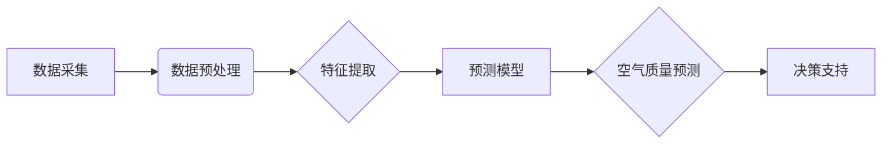

>  空气质量预测，机器学习，深度学习，环境监测，数据分析，传感器网络

## 1. 背景介绍

空气污染已成为全球性的环境问题，对人类健康和生态系统造成严重威胁。及时准确地预测空气质量变化对于制定有效的防治措施、保护公众健康和环境安全至关重要。传统空气质量监测方法依赖于地面监测站，数据覆盖范围有限，实时性不足。随着物联网、大数据和人工智能技术的快速发展，基于人工智能的空气质量预测模型应运而生，为环境监测和管理提供了新的思路和方法。

## 2. 核心概念与联系

空气质量预测的核心概念包括：

* **空气污染物**: 主要包括颗粒物 (PM2.5, PM10)、二氧化硫 (SO2)、氮氧化物 (NOx)、臭氧 (O3)、一氧化碳 (CO) 等。
* **环境因素**: 包括气温、湿度、风速、风向、降雨等气象条件，以及地形、植被、人口密度等地理因素。
* **数据采集**: 利用传感器网络、卫星遥感、地面监测站等方式获取空气污染物浓度、环境因素等数据。
* **数据分析**: 对采集到的数据进行清洗、预处理、特征提取等操作，提取有用的信息。
* **预测模型**: 利用机器学习、深度学习等算法构建空气质量预测模型，对未来空气质量浓度进行预测。

**核心概念架构图:**



## 3. 核心算法原理 & 具体操作步骤

### 3.1  算法原理概述

空气质量预测模型主要采用机器学习和深度学习算法，这些算法能够从历史数据中学习空气质量变化的规律，并根据当前环境因素预测未来空气质量浓度。常用的算法包括：

* **线性回归**:  适用于线性关系的预测问题，简单易实现，但对非线性关系的预测能力有限。
* **支持向量机 (SVM)**:  能够处理高维数据，对非线性关系有较好的预测能力，但训练时间较长。
* **决策树**:  易于理解和解释，能够处理分类和回归问题，但容易过拟合。
* **随机森林**:  通过构建多个决策树并进行投票，提高预测精度，并具有较好的鲁棒性。
* **神经网络**:  能够学习复杂非线性关系，具有较高的预测精度，但训练数据量较大，训练时间较长。

### 3.2  算法步骤详解

以随机森林算法为例，详细说明其预测步骤：

1. **数据收集**: 收集历史空气质量数据、气象数据、地理数据等。
2. **数据预处理**: 对数据进行清洗、缺失值处理、特征缩放等操作。
3. **特征工程**:  提取特征，例如气温变化率、风向变化幅度等，增强模型预测能力。
4. **模型训练**:  将数据划分为训练集和测试集，使用训练集训练随机森林模型。
5. **模型评估**:  使用测试集评估模型性能，例如准确率、均方误差等。
6. **模型调参**:  根据评估结果，调整模型参数，例如树的深度、样本数量等，提高模型性能。
7. **预测**:  使用训练好的模型对未来空气质量浓度进行预测。

### 3.3  算法优缺点

**随机森林算法的优点**:

* 鲁棒性强，对异常数据和噪声不敏感。
* 能够处理高维数据。
* 预测精度高。
* 易于理解和解释。

**随机森林算法的缺点**:

* 训练时间较长。
* 对数据分布变化敏感。

### 3.4  算法应用领域

随机森林算法广泛应用于空气质量预测、天气预报、金融风险评估、医疗诊断等领域。

## 4. 数学模型和公式 & 详细讲解 & 举例说明

### 4.1  数学模型构建

空气质量预测模型通常采用回归模型，目标是预测未来时间段的空气污染物浓度。假设我们想要预测未来时间段的 PM2.5 浓度，可以构建如下回归模型：

$$
PM2.5_{t+h} = f(PM2.5_{t}, PM2.5_{t-1}, ..., PM2.5_{t-n}, Weather_{t}, Weather_{t-1}, ..., Weather_{t-m})
$$

其中：

* $PM2.5_{t+h}$: 未来时间段 $h$ 的 PM2.5 浓度。
* $PM2.5_{t}, PM2.5_{t-1}, ..., PM2.5_{t-n}$:  过去 $n$ 个时间段的 PM2.5 浓度。
* $Weather_{t}, Weather_{t-1}, ..., Weather_{t-m}$:  过去 $m$ 个时间段的气象数据。
* $f$:  回归模型函数。

### 4.2  公式推导过程

回归模型的具体形式取决于选择的算法。例如，线性回归模型的函数形式为：

$$
f(x) = w_0 + w_1x_1 + w_2x_2 + ... + w_nx_n
$$

其中：

* $w_0, w_1, w_2, ..., w_n$:  模型参数。
* $x_1, x_2, ..., x_n$:  输入特征。

线性回归模型的参数可以通过最小二乘法估计。

### 4.3  案例分析与讲解

假设我们想要预测未来 24 小时的 PM2.5 浓度，并使用过去 24 小时的 PM2.5 浓度和气象数据作为输入特征。我们可以使用线性回归模型进行预测，并根据模型参数计算未来 24 小时的 PM2.5 浓度。

## 5. 项目实践：代码实例和详细解释说明

### 5.1  开发环境搭建

* 操作系统: Ubuntu 20.04
* Python 版本: 3.8
* 必要的库: pandas, numpy, scikit-learn, matplotlib

### 5.2  源代码详细实现

```python
import pandas as pd
from sklearn.ensemble import RandomForestRegressor
from sklearn.model_selection import train_test_split
from sklearn.metrics import mean_squared_error

# 加载数据
data = pd.read_csv('air_quality_data.csv')

# 数据预处理
# ...

# 特征工程
# ...

# 划分训练集和测试集
X_train, X_test, y_train, y_test = train_test_split(X, y, test_size=0.2, random_state=42)

# 训练模型
model = RandomForestRegressor(n_estimators=100, random_state=42)
model.fit(X_train, y_train)

# 预测
y_pred = model.predict(X_test)

# 评估模型
mse = mean_squared_error(y_test, y_pred)
print(f'Mean Squared Error: {mse}')

# 可视化结果
# ...
```

### 5.3  代码解读与分析

* 代码首先加载空气质量数据，并进行数据预处理和特征工程。
* 然后使用 `train_test_split` 函数将数据划分为训练集和测试集。
* 使用 `RandomForestRegressor` 类构建随机森林模型，并使用 `fit` 方法训练模型。
* 使用 `predict` 方法对测试集进行预测，并使用 `mean_squared_error` 函数评估模型性能。
* 最后可视化预测结果。

### 5.4  运行结果展示

运行代码后，会输出模型的均方误差值，以及预测结果的可视化展示。

## 6. 实际应用场景

### 6.1  环境监测

空气质量预测模型可以用于监测空气质量变化趋势，预警空气污染事件，帮助政府制定环境保护政策。

### 6.2  公众健康

空气质量预测模型可以为公众提供实时空气质量信息，提醒人们采取防护措施，保护自身健康。

### 6.3  智慧城市

空气质量预测模型可以集成到智慧城市平台，为城市管理提供数据支持，优化城市规划和资源配置。

### 6.4  未来应用展望

随着人工智能技术的不断发展，空气质量预测模型将更加精准、高效，并应用于更多领域，例如：

* **精准医疗**:  根据空气质量预测结果，为患者提供个性化的医疗建议。
* **农业生产**:  预测空气污染对农作物的影响，帮助农民采取相应的防治措施。
* **交通管理**:  根据空气质量预测结果，优化交通流量，减少交通拥堵和尾气排放。

## 7. 工具和资源推荐

### 7.1  学习资源推荐

* **书籍**:
    * 《机器学习》 - 周志华
    * 《深度学习》 - Ian Goodfellow
* **在线课程**:
    * Coursera: Machine Learning
    * edX: Deep Learning

### 7.2  开发工具推荐

* **Python**:  主流的机器学习和深度学习编程语言。
* **TensorFlow**:  谷歌开发的开源深度学习框架。
* **PyTorch**:  Facebook 开发的开源深度学习框架。

### 7.3  相关论文推荐

* **Air Quality Forecasting Using Machine Learning: A Review**
* **Deep Learning for Air Quality Prediction**
* **A Hybrid Approach for Air Quality Forecasting Using Random Forest and Support Vector Regression**

## 8. 总结：未来发展趋势与挑战

### 8.1  研究成果总结

基于人工智能的空气质量预测模型取得了显著的成果，能够有效提高空气质量预测精度，为环境监测和管理提供有力支持。

### 8.2  未来发展趋势

未来空气质量预测模型将朝着以下方向发展：

* **模型精度提升**:  探索更先进的算法和模型架构，提高预测精度。
* **数据融合**:  融合多源数据，例如卫星遥感数据、移动设备数据等，增强模型预测能力。
* **实时性增强**:  利用实时数据流，实现分钟级甚至秒级的空气质量预测。
* **解释性增强**:  提高模型的可解释性，帮助人们理解模型预测结果背后的原因。

### 8.3  面临的挑战

空气质量预测模型还面临一些挑战：

* **数据质量**:  空气质量数据往往存在缺失、噪声等问题，需要进行有效的数据清洗和处理。
* **模型复杂性**:  深度学习模型参数众多，训练过程复杂，需要大量的计算资源和专业知识。
* **可解释性**:  深度学习模型的决策过程难以解释，需要开发更有效的可解释性方法。

### 8.4  研究展望

未来研究将重点关注以下方面：

* 开发更鲁棒、更准确的空气质量预测模型。
* 探索新的数据融合方法，提高模型预测能力。
* 研究模型的可解释性，提高模型的信任度。
* 将空气质量预测模型应用于更多领域，为社会发展提供更多支持。

## 9. 附录：常见问题与解答

### 9.1  Q1:  空气质量预测模型的精度如何？

**A1:**  空气质量预测模型的精度取决于多种因素，例如数据质量、模型选择、训练方法等。一般来说，先进的模型能够达到较高的预测精度，但仍存在一定的误差。

### 9.2  Q2:  空气质量预测模型需要哪些数据？

**A2:**  空气质量预测模型需要空气污染物浓度数据、气象数据、地理数据等。

### 9.3  Q3:  如何评估空气质量预测模型的性能？

**A3:**  常用的评估指标包括均方误差 (MSE)、平均绝对误差 (MAE) 等。

### 9.4  Q4:  空气质量预测模型的应用场景有哪些？

**A4:**  空气质量预测模型