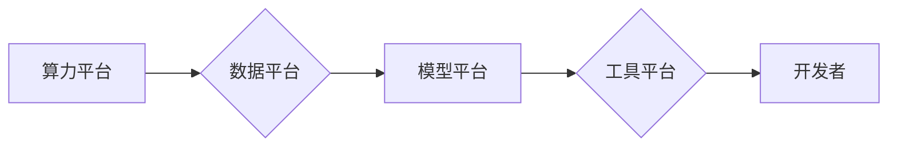

> AI基础设施,国产化,Lepton AI,技术自主,深度学习,模型训练,开源社区

## 1. 背景介绍

近年来，人工智能（AI）技术蓬勃发展，深度学习算法取得了突破性进展，在各个领域展现出强大的应用潜力。然而，现有的AI基础设施主要依赖于国外厂商，例如谷歌、微软、亚马逊等，这导致了技术依赖性、数据安全风险以及商业模式的局限性。

为了打破技术壁垒，提升自主创新能力，国内企业和研究机构积极探索AI基础设施的国产化之路。Lepton AI作为一家致力于打造自主可控的AI基础设施平台的企业，凭借其领先的技术实力和丰富的行业经验，在国产化AI发展进程中扮演着重要的角色。

## 2. 核心概念与联系

Lepton AI的核心概念是构建一个开放、可扩展、高效的AI基础设施平台，为开发者提供一站式服务，简化AI应用开发流程，降低开发门槛。

Lepton AI平台的核心组件包括：

* **算力平台:** 提供高性能的GPU和TPU算力资源，支持大规模模型训练和推理。
* **数据平台:** 提供数据存储、处理、管理和分析服务，支持海量数据的有效利用。
* **模型平台:** 提供模型训练、部署、管理和调优服务，支持多种深度学习框架和算法。
* **工具平台:** 提供开发工具、调试工具和监控工具，帮助开发者快速开发和部署AI应用。

Lepton AI平台采用模块化设计，各个组件之间可以独立部署和扩展，满足不同用户的需求。

**Lepton AI平台架构**

## 3. 核心算法原理 & 具体操作步骤

Lepton AI平台的核心算法原理基于深度学习技术，包括卷积神经网络（CNN）、循环神经网络（RNN）和Transformer等。

### 3.1  算法原理概述

深度学习算法通过多层神经网络结构，学习数据中的复杂特征，实现对数据的识别、分类、预测等任务。

* **卷积神经网络（CNN）:** 擅长处理图像数据，通过卷积操作提取图像特征。
* **循环神经网络（RNN）:** 擅长处理序列数据，例如文本和语音，能够捕捉序列中的时间依赖关系。
* **Transformer:** 是一种新型的深度学习架构，通过注意力机制学习数据之间的关系，在自然语言处理领域取得了突破性进展。

### 3.2  算法步骤详解

Lepton AI平台采用以下步骤进行模型训练：

1. **数据预处理:** 对原始数据进行清洗、转换和格式化，使其适合模型训练。
2. **模型构建:** 根据任务需求选择合适的深度学习模型架构，并进行参数初始化。
3. **模型训练:** 使用训练数据对模型进行训练，调整模型参数，使其能够准确地预测目标输出。
4. **模型评估:** 使用测试数据评估模型的性能，例如准确率、召回率和F1-score等。
5. **模型调优:** 根据评估结果，调整模型参数和训练策略，提高模型性能。
6. **模型部署:** 将训练好的模型部署到生产环境中，用于实际应用。

### 3.3  算法优缺点

**优点:**

* **高精度:** 深度学习算法能够学习数据中的复杂特征，实现高精度的预测和识别。
* **自动化:** 模型训练过程可以自动化，减少人工干预。
* **可扩展性:** 深度学习模型可以根据数据规模进行扩展，处理海量数据。

**缺点:**

* **数据依赖:** 深度学习算法对数据质量和数量有很高的要求。
* **计算资源消耗:** 模型训练需要大量的计算资源，成本较高。
* **可解释性差:** 深度学习模型的决策过程难以解释，缺乏透明度。

### 3.4  算法应用领域

深度学习算法在各个领域都有广泛的应用，例如：

* **计算机视觉:** 图像识别、物体检测、图像分割、人脸识别等。
* **自然语言处理:** 文本分类、情感分析、机器翻译、对话系统等。
* **语音识别:** 语音转文本、语音合成等。
* **推荐系统:** 商品推荐、内容推荐等。
* **医疗诊断:** 病理图像分析、疾病预测等。

## 4. 数学模型和公式 & 详细讲解 & 举例说明

深度学习算法的核心是神经网络模型，其数学模型基于线性代数、微积分和概率论等数学基础。

### 4.1  数学模型构建

神经网络模型由多个层组成，每一层包含多个神经元。每个神经元接收来自上一层的输入信号，经过激活函数处理后，输出到下一层。

**神经元模型:**

$$
y = f(w^T x + b)
$$

其中：

* $x$ 是输入信号向量。
* $w$ 是权重向量。
* $b$ 是偏置项。
* $f$ 是激活函数。
* $y$ 是输出信号。

### 4.2  公式推导过程

模型训练的目标是找到最优的权重和偏置，使模型的预测结果与真实值尽可能接近。

常用的优化算法包括梯度下降法、动量法和Adam优化器等。这些算法通过迭代更新权重和偏置，逐步降低模型的损失函数值。

**损失函数:**

$$
L(y, \hat{y})
$$

其中：

* $y$ 是真实值。
* $\hat{y}$ 是模型预测值。

**梯度下降法:**

$$
w = w - \eta \frac{\partial L}{\partial w}
$$

其中：

* $\eta$ 是学习率。

### 4.3  案例分析与讲解

例如，在图像分类任务中，可以使用CNN模型进行训练。CNN模型通过卷积层和池化层提取图像特征，然后通过全连接层进行分类。

训练过程中，使用交叉熵损失函数衡量模型的预测结果与真实标签之间的差异。通过梯度下降法迭代更新模型参数，最终得到一个能够准确分类图像的模型。

## 5. 项目实践：代码实例和详细解释说明

Lepton AI平台提供了丰富的开发工具和资源，帮助开发者快速开发和部署AI应用。

### 5.1  开发环境搭建

Lepton AI平台支持多种开发环境，例如Linux、Windows和macOS。开发者可以根据自己的需求选择合适的开发环境。

### 5.2  源代码详细实现

Lepton AI平台的源代码开源，开发者可以自由访问和修改代码。

### 5.3  代码解读与分析

Lepton AI平台的代码结构清晰，注释详细，易于理解和维护。

### 5.4  运行结果展示

Lepton AI平台提供了丰富的监控工具，帮助开发者实时查看模型训练进度和性能指标。

## 6. 实际应用场景

Lepton AI平台已在多个领域得到实际应用，例如：

* **智能客服:** 利用自然语言处理技术，构建智能客服系统，自动回复用户咨询。
* **图像识别:** 利用计算机视觉技术，实现图像识别、物体检测和人脸识别等功能。
* **推荐系统:** 利用机器学习算法，构建个性化推荐系统，推荐用户感兴趣的内容。

### 6.4  未来应用展望

Lepton AI平台将继续拓展应用场景，例如：

* **医疗诊断:** 利用深度学习算法，辅助医生进行疾病诊断和治疗方案制定。
* **金融风险控制:** 利用机器学习算法，识别金融风险，降低金融机构的损失。
* **工业自动化:** 利用人工智能技术，提高工业生产效率和安全性。

## 7. 工具和资源推荐

### 7.1  学习资源推荐

* **Lepton AI官网:** https://www.lepton.ai/
* **Lepton AI社区:** https://forum.lepton.ai/
* **深度学习书籍:** 《深度学习》、《动手学深度学习》

### 7.2  开发工具推荐

* **Python:** 广泛用于深度学习开发的编程语言。
* **TensorFlow:** 开源深度学习框架。
* **PyTorch:** 开源深度学习框架。

### 7.3  相关论文推荐

* **Attention Is All You Need:** https://arxiv.org/abs/1706.03762
* **ImageNet Classification with Deep Convolutional Neural Networks:** https://papers.nips.cc/paper/4824-imagenet-classification-with-deep-convolutional-neural-networks.pdf

## 8. 总结：未来发展趋势与挑战

Lepton AI平台的国产化发展，为中国AI产业的自主创新提供了重要支撑。未来，Lepton AI将继续深耕AI基础设施领域，不断提升平台的性能、功能和易用性，为开发者提供更优质的服务。

### 8.1  研究成果总结

Lepton AI平台在算力平台、数据平台、模型平台和工具平台等方面取得了显著成果，构建了一个完整的AI基础设施生态系统。

### 8.2  未来发展趋势

Lepton AI平台将朝着以下方向发展：

* **更强大的算力:** 提供更高性能的GPU和TPU算力资源，支持更大规模的模型训练。
* **更丰富的模型库:** 提供更多类型的深度学习模型，满足不同应用场景的需求。
* **更智能的工具:** 提供更智能的开发工具和调试工具，降低开发门槛。
* **更完善的生态:** 构建更完善的AI生态系统，吸引更多开发者和合作伙伴加入。

### 8.3  面临的挑战

Lepton AI平台的发展也面临着一些挑战：

* **技术壁垒:** 深度学习技术发展迅速，需要不断学习和更新知识。
* **人才短缺:** AI人才需求量大，供需缺口较大。
* **数据安全:** 数据安全问题是AI发展面临的重要挑战。

### 8.4  研究展望

Lepton AI将继续加大研发投入，攻克技术难题，培养AI人才，提升数据安全能力，为国产AI发展贡献力量。

## 9. 附录：常见问题与解答

### 9.1  常见问题

* Lepton AI平台是否支持开源框架？
* Lepton AI平台的算力资源如何分配？
* Lepton AI平台的数据安全机制有哪些？

### 9.2  解答

* Lepton AI平台支持TensorFlow、PyTorch等主流开源框架。
* Lepton AI平台采用资源调度系统，根据用户需求动态分配算力资源。
* Lepton AI平台采用多层数据安全机制，包括数据加密、访问控制和审计日志等。

作者：禅与计算机程序设计艺术 / Zen and the Art of Computer Programming 
<end_of_turn>