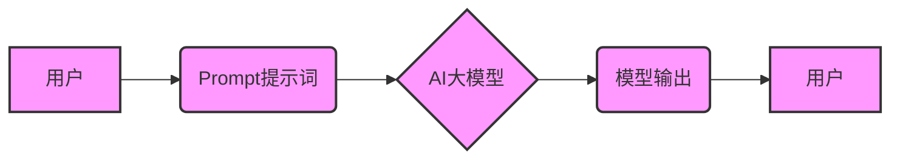

> AI大模型,Prompt提示词,偏见,公平性,伦理,最佳实践,模型训练

## 1. 背景介绍

近年来，大规模语言模型（LLM）的快速发展，如GPT-3、LaMDA和BERT等，为人工智能领域带来了革命性的变革。这些模型能够理解和生成人类语言，在文本生成、翻译、问答和代码生成等领域展现出令人惊叹的性能。然而，LLM的训练数据往往来自互联网，其中包含各种社会偏见和歧视性内容。如果未经处理，这些偏见可能会被模型学习并放大，导致模型生成带有偏见和歧视性的输出，从而引发伦理和社会问题。

因此，如何确保AI大模型的输出没有偏见，是当前人工智能领域面临的重要挑战之一。Prompt提示词作为与模型交互的关键环节，在消除模型偏见方面发挥着至关重要的作用。

## 2. 核心概念与联系

**2.1  Prompt提示词**

Prompt提示词是指用户向AI大模型输入的文本指令或问题，它引导模型生成特定的输出。

**2.2  模型偏见**

模型偏见是指AI模型在训练过程中由于数据偏差而产生的输出偏差，导致模型对某些群体或概念表现出不公平或歧视性的倾向。

**2.3  公平性与伦理**

公平性是指AI模型的输出结果对所有用户都是公正和无偏见的。伦理则指AI模型的开发和应用应该遵循道德规范，避免造成社会伤害。

**2.4  关系图**



## 3. 核心算法原理 & 具体操作步骤

**3.1  算法原理概述**

消除模型偏见的主要方法是通过对训练数据进行预处理和模型训练过程中的调整。

**3.2  算法步骤详解**

1. **数据收集和预处理:** 收集大量高质量的训练数据，并进行清洗、去噪和标准化处理，以减少数据中的偏见和噪声。
2. **数据平衡:** 对训练数据进行平衡，确保不同群体或概念的样本数量均衡，避免模型过度偏向某个群体。
3. **对抗训练:** 使用对抗样本训练模型，对抗样本是经过精心设计，旨在扰乱模型预测的样本。通过对抗训练，模型可以学习识别和抵抗数据中的偏见。
4. **正则化:** 在模型训练过程中使用正则化技术，例如L1正则化和L2正则化，来惩罚模型的复杂度，避免模型过拟合训练数据中的偏见。
5. **公平性度量:** 使用公平性度量指标，例如不公平度和差异比率，来评估模型的公平性，并根据指标结果调整模型参数和训练策略。

**3.3  算法优缺点**

* **优点:** 可以有效减少模型偏见，提高模型的公平性。
* **缺点:** 需要大量的计算资源和时间，并且需要对数据和模型进行深入的分析和理解。

**3.4  算法应用领域**

* **自然语言处理:** 文本分类、情感分析、机器翻译等。
* **计算机视觉:** 图像识别、物体检测、人脸识别等。
* **推荐系统:** 商品推荐、内容推荐、用户匹配等。

## 4. 数学模型和公式 & 详细讲解 & 举例说明

**4.1  数学模型构建**

假设我们有一个分类模型，其目标是将文本分类为正类和负类。我们可以使用逻辑回归模型来构建数学模型，其输出为概率值，表示文本属于正类的概率。

**4.2  公式推导过程**

逻辑回归模型的输出概率为：

$$
P(y=1|x) = \frac{1}{1 + e^{-(w^T x + b)}}
$$

其中：

* $y$ 是文本的类别标签，1表示正类，0表示负类。
* $x$ 是文本的特征向量。
* $w$ 是模型的参数向量。
* $b$ 是模型的偏置项。

**4.3  案例分析与讲解**

假设我们有一个文本分类任务，需要将新闻文章分类为体育新闻和非体育新闻。我们可以使用逻辑回归模型，并将新闻文章的词频作为特征向量。模型训练完成后，我们可以使用该模型对新的新闻文章进行分类。

## 5. 项目实践：代码实例和详细解释说明

**5.1  开发环境搭建**

* Python 3.7+
* TensorFlow 2.0+
* PyTorch 1.0+

**5.2  源代码详细实现**

```python
import tensorflow as tf

# 定义模型
model = tf.keras.models.Sequential([
    tf.keras.layers.Embedding(input_dim=vocab_size, output_dim=embedding_dim),
    tf.keras.layers.GlobalAveragePooling1D(),
    tf.keras.layers.Dense(units=1, activation='sigmoid')
])

# 编译模型
model.compile(optimizer='adam',
              loss='binary_crossentropy',
              metrics=['accuracy'])

# 训练模型
model.fit(x_train, y_train, epochs=10, batch_size=32)

# 评估模型
loss, accuracy = model.evaluate(x_test, y_test)
print('Loss:', loss)
print('Accuracy:', accuracy)
```

**5.3  代码解读与分析**

* 该代码示例使用TensorFlow框架构建了一个简单的文本分类模型。
* 模型结构包括嵌入层、全局平均池化层和全连接层。
* 嵌入层将词向量表示为稠密的向量。
* 全局平均池化层将每个文本的词向量平均化，得到文本的整体表示。
* 全连接层将文本的整体表示映射到输出概率。
* 模型使用Adam优化器、二元交叉熵损失函数和准确率作为评估指标。

**5.4  运行结果展示**

训练完成后，我们可以使用模型对新的文本进行分类，并输出分类结果和概率值。

## 6. 实际应用场景

**6.1  新闻分类**

将新闻文章分类为不同的类别，例如体育、财经、科技等。

**6.2  情感分析**

分析文本的情感倾向，例如正面、负面或中性。

**6.3  垃圾邮件过滤**

识别和过滤垃圾邮件。

**6.4  未来应用展望**

* **个性化推荐:** 根据用户的偏好和历史行为，推荐个性化的商品、内容和服务。
* **医疗诊断:** 辅助医生进行疾病诊断和治疗方案制定。
* **教育辅助:** 提供个性化的学习辅导和评估。

## 7. 工具和资源推荐

**7.1  学习资源推荐**

* **书籍:**
    * "Deep Learning" by Ian Goodfellow, Yoshua Bengio, and Aaron Courville
    * "Hands-On Machine Learning with Scikit-Learn, Keras & TensorFlow" by Aurélien Géron
* **在线课程:**
    * Coursera: Machine Learning by Andrew Ng
    * Udacity: Deep Learning Nanodegree

**7.2  开发工具推荐**

* **TensorFlow:** https://www.tensorflow.org/
* **PyTorch:** https://pytorch.org/
* **Scikit-learn:** https://scikit-learn.org/

**7.3  相关论文推荐**

* "On the Dangers of Stochastic Parrots: Can Language Models Be Too Big?" by Emily M. Bender, Timnit Gebru, Angelina McMillan-Major, and Margaret Mitchell
* "Mitigating Bias in Language Models" by Timnit Gebru, Debedia Deb, and Emily Bender

## 8. 总结：未来发展趋势与挑战

**8.1  研究成果总结**

近年来，在消除AI模型偏见方面取得了显著进展，包括数据预处理、对抗训练、公平性度量等技术。

**8.2  未来发展趋势**

* **更有效的偏见检测和缓解方法:** 开发更精确、更全面的偏见检测方法，并设计更有效的偏见缓解策略。
* **可解释性增强:** 提高AI模型的可解释性，以便更好地理解模型的决策过程，并识别潜在的偏见来源。
* **跨领域合作:** 加强跨领域合作，例如人工智能、社会科学、伦理学等，共同解决AI偏见问题。

**8.3  面临的挑战**

* **数据偏差:** 训练数据中的偏见难以完全消除，需要不断探索新的数据收集和预处理方法。
* **模型复杂性:** 复杂模型的决策过程难以理解，需要开发更有效的可解释性技术。
* **伦理规范:** 需要制定更完善的AI伦理规范，指导AI模型的开发和应用。

**8.4  研究展望**

未来研究将继续关注以下方向:

* 开发更鲁棒、更公平的AI模型。
* 提高AI模型的可解释性和透明度。
* 建立完善的AI伦理规范和监管机制。


## 9. 附录：常见问题与解答

**9.1  如何评估AI模型的公平性？**

可以使用各种公平性度量指标，例如不公平度、差异比率、等效机会度等，来评估AI模型的公平性。

**9.2  如何减少AI模型的偏见？**

可以通过以下方法减少AI模型的偏见:

* 使用多样化、代表性的训练数据。
* 使用对抗训练技术，训练模型抵抗数据中的偏见。
* 使用正则化技术，惩罚模型的复杂度，避免模型过拟合训练数据中的偏见。
* 使用公平性度量指标，评估模型的公平性，并根据指标结果调整模型参数和训练策略。

**9.3  AI模型的偏见会带来哪些危害？**

AI模型的偏见可能会导致以下危害:

* 歧视和不公平的待遇。
* 误判和错误决策。
* 社会分化和不信任。


作者：禅与计算机程序设计艺术 / Zen and the Art of Computer Programming 
<end_of_turn>