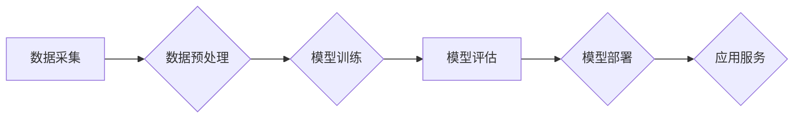

> AI大模型，创业，竞争对手，技术趋势，商业模式，人才培养，风险管理

## 1. 背景介绍

人工智能（AI）技术近年来发展迅速，特别是大模型的涌现，为各行各业带来了前所未有的机遇。大模型，是指参数规模庞大、训练数据海量的人工智能模型，具备强大的泛化能力和学习能力，能够在自然语言处理、计算机视觉、语音识别等领域取得突破性进展。

随着大模型技术的成熟，越来越多的创业者看到了其中的商机，纷纷涌入AI大模型领域。然而，这个领域竞争激烈，新兴的创业公司面临着来自巨头企业的挑战。如何应对未来竞争对手，成为创业者必须认真思考的问题。

## 2. 核心概念与联系

**2.1 AI大模型的定义与特点**

AI大模型是指参数规模庞大、训练数据海量的人工智能模型，其核心特点包括：

* **规模化：** 大模型拥有数亿甚至数十亿的参数，使其能够学习更复杂的模式和关系。
* **泛化能力强：** 由于训练数据量大，大模型能够更好地泛化到未知的数据集，在不同任务上表现出色。
* **多模态学习：** 一些大模型能够处理多种数据类型，例如文本、图像、音频等，实现跨模态的学习和理解。

**2.2 大模型的架构与训练**

大模型的架构通常基于深度学习，常见的架构包括 Transformer、BERT、GPT 等。训练过程需要大量的计算资源和时间，通常采用分布式训练的方式，将模型参数和数据分布到多个机器上进行并行训练。

**2.3 大模型的应用场景**

AI大模型在各个领域都有广泛的应用，例如：

* **自然语言处理：** 文本生成、机器翻译、问答系统、情感分析等。
* **计算机视觉：** 图像识别、物体检测、图像分割、视频分析等。
* **语音识别：** 语音转文本、语音合成、语音助手等。
* **推荐系统：** 商品推荐、内容推荐、个性化服务等。

**2.4 大模型创业的机遇与挑战**

AI大模型创业机遇巨大，但也面临着诸多挑战：

* **技术门槛高：** 大模型的开发和训练需要强大的技术实力和资源投入。
* **数据获取困难：** 大模型的训练需要海量高质量的数据，获取数据成本高且难度大。
* **竞争激烈：** 巨头企业在AI领域投入巨资，对创业公司构成巨大压力。
* **伦理风险：** 大模型的应用可能带来伦理风险，例如数据隐私泄露、算法偏见等。

**Mermaid 流程图**



## 3. 核心算法原理 & 具体操作步骤

**3.1 算法原理概述**

大模型的训练主要基于深度学习算法，其中 Transformer 架构是目前最流行的模型架构之一。Transformer 架构的核心思想是利用注意力机制来学习文本序列之间的关系，从而实现更准确的文本理解和生成。

**3.2 算法步骤详解**

1. **数据预处理：** 将原始文本数据进行清洗、分词、词向量化等处理，使其能够被模型理解。
2. **模型构建：** 根据 Transformer 架构构建模型，并设置模型参数，例如隐藏层数、神经元数量、注意力机制参数等。
3. **模型训练：** 使用训练数据对模型进行训练，通过反向传播算法不断调整模型参数，使其能够更好地预测目标输出。
4. **模型评估：** 使用测试数据对模型进行评估，衡量模型的准确率、召回率、F1-score 等指标。
5. **模型部署：** 将训练好的模型部署到服务器或云平台，使其能够提供服务。

**3.3 算法优缺点**

**优点：**

* 强大的泛化能力：Transformer 架构能够学习到文本序列之间的复杂关系，从而实现更准确的文本理解和生成。
* 并行训练效率高：Transformer 架构支持并行训练，能够有效缩短训练时间。
* 可扩展性强：Transformer 架构可以轻松扩展到更大的模型规模，从而进一步提升性能。

**缺点：**

* 计算资源需求高：Transformer 架构训练需要大量的计算资源，成本较高。
* 训练时间长：Transformer 架构训练时间较长，需要耐心等待。
* 参数量大：Transformer 架构参数量庞大，需要大量的存储空间。

**3.4 算法应用领域**

Transformer 架构在自然语言处理领域有着广泛的应用，例如：

* **机器翻译：** Google Translate、DeepL 等机器翻译系统都采用了 Transformer 架构。
* **文本摘要：** BART、T5 等模型能够自动生成文本摘要。
* **问答系统：** BERT、XLNet 等模型能够理解自然语言问题并给出准确的答案。
* **对话系统：** GPT-3、LaMDA 等模型能够进行自然流畅的对话。

## 4. 数学模型和公式 & 详细讲解 & 举例说明

**4.1 数学模型构建**

Transformer 架构的核心是注意力机制，其数学模型可以表示为：

$$
Attention(Q, K, V) = softmax(\frac{QK^T}{\sqrt{d_k}})V
$$

其中：

* $Q$：查询矩阵
* $K$：键矩阵
* $V$：值矩阵
* $d_k$：键向量的维度
* $softmax$：softmax 函数

**4.2 公式推导过程**

注意力机制的目的是计算查询向量 $Q$ 与键向量 $K$ 之间的相似度，然后根据相似度加权求和值向量 $V$，得到最终的输出。

1. 计算 $QK^T$，得到一个矩阵，其中每个元素表示查询向量与键向量的点积。
2. 对矩阵 $QK^T$ 进行归一化，使用 softmax 函数将每个元素转换为概率分布。
3. 将概率分布与值向量 $V$ 进行加权求和，得到最终的输出。

**4.3 案例分析与讲解**

假设我们有一个句子 "我爱学习编程"，将其转换为词向量表示，得到查询向量 $Q$、键向量 $K$ 和值向量 $V$。

使用注意力机制计算每个词与其他词之间的相似度，例如 "我" 与 "学习" 的相似度较高，因为它们在语义上相关。

最终的输出将是每个词的加权平均值，其中与其他词相似度高的词的权重较高。

## 5. 项目实践：代码实例和详细解释说明

**5.1 开发环境搭建**

* 操作系统：Ubuntu 20.04
* Python 版本：3.8
* 深度学习框架：PyTorch 1.8

**5.2 源代码详细实现**

```python
import torch
import torch.nn as nn

class Transformer(nn.Module):
    def __init__(self, vocab_size, embedding_dim, num_heads, num_layers):
        super(Transformer, self).__init__()
        self.embedding = nn.Embedding(vocab_size, embedding_dim)
        self.transformer_layers = nn.ModuleList([
            nn.TransformerEncoderLayer(embedding_dim, num_heads)
            for _ in range(num_layers)
        ])
        self.linear = nn.Linear(embedding_dim, vocab_size)

    def forward(self, x):
        x = self.embedding(x)
        for layer in self.transformer_layers:
            x = layer(x)
        x = self.linear(x)
        return x
```

**5.3 代码解读与分析**

* `__init__` 方法：初始化模型参数，包括词嵌入层、Transformer 层和线性层。
* `forward` 方法：定义模型的正向传播过程，将输入序列转换为输出序列。

**5.4 运行结果展示**

使用训练好的模型对测试数据进行预测，并评估模型的性能。

## 6. 实际应用场景

**6.1 自然语言处理**

* **机器翻译：** 使用 Transformer 架构的模型可以实现更高质量的机器翻译。
* **文本摘要：** 可以自动生成文本摘要，节省时间和精力。
* **问答系统：** 可以理解自然语言问题并给出准确的答案。

**6.2 计算机视觉**

* **图像识别：** Transformer 架构也可以应用于图像识别任务，例如识别物体、场景等。
* **图像生成：** 可以使用 Transformer 架构生成新的图像。

**6.3 其他领域**

* **语音识别：** Transformer 架构可以提高语音识别的准确率。
* **推荐系统：** 可以根据用户的历史行为推荐相关商品或内容。

**6.4 未来应用展望**

随着大模型技术的不断发展，其应用场景将更加广泛，例如：

* **个性化教育：** 根据学生的学习情况提供个性化的学习方案。
* **医疗诊断：** 辅助医生进行疾病诊断，提高诊断准确率。
* **科学研究：** 加速科学研究的进程，发现新的知识。

## 7. 工具和资源推荐

**7.1 学习资源推荐**

* **书籍：**
    * 《深度学习》
    * 《自然语言处理》
* **在线课程：**
    * Coursera
    * edX
* **博客和论坛：**
    * Towards Data Science
    * Reddit

**7.2 开发工具推荐**

* **深度学习框架：** PyTorch、TensorFlow
* **编程语言：** Python
* **云平台：** AWS、Google Cloud、Azure

**7.3 相关论文推荐**

* **Attention Is All You Need**
* **BERT: Pre-training of Deep Bidirectional Transformers for Language Understanding**
* **GPT-3: Language Models are Few-Shot Learners**

## 8. 总结：未来发展趋势与挑战

**8.1 研究成果总结**

近年来，AI大模型取得了显著的进展，在各个领域都展现出强大的应用潜力。Transformer 架构成为大模型发展的核心，其注意力机制能够有效学习文本序列之间的关系，提升模型的性能。

**8.2 未来发展趋势**

* **模型规模进一步扩大：** 未来大模型的规模将继续扩大，参数量将达到数万亿甚至数千亿。
* **多模态学习发展：** 大模型将能够处理多种数据类型，实现跨模态的学习和理解。
* **模型训练效率提升：** 研究人员将继续探索新的训练方法，提高模型训练效率。
* **模型解释性增强：** 研究人员将致力于提高大模型的解释性，使其能够更好地被理解和信任。

**8.3 面临的挑战**

* **数据获取和隐私保护：** 大模型的训练需要海量高质量的数据，如何获取数据并保护用户隐私是一个挑战。
* **计算资源需求：** 大模型的训练需要大量的计算资源，成本较高。
* **模型安全性和可解释性：** 大模型可能存在安全漏洞和偏见问题，需要加强安全性和可解释性研究。

**8.4 研究展望**

未来，AI大模型将继续朝着更强大、更智能的方向发展，为人类社会带来更多福祉。

## 9. 附录：常见问题与解答

**9.1 如何选择合适的AI大模型？**

选择合适的AI大模型需要根据具体的应用场景和需求进行考虑，例如：

* **任务类型：** 不同的任务类型需要不同的模型架构，例如机器翻译需要Transformer架构，文本分类可以使用CNN或RNN架构。
* **数据规模：** 模型的规模需要与训练数据的规模相匹配，过大的模型可能导致过拟合，过小的模型可能无法学习到复杂的模式。
* **计算资源：** 模型的训练需要大量的计算资源，需要根据实际情况选择合适的模型规模。

**9.2 如何训练自己的AI大模型？**

训练自己的AI大模型需要具备一定的技术基础和资源投入，包括：

* **数据