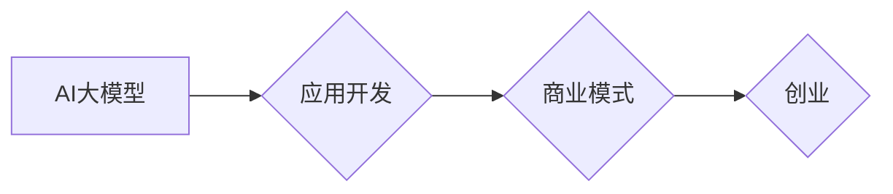

> AI大模型，创业，应用开发，商业模式，技术趋势，未来趋势

## 1. 背景介绍

人工智能（AI）技术近年来发展迅速，特别是大模型的涌现，为各行各业带来了前所未有的机遇。大模型，是指参数规模庞大、训练数据海量的人工智能模型，具备强大的泛化能力和学习能力，能够在自然语言处理、计算机视觉、语音识别等领域取得突破性进展。

随着大模型技术的成熟，越来越多的创业者看到了其中的商机，纷纷涌入AI大模型创业领域。然而，仅仅拥有强大的技术能力还不够，想要打造出爆款应用，还需要深入理解市场需求、用户痛点，并构建合理的商业模式。

## 2. 核心概念与联系

**2.1 AI大模型**

AI大模型是指参数规模庞大、训练数据海量的人工智能模型，其核心特点是：

* **规模化：** 参数数量达到亿级甚至万亿级，拥有海量计算能力。
* **泛化能力强：** 能够在不同领域和任务上表现出色，具有良好的迁移学习能力。
* **学习能力强：** 可以从海量数据中学习复杂的模式和知识，不断提升自身性能。

**2.2 应用开发**

AI大模型的应用开发是指利用大模型的强大能力，开发出能够解决实际问题、满足用户需求的软件应用。

**2.3 商业模式**

商业模式是指企业为创造价值、获取利润而采取的策略和方法。

**2.4 创业**

创业是指创办新企业，开发新产品或服务，并将其推向市场。

**2.5 核心关系**

AI大模型、应用开发、商业模式和创业相互关联，共同构成了AI大模型创业的完整生态系统。

**Mermaid 流程图**



## 3. 核心算法原理 & 具体操作步骤

**3.1 算法原理概述**

大模型的训练主要基于深度学习算法，其中Transformer模型是目前最主流的架构。Transformer模型的核心思想是利用注意力机制，捕捉文本序列中不同词语之间的关系，从而更好地理解上下文信息。

**3.2 算法步骤详解**

1. **数据预处理:** 将原始文本数据进行清洗、分词、标记等操作，使其能够被模型理解。
2. **模型构建:** 根据Transformer模型架构，搭建模型结构，包括编码器、解码器和注意力机制等模块。
3. **模型训练:** 使用海量文本数据对模型进行训练，通过调整模型参数，使其能够生成准确的预测结果。
4. **模型评估:** 使用测试数据对模型进行评估，衡量模型的性能，例如准确率、召回率等指标。
5. **模型部署:** 将训练好的模型部署到服务器或云平台，使其能够为实际应用提供服务。

**3.3 算法优缺点**

**优点:**

* 强大的泛化能力和学习能力
* 可以处理长文本序列
* 能够捕捉文本中的复杂关系

**缺点:**

* 训练成本高，需要海量数据和计算资源
* 模型参数量大，部署成本较高
* 训练过程复杂，需要专业的技术人员

**3.4 算法应用领域**

* 自然语言处理：文本分类、情感分析、机器翻译、问答系统等
* 计算机视觉：图像识别、目标检测、图像生成等
* 语音识别：语音转文本、语音合成等
* 其他领域：代码生成、药物研发、金融分析等

## 4. 数学模型和公式 & 详细讲解 & 举例说明

**4.1 数学模型构建**

Transformer模型的核心是注意力机制，其数学模型可以表示为：

$$
Attention(Q, K, V) = softmax(\frac{QK^T}{\sqrt{d_k}})V
$$

其中：

* $Q$：查询矩阵
* $K$：键矩阵
* $V$：值矩阵
* $d_k$：键向量的维度
* $softmax$：softmax函数

**4.2 公式推导过程**

注意力机制的目的是计算每个词语与其他词语之间的相关性，并根据相关性权重来加权求和，从而得到上下文信息。

1. 计算查询矩阵 $Q$ 与键矩阵 $K$ 的点积，得到一个得分矩阵。
2. 对得分矩阵进行归一化，使用softmax函数将其转换为概率分布。
3. 将概率分布与值矩阵 $V$ 进行加权求和，得到最终的输出。

**4.3 案例分析与讲解**

例如，在翻译句子“我爱北京”时，注意力机制会计算每个词语与其他词语之间的相关性，例如“我”与“爱”的相关性较高，而“我”与“北京”的相关性较低。

根据这些相关性权重，注意力机制会将“爱”的上下文信息更充分地融入到“北京”的翻译中，从而得到更准确的翻译结果。

## 5. 项目实践：代码实例和详细解释说明

**5.1 开发环境搭建**

* Python 3.7+
* PyTorch 或 TensorFlow
* CUDA 和 cuDNN

**5.2 源代码详细实现**

```python
import torch
import torch.nn as nn

class Transformer(nn.Module):
    def __init__(self, vocab_size, embedding_dim, num_heads, num_layers):
        super(Transformer, self).__init__()
        self.embedding = nn.Embedding(vocab_size, embedding_dim)
        self.transformer_layers = nn.ModuleList([
            nn.TransformerEncoderLayer(embedding_dim, num_heads)
            for _ in range(num_layers)
        ])
        self.linear = nn.Linear(embedding_dim, vocab_size)

    def forward(self, x):
        x = self.embedding(x)
        for layer in self.transformer_layers:
            x = layer(x)
        x = self.linear(x)
        return x
```

**5.3 代码解读与分析**

* `__init__` 方法：初始化模型参数，包括词嵌入层、Transformer编码器层和线性输出层。
* `forward` 方法：定义模型的正向传播过程，将输入序列经过词嵌入层、Transformer编码器层和线性输出层，最终得到输出序列。

**5.4 运行结果展示**

使用训练好的模型，可以对新的文本序列进行预测，例如翻译句子、生成文本等。

## 6. 实际应用场景

**6.1 自然语言处理**

* **机器翻译:** 将一种语言翻译成另一种语言，例如Google Translate。
* **文本摘要:** 将长文本压缩成短文本，例如新闻摘要、会议记录摘要。
* **情感分析:** 分析文本中的情感倾向，例如判断用户对产品的评价是正面还是负面。
* **问答系统:** 根据用户的问题，从知识库中找到答案，例如智能客服系统。

**6.2 计算机视觉**

* **图像识别:** 将图像分类到不同的类别，例如识别猫、狗、汽车等。
* **目标检测:** 在图像中检测到特定目标，并标注其位置和类别，例如人脸识别、车牌识别。
* **图像生成:** 根据文本描述生成图像，例如绘画、设计等。

**6.3 语音识别**

* **语音转文本:** 将语音转换为文本，例如语音助手、语音输入等。
* **语音合成:** 将文本转换为语音，例如语音播报、语音聊天等。

**6.4 其他领域**

* **代码生成:** 根据自然语言描述生成代码，例如GitHub Copilot。
* **药物研发:** 利用大模型预测药物的活性，加速药物研发过程。
* **金融分析:** 分析金融数据，预测市场趋势，辅助投资决策。

**6.5 未来应用展望**

随着AI大模型技术的不断发展，其应用场景将更加广泛，例如：

* **个性化教育:** 根据学生的学习情况，定制个性化的学习方案。
* **智能医疗:** 辅助医生诊断疾病、制定治疗方案。
* **自动驾驶:** 提高自动驾驶汽车的安全性、可靠性和智能化水平。

## 7. 工具和资源推荐

**7.1 学习资源推荐**

* **书籍:**
    * 《深度学习》
    * 《自然语言处理》
    * 《Transformer模型详解》
* **在线课程:**
    * Coursera: 深度学习
    * Udacity: 自然语言处理
    * fast.ai: 深度学习

**7.2 开发工具推荐**

* **框架:** PyTorch, TensorFlow
* **库:** HuggingFace Transformers, OpenAI API
* **平台:** Google Colab, AWS SageMaker

**7.3 相关论文推荐**

* 《Attention Is All You Need》
* 《BERT: Pre-training of Deep Bidirectional Transformers for Language Understanding》
* 《GPT-3: Language Models are Few-Shot Learners》

## 8. 总结：未来发展趋势与挑战

**8.1 研究成果总结**

近年来，AI大模型取得了显著进展，在自然语言处理、计算机视觉等领域取得了突破性成果。

**8.2 未来发展趋势**

* **模型规模化:** 模型参数规模将继续扩大，训练数据量也将进一步增加。
* **多模态学习:** 大模型将能够处理多种数据类型，例如文本、图像、音频等。
* **可解释性:** 研究如何提高大模型的可解释性，使其决策过程更加透明。
* **安全性和隐私性:** 加强大模型的安全性和隐私性保护，防止模型被恶意利用。

**8.3 面临的挑战**

* **计算资源:** 训练大型模型需要大量的计算资源，成本较高。
* **数据获取:** 获取高质量的训练数据是一个挑战。
* **伦理问题:** 大模型的应用可能带来伦理问题，例如偏见、歧视等。

**8.4 研究展望**

未来，AI大模型将继续朝着更强大、更智能的方向发展，并应用于更多领域，为人类社会带来更多福祉。

## 9. 附录：常见问题与解答

**9.1 如何选择合适的AI大模型？**

选择合适的AI大模型需要根据具体的应用场景和需求进行考虑，例如模型规模、参数量、训练数据、性能指标等。

**9.2 如何训练自己的AI大模型？**

训练自己的AI大模型需要具备一定的机器学习和深度学习知识，以及充足的计算资源和训练数据。

**9.3 如何部署AI大模型？**

部署AI大模型可以采用云平台、服务器或边缘设备等方式，需要根据实际情况选择合适的部署方案。


作者：禅与计算机程序设计艺术 / Zen and the Art of Computer Programming 
<end_of_turn>