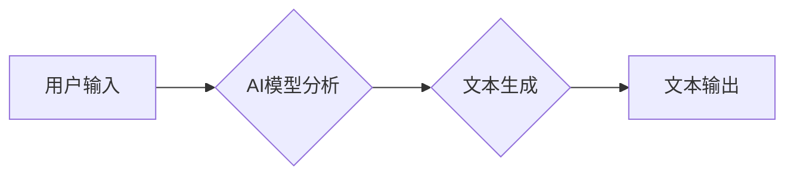

> AI写作, GPT-3, 文本生成, 创意写作, 大纲生成, 续写, 润色, 文本优化

## 1. 背景介绍

人工智能技术近年来取得了飞速发展，其中自然语言处理（NLP）领域尤为突出。大型语言模型（LLM）的出现，例如GPT-3、LaMDA等，使得机器具备了理解和生成人类语言的能力，为创意写作领域带来了革命性的变革。

传统的创意写作往往依赖于人类的灵感、想象力和经验积累。而AI写作工具则可以帮助作家克服创作瓶颈，提高写作效率，并探索新的创作可能性。

## 2. 核心概念与联系

**2.1 AI写作的本质**

AI写作的核心是利用机器学习算法训练模型，使其能够理解文本的语义和结构，并根据输入的提示或上下文生成新的文本。

**2.2  AI写作流程**

AI写作流程通常包括以下几个步骤：

1. **文本输入:** 用户提供写作主题、关键词、故事梗概等信息。
2. **模型处理:** AI模型分析输入文本，理解其语义和结构。
3. **文本生成:** 模型根据训练数据和输入信息，生成新的文本内容。
4. **文本输出:** 用户获得生成的文本内容，可进行修改和完善。

**2.3  AI写作与创意写作的关系**

AI写作并非要取代人类作家，而是要成为其创作的辅助工具。AI可以帮助作家：

* **克服创作瓶颈:** 提供写作灵感、故事梗概、人物设定等。
* **提高写作效率:** 自动生成文本内容，节省时间和精力。
* **探索新的创作可能性:** 尝试不同的写作风格、题材和视角。

**2.4  Mermaid 流程图**



## 3. 核心算法原理 & 具体操作步骤

**3.1  算法原理概述**

AI写作的核心算法通常是基于Transformer架构的深度学习模型，例如GPT-3。Transformer模型通过自注意力机制学习文本的上下文关系，能够捕捉长距离依赖关系，生成更流畅、更自然的文本。

**3.2  算法步骤详解**

1. **词嵌入:** 将文本中的每个词转换为向量表示，捕捉词语的语义信息。
2. **编码器:** 利用多层Transformer编码器，对输入文本进行编码，提取文本的语义特征。
3. **解码器:** 利用多层Transformer解码器，根据编码后的文本信息，生成新的文本词。
4. **输出层:** 将解码器的输出转换为概率分布，预测下一个词的可能性。

**3.3  算法优缺点**

**优点:**

* 生成文本流畅自然
* 能够捕捉长距离依赖关系
* 可生成不同风格的文本

**缺点:**

* 训练成本高
* 需要大量训练数据
* 容易生成虚假信息

**3.4  算法应用领域**

* 文本生成：小说、诗歌、剧本、新闻报道等
* 机器翻译：将一种语言翻译成另一种语言
* 文本摘要：生成文本的简短摘要
* 对话系统：构建能够与人类进行自然对话的聊天机器人

## 4. 数学模型和公式 & 详细讲解 & 举例说明

**4.1  数学模型构建**

Transformer模型的核心是自注意力机制，其数学模型可以表示为：

$$
Attention(Q, K, V) = \frac{exp(Q \cdot K^T / \sqrt{d_k})}{exp(Q \cdot K^T / \sqrt{d_k})} \cdot V
$$

其中：

* $Q$：查询矩阵
* $K$：键矩阵
* $V$：值矩阵
* $d_k$：键向量的维度

**4.2  公式推导过程**

自注意力机制通过计算查询向量与键向量的点积，来衡量它们之间的相关性。点积结果经过softmax归一化，得到每个键向量的权重，然后将权重与值向量相乘，得到最终的注意力输出。

**4.3  案例分析与讲解**

假设我们有一个句子“我爱吃苹果”，其词嵌入向量分别为：

* 我：[0.1, 0.2, 0.3]
* 爱：[0.4, 0.5, 0.6]
* 吃：[0.7, 0.8, 0.9]
* 苹果：[1.0, 1.1, 1.2]

当计算“我”与其他词的注意力权重时，我们会发现“我”与“爱”的注意力权重最高，因为它们在语义上紧密相关。

## 5. 项目实践：代码实例和详细解释说明

**5.1  开发环境搭建**

* Python 3.7+
* TensorFlow/PyTorch
* CUDA/cuDNN

**5.2  源代码详细实现**

```python
import tensorflow as tf

# 定义Transformer模型
class Transformer(tf.keras.Model):
    def __init__(self, vocab_size, embedding_dim, num_heads, num_layers):
        super(Transformer, self).__init__()
        self.embedding = tf.keras.layers.Embedding(vocab_size, embedding_dim)
        self.transformer_layers = [
            tf.keras.layers.MultiHeadAttention(num_heads=num_heads, key_dim=embedding_dim)
            for _ in range(num_layers)
        ]
        self.dense = tf.keras.layers.Dense(vocab_size)

    def call(self, inputs):
        # 词嵌入
        embeddings = self.embedding(inputs)
        # Transformer层
        for layer in self.transformer_layers:
            embeddings = layer(embeddings)
        # 全连接层
        outputs = self.dense(embeddings)
        return outputs

# 实例化模型
model = Transformer(vocab_size=10000, embedding_dim=512, num_heads=8, num_layers=6)

# 训练模型
# ...

```

**5.3  代码解读与分析**

* `Embedding`层将词转换为向量表示。
* `MultiHeadAttention`层实现自注意力机制，捕捉文本的上下文关系。
* `Dense`层将编码后的文本信息转换为概率分布，预测下一个词。

**5.4  运行结果展示**

训练好的模型可以用于生成新的文本内容。例如，输入“我爱”，模型可以生成“我爱吃苹果”。

## 6. 实际应用场景

**6.1  小说创作**

AI写作工具可以帮助作家克服创作瓶颈，生成故事梗概、人物设定、场景描述等，提高写作效率。

**6.2  剧本写作**

AI可以根据给定的主题和人物，生成剧本的对话、场景和情节，为影视创作提供新的灵感。

**6.3  广告文案创作**

AI可以根据目标受众和产品特点，生成吸引人的广告文案，提高广告转化率。

**6.4  未来应用展望**

AI写作技术将继续发展，应用场景将更加广泛，例如：

* 自动生成新闻报道
* 创建个性化教育内容
* 辅助科研论文写作

## 7. 工具和资源推荐

**7.1  学习资源推荐**

* **书籍:**
    * 《深度学习》
    * 《自然语言处理》
* **在线课程:**
    * Coursera: 自然语言处理
    * edX: 深度学习

**7.2  开发工具推荐**

* **TensorFlow:** 开源深度学习框架
* **PyTorch:** 开源深度学习框架
* **HuggingFace:** 提供预训练模型和工具

**7.3  相关论文推荐**

* 《Attention Is All You Need》
* 《BERT: Pre-training of Deep Bidirectional Transformers for Language Understanding》

## 8. 总结：未来发展趋势与挑战

**8.1  研究成果总结**

AI写作技术取得了显著进展，能够生成流畅、自然的文本内容，并应用于多个领域。

**8.2  未来发展趋势**

* 模型规模和性能将继续提升
* 更加细粒度的文本控制
* 跨语言文本生成
* 融合多模态信息

**8.3  面临的挑战**

* 虚假信息生成
* 伦理和社会影响
* 数据偏见和公平性

**8.4  研究展望**

未来研究将重点关注：

* 提高模型的鲁棒性和安全性
* 探索AI写作的伦理和社会影响
* 开发更加高效、可解释的AI写作模型

## 9. 附录：常见问题与解答

**9.1  AI写作可以完全取代人类作家吗？**

目前，AI写作工具仍然无法完全取代人类作家。AI擅长生成文本内容，但缺乏人类的创造力和情感表达能力。

**9.2  如何避免AI写作生成虚假信息？**

可以通过以下方式来避免AI写作生成虚假信息：

* 使用高质量的训练数据
* 开发更加鲁棒的模型
* 加强文本审核和事实验证

**9.3  AI写作的伦理问题有哪些？**

AI写作的伦理问题包括：

* 著作权问题
* 偏见和歧视问题
* 虚假信息传播问题


作者：禅与计算机程序设计艺术 / Zen and the Art of Computer Programming 
<end_of_turn>